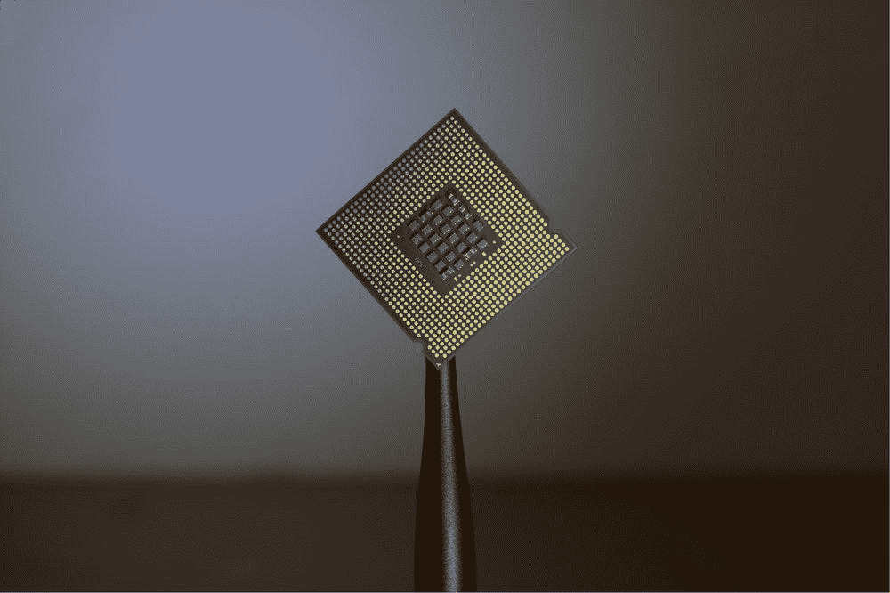

# 人工智能不仅仅是 IT 人员的专利

> 原文：<https://medium.datadriveninvestor.com/ai-isnt-just-for-the-it-guys-1bea7372712?source=collection_archive---------13----------------------->

简而言之，人工智能并不新鲜。

它从 20 世纪 60 年代就已经存在了。技术进步提高了处理速度，并允许访问大量丰富的数据。无论你是否意识到，人工智能已经开始积极地扎根于我们的日常生活中。当你使用网飞、YouTube 或 Spotify 时，人工智能会替你做决定。当你使用谷歌地图导航道路或预订抓取汽车时，人工智能会为你做这些工作。当你在网上订购杂货时出错时，你很可能是在与人工智能聊天机器人交谈，而不是与人类交谈。

在某种程度上，人工智能每天都在影响着我们的生活。

人工智能不再只是 IT 人员的专利。

聊天机器人

聊天机器人在客户服务中很受欢迎，因为它们提供 24/7 的支持和高效的回复。除了简单的产品查询，它们还被开发来为消费者创造个性化和吸引人的体验。例如，餐馆正在使用机器人取代服务人员，并接管诸如点菜、上菜和收款等职能。通过 AI 自动化，这些“智能”餐厅降低了人力成本，为顾客创造了个性化和新颖的用餐体验。另一个例子是，杂货店通过使用聊天机器人来增加消费者互动。购物者可以获得各种产品的信息，食谱建议，食物的营养价值，并在商店购物时获得优惠券或代金券。商店中部署的人工智能聊天机器人使日常购物变得有趣，并为日常购物者创造价值。

 [## 人工智能与创造力:梦想成真——数据驱动的投资者

### 人工智能总是让我着迷。不仅作为一套有用的工具，不断发展，而且作为一个…

www.datadriveninvestor.com](https://www.datadriveninvestor.com/2019/01/28/ai-creativity-deep-dream-comes-true/) 

**医疗保健**

人工智能在重新设计医疗保健、改善患者安全和医疗诊断方面具有巨大的潜力。一份报告显示，医疗事故是继心脏病和癌症之后的第三大死亡原因。让我们以放射学为例。机器学习使医疗保健提供商能够在更短的时间内分析大量数据(如核磁共振成像、x 光等)，为他们的诊断和决策提供支持。这加快了医生的工作流程，减少了患者获得准确及时治疗的等待时间。人工智能也可以像你拥有的移动设备一样触手可及。虚拟健康助手可以跟踪你的健康状况，提醒你服药和参加健康预约。如果检测到不良症状，他们甚至可以向您的医生发送警报，必要时触发现场护理。可穿戴设备在检查健康方面也变得越来越常见，它可以监测你的心率、血压水平，并监测病人术后的任何并发症。所有这些创新已被证明对那些热衷于采取积极主动的方法来保持良好健康的人是有益的。

**社交媒体**

平均每天花在社交上的时间是 [116 分钟](https://www.entrepreneur.com/slideshow/306136)。但你知道人工智能在我们在社交媒体上看到的东西中发挥着重要作用吗？Spotify 上推荐给你的音乐、你在脸书上看到的朋友的帖子以及谷歌上的产品搜索结果都是算法和分析的结果。

人工智能已经在不经意间影响了消费者的购买行为和习惯。企业正在利用人工智能来了解更多关于消费者的信息，以便调整他们的营销策略和业务，从而为他们提供个性化的列表。

**金融**

你可能会收到一条短信通知，通知你在走出零售店后购买了商品。这项服务有一天会为你节省数千美元。利用位置数据和购买模式，人工智能可以识别出与众不同的客户行为模式。分析这些数据可以提供早期检测任何可能导致金融欺诈或盗窃的异常行为的可能性。金融欺诈多年来一直存在，但使用人工检测欺诈可能是一项耗时且乏味的工作。利用人工智能等技术降低了人为错误或篡改的风险，并提高了犯罪侦查的效率。

人工智能不再是遥远的可能性或科幻小说，而是我们今天日常生活中的真实现象。在很大程度上，这些新兴技术增强了现有的商业功能，减轻了人类日常单调的工作负担，为我们的生活带来了便利和复杂。

人工智能不再只是 IT 人员的专利，它将永远改变我们做事的方式。

*原载于*[*https://articles . noodle factory . ai*](https://articles.noodlefactory.ai/ai-isnt-just-for-the-it-guys)*。*