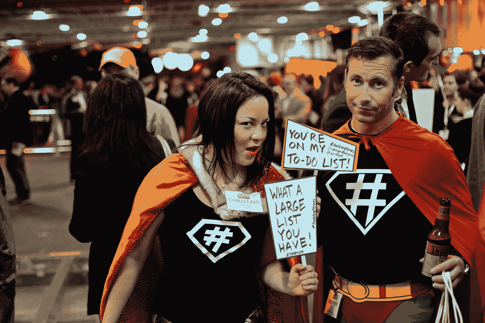
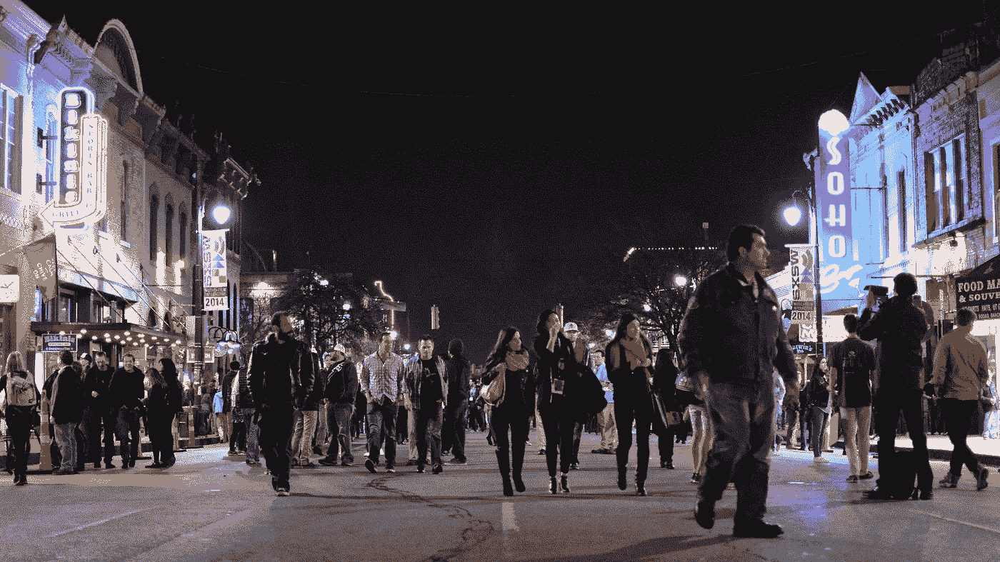

# 人工智能从营销的社交媒体时代吸取的教训

> 原文：<https://medium.datadriveninvestor.com/ai-lessons-from-marketings-social-media-era-69652307ec5f?source=collection_archive---------27----------------------->

The Hashtag Economy visualized at Social Media Marketing World

回顾社交媒体时代，双向对话应该赋予新的自由，打破传统的权力结构。像《线索列车宣言》 这样的开创性书籍承诺了一个世界，在这个世界里，消费者有权反击广告商。

事情开始得很好。新的声音随着博客和后来的社交媒体账户而兴起。他们提供了与传统杂志和新闻媒体不同的观点。在深水地平线墨西哥湾漏油事件中，像[英国石油公司这样的品牌突然被追究责任，在推特上引发了巨大的反对浪潮。品牌很快在网上建立了自己的存在，参与(并希望缓解)这些对话。在某些情况下，比如埃及的阿拉伯之春，周期性政府被推翻了。](https://instituteforpr.org/wp-content/uploads/BP-Twitter-The-Deep-Water-Horizon.pdf)

快进到 2019 年。发生了什么事？

赚大钱就是这么回事。这不是为了资本主义或营销业务。这是我们的工作。

但是，一旦像脸书和 Twitter 这样的媒体公司试图利用数字对话，并挂起他们的算法流来获取最令人兴奋的对话，包括广告，世界就变了。社交媒体世界不再公平。

品牌可以避免这种对话，但仍能获得成功。有影响力的人成为他们自己孤立的权力结构，像一个迷你媒体渠道一样传递信息给观众。许多有影响力的人牺牲了真实性和透明度。像与他们合作的企业一样，有影响力的人试图谋生并保持市场地位，在这样做的过程中，许多人不再无情地迎合他们的追随者。

政治、特殊利益和品牌势力发现，他们可能会使人类精神两极分化，而不是寻找新的声音和强调真理。虚假信息、半真半假和欺骗公众成为可能，因为大量人口落入部落，相信志趣相投的个人并寻求对事实的解释。

# 争吵

Austin’s Sixth Street during the SXSW Interactive Festival, a social media marketing darling conference.

这种新的数字部落主义使得出售和保留权力变得更加容易。是不是都是黑与白，坏与好？远非如此。

社交媒体仍然赋予弱者权力，偶尔的消费者起义(似乎通常是针对航空公司)或#metoo 或#blacklivesmatter 等政治运动就是证明，但影响变化要难得多。相反，消费者和个人是由公共网络上的品牌、权力结构和个人营销者收获的。

人工智能已经帮助数字媒体品牌和广告商实现了这些成果。从社交网络细分和兴趣度算法到精心制作的广告服务，以及将个人兴趣与广告记录相关联，人工智能使品牌能够利用社交媒体盈利。通过这样做，艾打造了自己的营销蓝图。

这并不意味着每个品牌都将社交网络(或人工智能)视为广告和发展业务的手段，同时最大限度地减少客户反馈。一些品牌在对话中表现得非常好，积极参与客户和利益相关者的对话。像 Wendy's 这样的品牌在 Twitter 上提供搞笑的小吃。智能手机外壳公司 [Peel 在 Instagram](https://sproutsocial.com/insights/social-media-marketing-examples/) 上带来了真实的回应和精彩的内容。

离群点无处不在。他们因超越竞争对手而获得了应有的成功和认可。

不太明显或者更容易被忽视的是许多在社交媒体领域表现不佳的品牌。直到人工智能使他们能够更好地在社交网络中扩大规模和做广告，同时避免参与。

# **人工智能品牌会被问责吗？**

展望未来，营销人工智能实施将遭遇与企业社交媒体类似的趋势浪潮。以下是我对这一过程的理论:

1.  通常，个人或品牌首先做对他们最有利的事情，巧妙地被个人和商业成功的需要所说服。
2.  上市速度、数据采集以及更低的人力资源和技术成本将导致品牌偷工减料。
3.  结果，理想的行为和最佳实践经常被忽视。
4.  那些在机器学习实现上煞费苦心的离群者将把自己从他们的竞争对手中分离出来，并建立最佳实践。

当谈到挣一美元或保住一份工作时，马斯洛的需求层次优先。在个人层面，生理、安全、自尊比思想原则更重要。对组织来说，利润、使命目标和权力至高无上。因为员工有马斯洛需求，组织很少看到他们的目标受挫。

聪明的品牌会明白，做正确的事情是获得最大成功和降低风险的手段。他们将成为局外人。

一些人工智能实现将以最尴尬的方式遭受壮观的道德和数据失败。据 Forrester 称，他们将是遭受 4%损失的品牌，因为他们的偏见和道德问题暴露在公众面前。但绝大多数偷工减料的品牌不会在一个国家的舞台上爆发。相反，他们只会用更新、更精确、或许更令人毛骨悚然的方式向客户发送垃圾邮件。

真正的问题是，不诚实地使用人工智能的营销人员是否会被追究责任？

具有讽刺意味的是，在数字时代，通常仍然需要外部传统和社交媒体的力量来让一个品牌或个人负起责任。无论是广告商因支持仇外新闻节目而受到攻击，还是谷歌因对白人男性员工的反向歧视而受到挑战，公众浪潮仍然保留着力量。

然而，与社交媒体时代的开始不同，这些运动通常需要实现大众意识，并不总是有效的。想想最高法院对 [Brett Kavanaugh 的成功提名，尽管#metoo 运动](https://www.politico.com/magazine/story/2018/10/09/kavanaugh-metoo-temperance-suffragettes-221141)强烈抗议，该运动在媒体业务中非常成功地消灭了被指控的男性掠夺者。

一些人担心一个更加黑暗的人工智能市场未来，在其中可能会找到一个公平的平衡。人工智能可能会被用来减少和剥夺隐私。对数据的追求将会破坏(甚至可能取代)在个人基础上可以和应该监控什么的传统规范。

当营销人员在不考虑信任的情况下使用这些数据挖掘客户群时，可能会适得其反。品牌会失去信任，也会失去客户忠诚度。当这种情况发生时，客户将他们视为一个交易者，一个当他们需要某些东西时可以使用的品牌。或者，如果有其他可行的选择，干脆避开这个品牌。

你怎么想呢?