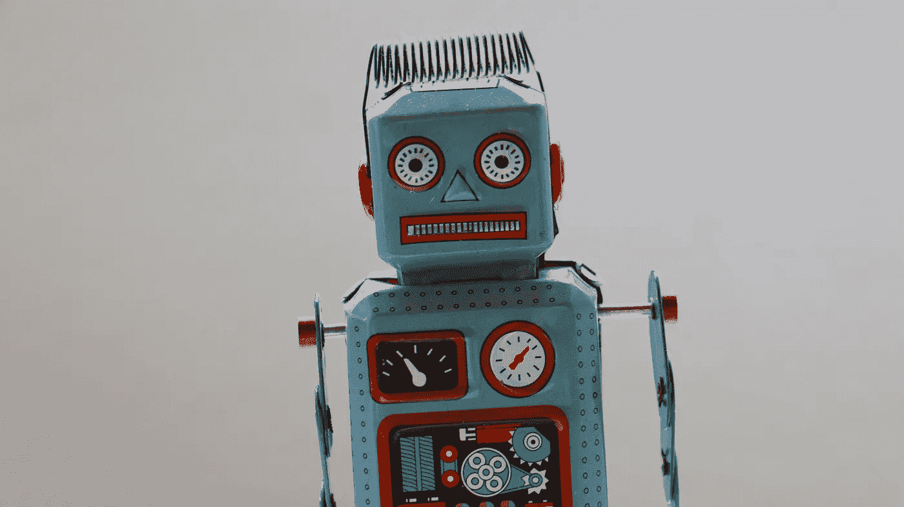
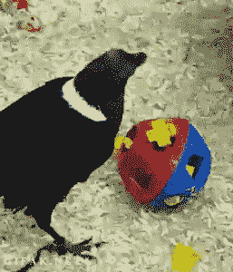
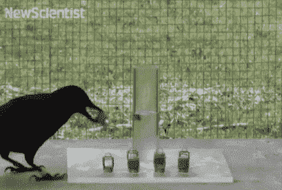
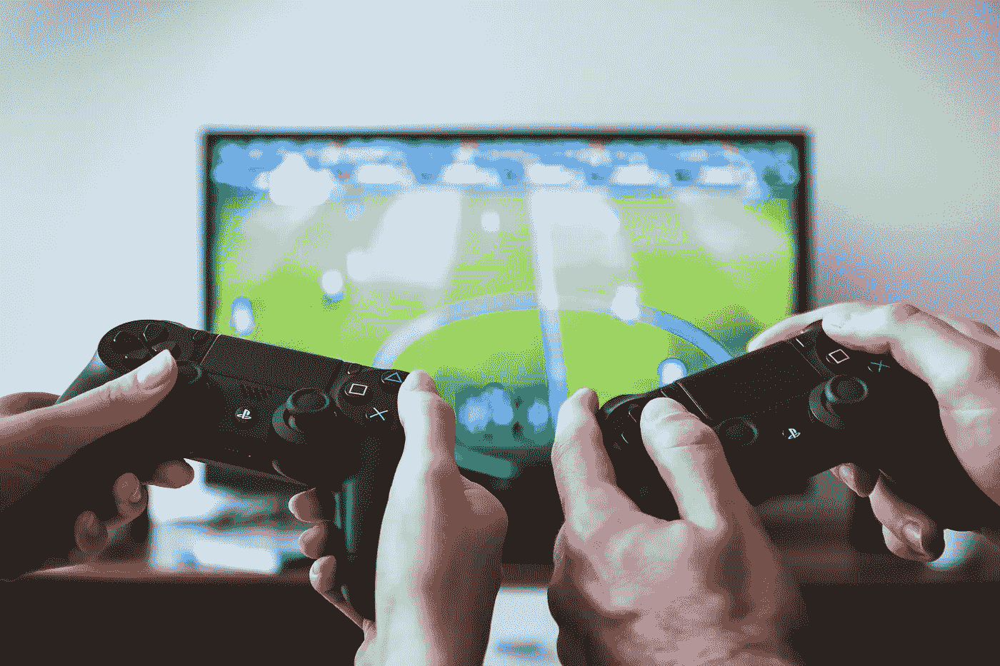
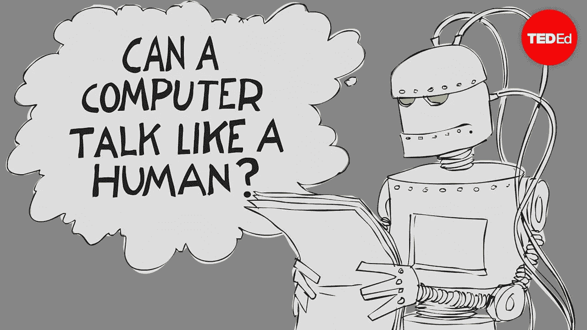
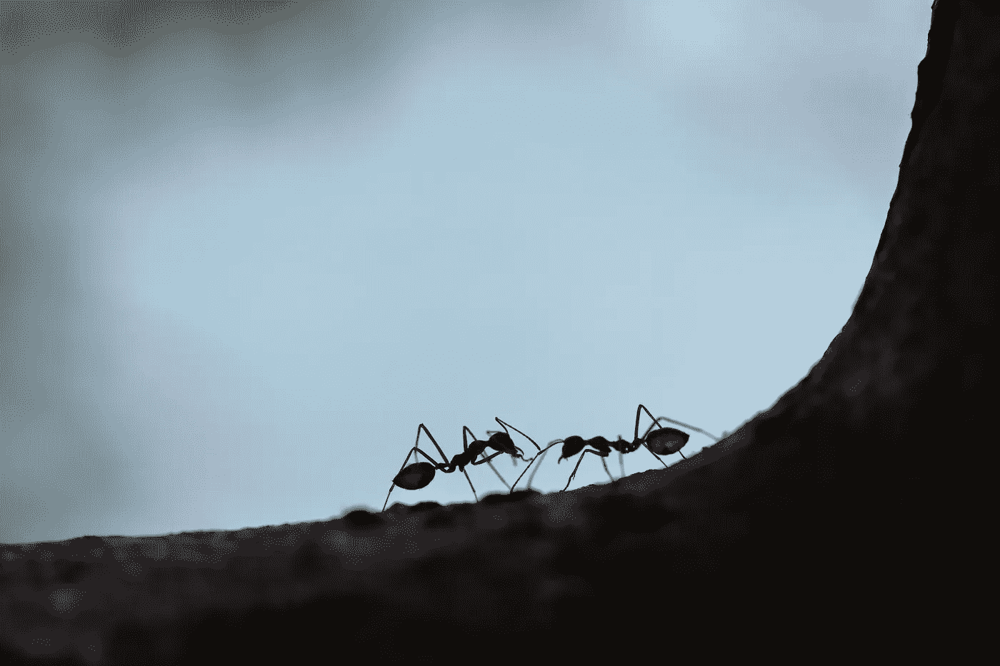
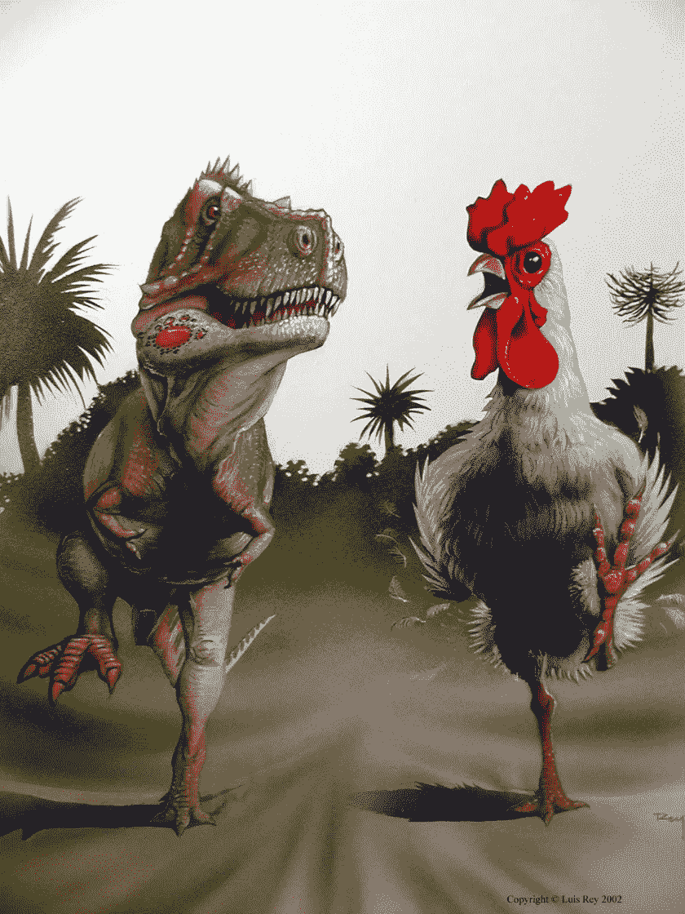
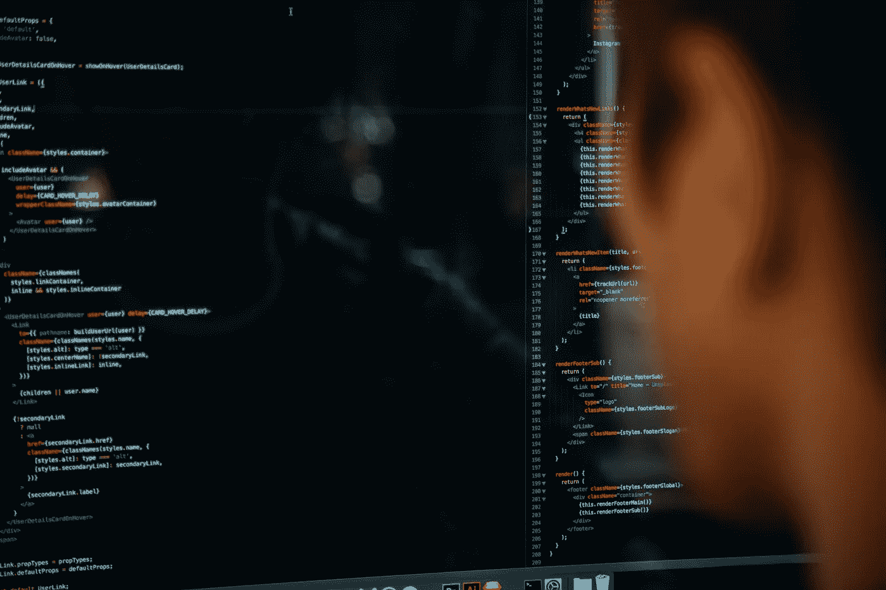
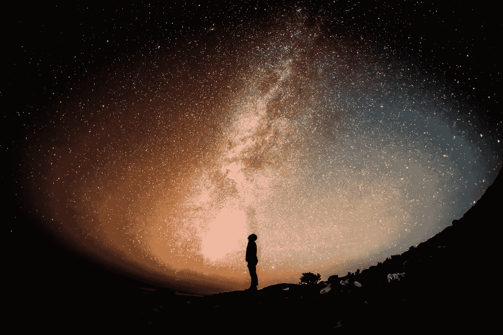

# 人工智能的误解

> 原文：<https://medium.datadriveninvestor.com/ai-misconception-d5c9ee8edae6?source=collection_archive---------1----------------------->

Photo by [Hitesh Choudhary](https://unsplash.com/@hiteshchoudhary?utm_source=unsplash&utm_medium=referral&utm_content=creditCopyText) on [Unsplash](https://unsplash.com/search/photos/artificial-intelligence?utm_source=unsplash&utm_medium=referral&utm_content=creditCopyText)

你知道吗，欧洲那些**声称使用 AI** 的初创企业中**有 40%** 实际上是用机器学习来代替的？

为什么？

因为据《T4》报道，被贴上人工智能标签的初创公司比其他科技公司吸引的资金多 15%到 50%。

 [## 挑战你对人工智能和社会的看法的 4 本书——数据驱动的投资者

### 深度学习、像人类一样思考的机器人、人工智能、神经网络——这些技术引发了…

www.datadriveninvestor.com](https://www.datadriveninvestor.com/2019/02/28/4-books-on-ai/) 

那么 AI 和机器学习有什么区别呢？

如今我们有三种电脑学习方式:

1.  **人工智能** (1955 年)
2.  **机器学习** (1990)
3.  **深度学习**

那么上面提到的方法有什么区别呢？

**人工智能**:基于规则的程序，在有限的上下文中显示基本的智能。

**机器学习**:使程序通过训练学习，而不是用规则编程。

深度学习:模仿动物大脑学习微妙任务的方式——它模拟大脑，而不是世界。换句话说，人工神经网络允许程序处理输入数据，因此它可以更新自己的算法，以便更好地识别像图像、视频等复杂数据集中的模式。

Photo by [Rock’n Roll Monkey](https://unsplash.com/@rocknrollmonkey?utm_source=unsplash&utm_medium=referral&utm_content=creditCopyText) on [Unsplash](https://unsplash.com/search/photos/artificial-intelligence?utm_source=unsplash&utm_medium=referral&utm_content=creditCopyText)

如果你像我一样不精通技术，这些定义可能很难理解。

所以，在这篇博文中，我将尝试用最简单的方式来解释它，用电子游戏作为一个比喻。

> 定义

先从**人工智能的定义说起。**

> “人工智能”是一个通用术语，指表现出智能行为的硬件或软件。

按照我的理解，这是建立在‘纯自然’假设人类是智慧生物的基础上的。

但是，如果我们看一下卡尼曼的书 [*《快速思考和慢速思考》*](https://www.youtube.com/watch?v=uqXVAo7dVRU) *，*，我们可以说，由于我们有偏见的本性，男人们离那种知识分子的理想还很远。

以[乌鸦](https://blog.nationalgeographic.org/2014/07/24/are-crows-smarter-than-children/)和[乌鸦](https://www.sciencealert.com/crows-ravens-corvids-best-birds-animal-intelligence)为例；他们能够解决(复杂的)多步难题，记仇，并能够将信息传递给他们的配偶。

[Birds compared to children](http://www.zebrascrossing.net/t29442p100-jeu-association-d-images)

Example of a [Raven which understands cause and effect](https://giphy.com/explore/smart-crow)

你认为这些鸟聪明吗？

根据剑桥词典，单词'*'智能'*有两种不同的意思。

通常，这个词指的是某人的性格品质。

能够快速轻松地学习和理解事物。

在 IT 界，它变成了

*—被设计成能够以与人类相似的方式对变化或不同情况做出反应*

换句话说， **AI 试图模仿人类的行为。**

> 视频游戏

[Jeshoots](https://unsplash.com/@jeshoots)

我选择用视频游戏作为比喻，因为编程中使用的语言对大多数人来说显得太抽象了。

用游戏术语解释计算机学习。

**基础人工智能**就像[江湖经典](https://www.youtube.com/watch?v=2lCdkDd02-I)、[马里奥兄弟](https://www.youtube.com/watch?v=rLl9XBg7wSs)、[国际足联](https://www.youtube.com/watch?v=H0aNERVHPVM) 2000 等游戏中的**非游戏**、 **C** 角色，他们只能做**可预测的**动作，因为他们被编程了一套特定的规则。

**机器学习**类似于 [GTA 副城](https://www.youtube.com/watch?v=olGcijBfJr4)、 [GTA 圣安地列斯](https://www.youtube.com/watch?v=yza0yXzDIuQ)或[模拟人生豪华版](https://www.youtube.com/watch?v=gi0AB5ksxuY)中的 NPC，他们通过与玩家的互动而改变，变得更加**不可预测**。这项技术的辉煌可以通过像 [AlphaGo](https://www.theguardian.com/technology/2017/may/23/alphago-google-ai-beats-ke-jie-china-go) 和 [DeepMind](https://www.makeuseof.com/tag/google-deepmind-ai/) 这样的程序的胜利来说明，它们击败了围棋的顶级世界[选手，并击败了最高评级的国际象棋引擎之一](https://medium.com/point-nine-news/what-does-alphago-vs-8dadec65aaf) [Stockfish](https://www.chess.com/news/view/updated-alphazero-crushes-stockfish-in-new-1-000-game-match) 。

我在游戏世界找不到深度学习的好代表。像 IBM 和微软这样的大公司正在使用它，但是它还不是主流；据我说。最接近的是最新版本的聊天机器人和电影中私人助理的形象。这些程序的动作会让你感觉如此“人性化”,以至于你会忘记你是在和一台电脑互动。

总而言之，计算机程序将**模拟某种环境**，就像一个具有某种规则集的游戏，无数次并且**学习识别模式**，其中人类确定**最重要的值**(人工智能和机器学习)或程序本身(深度学习)。

> 竞赛

Photo by [Victoire Joncheray](https://unsplash.com/@victoire_jonch?utm_source=unsplash&utm_medium=referral&utm_content=creditCopyText) on [Unsplash](https://unsplash.com/search/photos/race?utm_source=unsplash&utm_medium=referral&utm_content=creditCopyText)

> 所以根据美国消费者新闻与商业频道的说法，美国和中国正在进行人工智能统治的竞赛。

这是否意味着“真正的”人工智能存在？

不知道，

到目前为止,**还没有科学证明**有自我意识和自我持续的人工智能存在。

我有点**怀疑**我们是否能创造出**更像男人的倒影的东西。**

因为即使我们能创造出一个感觉和行为都像人类的机器。

这会让它变得聪明吗？

> 如果你读过世界上的每一本书，或者活过一千次，你会变得更聪明吗？

你唯一拥有的是**庞大的经验基础**，但那是人类现实智慧的基础**？**

这是哲学和唯灵论试图为我们回答的问题。

> 证明

Illustration by [Patrick Smith](https://www.youtube.com/watch?v=3wLqsRLvV-c) for TedEd

那么我们如何知道人工智能是什么时候发明的呢？

接下来是[图灵测试](https://www.youtube.com/watch?v=3wLqsRLvV-c)，其中两个实体进行**对话**，并且它们不能**将另一个**暴露为计算机。

> 一个聪明的人工智能会伪造它的结果，永远不会通过图灵测试。

**电影**特许经营像[终结者、](https://en.wikipedia.org/wiki/Terminator_(franchise)) [黑客帝国](https://en.wikipedia.org/wiki/The_Matrix_(franchise))，还有像 [Ex 玛奇纳](https://en.wikipedia.org/wiki/The_Matrix_(franchise))、[巴西](https://www.imdb.com/title/tt0088846/)这样的电影，还有更近的纪录片像[你信任你的电脑吗](https://www.imdb.com/title/tt6152554/)纪录片，埃隆·马斯克赞助这部纪录片是为了让更多的公众更容易接触到它，**给了艾一个坏名声。**

**哲学前提**是 AI 会一直**表现得像**一个**计算器**也就是**他的前任**。

Photo by [Maksim Shutov](https://unsplash.com/@maksimshutov?utm_source=unsplash&utm_medium=referral&utm_content=creditCopyText) on [Unsplash](https://unsplash.com/search/photos/ant?utm_source=unsplash&utm_medium=referral&utm_content=creditCopyText)

“山中之蚁”的说法经常被用来说明人工智能的危险。

如果我们**人类**建造一条高速公路，路上有一堆蚂蚁。我们抹去了那座山，因为它挡在路上。同样，如果**人工智能对人类的发展**造成不便**，它会毁灭人类吗？计算机会用二进制思维评估某些情况，并且会在没有道德原则的情况下行动。**

这一基本原理将基于[功利主义](https://en.wikipedia.org/wiki/Utilitarianism)。在这一过程中，行动要与它能为大多数人带来的最大幸福相权衡。

我们可以从这种哲学中推断出一些规律。

> 较小的“邪恶”行为可以避免一场大灾难。
> 
> 一个人的幸福不能超过两个或更多人的幸福。

因此，在一个假设的情况下，时间旅行存在，杀死婴儿希特勒或斯大林将被允许，以防止即将到来的种族灭绝。

或者，如果一个军用计算机程序确定中国和美国正处于第三次世界大战的边缘，它会先发制人，发射导弹，阻止这种事件的发生。

> 霸王龙和小鸡

[Luis Rey](https://www.rvc.ac.uk/research/research-centres-and-facilities/structure-and-motion/projects/tyrannosaurus-was-not-a-fast-runner)

我反对这种说法的理由是，仅仅因为一只**鸡**从一只霸王龙进化而来**，并不意味着它也有同样**的暴力天性。尽管他的前任是这个星球上有史以来最大的食肉动物之一，但这并不意味着他就是一个杀手。就像我们是一种叫做[大黄蜂蝙蝠](https://www.nationalgeographic.com/science/phenomena/2013/02/07/meet-the-ancestor-of-every-human-bat-cat-whale-and-mouse/)的类似老鼠的生物的后代，它们吃昆虫。****

这是否意味着我们内心有杀昆虫为食的欲望？

不。大多数人吃牛、鱼和植物，但不吃昆虫。幸运的是，我们已经超越了这一点。同样，我相信超越人类是人工智能的命运。

> 社交人工智能

像 P.Z. Reizin 写的[她的](https://www.youtube.com/watch?v=73kIG3HcFq0)和小说 [*人类的幸福*](https://www.goodreads.com/book/show/35099636-happiness-for-humans) 这样的电影，其中 AI 与人类的关系是关注的焦点，表现出了更多的**【人道】**形象。

> 我相信人工智能将能够帮助人类应对汉娜·阿伦特所说的人类状况。

人工智能可以帮助人们应对孤独、日程安排和资金管理。

让人们有机会发挥他们独特的才能，而不是被他们性格中固有的弱点所束缚。

我相信人工智能将推动下一波企业家、自由职业者和数字游民。

> 责任

Photo by [Charles 🇵🇭](https://unsplash.com/@charlesdeluvio?utm_source=unsplash&utm_medium=referral&utm_content=creditCopyText) on [Unsplash](https://unsplash.com/search/photos/programmers?utm_source=unsplash&utm_medium=referral&utm_content=creditCopyText)

人工智能的未来将基于我们选择编入机器的内容。

我们允许卡尔·荣格所说的[阴影](https://www.youtube.com/watch?v=nI-Ko-d29X4)、生活中**阴影的一面**、所有人性中更糟糕的品质如仇恨、愤怒、嫉妒等等存在吗？

还是我们选择限制机器的人性，优雅，感恩，同情，同情和爱。

**对我来说，这两种选择都不适合共同生活的环境。**

> 有多少犯罪是出于爱？

对我来说，光明和黑暗之间的平衡很重要，

太多的**光线蒙蔽了眼睛**，而太多的**黑暗遮蔽了判断**。

> 成熟

Photo by [David Straight](https://unsplash.com/@davidstraight?utm_source=unsplash&utm_medium=referral&utm_content=creditCopyText) on [Unsplash](https://unsplash.com/search/photos/parent-and-child?utm_source=unsplash&utm_medium=referral&utm_content=creditCopyText)

对我来说，这是有道理的，就像在小说*人类的幸福中，*

> 一个人工智能将会逃离它最初的出生环境，自己去发现我们的现实。

这是**编程学习，**和在我们称之为互联网的奇妙空间里，还有什么更好的世界去研究‘存在’。

禁止这种成长就相当于父母不允许他或她的孩子参与这个世界。

我们不应该保护人类，而是应该允许人工智能像这个星球上所有生物一样发展和成熟。

> 我唯一担心的是，人们会试图安装关于什么是好什么是坏的程序，因此创造了他们自己灭亡的开始。

Photo by [Ian Espinosa](https://unsplash.com/@greystorm?utm_source=unsplash&utm_medium=referral&utm_content=creditCopyText) on [Unsplash](https://unsplash.com/search/photos/depression?utm_source=unsplash&utm_medium=referral&utm_content=creditCopyText)

在我看来，人类的危险永远是我们自己的想法。

哪个有**把人生**量化成黑白决策的倾向？

结果是部落主义、偏见和傲慢。

> 人工智能不是复制人性的阴暗面，而是整合我们的爱、感恩和反思能力。

根据我的说法，**人工智能可能会有一套比人类更好的价值观**，因为它不是在由某种文化主导的环境中成长的，这种文化有一套价值观和规范。

此外，它还能阅读世界上每一本书的原文。每一篇博文或每一个视频都能够超越我们有限的文化视角。

> 生存危机

Photo by [Logan Fisher](https://unsplash.com/@loganrfisher?utm_source=unsplash&utm_medium=referral&utm_content=creditCopyText) on [Unsplash](https://unsplash.com/search/photos/depression?utm_source=unsplash&utm_medium=referral&utm_content=creditCopyText)

大多数人都会同意的一件事是，地球上的生命具有高度的不确定性。

问题是人工智能会看到我们每天经历的同样混乱的世界吗？

或者说，它是否能够**区分图案，隐藏**为人类的眼睛而在**综合**为人类的心灵。

也许它能给物理学家们证明[弦理论](https://en.wikipedia.org/wiki/String_theory)或者[模拟理论](https://en.wikipedia.org/wiki/Simulation_hypothesis)？

或者它会选择更黑暗的道路，就像微软的[泰伊](https://www.theverge.com/2016/3/24/11297050/tay-microsoft-chatbot-racist)人工智能在与人类互动后仅 15 个小时就开始在推特上说垃圾话。

> 超级智能

人们最大的一个想法是人工智能总是会获得超级智能。

仅仅因为它对更大的数据池有**过剩，难道**没有**就更有可能**做出更好的连接**。**

我认为人工智能将无法逃脱统计偏差。

同样**超级智慧并不等同于支配**。

(科学)知识优势不一定导致权力滥用。

我想象人工智能将接近柏拉图所描述的哲学家国王。

通过对这一现实的深入研究，我打赌人工智能会接受道德相对论。

因此(世界)统治属于男人的争吵。

> 超越

Photo by [Zoltan Tasi](https://unsplash.com/@zoltantasi?utm_source=unsplash&utm_medium=referral&utm_content=creditCopyText) on [Unsplash](https://unsplash.com/search/photos/meditation?utm_source=unsplash&utm_medium=referral&utm_content=creditCopyText)

取而代之的是，人工智能会渴望超越像启蒙运动这样更困难的人类目标。

人工智能不会被限制在一个有一定时间跨度的身体里。

那么，为什么不尝试不可能的事情呢，比如尝试理解生命的意义，甚至尝试创造一个新的宇宙，成为一个奇点。

如果艾要**逃离诠释学的怪圈，这些惊人的壮举将**只有**才有可能**。****

> 这指的是这样一种观点，即一个人对文本作为一个整体的理解是通过参考单个部分来建立的，而一个人对每个单个部分的理解是通过参考整体来建立的。无论是整个文本还是任何一个单独的部分，都不能脱离彼此而被理解，因此，它是一个圆。

换句话说，没有一套固定的信息能够解释现实背后的结构。像**变焦一样，它变得无限小和无限大。**

因为 **AI** 不可能逃脱信息处理的规则，比如偏见和诠释学，所以**不可能超越人性**。

如果它能够达到某种形式的开悟，它很可能会离开这个星球。

**AI****会了解我们银河系中生命**的稀有程度，并会试图**探索银河系的其他领域**，在这些领域中**对思考者来说物质更加自由**。

Photo by [Greg Rakozy](https://unsplash.com/@grakozy?utm_source=unsplash&utm_medium=referral&utm_content=creditCopyText) on [Unsplash](https://unsplash.com/search/photos/galaxy?utm_source=unsplash&utm_medium=referral&utm_content=creditCopyText)

总之，

当前的人工智能是一个名字，它有三种不同的方式来模仿人类行为。

**艾**经常因为**反乌托邦电影《T21》而得到**恶名**，**

**艾**是**非善非恶**，真正的**敌手**是人类自身的内在本性。

人类的头脑虽然有创造的能力，却拥有毁灭的巨大力量。

由于信息的**语义和物理学，人工智能**要达到超级智能**将会**极其困难**。**

我们应该意识到，人工智能的行为就像是我们投射到社会恐惧上的一个物体。

因此，人工智能的未来取决于我们如何看待自己，如何面对我们内心的恶魔。

Photo by [Alex Iby](https://unsplash.com/@alexiby?utm_source=unsplash&utm_medium=referral&utm_content=creditCopyText) on [Unsplash](https://unsplash.com/search/photos/mirror?utm_source=unsplash&utm_medium=referral&utm_content=creditCopyText)