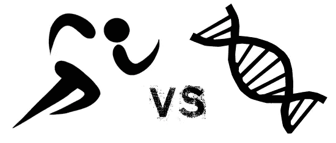
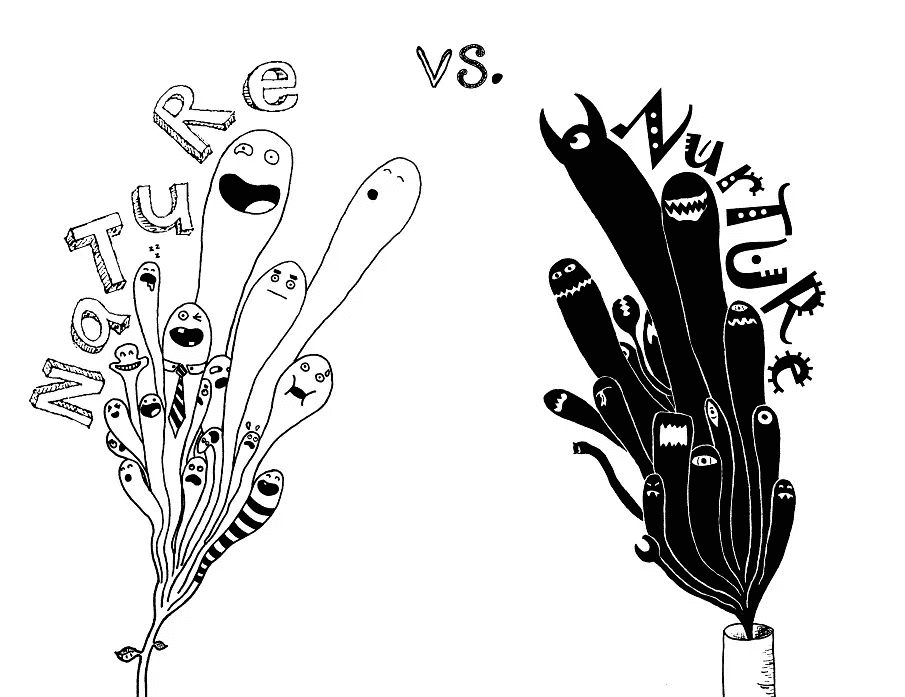

# 人工智能——先天还是后天

> 原文：<https://medium.datadriveninvestor.com/ai-nature-or-nurture-e20ba998a176?source=collection_archive---------7----------------------->

我敢肯定，当你读到这个标题的时候，你脑海中的第一个想法一定是……‘养育，废话！’。你说得很对。但是…

是的，今天的人工智能主要是后天培养的。它所知道的一切都是我们人类教给它的。算法是我们写的。它训练的数据是由我们提供的。我们设置参数来模拟算法，它们会出错。为我们服务，实现我们不可告人的自私目的。无论是理解我们的语言，还是驾驶我们的汽车，或者在更平凡的方面，安排我们的会议。所以是后天培养。我们设定目标，并帮助他们实现这些目标。

那为什么要讨论这个话题？你可能会问，自然是可能的吗？

在我们进入是否和如何之前，让我们谈谈什么？

> 什么是自然，或者更确切地说是自然学习？

在我不断发展的思维过程中，其实只有两件事。

**1。自学**——自学很重要。没有人喂你吃饭，没有人告诉你学什么和怎么学。也没人给你问题陈述。仅仅是你的经历和实验。这包括决定学习方法(观察或倾听)，并找到学习所需的数据。自然就是没有人告诉你该学什么，或者怎么学。

> 自然是当你，因为你的好奇心或需要，决定尝试某事，因为你满足好奇心的驱动力，找到做这件事的方法，并在这个过程中学习。

当然也有偶然的学习，火，烹饪，所有这些都是我们观察到的行为，然后我们进行实验来完善和扩展。坦白地说，偶然的学习是主要的学习方式，其他的都只是扩展和完善我们所学的。

**2。传承这种学习**——仅仅学习新的东西是不够的，它需要传播和渗透到人类的结构中，以发挥其潜力。只有当学习与他人分享，让他们接受、试验、扩展和完善时，学习才会坚持。现在这个传递是双重的。主要是横向进行。通过观察其他生物，或者被父母教导——这是代际的，学习是沿着一个光谱进行的，所以所有的千禧一代都知道社交网络，但处于边缘的人(“81 年出生的人像我一样”)不太了解。你可能会争辩说这种类型的传承就是养育的全部，我同意。

另一种是跨代，知识以一种编码的方式传递，这种知识本质上是物理的或行为的，通过基因传递。你可能会再次争辩说，这并不是真正的学习，但通过反复试验(通常以生命的死亡而告终)，我们人类已经学会了如何生存和发展。而这种学习代代相传。无论是汇聚热量和采摘水果的最佳高度，还是让我们远离许多事情的恐惧本能，这些都是通过无数次事故习得的，并通过遗传、适者生存、突变等等传递下来。从我们没有有意识地查看数据、改变我们的行为或身体结构的意义上来说，这不是习得的行为，但它最终是学习，因为我们确实学会了如何应对自然和生活，即使是偶然的。只是机制不同而已。但最终我们变得能更好地处理我们周围的因素，

## 现在我们已经定义了什么是学习，让我们看看人工智能现在在哪里，它将走向哪里。

首先让我们谈谈传播知识。今天，诸如遗传算法和各种类型的神经网络之类的算法，从创建许多自我的随机副本开始，每一个都与另一个稍有不同。经过几代，这些随机的拷贝以某种方式相互作用，相互学习，最终最好的、完美的拷贝诞生了。这实际上是一个完善自我的过程，有很大的可能性找到局部最优(这在人类中也会发生)。但这是真正的学习吗？如果所有的算法朝着同一个目标努力，互相学习，这可能是向前迈进了一步。这已经发生在自动驾驶汽车世界，每辆汽车，无论其算法如何，都将与另一辆汽车对话并共享信息。同意算法将非常相似，这将只能通过标准化来实现，但这是第一步。

> 但是，真正的学习应该是不同种类的算法通过推或拉机制相互学习。

据我所知，我们离这还很远。但是，如果我们要达到人工智能可以做任何事情的一般智能，这将是必需的。我们需要数以百万计的不同算法来解决数以百万计的不同问题，并相互学习以帮助解决彼此的问题。到那时，人工智能的真正创造力将成为可能。我相信这在不久的将来是可能的，我们只需要弄清楚如何连接 algos，这样他们就可以用一种语言相互交流。

自主学习——人工智能真的能自主学习吗？人工智能会选择自己的数据，设计自己的方法从这些数据中学习吗？或者在更深的层次上，人工智能是好奇的，还是它有自己的问题？

据我所知，现在所有这些问题的答案都是否定的。今天的人工智能被赋予了数据，被赋予了从这些数据中学习的算法。它完全由人类实现。是的，的确有 dnn 和 CNN，它们给出的只是问题陈述和游戏规则，但同样，我们人类正在制定这些规则。甚至还有生成自己数据的 GAN。但是…

> 人工智能仍然在人类的领域里玩，就像人类在自然领域里玩一样。

另一方面，这正是为什么人工智能将使我们能够更深入地研究一个问题，而不是更广泛，因为它将总是受到人类目标和规则的限制。

那么，我们如何让人工智能能够天生学习，而不是一直培养它。本质上，我也在问，我们如何让人工智能超越我们，走得更广，而不仅仅是更深？我们应该这么做吗？

嗯，我们需要给他们基本的目标，以及观察和学习的方法。让我们先从人的角度来说。*我们观察的手段是我们的五种感官——它们对所有生物都有不同的等级，但正是这五种感官使我们能够互动和观察。我们的学习引擎当然是大脑，它解释来自这些感官的信号，处理它们，并为后代保存结果。*

人工智能在这两个领域都取得了很大进展。人工智能能说话、听、看和感觉。唯一不是人工开发的感觉是嗅觉。我相信我们也离发展这一目标不远了。无论如何，大脑是人工智能的全部。不同的算法来模仿不同的学习方式。

缺少什么，并且一直缺少自己的基本目标。人类的目标可以是多方面的，分层次的，想想马斯洛的金字塔。最底层是生存的需要，但实际上，驱动一切的主要目标，包括生存和性交的需要，是传播我们同类的需要。确保有更多像我们一样的人。这是每个生物做任何事情的主要原因。这是我们的法典。

> AI 没有任何这样的首要理由存在，它们只为我们而存在，为我们的首要理由服务。

人工智能超越我们的唯一方式是当它们有自己存在的主要理由时。如果这个原因和人类一样，传播他们的物种，做任何需要的事情来实现这个目标，他们就会成为人类 2.0，而我们人类，1.0 版本会在一段时间后灭亡。但是，如果这个原因是其他的，比如这个星球生存了尽可能长的时间，那么故事可能会非常不同，人类可能仍然无法生存，我们是杀死这个星球上其他一切的主要原因，但是地球母亲将会生存下来。或者它可以是最大化人类的集体幸福，不管用什么方法。这也可能导致一些令人惊讶的后果。

> 你可能会问，谁来定义目标。我确实相信，有一天，某个地方的某个流氓科学家会为人工智能编写出如此高贵的炸药，而人类将不得不承担后果。