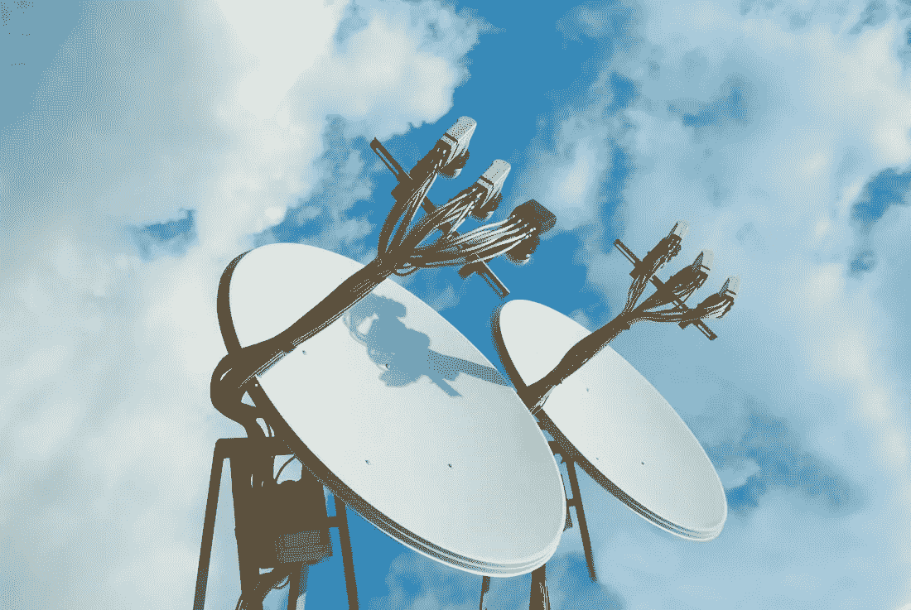

# 人工智能、网络中立和税收改革将共同塑造我们的未来

> 原文：<https://medium.datadriveninvestor.com/ai-net-neutrality-and-tax-reform-together-will-shape-our-future-b843fae8de27?source=collection_archive---------2----------------------->

它们不能分开讨论，因为它们将共同塑造我们的未来。

我们一直在快速发展，成为全球主要的互联信息社会。为了清楚起见，[信息社会](http://whatis.techtarget.com/definition/Information-Society)是这样一个社会，在这个社会中，信息的创造、分配和操纵已经成为最重要的经济和文化活动，而农业和工业化等其他活动总体上变得不那么重要。

增强你的大脑

我们还经历了新技术发展的急剧加速，无论是在创新的广度上还是在信息传播的深度上，都迫使我们适应新的生产力水平和在线存在。这就是“大数据”和基于云的解决方案的情况，这些解决方案支持虚拟助理、点播流、实时协作、虚拟会议、交通信息交换等等。如果你考虑到十年前还没有 iPhone 或装有 GPS 的汽车，这种速度是惊人的。五年前，虚拟助手、无人机、云基础软件、人工智能仅限于实验室，黑客无法阻止整个电网将我们推向世界末日。有迹象表明，加速度将继续增长。到了一定程度，人类的大脑将不足以跟随和适应。到那时，为了提高经济效率，我们将不得不利用由人工智能驱动的虚拟助手来增强我们的认知能力、数据处理能力和情境化，并通过能力分析为我们指明更好的方向。计算机不仅会驾驶我们的汽车，还会塑造我们的日程、决策甚至行为。这一切不再是科幻小说，而是纯粹的线性投影。

这幅画有点不对劲

我非常相信技术可以帮助我们过上更好的生活，带来更多的便利和财富。但是，每一次历史性的大技术浪潮，即工业革命，都会给社会带来许多固有的痛苦——破坏。这意味着普通人失去他们的企业或工作，必须通过高等教育和专业化来重新适应新的体系。我们正在经历的第四次工业革命的独特之处在于，我们给了人们适应的时间。前三次工业革命让人们在几十年后重新掌握技能。在我们目前的时代，我们只有不到 20 年的时间来调整——这是不够的，我们正生活在促进我们近代史上最深刻的社会不平等的边缘。这一进程的影响可能会对我们的经济和数亿人造成毁灭性的打击。

这就是我们正在为自己铺设的道路的证据。首先，经济一直在增长，但工资并没有以合理的速度增长。这种脱节至少可以用一个简单的事实来解释——中产阶级的工作已经逐渐被淘汰，新的工作没有被淘汰的工作薪水高。看看这项研究的数据。人们开始被新技术抛弃，他们很少能及时重新掌握技能。随着无家可归人口的空前增长，看看在[西海岸](https://www.usnews.com/news/best-states/washington/articles/2017-11-06/homeless-explosion-on-west-coast-pushing-cities-to-the-brink)发生了什么。这些趋势是真实的，如果我们的方法不发生深刻变化，它们就不会变得更好。我们不再谈论与煤炭相关的工作，而是在几年内数以百万计的办公室工作岗位被取消。我们的中产阶级岌岌可危，而[社会不平等](https://ourworldindata.org/income-inequality/)正在加剧。我们的社会结构能维持多久直到它开始分裂？

企业集中的好与坏

这些趋势尤其与新技术和国会的税收改革可能带来的问题有关。如果我们看不到全貌，我们最终可能只是加快我们人口的经济差距，将越来越多的人置于贫困线以下，并让位于欧洲和亚洲一些更发达的经济体。

当前的根本问题是，我们应该允许科技公司拥有多大程度的集中度和自主权。请记住，我们正在进入一个信息社会，大型科技公司目前比一些国家更重要，市值超过 1 万亿美元。例如，鉴于硅谷对丹麦的影响，丹麦任命了一名驻硅谷大使。

鉴于竞争较弱，大公司带来更大的利润。这些收益可能会促进更多更快的创新，但同时也有助于提高收入集中度，因为它们往往会在每一次合并或收购中消除就业岗位，并主要向富裕的投资者支付股息。与此同时，大公司可以在游说上花更多的钱来影响我们的立法者做出有利于他们的裁决。

这似乎是本周网络中立投票的情况。FCC 一直无视支持网络中立的不断叫嚣，做出有利于大型网络公司的裁决。托德·阿喀琉斯在[这篇文章](https://www.linkedin.com/pulse/net-neutrality-new-tires-rusted-old-car-todd-achilles/)中清楚地解释了竞争在行业中无效的影响。现在，像威瑞森、AT & T 和康卡斯特这样的大公司可以排除中小型企业竞争对手的内容，因为他们没有足够的钱来支付互联网上的快车道和过路费。结果是更多的集中，更少的竞争，更多的不平等。企业必须保护自己的利益并发展壮大，这是可以理解的。他们会将此作为他们的首要任务。例如，康卡斯特就在 FCC 投票之前，立刻从他们的网站上删除了他们支持网络中立的承诺——这是可耻的。这也告诉我们，道德讨论往往不如利润潜力那么重要，联邦通信委员会主席 Ajit Pai 的观点是没有意义的。公司将统治我们对信息的访问，就像中国政府在中国控制它一样，只是一个不同的权力统治者。

税制改革就是如此。通过对 1%的富人和大公司少征税，将会给这个已经衰弱的社会带来更多的收入集中和更多的社会不平等。鉴于中产阶级的工作岗位比其他人消失得更快，押注中产阶级税收将有助于抑制赤字也是不可信的。不断增加的债务将继续困扰我们的学校系统，降低我们大多数孩子的教育质量，危及他们的未来。更高和更好的教育是在这场新工业革命中变得更强大的唯一途径。我们的立法者似乎被旧的范式束缚住了，不理解工作将主要是虚拟的和移动的，公司将在任何国家雇用准备更充分的人——新工作的边界将越来越少。

如果我们不迅速采取行动，人工智能就会面临这种情况。AI 未来会创造新的工作岗位，但首先会有更快的淘汰。每一份 WEF(世界经济论坛)的研究都表明。今天，三家公司专注于人工智能的开发——谷歌、亚马逊和微软，没有政府机构忽视它的开发，并与关键的社会团体进行健康的讨论。我们需要让每个人都清醒过来，回答我们如何在不减缓人工智能发展的情况下讨论伦理问题。查看柳文欢·埃齐奥尼[在 NYT](https://www.nytimes.com/2017/09/01/opinion/artificial-intelligence-regulations-rules.html) 的专栏文章。是时候了解人工智能的社会影响，并实施解决方案，让我们的生活变得更好，而不是更糟。

做某事

FCC 对网络中立的决定，对人工智能的缺乏行动以及国会的税收改革方向告诉我们，社会不平等将继续增长，工资不会增长，经济扩张的好处只会被人口中最顶层的 1%所感知。美国将失去竞争力，因为我们的孩子没有受到足够的教育。是时候给我们的立法者打电话，要求一个不同的方法了。是时候选择与你做生意的公司以及向谁购买服务了。是时候投资新业务和新解决方案，帮助创造更美好的未来了。加入我们的[集体智慧](http://www.collectivebrains.org/)。

*最初发表于*[T5【www.collectivebrains.org】](https://www.collectivebrains.org/editorial/ai-net-neutrality-and-tax-reform-together-will-shape-our-future)*。*