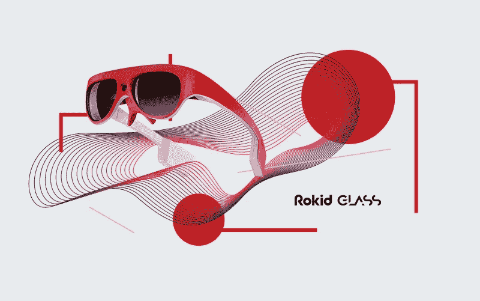

# 人工智能在 AR 上——持续的技术趋势

> 原文：<https://medium.datadriveninvestor.com/ai-on-ar-the-ongoing-tech-trend-cd46298910dc?source=collection_archive---------12----------------------->

AI-powered AR Glass - Rokid Glass

我们非常乐意分享和讨论我们对当前技术趋势的想法和预测，以及我们对涉及我们产品的解决方案的愿景！它让我们有机会展示我们的产品路线图，并解释我们为什么专注于开发 AI/AR 产品，以及我们如何结合这两种技术。

## 1.产品愿景和路线图

Rokid 的产品愿景非常简单明了:利用我们的语音和视觉人工智能技术，创造一个能够提高日常生活质量的智能助手，同时为用户提供无与伦比的增强现实体验。

自 2014 年成立 Rokid 以来，Rokid 创始人兼首席执行官朱自己的路线图一直非常清晰，包括家庭人工智能、便携式人工智能以及最终的个人人工智能。Rokid 的第一款产品 Alien 展示了我们的家庭人工智能概念。Rokid 的第二款产品 Pebble 体现了我们对便携式人工智能的想法。

## 2.为什么 AI 在 AR 上？

在过去的三年里，我们进行了大量的思考和研究，以找出“个人人工智能”的概念应该采取什么形式。会是耳机吗？一块手表？眼镜，还是纽扣？或者，也许是某种完全不同类型的可穿戴设备？最终，在仔细权衡了众多想法的利弊后，我们决定，带有嵌入式人工智能助手的 AR 眼镜提供了个人人工智能能够和应该成为的最真实和最令人信服的表达。

支撑整体用户体验的是计算机视觉、深度学习和自然语言处理等领域的快速进步。例如，在图像识别方面，计算机视觉的准确性现在可以与我们人类的能力相媲美。新的专用人工智能芯片正在加快深度学习的速度，自然语言处理的惊人进步现在正使人机语音交互越来越直观。

这些技术进步正在催生全新的生态系统，其中增强现实增强的应用和内容正在融合，正如数百万每天与智能手机互动的人已经在使用增强现实所证明的那样。

## 3.我们的产品解决方案是什么？

在整个过程中，我们一直希望不仅能够融合数字和物理世界，还能提供卓越的用户体验，流畅地融合复杂的视觉和语音元素。具体来说，这种体验可以让你在一个陌生的城市轻松找到路，提醒你一个老朋友的最新状态，并立即将外语餐厅菜单翻译成你的母语。

在 CES 上试用 Rokid Glass 的参观者中压倒性的积极反应充分证实了我们对个人人工智能的愿景是正确的。Rokid Glass 先进的面部和物体识别功能给用户留下了深刻的印象，这些功能包括能够快速准确地获取你可能一时忘记的某人的姓名和其他识别信息。

在 CES 上对 Rokid Glass 表现出浓厚兴趣的还有那些代表博物馆的人，他们对能够提供更多艺术作品信息的前景很感兴趣。零售商也受到了在实体店中展示产品细节、评论和价格比较的潜力的启发。

## 4.产品更新

在用于评估头戴式显示器(HMD)的各种指标中，重量、视野(FOV)和价格可能是最常被引用的。对于目前市场上可用的设备，重量通常在<50 grams=”” to=””> 500 克之间，这是耳机/眼镜耐磨性方面的一个主要因素。毫不奇怪，一个大 FOV 提供了一个更好的沉浸式体验。然而，这也需要权衡重量和外观。挑战是在两个极端之间取得平衡；一端是“类似虚拟现实”的大 FOV 笨重头盔，另一端是好看的小 FOV“智能眼镜”我们 Rokid 认为，我们已经找到了介于两者之间的“最佳点”，将最佳的可穿戴性和高度的沉浸感结合在一起。此外，价格对消费者友好。

从各种可能的光学解决方案中，我们选择了高分辨率(720p)色彩鲜艳的有机发光二极管微显示器，结合我们自己设计的超薄单自由透镜。这种最佳的光学解决方案提供了大约 33 度的 FOV。此外，其高度的光学效率显著降低了功耗。它还拥有最具设计友好性的外形，以确保耐磨性。整体来看，整个硬件系统体现了极致设计的精神。它的工业设计提供了时尚和流线型的形状，在传统笨重的 AR 眼镜和/或头盔中脱颖而出。在使用超轻质材料的过程中，我们的机械工程师也从人体工程学角度考虑了这一点。强大的 CPU 支持摄像头、IMU、触摸传感器、麦克风和扬声器，它们共同承诺通过触摸板、语音和手势控制实现交互式用户界面。由于所有功能都集成在一起，Rokid Glass 系统可以通过蓝牙和 WiFi 独立运行，而不需要连接到计算机。所有这些的总重量只有 130 克。

Rokid Glass 建立在定制的 Android 操作系统上，使我们有可能提供具有我们自己开发的算法的 SDK。这些包括(但不限于)手势和语音控制的用户界面，以及包括人脸识别和物体识别的计算机视觉算法。此外，开发人员将能够使用我们的 SLAM SDK 进行本地化和映射，以创建他们自己独特的使用 Rokid Glass 在 3D 空间内进行交互的方式。