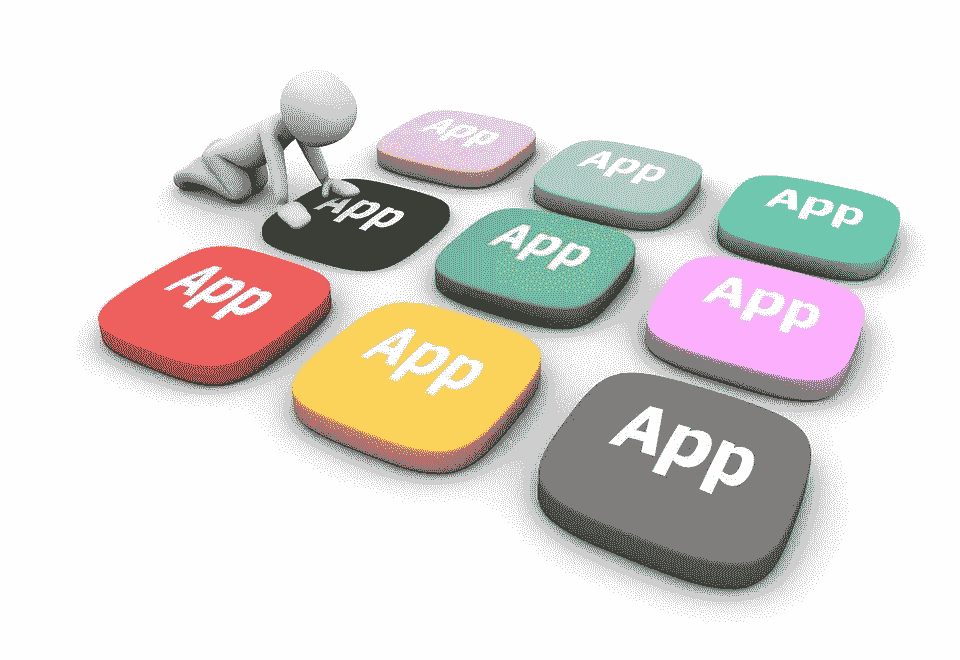

# 人工智能操作系统

> 原文：<https://medium.datadriveninvestor.com/ai-operating-system-7809e7fc4e49?source=collection_archive---------1----------------------->

**简介**

基于 AI 的操作系统可以具有与软件管理、硬件管理和公共系统服务相关的特征。与传统操作系统的关键区别在于系统管理的智能化。操作系统架构从旧的 IBM 大型机发展到 linux 和 macOS。Windows metro 展示了操作系统中人工智能的一些特性。基于强人工智能的方法被用于 AI 操作系统。模糊逻辑、专家系统、神经网络、模式识别、预测和其他人工智能特性被用于开发人工智能操作系统。

基于人工智能的操作系统具有感知智能、想象、上下文特定搜索、上下文启动、抽象联想思维和其他人工智能技术。这些方法通过使用并行进程、良好的内存管理和改进的安全性来帮助减少操作时间。新的操作系统具有数字助理、翻译服务、语音识别、用户交互、配置文件管理、安全扫描和用户报告。

 [## 人工智能与创造力:梦想成真|数据驱动的投资者

### 人工智能总是让我着迷。不仅作为一套有用的工具，不断发展，而且作为一个…

www.datadriveninvestor.com](https://www.datadriveninvestor.com/2019/01/28/ai-creativity-deep-dream-comes-true/) 

正如 holly wood 电影中所示，基于人工智能的操作系统可以在用户在计算机或移动设备上执行任务时向用户提供建议、指导、帮助、演示、推导、解释、解释、预测、证明和建议。它就像用户执行任务时的伴侣。操作系统具有使用历史交互、个人偏好、简档和交互来学习和发展的能力。与用户的交互可以是命令行、语音、基于文本和手势。操作系统可以提供与 IOT 集成的能力。例如，家庭自动化和安全性可以轻松集成。

**操作系统特性**

操作系统由内核、外壳和系统服务组成。用户与终端交互以获得外壳服务。这些服务是与身份验证、授权、计划、管理文件和报告相关的组件。内核具有弹性伸缩、独立于技术栈执行运行时，以及从特定实现中抽象容器的能力。容器可以很容易地跨不同的云部署。

这个操作系统将对基于人工智能的数据建模、机器学习和深度学习非常有用。需要对数据进行处理和分析，以训练、测试和执行人工智能模型。操作系统可以选择具有技术栈的特定容器来分析机器学习模型。它可以基于 Tensor Flow、Keras、Caffe、scikit-learn 或基于 R 的技术堆栈。在基于人工智能的操作系统中，管理和集成不同的数据源将变得很容易。

使用弹性模式，操作系统可以使用多个节点和存储管理功能轻松扩展。它可以具有诸如自校正、自优化和自动缩放的特征。操作系统可以具有与发现不同的服务、功能、模型、数据源和技术组件相关的可发现性服务。类似于应用程序商店，这个操作系统将有一个应用程序商店，其中将有可以轻松部署的应用程序。供应商和开发人员可以发布应用程序。

**系统生命周期**

像传统的操作系统一样，从启动到关机，重要的特性保持不变。代码从引导盘运行并定位分区引导记录。该记录定位引导特定代码文件。这些文件被加载以供执行。加载文件后，用户将看到一个用户友好的界面。至此，与人工智能方法相关的服务被初始化。引导序列确保启动这些服务来帮助用户执行他的任务。

人工智能服务接管启动模块，并通过命令行、文本、手势、用户界面菜单和语音帮助用户处理他的请求。这些服务跟踪用户数据、模式、导航、行为，并将这些数据用于学习。通信服务使用基于信号的信道来发送和接收消息。人工智能基本模块处理信息并帮助不同的服务管理系统。用户操作在数据存储中存储和更新。应用程序特定的行为、文件命名、内容组织和信息处理都保存在数据存储中。

Digital Assistant

为了处理与语音、文本和命令行方法相关的语言处理，NLP 和 NLU 模块用于处理内容。基于神经网络的模块有助于学习语音、文本和手势的用户输入模式。个人用户名、密码、首选项、填写表单的个人资料以及用户数据都存储在安全的数据存储中。操作系统提供了更好的登录体验，用户输入最少。

社交媒体访问和用户以安全的方式与社交媒体交互是该操作系统的功能之一。该操作系统将具有从用户应用程序访问内容、媒体文件、本地文件、互联网的组件。该应用程序将有友好的用户界面，以帮助用户导航和定位正确的内容。操作系统的基本模块存储用户交互并从用户动作中学习。

AI OS : Multi Channel Based

数字助理将陪伴用户，帮助他执行复杂的任务。它可以像钢铁侠的贾维斯一样帮助报道、研究、建议、解释和推导。该助理可以管理日程、安排会议、执行更改、创建基于搜索的报告以及在社交媒体上进行跟踪。操作系统将有一个处理日常任务和学习不同技能的个人助理。它可用于研究、调度和管理操作系统。系统范围的变化、社交媒体跟踪、做笔记、提醒和警报管理是数字助理的功能。

App Store : AI OS & SDK

操作系统将能够处理多媒体。媒体可以从互联网、本地文件系统和媒体播放器的云端播放。可以从任何设备(如笔记本电脑、平板电脑、手机和浏览器)从云中访问媒体。该操作系统具有高可用性的关键特征。它将拥有桌面客户端、在线终端访问、移动应用程序和来自任何其他平台的 SSL 访问。输入方法可以是感官输入、键盘、鼠标、触摸板和其他基于手势的输入。可以为基于事件的任务配置操作系统。基于事件执行动作，并且系统学习为类似事件自动创建的模式。

愿景是创建一个 SDK，它可以拥有用于开发应用程序和管理商店的工具集，以使应用程序可以从不同的供应商和开发商处获得。