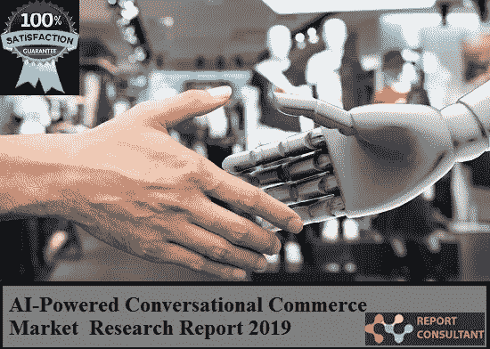

# 人工智能驱动的对话式商务市场研究

> 原文：<https://medium.datadriveninvestor.com/ai-powered-conversational-commerce-market-research-361c4780f760?source=collection_archive---------9----------------------->

对话式商务就是将消息传递(如实时聊天和人工智能聊天机器人/虚拟助手)融入购物体验，随时随地回答客户的问题和关注。

 [## 挑战你对人工智能和社会的看法的 4 本书——数据驱动的投资者

### 深度学习、像人类一样思考的机器人、人工智能、神经网络——这些技术引发了…

go.datadriveninvestor.com](http://go.datadriveninvestor.com/4AI1) 

随着时间的推移，移动技术的进步继续彻底改变着零售业。但 2019 年将迎来一场特别深刻的变革，因为更丰富的人工智能驱动的界面推动了已经席卷零售业的趋势。人工智能一直是这个对话式商业故事的一部分——但人工智能不断改进的能力现在正进入消费者生活中最重要的界面之一:文本收件箱。自动化企业对消费者信息传递的未来，更具体地说，零售市场的未来，将由人工智能驱动的品牌和消费者之间的互动来塑造。

在 2018 年至 2026 年的预测期间，全球人工智能驱动的对话式商务市场将快速增长。

**顶级关键球员:**

微软(美国)

谷歌(美国)

Salesforce(美国)

IBM(美国)

英特尔(美国)

亚马逊网络服务(美国)

HPE(美国)

Ayasdi(美国)

高通技术公司(美国)

绝对数据(美国)

脸书信使

BotFuel

聊天燃料

聊天机器人机构

因本塔，科宁科尔

iAdvize

添加结构

Whimmly

人工智能驱动的对话式商务市场研究报告详细阐述了顶级制造商或服务提供商的业务概况。它包括公司概况、联系方式、规格和利润率等信息性数据。除此之外，它还提供了各种 c 级人物的案例研究。另一方面，它让我们清楚地了解企业的财务状况。人工智能驱动的对话式商务的日益普及促进了市场的增长。它列出了企业的驱动因素和制约因素，以了解企业的各个兴衰阶段。

本研究报告中展示的表格、图形、图表和图片的有效集合，清晰地展示了全球人工智能驱动的对话式商务市场，为轻松理解这些概念奠定了坚实的基础。此外，它还讨论了有助于提高业务绩效的战略规划和资源利用。它提供了政府的关键法规、政策和规则，以推动业务的成功发展。

**在这项研究中，估计人工智能驱动的对话式商务市场规模的年份如下:**

历史年份:2013–2018

基准年:2017 年

预计年份:2018 年

预测年 2018 年至 2025 年

如果您有任何特殊要求，请告诉我们，我们将为您提供您想要的报告。