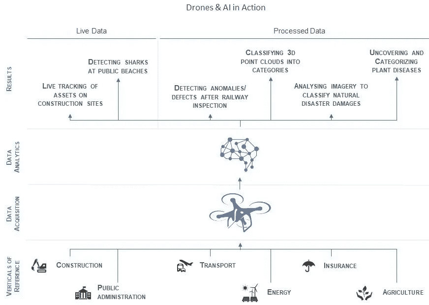
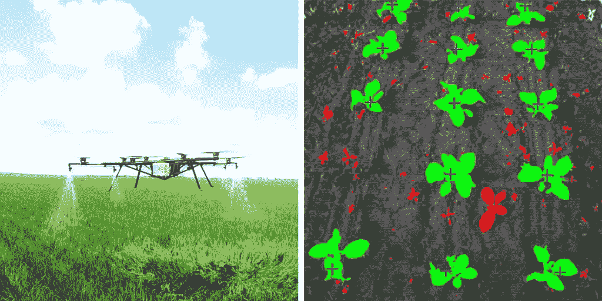
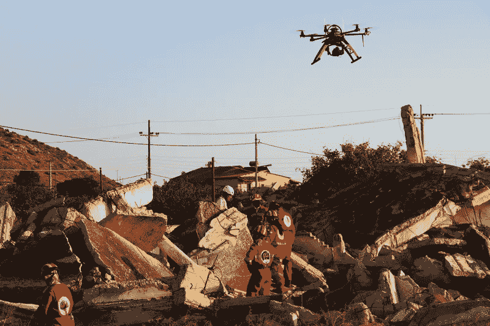
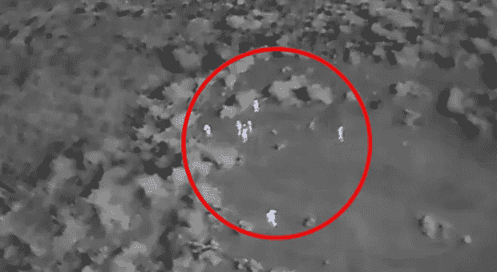
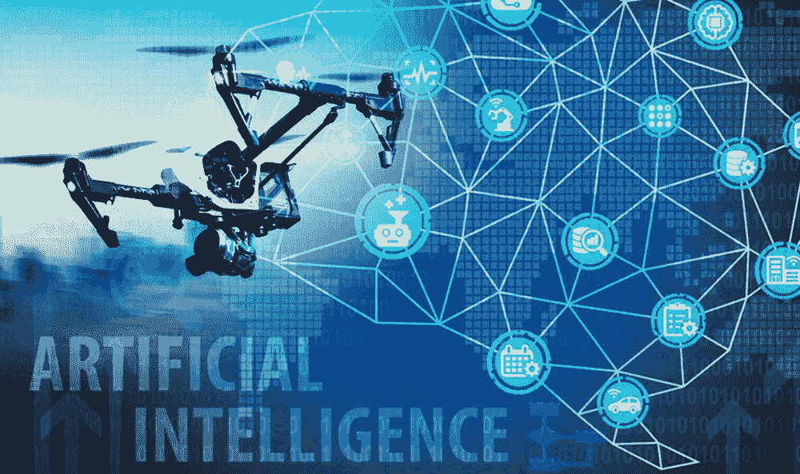

# 人工智能驱动的无人驾驶飞机:一项技术优势

> 原文：<https://medium.datadriveninvestor.com/ai-powered-drones-a-technological-benison-c734f6135c2c?source=collection_archive---------2----------------------->

作为一名好奇的读者，几天前，我正在阅读本世纪最热门的词汇，**无人机**和**人工智能**，这两个词如何改变地球上人类生活的未来，这完全令人着迷。

这就是为什么，我决定将我目前的博客文章献给这两项技术，以便我们(我和我的读者)可以一起探索人工智能驱动的无人机新时代的可能性。

无人机可以被称为**飞行机器人**，但目前，它们中的大多数由人类飞行员控制。从农业到房地产，从国防到包裹递送，无人机在多个行业都有各种各样的好处。

 [## 我们为军事人工智能做好准备了吗？-数据驱动型投资者

### 今天，算法可能会以迷人的形状出现，例如索菲亚，一个态度可爱、开明的机器人…

www.datadriveninvestor.com](https://www.datadriveninvestor.com/2019/02/21/are-we-ready-for-military-ai/) 

仅仅在低空飞行并不是无人机的特别之处。正是它们捕捉远程数据、监控视频并在没有太多人工干预的情况下针对各种目标进行分析的能力，使得无人机作为动态传感器如此有利可图。无人机还可以将电力与高效利用运输能力结合起来，并最终有助于减少二氧化碳排放和改善许多服务。

为了减少数据中的人为干预，我们需要让**智能无人机**能够**读取**、**计算**、**分析**、**预测**数据，以提供有用的信息。在没有人类的情况下，无人机可以依靠内置的机器学习算法来运行。

这种过程的一个例子是，让我们假设我们需要像教小孩一样教无人机。那么，我们如何教一个蹒跚学步的孩子呢？我们给他们看这个物体(像一个苹果)并告诉他们它的名字，“苹果”。现在，我们需要一次又一次地重复这个过程，直到幼儿记住这个物体及其名称。类似地，一种简单的机器学习技术是'**监督学习**'。在这种技术中，我们可以获取大量无人机的视频(无人机图像的数据集)并对其进行标记。在对象检测模型中，我们可以传递这个数据集，模型可以记住这个标记的数据。现在，当我们向模型提供新的测试图像时，该模型基于各种特征可以预测该给定图像内每个对象的标签。

这些模型基于**深度神经网络**，而深度神经网络又依赖于**高级概率&统计**技术。

# 有自己眼睛的无人机:

想象一个飞行物体，它可以飞行几个小时，并连接到互联网。它可以拍摄无限数量的照片并进行处理，而且每天都变得更加智能。它可以改进其软件，以更精确的面部检测来识别情绪。在测试中发现，人工智能驱动的无人机在短短 40 小时内通过反复试验自学了 20 种不同的环境。

# 更好地应对障碍:

无人机可以处理传感器数据，并通过分析途中的障碍来规划前进的道路。可以用于此目的的著名机器学习算法之一是'**模糊逻辑**'。

简而言之，该算法将检测一个对象，并可以为该对象的所有可能标签赋予一个值(从 0 到 1 ),具有最高值的标签将是解决方案。要了解更多，你可以去这个网站【https://www.geeksforgeeks.org/fuzzy-logic-introduction/ 。它对这个算法有最简单的解释。

# 农业可能性:

无人机镜头可以放大番茄幼苗的黄色花朵，并将这些图像用于人工智能算法，该算法可以精确预测花朵需要多长时间才能变成成熟的番茄，可以采摘、包装和进入杂货店的农产品区。

据报道，无人机可以利用计算机视觉来监控和喷洒杂草。精准喷洒可以帮助**防止除草剂抗药性**。精确技术消除了通常喷洒在作物上的 80%的化学物质，并且可以减少 90%的除草剂支出。

公司正在利用**深度学习模式识别算法**来处理无人机捕捉的数据，以监测作物和土壤中的养分缺乏。通过软件算法进行分析，该算法将特定的树叶图案与某些土壤缺陷、植物害虫和疾病相关联。

# 建筑和房地产:

在另一个用例中，人工智能驱动的无人机可以通过分析过去的数据来拥有**预测能力**。例如，从一个建筑工地拍摄的长达一个月的镜头可以用来预测该工地在未来一周左右的样子。

# 搜索和救援:

具有高效机器学习算法的无人机可以自行分析区域图像，并且只向人类发送具有特定搜索对象的图像。例如，一组人无法实时关注从数百架无人机接收到的视频片段来寻找失踪的车辆。然而，通过人工智能，智能算法可以分析从不同摄像机接收的镜头，并实时识别搜索的对象。

# 偏远地区的紧急医疗用品:

它可以检测到人类无法快速到达的精确位置，以便投放药物。此外，有了更好的算法，它可以定位药物必须送达的特定地址和人员。

# 危险战区的无人监视；

正如我们所知，人工智能描述了具有人类智能特征的机器的能力，这些机器可以执行复杂的任务，如推理、解决问题、规划和学习。 **AI 驱动的武装无人机**可以在热成像相机的帮助下自行识别目标，并且可以在没有人类干预的情况下对其进行攻击。

为了进行精确的**目标识别**，我们需要大型数据集来教会无人机各种环境。该数据库是识别的关键起点，因为它将是分析数千张面部图像的基础，以便在环境和热特征之间建立最佳关联。

还有许多甚至尚未探索的可能性，比如，实际上一些日本公司正在使用一种叫做 **T-Frend** 的无人机，它是“**设计来减少加班，在下班后在办公室飞来飞去**，播放大声的音乐，给任何仍在工作的员工拍照，并向管理层报告”。他们还可以利用成群的小型太空探测器探索地球无法及时通讯的星系。

大多数无人机数据分析公司仍在使用传统方法处理从无人机获取的数据。但所有参与者对他们是否部署人工智能工具的问题做出积极回应的事实表明，人工智能似乎对他们越来越重要。37%的受访者已经完全依赖机器或深度学习，所有迹象表明，随着时间的推移，这一比例将会增加。

进一步利用和开发这些强大的智能数据处理工具将有助于大大减少大数据的处理时间，这是当今的一个巨大挑战。因此我们可以得出结论，随着人工智能在无人机行业的应用越来越重要，**高度自动化的飞行**将变得更加可行和更加普遍。