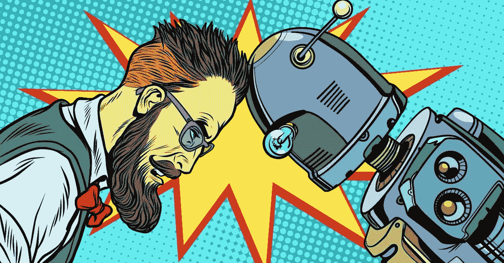

# 人工智能驱动的人力资源及其不可替代的人的因素

> 原文：<https://medium.datadriveninvestor.com/ai-powered-hr-and-its-irreplaceable-human-factor-a0f09f79ae30?source=collection_archive---------21----------------------->

AI 或人工智能这个词已经被使用了足够多的时间，以至于成为年度词汇，或者连续多年，所有人都在关注它。它的隆重登场，激发了推动企业前进的能量，也让人们对失去舞台地位产生了些许恐惧。这个新家伙，也被称为 AI，接管了大多数行业，并使那些从事地面工作的人的生活变得更容易和更可怕。当然，这只是更广泛的情况，我们今天谈论的微观情况是它的进入、存在和对人力资源的影响。正如许多人所说，真正的人类事物正在体验机器人的味道。那么有了 AI，HR 的生活会是怎样的呢？到底会不会有生命，这是我们要探究的问题。

**AI 在招聘**

人工智能的传播已经在人力资源的许多不同领域占据了一席之地，其中招聘过程占据了相当突出的位置。通常是在一个有限的空间里与来自该组织的几名经理和候选人聊天，现在已经变成了一个过程，其中包括通过系统进行技能测试和职位映射，导致聊天机器人支持的面试，然后通过一个平台完成适应性检查和入职。考虑到即将到来的变化，这些只是冰山一角。虚拟现实甚至让员工有机会在不踏入工作环境的情况下感受一下工作环境。几乎没有身体接触，却在如此短的时间内完成了如此多的工作。

**AI 体验**

人工智能的便捷和超现实的特点给工作环境带来了新的灵感。人力资源也不例外，在这里，人的因素可以体验到一种新的兴奋感和便利感，所有这些都打包在一个包中，几乎没有集成。 [HRIS](http://www.peopleshr.com/) 是很久以前的事了，但是很少集成人工智能元素，这种体验得到了额外的推动，使工作变得更加容易和高效。像申请离开这样的自动化功能现在可以很容易地通过机器人技术来命令和完成，将这个过程中点击和键入的少量人工劳动变成一个简单的语音命令。

**人工智能分析**

从那时起，分析就要花费相当多的时间和精力，它需要支持材料，最终结果通常是需要支持结论的重大决策。随着人工智能的一小部分渗透到技术领域，爬进像 [HRIS](http://www.peopleshr.com/) 这样的空间，预测分析和模拟等工具进入了整体画面。预测分析通过获取存档数据，绘制出未来的趋势和模式。曾经非常依赖直觉的东西得到了很好的明显支持的视觉表现。另一方面，模拟可以让你建立自己的未来，玩数字游戏，让拼图块符合需要的方式。这些不是最复杂的人工智能，而仅仅是一棵大树的叶子，在需要的时候仍然有所作为。

**人为因素**

在所有这些技术讨论中，许多人似乎看到了人类工作场所未来的负面乌云。但许多人没有看到的是，技术的未来取决于人类因素，最聪明的技术从人类互动中学习，这就是为什么它被称为机器学习而不是魔法。一个机器人军队接管世界的世界远远超出了我们的能力范围，尽管更近更可能的未来是一个到处都写着便利的未来。事情将变得比以往任何时候都更容易和更快地处理，任务也将有所不同。但是人力资源中的人的因素仍然会保持不变。未来将是由高性能技术驱动的劳动力。因此，需求将改变为更高的赌注，给予那些能够更好地与开发合作的人，然而人类的需求仍然是必要的。

就像几代人穿越时间一样，太阳以旧的方式落下，新开发的方式进入大气层。有时很难跟上，甚至在某些点上很难理解，因为变化总是很难处理。AI 是这样一个大联盟的球员，将不断做出改变，一些人可能会觉得有挑战性，而另一些人会觉得有趣，这取决于一个人处理变化的方式。这个人类设计的奇迹没有魔法，但像人类一样的思考方式可能更高级一点，因为它只有一个优先事项，那就是完成工作。作为人类，这是我们和人工智能之间的障碍，这带来了多样性。随着我们能力的提高，随着赌注的增加，人的因素将成为保持比赛场地有趣和高要求的因素。