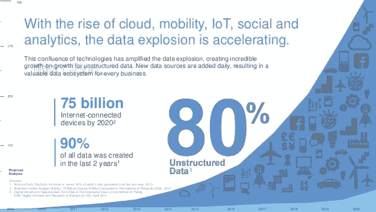
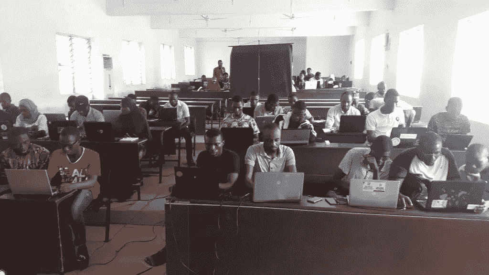

# AI 星期六(AI6) Ibadan 群组 2

> 原文：<https://medium.datadriveninvestor.com/ai-saturdays-ai6-ibadan-cohort-2-b68dee5c99ee?source=collection_archive---------24----------------------->

这是 AI6 Ibadan 群组 2 的第一篇文章。

人工智能是引领第四次工业革命(4IR)的领域之一。根据 Stephen Odaibo 博士(开发 RetinaAI 的多学科专业人士和专家)的说法，“创新是一个过程，创新的两个主要步骤之一是**通过能力建设、创建结构和系统开发获得前沿**”。人工智能星期六 Ibadan 昨天(2019 年 1 月 19 日)刚刚开始了第二批活动，旨在培养人工智能方面的能力和人才，因为对专业人士和专家的需求不断上升。

对人工智能爱好者和专家的需求得到了 IBM 等顶级技术公司的评估，即世界上 90%的数据是在过去两年中创建的。该数据包含大约 80%的非结构化数据。人工智能是从这些非结构化数据中获得可操作见解的唯一方式。这些数据和见解是帮助其他几种技术在执行多种操作时变得更加智能、高效和有效的关键输入。一些技术是机器人，物联网，自动驾驶汽车和纳米技术。

Evaluation of Data Generated in the Last Two Years (Credit: IBM)

随着个人、团体和公司寻求利用这项技术，对人工智能的兴趣正以惊人的速度增长。AI6 Ibadan 群组 2 的参与者中有 90%是新参与者，另外 10%代表那些参与 AI6 Ibadan 群组 1 的参与者。许多人仍在联系大使，以便加入社区。由此可见伊巴丹(西非最大城市之一)对人工智能的兴趣。

国际环境与发展学院大使(Ahmed Olanrewaju 先生)代表国际环境与发展学院伊巴丹小组，在尼日利亚伊巴丹大学计算机科学系科拉·黛丝大厅启动了国际环境与发展学院第二组。这两次会议分别在上午 9 时至下午 1 时(格林尼治标准时间+1 时)和下午 2 时至 5 时举行。第一次会议是为“Python 程序员”举办的，包括由 Ahmed Olanrewaju 先生主持的初级“Python 编程介绍”和由 Adebayo、Ibrahim Olagoke 和 Nasirudeen 主持的“创建预测贷款欺诈的模型”。第二次会议是为不想学习编程的“非 Python 程序员”举办的，包括“Power BI 和数据转换介绍”。

AI6 Ibadan Cohort 2 Participants

阿卜杜勒哈米德·奥拉扬朱·RAJI。AI6 伊巴丹大使。