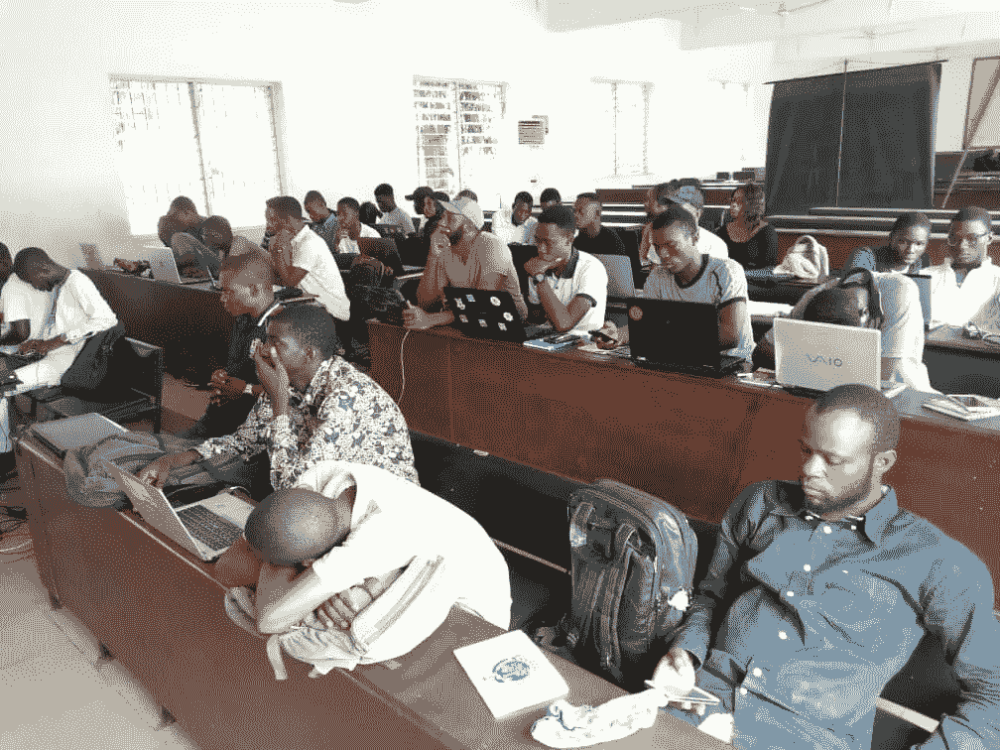
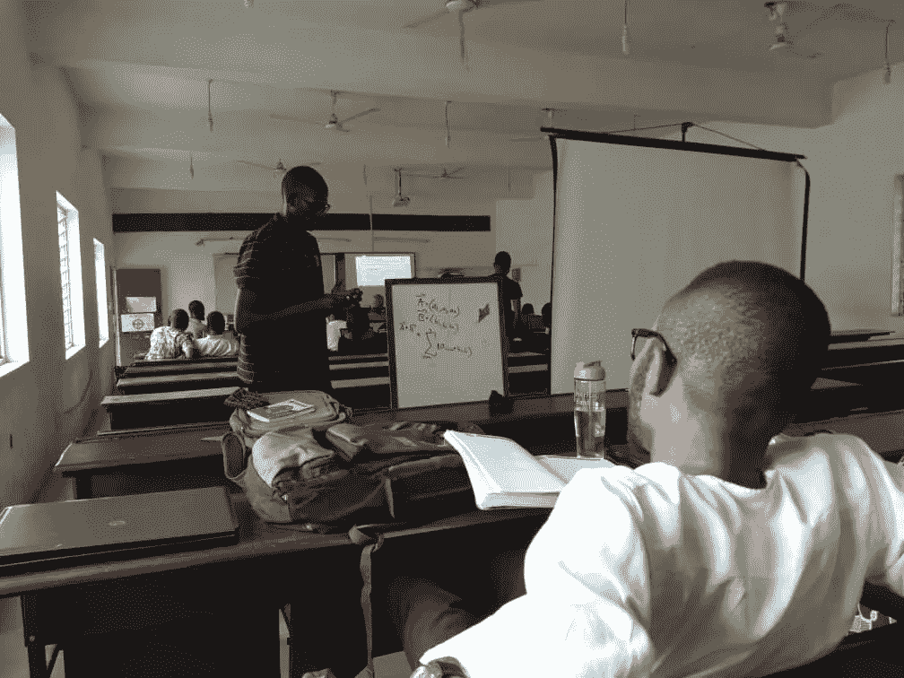
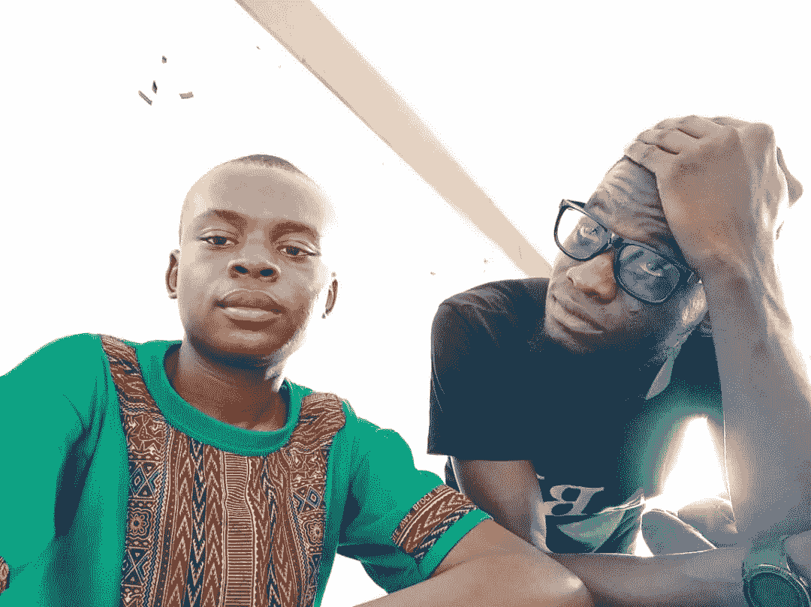

# AI 星期六 Ibadan 群组 2 -第 2 周

> 原文：<https://medium.datadriveninvestor.com/ai-saturdays-ibadan-cohort-2-week-2-d557976cba76?source=collection_archive---------20----------------------->

这是伊巴丹大学计算机科学系科拉·黛丝演讲厅又一个美好的日子。参与者早在上午 9:30 就开始来了。尽管这个特殊的星期六是这个月的最后一个星期六，被归类为包括伊巴丹在内的奥约州城市的环境日。在整理好后勤工作后，节目在上午 10 点多一点开始。

第一次会议立即开始了。《python 初学者教程》是由 Nasirudeen([@ naserelider](https://twitter.com/Nasereliver))和我( [@ao_raji](https://twitter.com/ao_raji) )促成的。中级/机器学习课由 Ibrahim Olagoke[(@ Ibrahim goke](https://twitter.com/ibrahimgoke))促成。Nasirudeen 通过 python 速成课程学习了该课程，其中包括列表、输入、输出(打印语句)、条件/循环语句(if、else、while、for 语句)、列表、元组、字典、集合、映射、逻辑语句(and、or)、比较(大于、等于、不等于、小于、小于)和布尔语句(真或假)。Nasirudeen 在课后进行了一个简短的练习，让参与者练习并询问有关课程的问题。

Participants during First Session of Week 2

中级班与初级班同时进行。线性代数是 Ibrahim 的课程顺序，参与者讨论矩阵、向量、加法和标量乘法、矩阵乘法、单位向量、矩阵和逆矩阵。

A participant contributing to the Linear Algebra class.

我接手了 Nasirudeen 的工作，并主持了一个“numpy”课程。在这节课中，我们看了 numpy 数组；它的属性，切片，整形和重塑，矩阵，索引，连接和分裂数组。在数组属性下，我们查看了形状、类型、大小和内容。数组切片包括从较大的数组中获取较小的数组。我们还处理了索引(选择和设置数组中的单个元素)、将数组整形为确定的大小、将其整形为另一个大小、连接数组以形成更大的数组以及将数组拆分为许多数组。由于第一节课的时间太紧，我允许参与者把 numpy 练习带回家练习。

Ibrahim Olagoke and I during a short break.

第一次会议在下午 1:30 左右结束，第二次会议在下午 2 点开始。 [Moyosola](https://twitter.com/mo_yosiwealth) 和首席大使( [Ahmed Olanrewaju](https://medium.com/u/a5071cc9fccd?source=post_page-----d557976cba76--------------------------------) )帮助非程序员类使用 PowerBI 从[box office mojo](http://www.boxofficemojo.com)执行数据采集、数据转换(检查特征类型、更改数据类型等)。)，对数据的简单查询和可视化数据。总共获得了 763 个具有关于电影的若干特征的观察结果。数据包含文本、日期和时间、货币和十进制数数据类型。

第二周的节目在下午 5 点左右结束

阿卜杜勒哈米德·奥拉扬朱·RAJI。大使，艾星期六伊巴丹。