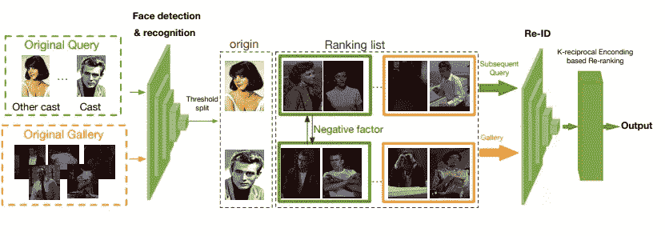
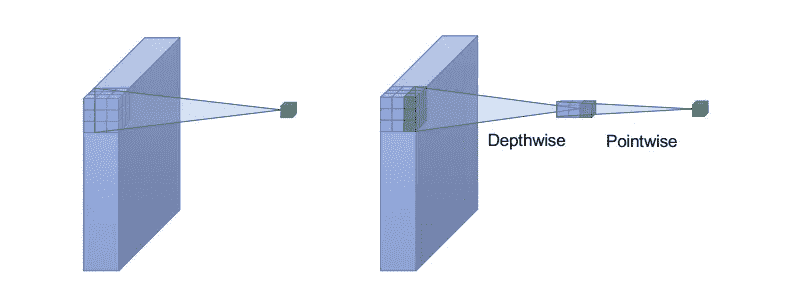
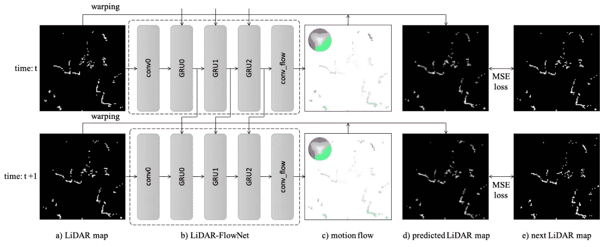
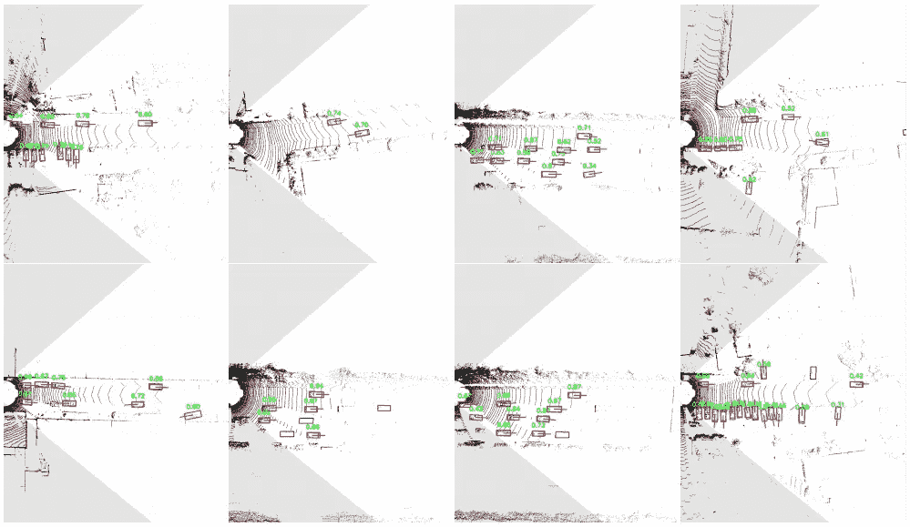

# AI 学者 5

> 原文：<https://medium.datadriveninvestor.com/ai-scholar-5-8af068233a28?source=collection_archive---------13----------------------->

## 神奇的开源图像分割数据标注软件；深度方向的卷积；SoTA 人脸图像编辑系统；实时三维物体检测；2018 更广泛的挑战结果

## [通过注册订阅时事通讯，将《AI scholar: Weekly》直接发送到您的收件箱](http://eepurl.com/ghCeNn)

## [AI Scholar (AI 大事件) 现在有中文版了！来读我们的每周时事通讯获取最新的 AI 研究见解](https://mp.weixin.qq.com/s/ba6WU_R_dfBqsH8pYICYLw)

# **还记得 2018 年更广泛的挑战吗？下面是结果**

ImageNet 和 COCO challenge 系列等公共基准和挑战背后的成功正在逐步推动人工智能研究的发展。正是这样的结果激发了更广泛的挑战，邀请学术界和工业界的研究人员和开发人员参与并鼓励进一步的研究和开发。该挑战由三项任务组成，并对计算机视觉领域的一些长期挑战进行了评估，包括人脸检测、行人检测和人员搜索。

## **结果:挑战总结和获奖方案**

挑战参与者被提供了用于上述三个任务的基准数据集。对于每条赛道，参与者需要将他们的模型输出上传到公共评估服务器，该服务器分为验证阶段和最终测试阶段。挑战赛的获胜者由模特的表现决定。

这份研究报告总结了 100 多个提交了有效材料的团队在每条赛道上的成绩。在人脸检测任务中，获胜团队通过汇总多个人脸检测器的预测，设计了一个单阶段检测器。行人检测跟踪的第一名提出了级联 R-CNN 模型，该模型具有强大的附加结构以提高性能。最后，在人物搜索中，获胜者设计了一个级联模型，利用个人的面部和身体特征。报纸上有每条赛道前 5 名车队的更多详细信息。

## **潜在用途和效果**

WIDER challenged 激励开发人员和研究人员更加努力，解决计算机视觉中的关键研究问题。新的方法无疑将推动有效的系统来帮助解决人类在人脸和物体检测方面面临的一些最可怕的问题。

更多阅读:[https://arxiv.org/abs/1902.06854v1](https://arxiv.org/abs/1902.06854v1)

# **用于学习多个视觉域的深度方向卷积**

深度可分卷积已被证明对于标准卷积应用非常强大，包括图像分类、自然语言处理和嵌入式视觉应用。根据该研究，这是第一个探索其多域学习应用的深度应用，并且基于来自不同域的图像共享跨通道关系的假设。

为了跨不同领域进行有效的知识转移，研究人员引入了 softmax 门控机制。在多领域学习模型的视觉十项全能挑战基准上测试，所建议的方法比最先进的传统方法得分更高。

## **潜在用途和效果**

所建议的方法是紧凑的，易于扩展，并且可以被训练以使用较少的计算能力工作和适应新的领域。深度方向卷积同样可以用于提高特定域表示的精度。该方法可以应用于计算机视觉、情感分析、推荐系统等方面的进步。

更多阅读:【https://arxiv.org/abs/1902.00927v2 

# **SC-FEGAN:新的人脸编辑系统**

SC-FEGAN 是新的高端人脸编辑系统。它基于 CNN，接受用户草图和颜色作为输入，用户只需很少的努力就可以完成和生成高质量的图像。为了改善尴尬的边缘，SC-FEGAN 采用了 SN-贴片 GAN。此外，它还通过 GAN 和样式丢失进行训练，以实现高级图像编辑。根据研究，与前述图像完成方法相比，SC-FEGAN 使用自由形式的遮罩在结构和形状的质量方面产生了更好的结果。研究人员在 celebA-HQ 数据集上分别训练了该系统。

## **潜在用途和效果**

SC-FEGAN 在一次转换和恢复大面积面部图像方面表现出色。它还允许用户自动编辑图像特征，如发型、脸型、眼睛、嘴巴等。让我们一致认为 SC-FEGAN 有潜力推动面部识别应用的研究工作。此外，它可以帮助生成非常需要的基于高质量图像的训练数据集。

更多阅读:[**https://arxiv.org/abs/1902.06838v1**](https://arxiv.org/abs/1902.06838v1)

# ****带自由标签的快速高质量注释****

**为了开发一个直观的基于 web 的界面，使用户能够获得高质量的注释，从而轻松适应不同的数据集和类别，这篇新发表的研究论文引入了免费标签。基于网络的工具为图像分割数据集的快速和高质量注释提供了典型的交互式界面。为了实现精细的语义分割，自由标签实现了区域增长细化(RGR)算法。RGR 可以完全无人监管，并且实现简单。与其他相关算法不同，它的计算时间和参数化允许超快快速的用户交互。免费标签易于访问，因为它实现了模块化设计，并且完全依赖于开源库。它可以部署在本地或外部服务器上，允许用户通过私有或众包方式进行注释。**

## ****潜在用途和效果****

****

**深度学习社区可以通过利用其模块化结构轻松注释任何图像数据集，从免费标签中受益匪浅。自由标签还可以适用于各种数据集的有效分割注释，这有助于开发更准确和鲁棒的模型。为了了解如何使用和正确注释数据集，可以使用短视频教程和一个有趣的类似游戏的 FreeLabel 版本。通过实时推进 RGR 算法，可以快速跟踪免费标签工具。此外，只需进行一些调整，免费标签就可以有效地用于移动设备和平板电脑。**

**更多阅读:【https://arxiv.org/abs/1902.06806v1 **

**代号:【https://bitbucket.org/phil_dias/freelabel-wacv/src】T4**

# ****激光雷达流网:用 GRU 估算运动流****

**研究人员刚刚提出了一种基于运动流的高级神经网络 2D 地图预测方法，LiDAR-FlowNet，它现在可以从当前帧和先前帧估计现有地图和下一个未知地图之间的运动流。最重要的是，他们设计了一种自我监督的策略来训练激光雷达流网，以实现高水平的性能。这使得在 2D 激光雷达地图上预见下一步行动变得非常简单明了。对研究人员和开发人员来说，好消息是这种新方法的测试结果验证了它的有效性。**

## ****潜在用途和效果****

**对于人工智能和机器学习社区来说，LiDAR FlowNet 有助于实现一种更廉价的方式来实现高级激光雷达地图预测。这种方法具有推动任何运动规划应用进步的巨大潜力，如现实世界的机器人设计和应用、自动驾驶汽车、角色动画、建筑设计、视频游戏、分子生物学研究等。**

**更多阅读:[https://arxiv.org/abs/1902.06919v1](https://arxiv.org/abs/1902.06919v1)**

# ****PIXOR:从点云中实时检测三维物体****

**新的研究揭示了 PIXOR，一种新的单级检测器模型，可以输出从逐像素神经网络预测解码的实时定向 3D 对象估计。可以把它想象成一个完全卷积的神经网络，它是为密集定向的 3D 对象检测而设计的。该模型的输入表示包括鸟瞰网络架构和模型优化，它们专门设计为带来平衡感，以实现自动驾驶的高精度和实时效率。**

**研究人员已经在 KITTI BEV 对象检测和大规模 3D 车辆检测基准上验证了 PIXOR。结果表明，与最先进的传统方法相比，PIXOR 在以超过 28 FPS 的速度运行时，提供了高水平的效率和平均精度(AP)。**

****

## ****潜在用途和效果****

**PIXOR 通过增强激光雷达对象和面部识别，实现了非常简单和低成本的鲁棒 3D 对象定位方法。该模型具有自动驾驶汽车关键技术的潜力，如实时 3D 场景重建、自我定位、语义解析和对象的语义理解，以使车辆能够实时推理和行动。**

**更多阅读:[https://arxiv.org/abs/1902.06326v1](https://arxiv.org/abs/1902.06326v1)**

# ****恐怖在哪里？****

**这些话挂在我们共享工作空间的对话上，在红框中，表明它们不是无聊的闲聊或笔记；这些文件已经提交给 RECOG。**

**一时的恼怒——我们已经*就此在*程序*上解决了*,对一个我们没有权限调查或调试，更不用说理解的系统的不同意的输入，就像在周五下午推向生产。**

**当然，它可能不会提出任何东西，但事情的设置方式，RECOG 从所有任务中学习，回滚需要比我们更高的权限。**

**对警报的恼怒——不是拒绝响应，而是显示“工作中…”**

**我们试图训练一个位置映射，物体识别系统。它不是我们的，是政府从…无论哪里带来的，因此，他们对访问权限非常谨慎。我们的工作是把黑盒变成中文室。**

**我们不被允许查看它的大部分代码，而且它被限制在精心策划的输入范围内。本来应该是。**

**所以我们给了它大量的城市图片。这些照片是用安装在无人驾驶飞机上的高分辨率相机拍摄的，它们提供了一个无与伦比的窗口，让人们了解人是谁，或者至少是他们在做什么。**

**我们正在解决一些校准问题，从简单的“有多少穿红色夹克戴太阳镜的人？”，到复杂的“哪个热狗摊更受欢迎？”当有人决定问这个问题时，他表现得非常好。**

**这个项目只有我们三个人。我们没有追踪指令的来源，所以我不知道他们谁问了，但我知道接下来发生了什么。**

**“工作……完成。找到匹配项。**

**令人眼花缭乱的巨大城市景观上的一个小广场，填满了我们面前的墙壁。**

**人类:99%**

**男性:91%**

**罪犯:77%**

**恐怖分子:70%**

**是谁首先建立了这些类别？**

**我们都闭嘴了，继续工作，假装什么都没发生过。**

**我后来听说，这一切爆炸的原因是，这家伙是一名联邦调查局特工，被分配来吸引和诱捕国内恐怖分子。在他被匹配的时候，他正在去见一个人的路上，这立刻引起了注意。**

**无论如何，不管发生了什么，那天晚上我们接到电话，告诉我们这周剩下的时间休息，不久之后我们被告知我们可以永远休息，因为他们要把这个项目带回内部。我猜它看起来太有希望了。**

**想知道它接下来会出现在哪里吗？**

**我一直想和鸟类一起工作。我是说，鸟的图像。真实的东西又臭又吵，需要一直喂，但是图像很美。那位老教授认为识别鸟类的项目很简单，并提供了一些主机时间和夏天来完成它。**

**不知道政府会给恐怖分子提供什么？**

**由于嫉妒的邻居或妥协的官员或只是为了赚钱养家糊口的人的话，人们被拖走并被折磨致死。基于一个不腐败的机器的话，还会做什么？**

****感谢阅读。如果您有建议、意见或其他想法，您可以通过以下方式联系我:****或发微博给我** [**@ cdossman**](https://twitter.com/cdossman)**