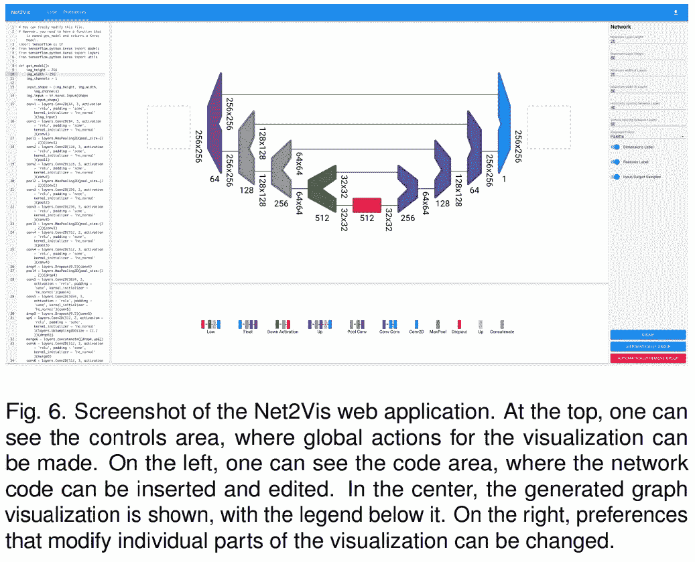
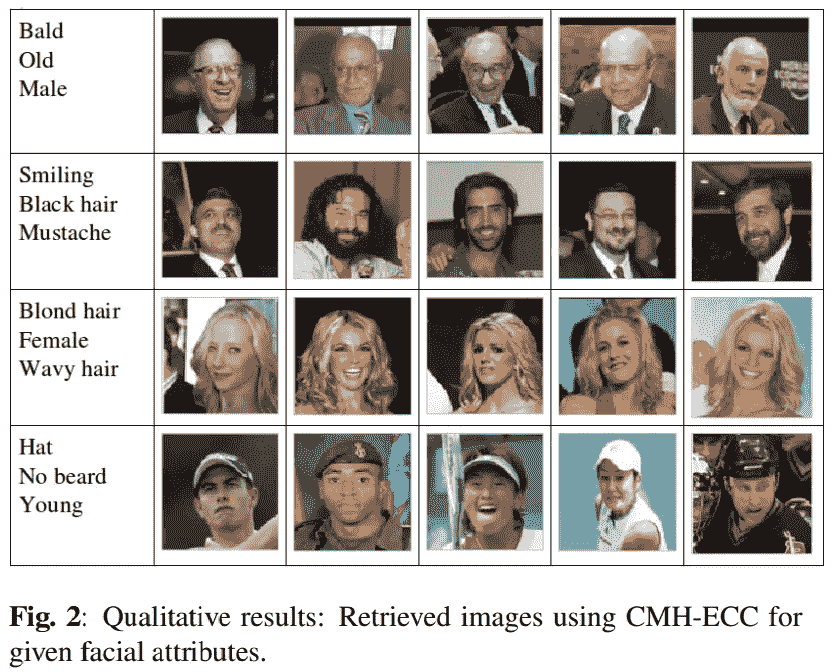
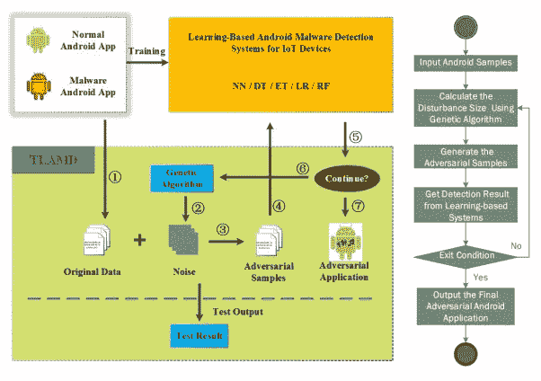
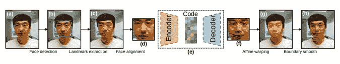
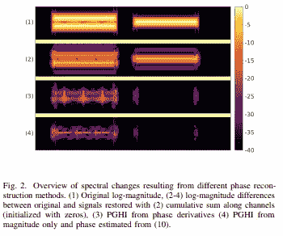

# 艾学者周刊:4

> 原文：<https://medium.datadriveninvestor.com/ai-scholar-weekly-4-edb73ea47c12?source=collection_archive---------15----------------------->

## 简单的 CNN 可视化，安全的 Web ML 应用程序，改进的面部图像检索，基于 DL 的恶意软件对抗测试平台，有效的音频合成，等等！

## [通过注册订阅时事通讯，将《AI scholar: Weekly》直接发送到您的收件箱](http://eepurl.com/ghCeNn)

## [AI Scholar (AI 大事件) 现在有中文版了！来读我们的每周时事通讯获取最新的 AI 研究见解](https://mp.weixin.qq.com/s/nYwekEq6fP2n8YmTKA7Zow)

# 使用 Net2Vis 实现发布就绪可视化

Net2Vis 的主要重点是通过使用精心制作的可视化编码遵守可视化语法规则，从而提高可视化的可读性。它还通过层累积合并了层抽象，从而大大降低了网络架构的复杂性。Net2Vis 还通过大幅减少过去用于生成发布就绪的网络可视化的大量时间来应对时间的挑战。不仅如此，这种方法还能实现一个连贯清晰的可视化设计。

## 潜在用途和影响

像 Net2Vis 这样的方法将使研究人员能够轻松地构建可视化，减少 CNN 可视化的模糊性。另一方面，读者将能够理解可视化，而不需要学习纸张特定的视觉设计语言，从而减少两端出错的机会。如果同样的方法可以扩展到所有架构的可视化就好了。

更多阅读:【https://arxiv.org/abs/1902.04394v1 

代号:【https://github.com/viscom-ulm/Net2Vis 

# 用 TensorSCONE 框架开发安全的 ML web 应用程序

如果你想开发健壮和安全的机器学习(ML)应用，研究人员推荐 TensorSCONE，这是一个基于 SGX 的安全的面向硬件的机器学习框架。TensorSCONE 提供透明度和高水平的性能，而不影响准确性。与以前实现数据隐私和完整性的模型不同，TensorSCONE 设计和架构基于 TensorFlow，支持训练和分类。

该框架利用 SGX 的先进技术，为部署在不受信任的网络基础设施上的任何 ML 应用提供强大的机密性和完整性保证。TensorSCONE 已经过多项基准测试和实际应用的评估，显示出强大的安全性和高端性能。

## 潜在用途和影响

TensorSCONE 为 ML 工程师提供了一个模型，帮助他们在私有和敏感数据上开发和执行安全的 ML 应用程序，而无需牺牲准确性和性能。此外，由于它是基于 TensorFlow 的，tensor flow 是最流行的 ML 框架之一，因此它可以支持大量未经修改的现有 ML 应用程序。

更多阅读:[https://arxiv.org/abs/1902.04413v1](https://arxiv.org/abs/1902.04413v1)

# 改进极端和狂野运动的深度姿态估计

发布的方法应用后数据增强来帮助增强极端和狂野运动的深度人类姿态估计。它是如何工作的？通过用旋转增强技术增强输入数据，并对每一帧多次使用姿态估计过程。在这之后，最一致的姿态和它的运动被重建用于平滑。新模型已经过系统测试，结果表明，它是一种在极端或野生姿态估计场景和不规则姿态下提高总体质量的有效方法。

## 潜在用途和影响

这种深度姿态估计算法可以用于各种狂野/极端的人体运动捕捉和虚拟化身的修改，这在过去是极难应用的。后数据扩充方法也可以有效地用于许多 HCI、UI 和体育科学应用中。此外，该方法激发了用户在超出 ML 领域范围的应用领域中应用 DNN 技术。

更多阅读:【https://arxiv.org/abs/1902.04250v1 

# 基于(CMH-ECC)技术的高效人脸图像检索

研究人员揭示了一种新的纠错深度交叉模态哈希(CMH-ECC)模型，该模型实现位图来规定某些面部属性，以使用给定的查询属性从数据库系统中实现相关的面部图像检索。基于两个标准公共数据集的测试结果表明，新模型优于传统的图像检索算法。

尽管当前的人脸图像检索方法取得了令人印象深刻的结果，但事实是它们仍然缺乏提炼图像搜索人脸属性的有效方法。该模型中的纠错码通过深度交叉模式散列来减小汉明距离并提高检索效率。

此外，CMH-ECC 使用逐点数据执行面部图像检索，而不需要使用成对或三倍的训练数据输入，这使得它可扩展到极其庞大的数据集。

## 潜在用途和影响

通过新的 CMH-ECC 模型，研究人员、设计人员和开发人员现在可以通过精确匹配和改进的结果来检索面部图像。该模型也可以是基于 ML 应用的进化高端下一代面部图像的开始。这有可能改善基于摄像头的安全系统。

更多阅读:【https://arxiv.org/abs/1902.04139v1 

# 对象检测模型训练的简单通用调整，以提高准确性

研究人员最近探索了通用模型训练调整，可以帮助增强对象检测模型的性能，而不增加计算开销。测试结果表明，在每个人工智能工程师都应该考虑申请的目标探测训练中，这些额外津贴可以达到大约 5%的绝对精度增长率。

首先，研究人员探索了一种对象检测混合技术，并认识到多个对象检测任务中有助于空间保持变换的特殊属性。由此，他们提出了一个视觉上连贯的图像混合，用于任何对象检测任务。第二，他们探索全面的训练渠道，如学习率计划、体重下降和协调批处理。最后，他们通过递增地组合它们来训练单阶段和多阶段对象检测模型，来调查所提议的训练增强的有效性。

## 潜在用途和影响

在人工智能研究社区中，谁不想要有助于改善他们工作的免费赠品呢？堆叠和实现这些调整意味着研究人员获得了一条简单的道路来训练对象检测器模型，而招致额外的计算成本。像这样的研究也有助于科学家和工程师为未来开发增强和更有效的对象检测算法。

更多阅读:[https://arxiv.org/abs/1902.04103v1](https://arxiv.org/abs/1902.04103v1)

# 健壮测试框架的物联网系统对抗样本

人工智能安全学者和研究人员表示，拥有一个测试物联网恶意软件检测系统鲁棒性的框架至关重要。认识到当前用于生成敌对样本的方法大多数需要训练模型参数，并且大多数针对图像数据，研究人员已经提出了一种用于物联网设备的 **T** 测试 **F** 框架，用于基于 **L** 收益的**A**n droid**M**alware**D**检测系统(TLAMD)来帮助防御物联网设备的敌对样本。

很简单——如果框架测试结果显示恶意软件检测系统无法防御敌对样本，那么这就是一个危险信号，系统需要加强。TLAMD 专注于生成有效的对立样本，这是在不知道模型参数的情况下测试框架的核心内容。

## 潜在用途和影响

通过集成遗传算法和特定的技术改进，TLAMD 可以以接近 100%的成功率为物联网 Android 应用程序创建对抗样本，并可用于黑盒系统测试。这对于 ML 安全分析师和开发人员来说是一个收获，因为这种方法显示了为物联网设备开发强大的基于学习的 Android 恶意软件检测算法的希望和巨大潜力。

更多阅读:[https://arxiv.org/abs/1902.04238v1](https://arxiv.org/abs/1902.04238v1)

# 实现去身份化而不丢面子

新的研究提出了一种新的人脸去身份验证方法，它不仅可以隐藏人脸身份，还可以保持必要的人脸属性的高视觉质量。新算法基于深度神经网络，不改变原始人脸或合成新的人脸，而是使用预先训练的人脸属性转移模型将非身份人脸属性映射到多个同意的人脸捐赠者，从而实现自然的人脸外观，同时确保合成数据中的身份变化。在各种图像和视频数据集上的测试结果是肯定的，证明了该模型的有效性。

## 潜在用途和影响

有了这种新方法，人工智能研究人员可以放心，他们可以在不损失原始数据质量的情况下实现面部去识别，并且仍然可以避免可能的面部身份诉讼。这也极大地有助于推进计算机视觉应用，因为它使得通过在图像/视频生成过程中引入随机性来改善原始数据集的多样性成为可能。此外，该方法可以扩展到处理面部遮挡和头部姿态变化。

更多阅读:【https://arxiv.org/abs/1902.04202v1 

# 利用 TiFGAN 的时频特性实现有效的音频合成

生成对抗网络(GANs)使得生成建模取得了非凡的进展，尤其是在图像处理和药物发现领域。然而，它们的用途不仅限于这些应用，还可以用于促进有效的自然声音产生。至少根据最近这项研究工作的介绍。

通过在短时傅立叶特征上训练 GAN，研究人员已经展示了在深思熟虑的生成 TF 建模中的潜在可能。他们提出了一个基于 TF 的模型 TiFGAN，该模型利用 GANs 通过学习如何评估 TF 表示的质量来实现高质量的音频合成。

TiFGAN 已经针对传统模型进行了测试。尽管和传统模型都实现了相似的网络架构，但它仍优于当前最先进的 GAN 生成波形算法。TiFGAN 在计算上也是低成本的，在模型训练过程中有很大的潜力来简化收敛评估。

## 潜在用途和影响

这种新的建模方法消除了音频合成中的质量下降和失真，真正展示了 GANs 中的休眠潜力，可以探索和利用这种潜力来生成一次性完整信号，从而实现更有效的音频合成。而且，如果时间-频率特征的对抗性生成可以应用于有效的音频合成，那么它也意味着人工智能研究社区在尝试更深入地研究 GANs 以实现更高效和有效的音频合成生成方面的进步之旅的开始。

更多阅读:[https://arxiv.org/abs/1902.04072v1](https://arxiv.org/abs/1902.04072v1)

# 一个以人工智能技术的影响为特色的短篇故事

**家庭相册**

我有一张旧的全家福照片。它褪色了，有些地方边缘参差不齐，有一个角被撕破了，正因为如此，我爱它胜过一切。因为另一张照片。

另一张照片展示了在海滩上的一天，我们所有的孩子都在和一只极其友好的金毛猎犬玩耍，我们只见过一天，却记得好几年。

除了我不记得那只狗——我记得它是我们自己的巧克力拉布拉多。

“但那时我们连贝茜都没有！”当我找到照片并提出问题时，我妈妈说。“就是那天在海滩上，我们说服自己真的养了一只狗给你玩。”

我想说的是，记忆并不是人们想象的那样。

与你的朋友交谈，与你的家人谈论过去的时光，先听听他们说什么*——在你有机会交换意见并对过去的现实达成共识之前。*

*回忆充其量是指引。*

*很久以前，人们没有照片，如果他们很富有并且有肖像，那么一定数量的艺术许可是可以预期的，甚至是必需的。后来每个人都有一个家庭相册，在它被低质量的照片冲洗，或火灾，或干脆放错地方之前，只要它存在。*

*在那个时候，人们明白过去是一种观点，观点是不同的。*

*然后我们有了数码摄影、存储和备份，突然间过去就永远过去了。*

*我们进入了一个手机摄像头，安全摄像头，人体摄像头的时代。面对如此海量的信息，无论多么重要，都不可能让足够多的人花足够多的时间仔细阅读。我们需要的是认可，我们得到了认可。*

*不过，这只是短暂的繁荣。自动识别图像中的物体或人与猜测图像中的物体看起来像什么并不遥远。插入它。在认知达到顶峰之前，它的价值被一个可怕的事实削弱了，即图像中的任何东西，无论是静止的还是运动的，存储的还是实时的，都不再被认为是可靠的。*

*当然，人们声称能够分辨出其中的区别——你可以从一些像素中分辨出来——但对于不理解其中任何一点的普通人来说，这仍然是一个见仁见智的问题。图像证明一切的时代已经过去了。*

*我相信我们的孩子会没事的。他们成长在一个图像不可靠、主观、短暂的世界里。以前一切都很好，以后也一样。但是对于几代习惯于相信他们所看到的东西的人来说，事情将不再一样。我们把记忆储存在这些东西里，然后这些东西辜负了我们。*

*所以我坐在这里，拿着这些家庭照片，太旧了，太真实了，事实上和出处上都太相似了，任何人都不可能篡改或伪造，我试着去回忆。*

*它们会持续多久就持续多久。*

***感谢阅读。如果您有建议、意见或其他想法，您可以通过以下方式联系我:****或发微博给我** [**@ cdossman**](https://twitter.com/cdossman)*