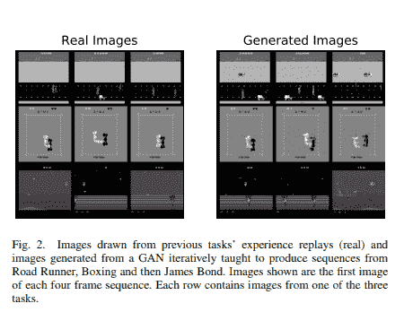
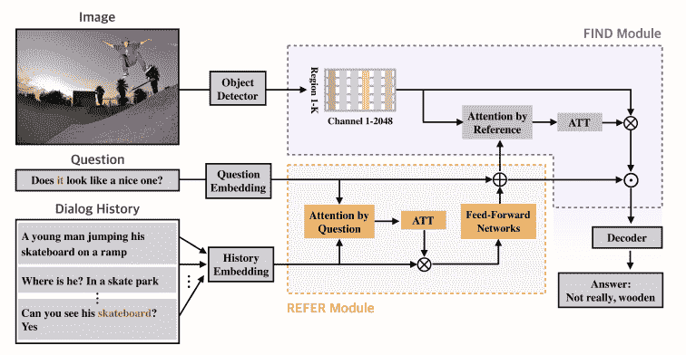
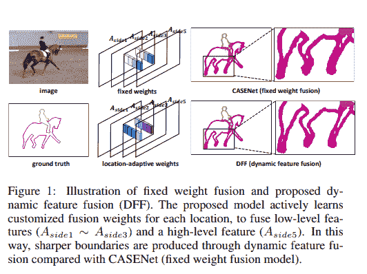
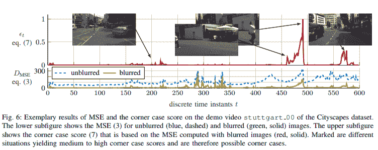
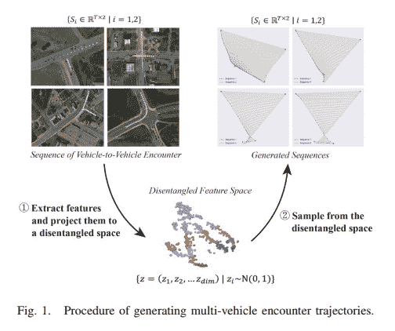
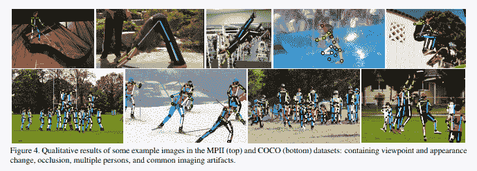
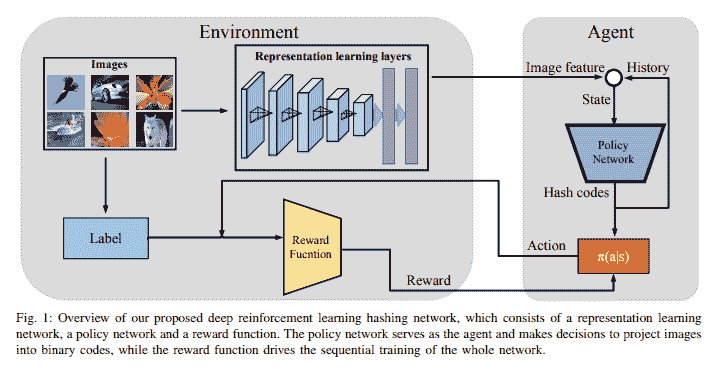
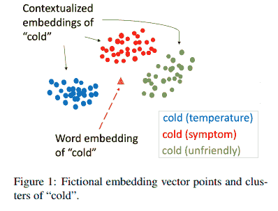

# 艾学者周刊:6

> 原文：<https://medium.datadriveninvestor.com/ai-scholar-weekly-6-1ee9054a8fc0?source=collection_archive---------14----------------------->

## 用于创建像人类一样学习的模型的深度强化学习，利用 DFF 增强的边缘检测，用于车辆与车辆相遇的数据集生成器，利用上下文嵌入改进临床概念提取，等等。

## [通过注册订阅时事通讯，将《人工智能学者周刊》直接发送到您的收件箱](http://eepurl.com/ghCeNn)

# **实现深度强化学习而没有灾难性遗忘的伪预演**

新模型集成了伪预演、深度生成模型和双存储方案，以产生一种即使在任务数量增加时也不需要额外存储需求的有效方法。通过迭代，该模型学习了三个 Atari 游戏，并在所有三个游戏中保持高于人类水平的性能，同时表现得像一组经过单独训练来执行任务的网络一样高效。

所有这些都是在无需重新查看过去任务中的数据的情况下实现的。与深度强化任务的现有算法相比，新模型表明，它不会像传统模型那样忘记过去的任务。

> [DDI 编辑推荐—深度学习专业化](http://go.datadriveninvestor.com/deeplearning/matf)

## **潜在用途和效果**

研究人员和一般人工智能社区可以利用新模型来进一步推进深度强化研究工作，并将该模型应用于尖端视频游戏、自动驾驶汽车和现实世界的机器人应用。给定一个足够大的网络，这可能是类人智能代理的关键吗？

更多阅读:[https://arxiv.org/abs/1812.02464v2](https://arxiv.org/abs/1812.02464v2)

# **用于提高视觉参考分辨率的双注意网络(DAN)**

最近，研究人员提出了增强视觉参考分辨率的 DAN，为解决视觉参考分辨率问题奠定了基础。DAN 实现了两种类型的注意力网络，包括参考和查找。REFER 是专门设计来通过实现自我关注方法来学习查询和对话历史之间的关系的。

相反，FIND 采用图像特征和参考感知表示输入(参考模块输出),并通过实现自下而上的注意技术来实现视觉基础。在 VisDial v1.0 和 v0.9 数据集上对 DAN 进行的定量和定性评估表明，它远远优于现有的可视对话模型。

## **潜在用途和效果**

AI 社区可以实现 DAN 来实现各种可视对话任务(包括协作对话系统)的可视参考解析。由于它不依赖于以前的视觉注意地图，DAN 可以通过实现 REFER 组件来解决不清楚的视觉，并使用 FIND model 组件来解决视觉图像的地面参考。

更多阅读:[https://arxiv.org/abs/1902.09368v1](https://arxiv.org/abs/1902.09368v1)

# **增强边缘检测的动态特征融合(DFF)方法**

来自中国的研究人员通过提出一种新的动态特征融合(DFF)策略来管理动态特征融合，该策略为不同的图像和位置分配不同的融合权重。DFF 由两个模块组成，包括特征提取器和自适应权重融合组件。该模型通过实现权重模型来实现动态特征融合，以针对以特定输入为条件的特征图中的每个单个位置推断多级特征的适当融合权重。

在对包括城市景观和 SBD 在内的标准基准数据集进行实验后，DFF 证明了它可以通过在对象边缘定位更准确的边缘以及抑制对象中无关紧要的边缘响应来大大提高模型性能。

## **潜在用途和效果**

语义边缘检测旨在联合提取边缘及其类别信息，以实现语义分割、对象识别等领域的高端应用。提出的 DFF 是第一项研究工作，旨在学习基于输入数据的自适应融合权重，以合并 sed 研究中的多级特征，从而促进和实现 SED 任务的最新发展。位置自适应权重学习器可以通过考虑高级和低级骨干特征图来改进。

更多阅读:[https://arxiv.org/abs/1902.09104v1](https://arxiv.org/abs/1902.09104v1)

# **用于自动驾驶的离线和在线拐角情况检测的框架**

这项新研究定义了拐角情况检测，并提出了一个框架，该框架可以处理来自移动车辆前端摄像机的视频信号，并为在线和离线用例生成拐角情况分数。根据该系统框架背后的研究人员的说法，拐角情况检测系统可以用作备用警告功能，为自动驾驶系统提供关于异常场景的信息。此外，关于离线模式，拐点检测框架可用于分析大量视频数据，以返回任何异常数据。

在包含来自 50 个城市的各种街道图像的 Cityscapes 数据集上，为分割和图像预测训练了技术拐角情况检测框架。

## **潜在用途和影响**

自动驾驶汽车研究人员和工程师可以实施 corner case 框架，为自动驾驶系统开发更有针对性的培训，因为它有助于解决关键培训数据代表性不足的问题。该系统还可以用于帮助选择存储和(重新)训练人工智能模型的相关场景

此外，所提出的拐角情况检测框架对于实现运动检测、图像配准、视频跟踪、图像拼接、3D 建模、全景拼接、对象识别等方面的增强开发是有效的。

更多阅读:【https://arxiv.org/abs/1902.09184v1 

# **车对车遭遇数据集生成器**

缺乏足够的训练数据减缓了自动驾驶技术的进步。然而，最近发布的这一模拟器模型现在通过提供足够的数据和资源来帮助工程师实施有效的自动驾驶汽车开发和测试，从而消除了这一限制。

多车辆轨迹生成器(MTG)可以将多车辆场景(驾驶相遇)编码为可解释的表示，以生成新的高质量驾驶相遇。生成器模型包括双向变分自动编码器和多分支解码器来实现其功能。

该研究还提出了一种新的解开指标，有可能全面分析创建的轨迹和模型驱动场景的鲁棒性。与现有的 VAE 和 infoGAN 车型相比，这款新的发电机车型真正展示了更强的创造高端驾驶场景的能力。

## **潜在用途和效果**

多车轨迹生成器是解决自动驾驶汽车问题的一个重要步骤。主要是缺乏多样的原始数据。不仅仅是无人驾驶汽车将获得提振。你可以将这种方法扩展到深度学习的其他领域，这些领域也有类似的数据问题。

更多阅读:[https://arxiv.org/abs/1809.05680v5](https://arxiv.org/abs/1809.05680v5)

# **用于高分辨率人体姿态估计的高分辨率网络(HRNet)**

与以串行方式连接子网的传统方法不同，新的 HRNet 方法以并行方式连接高到低分辨率子网，这使得保持高端分辨率以及实现卓越和准确的关键点预测成为可能。此外，许多现有的融合方案组合低级和高级表示，而 HRNet 执行重复的多尺度融合以增强高分辨率表示，这对于高质量的姿态估计是必不可少的。

在可可关键点检测和 MPII 人体姿态数据集上的实验表明，HRNet 的有效性优于传统方法。此外，通过在 PoseTrack 数据集上的测试，HRNet 在姿态跟踪方面表现出了优越性。所有的模型和代码都可以在[这个链接](https://jingdongwang2017.github.io/Projects/HRNet/index.html)上公开获得。

**潜在用途和影响**

研究人员和开发人员可以将 HRNet 应用于高级对象检测、活动识别、语义分割、人机交互(HCI)、虚拟现实、增强现实、人脸检测和对齐、图像检测和分类、翻译以及任何其他依赖于跟踪和测量人类活动的服务(如 Amazon Go)的应用。我期待着我的智能手机能告诉我我的举重状态是否正常。

更多阅读:【https://arxiv.org/abs/1902.09212v1 

code:[https://github . com/leoxiaobin/deep-high-resolution-net . py torch](https://github.com/leoxiaobin/deep-high-resolution-net.pytorch)

# **图像哈希的深度强化学习方法(DRLIH)**

DRLIH 是第一个从深度强化学习角度解决图像哈希挑战的研究工作。

提出的深度学习网络由特征表示网络和策略网络组成。策略网络利用递归神经网络(RNN)作为代理，按时间顺序将图像投影为二进制代码。

网络设计帮助生成图像并将其投影到哈希码 1 中，并计算哈希码 0 的概率。研究人员还提出了一种顺序学习策略，通过纠正先前函数出现的错误来学习哈希函数，以提高检索准确性。DRLIH 方法已经在三个标准数据集上进行了测试，结果表明其有效性优于传统的图像哈希方法。

## **潜在用途和效果**

DRLIH 技术是一种精确表示、索引、检索和自动识别图像的有效工具。通过查询图像是伪造的还是原始图像的副本，它可以用于更有效的图像认证。DRLIH 还可以用于有效的本地存储或缓存，防止照片重新传输或存储复制，以及用于以前通过水印实现的应用，如版权保护。

更多阅读:[https://arxiv.org/abs/1802.02904v2](https://arxiv.org/abs/1802.02904v2)

# **上下文嵌入改善临床概念提取**

新的研究提出了应对这一长期挑战的新方法。研究人员评估了各种嵌入方法，包括 word2vec、GloVe fastText、ELMo 和 BERT。他们还对四个临床概念语料库进行了分析，证明了上述每种技术的可推广性。

更重要的是，他们使用大型临床语料库开发了预先训练的情境化嵌入，并将性能与预先训练的模型进行比较。他们最后展示了与开放领域语料库相比，预训练对临床语料库的影响的详细分析，并报告了临床概念提取的性能提高，在所有测试语料库上实现了最先进的结果。研究结果显示了在临床文本语料库上嵌入的好处，在所有任务上实现了比传统模型更好的性能。

## **潜在用途和效果**

对于临床概念提取，上下文嵌入具有极大地推进自动文本处理的潜在可能性。此外，它还可以使研究人员增加临床文本的可访问性，这可以在增强的信息管理和非结构化临床文本数据挖掘方面进一步推进该领域。

更多阅读:[https://arxiv.org/abs/1902.08691v1](https://arxiv.org/abs/1902.08691v1)

> 我认为人工智能是一种喷气背包和眼罩，它会让我们朝着我们已经前进的方向倾斜，所以它会让我们更强大，但不一定更明智。
> 
> —麻省理工学院媒体实验室主任 Joi Ito 谈到对人工智能采取纯技术方法的危险，而不考虑它将嵌入的社会和政治系统

**感谢阅读。如果您有建议、意见或其他想法，您可以通过**[【chris@aiunderdogs.com】](mailto:chris@aiunderdogs.com)**联系我，或者发微博给我** [**@ cdossman**](https://twitter.com/cdossman)