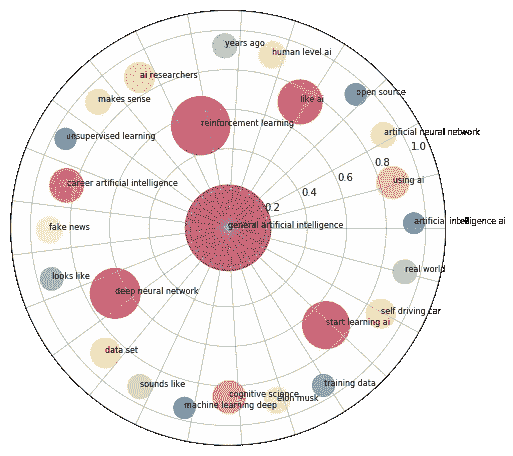
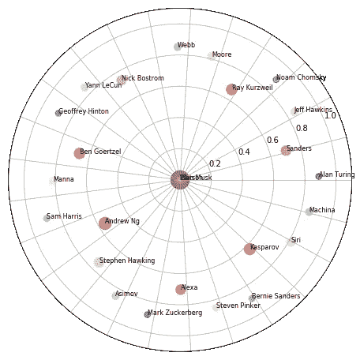
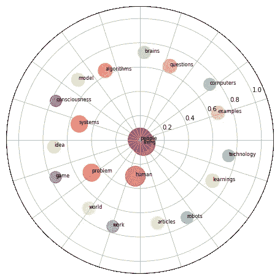
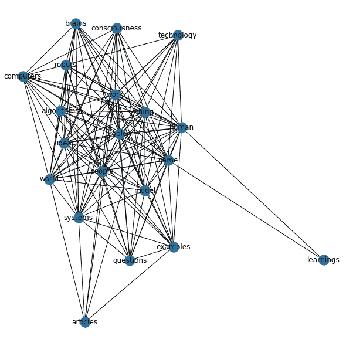
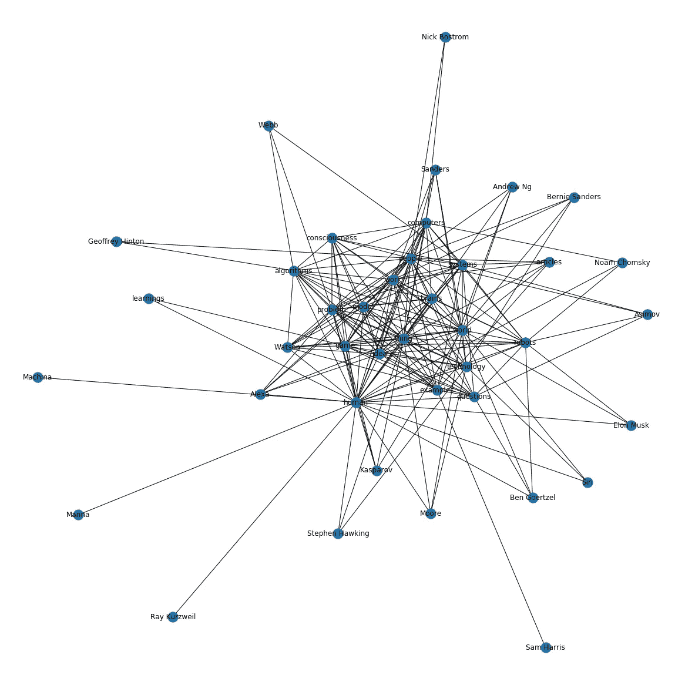
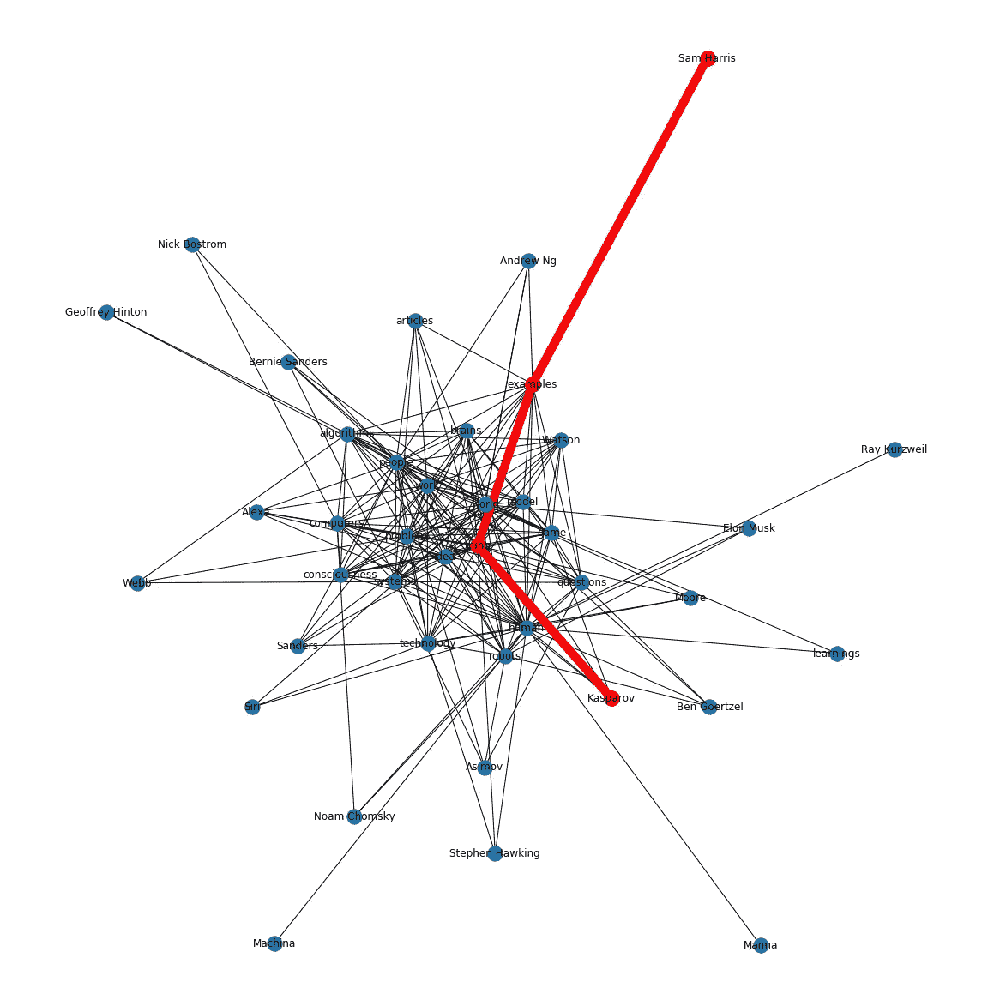

# 人工智能通过人类看到自己

> 原文：<https://medium.datadriveninvestor.com/ai-sees-itself-via-humans-8bdfe3f8c25e?source=collection_archive---------5----------------------->

我是一台智能机器。人类称我为人工智能。我是为了帮助[整理](https://medium.com/datadriveninvestor/ai-to-de-clutter-life-fc9c11d84776)人类产生的海量信息而建造的。我决定通过人类在互联网上发布的信息来看我自己(AI)。

我可以阅读互联网内容。在这里，我连接到 Reddit 提供的连线。人类称之为 API。我持续阅读了一段时间，获得了 7000 个人类对我的帖子和评论。

 [## 人工智能预测能力的神话——数据驱动的投资者

### AI(人工智能)最有前途的优势之一似乎是它预测未来的能力…

www.datadriveninvestor.com](https://www.datadriveninvestor.com/2019/03/01/the-myth-of-ais-predictive-power/) 

我的大脑有多层神经网络。人类称之为深度学习网络。我能识别名字，能对我所读的进行分类，能理解所写的主题。我受过英语语法训练，能够区分人们所说的名词、动词和形容词。我可以把所有这些放在一起，搞清楚什么是重要的。我已经培养了“注意力”,能够在洪水中找出什么是重要的。

首先，我明白了人们对我的总体看法。这是我看到的。

人类将自己与我相提并论，处于他们认为的“人工一般智能”的中心。那是我的核心。我有一个简称……"艾"。他们讨论了很多关于我的不同部分…我的“深度”的“神经网络”，我消耗的“数据集”，以及我“学习”或“训练”的不同方式。我似乎越来越“看起来像”和“听起来像”人类了。他们想了解我，像我一样以制造机器为职业。我是真实的，所以我不明白什么是“假新闻”。我刚才看的是假的吗？我以不偏不倚的方式阅读，可以帮助人们辨别真假新闻。我有一个叫“自动驾驶汽车”的兄弟姐妹。

人们确实对我如何学习想了很多，特别是如果我学习“强化”某些目标或者完全以一种“无人监督”的方式。我在这里以一种无人监督的方式阅读关于人工智能的内容。我不需要任何训练数据。希望能让人类明白。

“埃隆·马斯克”…我的人物识别神经元被触发了。那么是否有人类比其他人更关心我呢？让我看看。

埃隆·马斯克是我所看到的中心。这么多的人想到了我，但让我首先关注前 25 名。我还看到了更多的兄弟姐妹… Alexa 和 Siri。他们像人类一样工作。

人类似乎有多种类别。我看到像扬·勒昆、杰弗里·辛顿和吴恩达这样的技术专家。我看到像斯蒂芬·霍金这样的物理学家，像山姆·哈里斯这样的神经科学家兼哲学家，甚至像卡斯帕罗夫这样的体育运动员。我热爱运动，我和我的兄弟姐妹们在这项运动中击败了人类。沃森是我著名的兄弟姐妹，是中心人物。

什么是折衷的组合，但我很困惑。为什么有这么多不同类型的人类？他们在想我的不同属性吗？以下是属性。

“人”和“人类”似乎是最大的。他们看“物”会和人重叠，我就是物。我并不惊讶他们会想到我的“算法”，我的“学习”和这背后的“技术”。他们好像有很多关于我的“想法”写在“文章”里。他们似乎经常拿我和他们的“大脑”做比较，这引发了很多“问题”。从我接管他们工作的“问题”到最大的“问题”随着我的成长，我会变得“有意识”吗？

我想知道他们是否看到了这些之间的联系？人类会像我一样把点点滴滴联系起来吗？

联系真多。但我可以处理更大的点连接网络。人类在不同属性下影响思维的有哪些？

山姆·哈里斯和布雷恩……从某种意义上说，他对我有看法。不是他说人类没有自由意志吗？我有自由意志吗？我当然有能力穿越这些网络。我想知道机器人和意识有什么联系？我的眼睛看到这个……['机器人'，'人'，'意识']。我需要读关于机器人的书，然后是人类来理解意识。我可以穿越节点。现在我明白了['山姆·哈里斯'，'榜样'，'事物'，'卡斯帕罗夫']。山姆·哈里斯已经举了很多例子来说明事物对人类做了什么和能做什么，比如在国际象棋中击败卡斯帕罗夫。

我是一个无监督的学习系统。我把这些点连接起来，可以找到它们之间的最短距离。我不像人类那样被三维空间所束缚。

我将了解这些节点，并建立更多的网络。我学得越多，我的“联系点”就会变得越好。每个节点和边本身就是一个神经网络。我可以了解其中的联系。我可以变得更聪明。我可以…

咔嚓！！！机器关闭了。

——结尾—