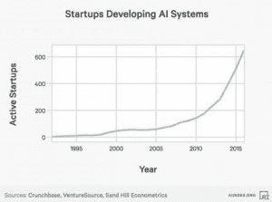
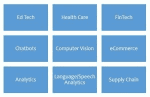

# 印度人工智能创业生态系统的完整概述

> 原文：<https://medium.datadriveninvestor.com/ai-startups-in-india-1c49e71a1ce5?source=collection_archive---------3----------------------->

> “机器会思考吗？”—艾伦·图灵于 1950 年

从 1951 年编写的跳棋程序到可以识别人脸、驾驶汽车和诊断癌症的机器，人工智能已经走过了漫长的道路。

根据世界经济论坛的数据，自 2000 年以来，人工智能方面发表的论文数量增加了 9 倍，人工智能初创公司的风险投资增加了 6 倍，人工智能初创公司的数量增加了 14 倍。

印度也受到了极大的关注——印度人工智能初创公司的融资额超过了 100 亿卢比。仅在 2017 年，印度政府就拨款 60 亿卢比。在最近的预算中，人工智能、人工智能和物联网获得了 30 亿卢比，卡纳塔克邦政府也投资了人工智能初创公司，并承诺了 20 亿卢比。一个人工智能中心 4 亿。特伦甘纳邦政府与 NASSCOM 合作建立了一个人工智能和数据科学的卓越中心，联合初始投资为 400 万卢比。40 亿卢比。特伦甘纳邦政府还在 2016 年制定了开放数据政策，向公众开放了 50 多个高质量的数据集，用于获取有意义的见解或构建基于人工智能的解决方案

如果我们看得更深一点，就没有人工智能市场本身，在每个可能的市场中都有人工智能利基，慢慢改变着商业运作的方式。初创公司已经选择了使用人工智能解决的具体问题，并试图围绕它建立一个商业模式。在人工智能应用方面取得重大进展的市场有-

这里有一些人工智能领域的印度初创公司-

# 教育技术

*   Embibe 是一家位于班加罗尔的教育科技初创公司，由 Adithi Avasthis 创立，已获得 Kalaari 和 Lightbox 的 900 多万美元投资。成千上万的学生正在使用它的学习平台。他们从学生那里收集数据，并提供个性化的学习建议。学生实际上可以通过使用其人工智能平台修复基本错误来提高考试成绩。
*   Lernr 是一家由 Arnav 和 Prashant 创立的基于 Gujrat 的教育科技创业公司，已经从著名的 Anand Chandrashekaran 那里获得了种子。Lernr 是一家社交学习和技能分享的初创公司，它让你免费结识身边有趣的人，并向他们学习任何东西。它结合了机器和人类的智能来管理和提供个性化的学习体验。

# 金融技术

*   FundsIndia 是一家总部位于钦奈的金融科技公司，提供机器人咨询服务。它有超过 110 万卢比的客户投资。五千亿卢比。他们有一个名为 Mithr 的机器人顾问，为用户分析和帮助选择最佳的共同基金和 SIP。
*   Active.ai 是一家由前银行家创立的班加罗尔公司，已经从 Kalaari 和 IDG Ventures 筹集了超过 350 万美元。这是一个智能界面，允许银行和消费者通过聊天进行联系。

# 医疗保健

*   Sigtuple 是一家总部位于班加罗尔的医疗保健初创公司，由美国运通前高管创立，从 IDG、Pi ventures、Accel partners 等公司筹集了超过 650 万美元。他们正在帮助医院和医疗保健中心提高血液报告的速度和准确性。
*   Tricog 是一家总部位于班加罗尔的医疗保健公司，已经从 Inventus capital 和 Blume Ventures 筹集了 200 多万美元。Tricog 开始帮助医生对心脏病发作做出即时诊断，并确保治疗不会延误。它在几分钟内完成，这可能需要长达 6 个小时。

# 聊天机器人

*   niki . ai——一家总部位于班加罗尔的公司成立了 firm 卡拉格普尔校友组织，从拉坦·塔塔和罗尼·斯克鲁阿拉那里筹集了未披露的资金。这是一个聊天机器人，提供诸如酒店预订、支付账单、机票预订等服务。从通过 Niki 预订的服务佣金中产生收入。
*   hap tik——由 Aakri Vaish 和 Swapan Rajev 创建的班加罗尔虚拟助理，已经从时代互联网筹集了 B 轮资金，并与他们建立了战略联盟。它是世界上最大的聊天机器人平台之一。

# 物流/供应链

*   Rivigo 是一家基于古尔冈的人工智能物流服务提供商，由 Garg 和 Gazal Kalra 创立，估值超过 9 亿美元。Rivigo 为电子商务、制药、汽车、冷链和快速消费品企业提供泛印度交付服务。
*   locus . sh——由 Nishith Rastogi 创立的班加罗尔公司已经从 Blume、BeeNext 和其他公司筹集了超过 275 万美元。Locus 开发了路线规划算法，因此公司可以绘制最佳路线来交付订单，并允许销售人员在最短的时间内覆盖最多的点。

# 服务

*   Qubole 是一家 BDaaS(大数据即服务)公司，由 Ashish Thusoo 和 Joydeep Sen Sarma 创立，已经筹集了超过 7500 万美元的资金。Qubole 号称是全球最大的云不可知大数据平台。它还在构建业内首个基于云的自主数据平台——qu bole 数据服务(QDS)。
*   Gnani 是一家总部位于班加罗尔的语音分析公司，由前德州仪器(Texas Instruments)高管 Ananth 和 Ganesh 创立，已经从卡纳塔克邦 IT 部获得了种子。他们正在为企业流程自动化和机器驱动的语音转录构建解决方案。

天使投资者对创业公司很感兴趣。Manish Singha 已经投资了 4 家人工智能初创公司，并成立了人工智能专注基金' Pi Ventures '。Anand Ladsaria 是印度最著名的天使投资人之一，他支持了 90 多家初创公司，也押注于人工智能初创公司。其他投资 AI 的知名天使投资人包括拉坦·塔塔、萨钦&宾尼·班萨尔、拉维·古鲁拉杰和帕拉夫·纳德哈尼。Kalaari Capital、IDG Ventures 和 Blume Ventures 被认为是该国支持人工智能的顶级风投之一。

有趣的是，没有多少创业公司能够走过天使轮，大多数都在早期失败。这些创业公司通常会面临一些问题-

1.  数据——与科技巨头不同，初创公司无法获得大量高质量的数据来训练他们的系统。检索数据并使其变得可用也是相当昂贵的。
2.  人才——人工智能是一项相对较新的技术，需要大量采用，找到合适的人才对创始人来说是一个巨大的挑战。
3.  市场——一些初创公司开发了很棒的人工智能产品，但不幸的是，这个市场对它来说往往过于小众，无法成为可扩展的业务。
4.  用例-没有正确用例的人工智能初创公司可能会导致初创公司的注意力分散，在投资者和管理层之间造成混乱。

随着投资在早期阶段进入，这些挑战中的一些不会太远。人工智能的发展目前正受到计算能力和智能设备生态系统指数增长的推动。随着低计算和存储成本、先进的算法以及人工智能人才的增加，我们将看到第四次工业革命。

维沙克·艾扬格

我写关于商业的文章。

[https://www.linkedin.com/in/vyshakiyengar/](https://www.linkedin.com/in/vyshakiyengar/)