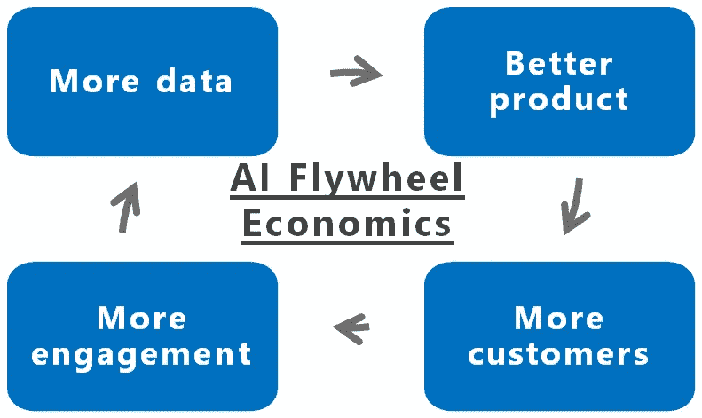
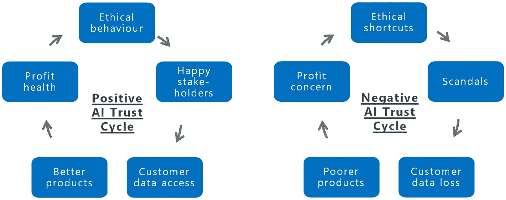

# 人工智能战略 101:如何通过人工智能建立可持续的竞争优势

> 原文：<https://medium.datadriveninvestor.com/ai-strategy-101-how-to-build-sustainable-competitive-advantage-through-artificial-intelligence-ca7bbe9f4cf7?source=collection_archive---------1----------------------->

## 创建人工智能(AI)战略是解决如何使用技术建立可持续竞争优势的过程。当我们建议我们的客户时，这里是人工智能认为的人工智能优势公司的六种最佳实践方式。

Photo by [Randy Fath](https://unsplash.com/photos/_EoxKxrDL20?utm_source=unsplash&utm_medium=referral&utm_content=creditCopyText) on [Unsplash](https://unsplash.com/search/photos/competition?utm_source=unsplash&utm_medium=referral&utm_content=creditCopyText)

公司战略的最终目标是建立可持续的竞争优势，这将带来更高的投资回报(无论如何衡量)。如果处理得当，基于对技术深刻理解的“人工智能战略”就是这样。

目前被称为“人工智能战略”的许多东西——企业选择什么机器学习(ML)工具来采取行动——实际上是供应商驱动的学习练习。这可能是测试技术并学习如何使用它的好方法，但它与长期战略不是一回事。

 [## 人工智能与创造力:作为创意引擎的比根——数据驱动的投资者

### 的确，2018 年可以被视为人工智能创造的创造力全盛时期的开始。当然可以…

www.datadriveninvestor.com](https://www.datadriveninvestor.com/2019/02/13/ai-creativity-biggan-as-a-creative-engine/) 

那么，[最佳实践 AI](http://www.bestpractice.ai) 是如何做到这一点的呢？

## **人工智能具有竞争优势的组织将使用三种战略工具来建立他们的业务……**

1.  **客户主张的转变**
2.  **AI 飞轮经济学**
3.  **虚拟价值链**

## …人工智能竞争优势的核心将有三个核心资产

1.  **数据**
2.  **天赋**
3.  **信任**

## 三个战略原则——没有一个是新的，但都被人工智能推了一把——将定义如何从人工智能中获取竞争优势。

这三者的核心是明确你从事什么业务，与哪些客户合作，以及具有什么价值主张。这还不是一系列可以外包给人工智能的问题。

1.  **客户主张的转变**

*这有两个方面——首先，这是打破传统的范围/速度/规模客户主张权衡的机会。其次，随着一切都被数字化——然后是个性化——产品生产商越来越多地以提供服务告终。*

范围、速度和规模之间的权衡可能会被彻底重新审视，并可能完全不再重要。

**范围**是关于对需求的主张特异性(通常是客户个性化水平或供应商的特定领域知识)；**速度**是产品或服务的可获得性(最好的例子可能是可口可乐的承诺“ [*触手可及*](https://www.ft.com/content/f0f57086-bb76-11e4-b95c-00144feab7de) ”)，而**规模**是通过规模经济压低价格的程度。

传统上，大多数行业不得不在这三者之间进行权衡。这是因为管理范围的复杂性成本不成比例，同时与速度相结合会大大增加浪费的经济成本。

人工智能正在越来越多地推动个性化的客户体验——并使许多这些权衡被打破。

例如，网飞的服务会推荐你可能喜欢和想看的视频。这在视频选择方面提供了个性化的范围，由即时速度(假设有足够的宽带服务)和网飞可以为其内容来源带来的巨大规模支持。在数字时代到来之前，要想提供一项与网飞相当的服务，需要一辆装满 VHS 录像带的铰接式卡车(**比例尺**)永久停在顾客家门外(**速度**)。现在的人工智能元素应该是一个聪明的图书管理员团队，他们看过所有的电影，并对像顾客这样的人喜欢什么做了广泛的研究。

在数字世界中，将范围、速度和规模结合起来很难，在物理世界中更是如此。然而，亚马逊正在交付——它拥有庞大的采购(以及定价)规模，提供比任何其他公司都更广泛的 SKU(范围),现在正在推动一天送达的速度(T21)。它也越来越清楚你下一步会买什么。人工智能对于管理这一行动的巨大复杂性至关重要。

与此同时，实物商品将越来越多地成为服务产品。

重型装备的终极件，劳斯莱斯航空发动机，现在被定价为“每小时”飞行工具——这看起来像是汽车工业的一个潜在未来。确保正确的车辆在正确的时间出现在正确的地点，始终是一项极其复杂的任务。因此，优步是人工智能的一大投资者。

随着时间的推移，需要人工智能的一个关键驱动因素将是日益复杂和相互关联的关系。从前，顾客买了一辆车，然后从公司的角度来看，在购买周期回来之前基本上消失了(可能通过第三方修理店低调出现)，现在他们很可能将个人生活的深层细节(从位置到偏好到行为)委托给运输公司。这需要一种完全不同的(也更复杂的)客户关系，而不仅仅是希望在做出购买决定时能够引起或吸引注意力。

因此，在寻找人工智能竞争优势的过程中，企业面临的第一个挑战是思考在人工智能时代，他们实际上提供了什么样的商业主张。产品作为服务更好的货币化吗？打破规模-范围-速度决策的历史权衡意味着什么？

正确理解这一点的公司将拥有引人注目的优势。这是一个建立你的经济学的好地方。

**2。AI 飞轮经济学**

规模回报是商业经济学中最古老的规则之一——你做的事情越多，通常成本越低。(这可能是因为你可以批量购买投入，管理可变性，或者只是因为你做的事情越多，你就越擅长。)这使得要么以较低的价格占领市场份额，要么以较高的投资建立进一步的能力。这个简单的原理是人工智能飞轮经济学的基础，它能够创建具有深度防御护城河的数据平台。

人工智能飞轮的工作方式如下:利用最佳数据，您可以构建最佳算法来提供最佳服务，这将鼓励最多的客户(触发传统的规模经济)，从而能够收集最多/最佳的数据，这些数据强化了改进服务的算法…

AI Flywheel economics (Best Practice AI)

人工智能为传统的规模经济增加了一个推动因素。部署人工智能的成本可能非常高(采购、争论和标记数据集、获取昂贵的技能、计算成本和运营集成)。但是，像大多数软件一样，这是一个高固定成本的业务，而可变成本相对较低(实际上不是零，因为模型需要测试和再培训，计算成本等等)。

这强化了先发制人和学习曲线的竞争优势。在某个阶段，特定任务的数据规模回报会下降，但实际上，随着市场细分变得越来越复杂，专注的任务可能会继续分散(见上一点)。

这是大数据平台公司都在拥抱人工智能的一个原因。他们知道需要处理哪些数据来优化他们的商业模式——从针对谷歌的广告到网飞的消费者观看偏好。如果他们能够持续地、反复地改善它，甚至每个周期提高几个百分点，那么，随着时间的推移，这些化合物将创造出巨大的竞争优势。

挑战在于算法优化它们的预测，并围绕一个核心问题空间建立规模。做到这一点的关键是了解你想要预测什么，并建立流程(从数据捕捉到反馈循环)来优化这一点。明确你最擅长的是什么。

其他的都需要区别对待。

**3。虚拟价值链**

每一项业务都是一系列的过程步骤，这些步骤结合起来就形成了价值链。在一个数据规模回报巨大的世界里，一家公司不可能在价值链的每一方面都做到最好。

这方面的一个例子是人力资源——价值链中相对简单的部分。几代人以来，高盛的部分竞争优势一直是招募最优秀的人才。然而，现在它使用一种视频招聘服务，用人工智能扫描视频，找出可能的候选人。视频团队正在聚合来自数百名招聘人员的数百万块视频数据，在训练系统方面，它最终会比高盛(Goldman Sachs)本身更好。高盛有一个选择:保持超然的态度，落后于快速发展的行业标准，失去竞争优势。鉴于其独特的资源规模和雇用最优秀员工的能力，高盛可能与这一家视频公司一样优秀，但它无法承担其价值链中数百个(如果不是数千个)此类流程中的每一个。

这意味着价值链将会爆炸。

人工智能时代的商业可能会外包大部分流程。为什么一家公司会在财务部门创造自己的人工智能工具？当其他人已经投入了大量的资金和专业知识来构建一个自动化的应付账款流程工具，实际上是一个*财务部门的盒子*时，还有什么理由在内部完成这项工作呢？最好去 AI 飞轮全流的供应商。

价值链将成为生态系统。

提供深度个性化产品的复杂性意味着企业需要从无数来源获取大量数据驱动的专业知识。将它们缝合在一起的关键痛点将随着 AI 变得更容易。挑选、混合、匹配——综合和组织这些不同的服务流将成为一项关键的管理任务。期待看到强大的企业中心和新的 B2B 平台，以帮助实现这一目标。

这将极大地提高启动、扩大和快速扩展业务的能力。这将意味着一切都必须为模块化而构建。让生态系统很好地协同工作需要一致的激励和信任。

面对这三大战略要务，企业需要专注于打造三块肌肉。核心资产将是**数据、人才和信任**

1.  **业务就是数据**

数据被形容为人工智能时代的石油。因此，这是一种资产——但它比这更复杂。

目前，对于大多数企业来说，数据是其存在的一个分支。当他们开展业务和运行流程时，所有的活动都会产生关于正在发生的事情的数据。销售数字被收集，在线活动被跟踪，部件被发送，顾客评论，价格被达成，折扣被提供和接受，员工生产力…随着我们变得越来越复杂，部署更多的传感器和测量工具，收集的数据量呈指数级增长。并且——在组织良好的公司——所有这些都进入数据湖，产生管理信息(MI ),有时反馈到公司以优化流程。许多数据被分流到第三方平台，以帮助他们支持企业优化其流程的一个元素(脸书将帮助企业创建更有针对性的广告，MailChimp 更好的电子邮件)。因此，在数据湖平静的水面上，将会有许多工具在业务中运行——通常在第三方网站上——迫切需要优化它们的特定流程。(平台玩家汇总这些数据，并利用它们来改善自己的内部流程——例如谷歌投放广告或提供搜索——这意味着他们已经在这条特定的曲线上领先了)。

那么，我们是否应该将数据视为一种可以用来优化业务的酷工具？

错误的耳机。

**数据流就是业务。**

这不是一种看问题的方式，但实际上这就是这个行业。过去，企业认为自己是产生数据的资产，而在 21 世纪**获胜的企业将把自己想象成附加了资产的数据流**。在即时生产、资产金融化、第三方供应商和零工经济的世界里，这些资产越来越不可能成为竞争优势。相反，有竞争力的速度将来自更好地将这些资产整合在一起、更快地优化以及更大规模的学习数据的能力。重要的数据是对客户、他们所经历的过程(从发现到购买，再到他们持续的品牌关系)以及更广泛的利益相关者链的深入了解。

好的——那么人工智能从何而来？

如果数据(石油、水、血液——无论你喜欢什么样的液体比喻)是在业务中流动的东西，那么人工智能本质上就是用蒸汽动力泵取代手泵的机会。可以处理的决策数量将呈指数级增长。人类评估员可能曾经能够每天处理 50 个案例，而人工智能将能够处理——潜在地——数百万个案例。随着效率的下降，算法将会改进并变得更好，而不是变得疲惫。

推论是至关重要的。你需要有东西要抽，并且知道你为什么要抽。在特定情况下，正在建立“数字双胞胎”,使企业能够测试、测量和实践实时数字模型，例如生产设施。这使得测试、监控和可视化成为可能。

下一阶段将是创造整个企业的数字双胞胎。数字化公司结构和数据流将允许下一代人工智能优势公司。

更通俗地说，你需要想好如何抽取数据。向云转移将是其中的一部分(因此，目前人工智能真正赚钱的是云计算服务)，但构建模块化数据基础设施也是如此。在这种情况下，企业需要记住，并非所有的数据都是平等的，更重要的是，并非所有的数据都受到平等的监管。

**2。人才:建立学习型组织**

在机器努力学习的世界里，人类也需要这样做。

人工智能优势组织的世界将是一个竞争日益激烈的世界。例如，对客户的关注意味着，随着品类的重塑，新的竞争可能来自几乎任何地方。一家拥有深厚医疗保健知识的公司很可能比一家行业公司生产出更好的食品或教育产品。这会让教科书出版商大吃一惊。

*谷歌类型的公司进入市场的风险经常被过度考虑，但这部分是因为它的技能组合目前是如此独特。不会太久了。*

即使没有创伤性的新掠食者，也有很多东西需要学习。

数字双胞胎的实现将鼓励无止境的场景建模。价值链的爆炸式增长会反复提出从哪里入手的问题。如果供应商可以在 API 的重新定位时换来换去，那么重点将是增值学习。公司可能不再运行会计流程，但他们肯定会需要财务顾问，他们可以帮助计划，调查和讨论预测。最后，建立信任将需要对道德、目的和方法进行更深入的思考，这可能比许多公司目前担心的要多——以及实现这一点的新技能。

一个学习型组织将花时间去理解新的权力动态和组织含义。谁拥有数据图片，谁就能推动决策。危险的诱惑是，人工智能和数据成为中央总部控制所有关键决策的一种方式，导致微观管理。这不太可能是在各级建立数据授权管理团队的最佳方式。企业组织和治理需要重新思考——可能会牺牲短期的效率和效果，换取长期的授权和能力建设。

曾经，只有偏执狂才能生存，现在我们进入了一个只有不断学习才能繁荣的时代。质疑、挑战、想象和思考的能力将变得至关重要。

随着人工智能工具咀嚼乏味的过程，花在世俗事务上的时间可能会减少，但业务通常会继续加速。高级经理们将在他们的业务范围内冲浪。思考和学习的时间将变得更加重要——但也越来越危险。

**3。信任是企业的核心资产**

人工智能需要数据，为了获得这些数据，人们需要信任与他们共享数据的公司。没有这种信任和数据，任何公司都无法建立深度的个性化关系，从而提供最好的产品。

一个人需要真正信任负责载着你的家人四处旅行的交通系统供应商——他们需要这些数据来优化他们的产品。因此，一个值得信赖的品牌，由强大的道德规范驱动，将成为关键。

相反，扭曲的道德规范和对偷工减料的关注将很快失去信任。失去信任将最终剥夺一家公司参与谈判的权利——看看被认为犯了这个错误对脸书的影响(从股价下跌到[招聘挑战](https://www.bizjournals.com/pittsburgh/news/2019/05/17/facebook-recruitment-drops-off-at-carnegie-mello.html))。

Positive and Negative AI Trust Cycles (Best Practice AI)

哪里有信任，哪里就有运营权，交易成本也会降低。这将是那些竞相动员复杂而新颖的价值链的企业的一个关键特征。

拥有超越急功近利的目标感——并反复证明这一点——将是建立可信品牌的核心。

信任也是与其他关键利益相关者打交道的关键。例如，人工智能经济学的性质意味着监管机构将在追踪不良行为方面发挥更大的作用。与此同时，算法新闻传播的速度将推动一个更艰难的媒体和政治运作环境。信任是最有希望充当防火墙的角色，让企业有足够的时间找出问题所在并做出回应。

然而，需要信任管理层的关键群体是员工。为了获得所提供的生产力提升，同事们需要与经理们合作来实现它们。否则，人工智能驱动的生产力工具被定性为“窥探”并遭到抵制的风险非常高。

所有这些都需要在激励方面做大量工作。建立信任需要一代人的时间，失去信任只需几分钟。当前的年度奖金周期很难对此进行奖励。超越底线的使命感和使命感将成为成功的人工智能优势公司的显著标志——在许多方面不是一件新鲜事，但在人工智能时代得到了火箭般的推动。

成功的人工智能优势企业的特征不一定是新的。所有这些趋势至少从数字时代的黎明就开始了，但人工智能给了它们火箭般的推动力。

这种未来大部分已经存在。也许在你的竞争对手中。

你准备好了吗？

当然不是。但是你需要考虑一下。

用比尔·盖茨的话说:

***“我们总是高估未来两年将发生的变化，低估未来十年将发生的变化。***

***不要让自己蒙混过关。***

如果你想找一个有经验的思维伙伴，请联系 tim@bestpractice.ai。访问[*www . best practice*](http://www.bestpractice,ai)*。人工智能，看看你已经可以使用人工智能的 650 多种方式，以及这些用例对你的业务可能产生的影响。*