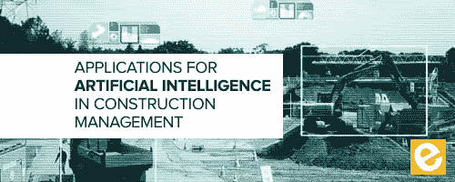
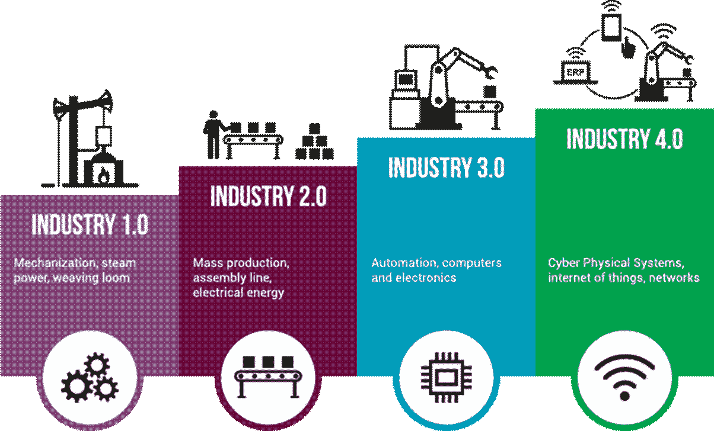

# 人工智能技术 VS 人工智能解决方案

> 原文：<https://medium.datadriveninvestor.com/ai-technology-vs-ai-solutions-3848f1a41875?source=collection_archive---------28----------------------->

## 全面采用人工智能的头号障碍是什么？

当人工智能初创公司寻找新客户时，一个持久的问题出现了。“如果机器学习是个好主意，为什么不是每个人都在做呢？”问题既烦人又有效。烦人是因为它将对话带入了商业心理学的模糊领域，有效是因为很酷的新技术总是来来去去。计算机科学的革命很少能一次就改变世界。在没有这个问题的答案的情况下推销你的技术，就像没有钢头靴出现在建筑工地一样。

Industry Specific AI Applications Are Key!

这类问题的答案总是一样的:“发明这玩意儿的天才们不懂你的行业。”你需要让客户知道你正在提供一个实际的解决方案，而不仅仅是把一个复杂的技术扔给他们，然后走开。对你所做的解释应该从你客户的实际业务问题开始。解释您的技术在解决方案中的作用，并强调对客户底线的积极影响。**展示相关行业的知识和对相关商业话题的真正兴趣。**这就是为什么尽管技术具有令人难以置信的灵活性，但专注于特定的机器学习应用程序更可取。

With AI targeting, letters get opened.

将客户推向全面的数据驱动的业务方法是很诱人的。聊天机器人可以彻底改变客户服务，神经网络可以彻底改变价格预测、线索挖掘和员工保留。就整个主题发表热情洋溢的演讲，然后说:“哦，顺便说一句，*我们的优化技术极大地提高了直邮广告的效果，这是一个错误。*“这不是一个有效的推销词。

更有效的推销是专注于特定的解决方案。对一些人来说，解决方法是图像识别。我的公司优化了直邮。虽然我为自己是“第四次工业革命”的一部分而自豪，但我仍然专注于基本面。客户需要了解集成您的技术的整个过程，他们希望您展示的知识不仅仅是 TensorFlow。

直邮是一种遵循一个目标和三个原则的营销形式。目标是增加利润。原理如下。

1.  如果你降低价格，你会卖出更多的单位。
2.  更昂贵的抵押品(信封和内容等。)=更高的转化率。
3.  更多的邮件=更多的转换。

当与客户交谈时，我总是强调这些要点。**“机器学习将增加你的利润，因为:*通过更好地预测你应该何时以及多久邮寄一次特定的线索，你可以增加你的邮寄次数，并提高你的营销宣传材料的质量。随着时间的推移，你会接触到更广泛的客户群，并能够为更高质量的销售线索提供更具吸引力的报价。我们的系统为每一步提供数据驱动的优化，并且随着时间的推移变得更加有效"***

另一家公司可能会说类似**“更好的面部识别通过允许更少的安全漏洞和更流畅的用户体验来降低你的责任。”**关键是对你的服务的任何解释都必须围绕你试图解决的问题的基本商业原则。

你可能会认为，在一个对人工智能程序员需求如此之高的世界里，人工智能公司找到客户不会有任何问题。企业正在争先恐后地融入人工智能，并实施数据驱动的流程。事实仍然是，人工智能工程师冒着忽略业务问题的风险，导致经理和企业主的困惑和幻灭。除了以技术为中心的思维模式外，通过采用解决问题的思维模式，人工智能公司可以展示人工智能的经济价值，并加快采用速度。我预测，2019 年将是我们弥合沟通差距的一年，并看到人工智能在行业各个层面的大规模采用。毕竟，解决问题是工程的全部。

I look forward to rereading this with you in 2020!