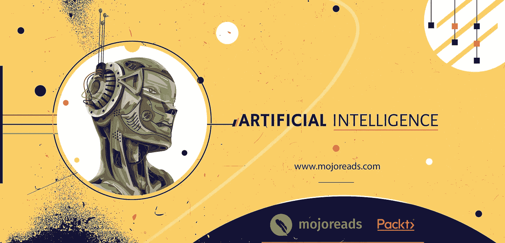
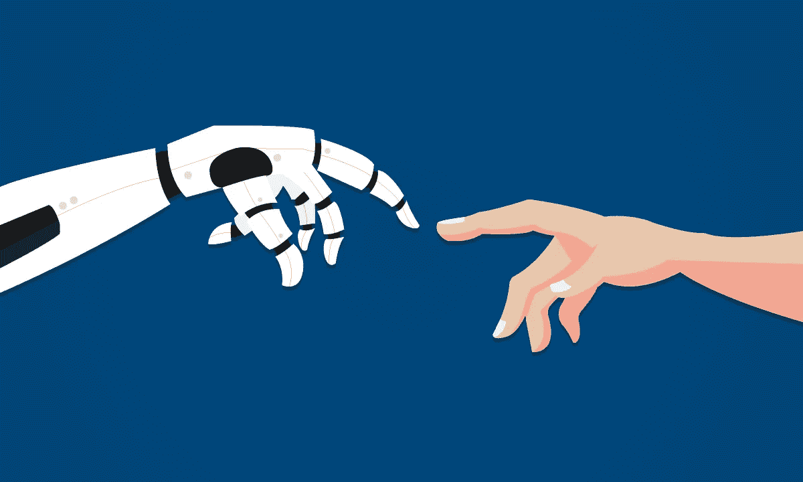

# 人工智能:机器的未来

> 原文：<https://medium.datadriveninvestor.com/ai-the-future-of-machines-58a11be1ef9a?source=collection_archive---------37----------------------->

自从第二次世界大战以来，这个词引起了巨大的轰动。它是在美国计算机科学家约翰·麦卡锡组织的达特茅斯会议上首次听到的。从那时起，研究人员就对深入研究和探索人工智能的潜力和好处表现出了兴趣。研究人员强烈认为，人工智能必须在计算机科学领域得到推广，因为他们清楚地看到了 [**人工智能**](https://jjd46.app.goo.gl/oHcK) 的潜力和深远影响。

这是下一个智能级别，可以分析神经模式，并为未来生成动态地图。人工智能有助于数据预处理和充分利用现有数据。很少有人推断为什么和如何，通过机器工作比人脑更聪明。

> *它会学得很快。*
> 
> 它将存储数据并充分利用它。
> 
> 比人类犯的错误少。

这种创新及其进步背后的原因是人类一直在改善自己，他们寻找简化工作流程的方法。加班加点的头脑也会变得疲惫，并试图释放自己。在这一点上 [**AI**](https://jjd46.app.goo.gl/oHcK) 进来，安全地保存数据并充分利用它，产生许多比人类一生所能实现的更有效的结果。

有一个神话流传开来，人工智能将成为就业机会的威胁。是的，在某种程度上是令人愉快的，但不完全是。大规模的就业萧条肯定不会出现，因为制造和操作一台超高效的机器也不容易。

简而言之，人工智能是一项实验，是对未来主义者的破冰挑战。此外，尽管处于最佳状态，人工智能在员工或工人的心目中仍不受欢迎。因为对它的崛起和接管许多人工作的恐惧是第一位的。
最著名的《纽约时报》畅销书作家、未来学家和机器人革命的发言人 [***马丁·福特***](https://jjd46.app.goo.gl/jDSg) 将他最好的观点、经历和对话集中到一个地方，以揭示最复杂的结构 [***人工智能***](https://jjd46.app.goo.gl/oHcK) 。

> [***“我们的设备理解我们说的话，对我们说话，并以越来越流畅的速度在语言之间进行翻译。人工智能驱动的视觉识别算法正在超越人类，并开始在从自动驾驶汽车到医学图像癌症诊断系统的各个领域得到应用。”***](https://jjd46.app.goo.gl/BHP1) ***—由*** [***马丁福特***](https://jjd46.app.goo.gl/jDSg)

他的作品 [***智能建筑师***](https://jjd46.app.goo.gl/9tve) 是一个惊人的例子，代表了所有人工智能问题的答案。