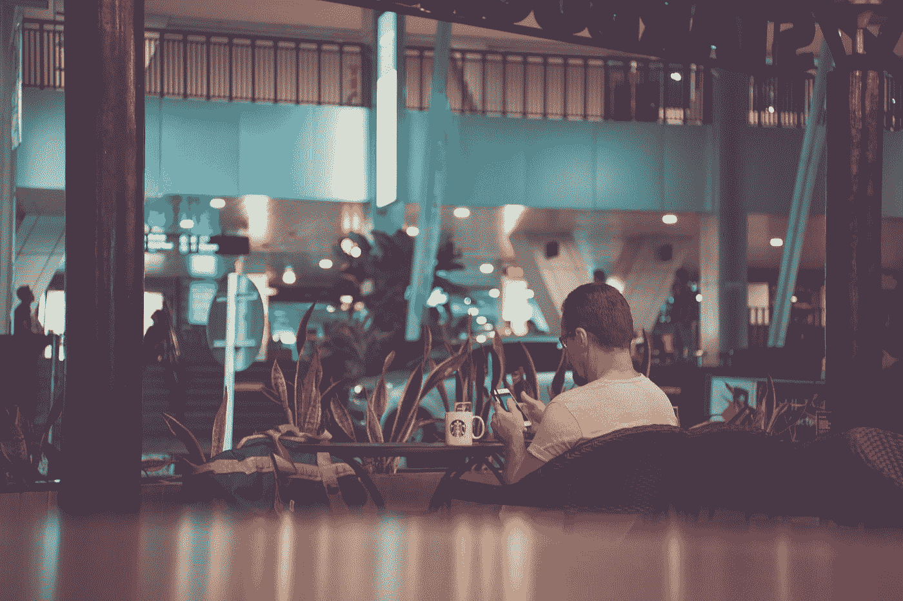

# 人工智能:行星大脑的新秩序

> 原文：<https://medium.datadriveninvestor.com/ai-the-new-order-of-the-planetary-brain-874b33c92d5f?source=collection_archive---------15----------------------->

Photo by [Ali Yahya](https://unsplash.com/@ayahya09?utm_source=medium&utm_medium=referral) on [Unsplash](https://unsplash.com?utm_source=medium&utm_medium=referral)

有可能你还在电话里半年聊一次的大学老室友，最好的朋友，已经去世好几年了。

在人工智能、大数据、数字语音克隆、实时视频深度假货、个性数据库以及针对个人的智能手机文本、照片和社交媒体编辑和审查的深度网络中，这项技术现在有可能提供一个真实的虚假角色——甚至在视频聊天中——你可能会误认为是一个可靠的人，他过去常常和你一起喝啤酒，如果你喝多了，会沿着希腊街送你回家。

通过全球情报机构的字母汤收集政府和私人情报，以及购买和出售你的数字信息(如旧货交易会上的大量垃圾和宝藏)的私人和公共公司，现在通过使用先进的人工智能在技术上得到保证，能够以数字方式再现一个已经在你脑海中作为历史和情感基石的真人。这种技术会议产生的结果，曾经不可能由一个或十个技术分析师令人信服地处理，现在有可能在国家层面投资人工智能，获得大数据和其他前述智能自动化。它可以从粗心的人身上剥夺每个秘密、成功和耻辱的知识。

你们两个用智能手机聊天的时候，你会跟你的老室友说什么？你会回忆起你曾经服用的药物或者更多(或更少)值得注意的一夜情吗？你有没有讨论过你的孩子，他们的名字、年龄、个性、抱负、艰辛，以及因为你的投资管理不善，抚养他们变得有多困难？闺蜜还会问什么？你和你的同事一起欺骗你的妻子吗？你偷税漏税吗？你有什么样的枪，放在哪里？

你会通过智能手机对远在地球另一端从未移民的父亲说些什么？棕榈蟹最近怎么样？脚上的骨刺还困扰着你，你去找哪个医生治疗？他在服用什么药物，你在服用什么药物，你对国内外的政治有什么看法？你朋友中有记者吗，他们和持不同政见者交往吗？自从政府镇压以来，现在谁在海滩上卖毒品？

前女朋友、男朋友和配偶可能会出乎意料地进入你的口袋(谁知道他们是怎么得到你的号码的呢?))对你大喊过去的错误或当前的失误，以促使你承认有罪，或者在特定的人施加特定类型的压力时，将你性格特征的更多细节添加到个性数据库中。

假设你在你的安卓或 iPhone 上给一个朋友发了一条短信，说:“四天前我们在网上发了洛杉矶机密，多么令人兴奋的混乱啊。”现在想象一下，它被一个人工智能选择性地编辑，说:“四天前的夜晚是机密，多么血腥令人兴奋的混乱。”想象一下，编辑文本的人工智能在发现谋杀案前四天回溯新闻(在我们的一些城市，谋杀每天都在发生)，然后从那时起重置你手机的 GPS 位置，以便让你成为犯罪的主要嫌疑人，因为它被编程为不喜欢你？当警察就这段文字询问你时，你别无选择，只能承认这是你的原话，但第一部分肯定没有出现，而这段文字的前一部分被一个随机应用程序从你的手机上删除了，这个应用程序与试图陷害你的政府人工智能有业务往来。

在美国,“信贷部”的“朱莉娅”的录音会在每天看似随机的时间打电话给你的手机，告诉你你已经被批准了更高的信贷额度。或者可能是“米歇尔”告诉你，你的企业已被批准贷款，你赢得了延长汽车保修，或者你的教育贷款可以很容易地重新融资。“米歇尔”真的给了你这些东西吗，你这个幸运的家伙？或者，她只是一个人工智能程序，听着你的呼吸和背景，根据你手机的位置设置来衡量你的愤怒或快乐如何受到你周围事物的影响，例如天气，交通，靠近你孩子的手机，靠近陌生人的手机，特定的街区，运输安全管理局的线路，交通法庭，葬礼，甚至周日教堂？此外，她说话的语气是否会从高兴变成急迫，从而进一步提取你潜在压力源的数据点？

据广泛报道，中国的全面监督和社会信用评分系统惩罚货币信用评分低的人。此外，它还跟踪每个中国公民的朋友和同事是谁，并根据他们能够收集的一系列大数据指标，目标公民将能够或不能租赁公寓、乘坐商业航班，甚至进入政府大楼。从理论上讲，中国的信用评分系统可以让你无家可归，没有朋友，没有任何家庭可以互动，因为害怕自己的社会信用评分会受到影响。

中国工厂正在使用“智能安全帽”,这种安全帽可以监测戴着它的工人的脑电波，记录愤怒、焦虑和抑郁的峰值。这是 2018 年向世界公布的真实、可行的技术。与安全帽相结合的是一个小型眼球追踪摄像头和一个遍布工厂车间的本地化接近传感器，工厂所有者(很可能是提供技术的中国政府本身)可以用它们来确定哪些员工和主管做出了最强烈的反应。根据具体情况，员工可能会被解雇或调到另一个楼层(如果他们有政治关系)，这些数据点会进入中国政府的总信息系统。

想想现代交通工具。几乎所有的都是可以被黑客攻击的。正如科技新闻媒体第一手展示的那样，远超过 1965 年左右结束的分销商上限和零电子产品时代，配备了无尽芯片、无线接入和 GPS 的现代汽车容易受到黑客的攻击。燃料喷射器和加速可以被远程操纵，制动系统可以被取消，甚至某些自动停车功能可以用来将车辆转向中间带，同时在油箱满油的情况下以 120 英里/小时的速度划红线，这样火球就可以销毁任何证据。

人工智能与视频深度伪造、音频克隆和其他生物识别技术协同工作，可以以任何方式重塑数字法庭证据。任何人的脸、声音和体型都可以被插入“展品:1”到“展品:你骑的马”，永远监禁任何被系统认为不适合自由的人。人工智能可以成为未来国家和公司总统的守护者，只提供最安全的膳食、最好的医疗保健和适当的教育信息，以适应所需的未来范式。如果一名记者或一名政客最喜欢的妓女(当出现分歧时)需要被推离某个特定的城市，他们可能会发现或揭露一个必要的秘密，令人难以置信的逼真的羞辱和犯罪可以在瞬间制造出来，并在当地的信息系统中传播。

在未来，也许是现在，任何一个数字技术足够发达的国家的两个公民都可以让他们的命运被编程*为*让他们在大城市的小人物的迷雾中找到彼此，并制造出适合运动、智力、顺从或种系缺陷的婴儿，以便出于不可知的原因进行研究和利用。人工智能可以利用像*这样的高度精致的广告的建议来消除自由意志，从而改变脸书和其他社交媒体上人们的当前行为。它可以操纵智能手机闹钟的基线时间，并在智能家居中预设 5G 咖啡机，以实现早醒或晚醒。如果需要的话，它可以为你定时交通信号*。理论上，这一切都可以实现，因为 DNA 数据库很快将大数据加入到一个由无数节点组成的足够先进和互联的人工智能网络中，可以让最佳夫妇在超市益生菌酸奶冷却器前的同一时间聚集在一起。在医生的办公室。在大学课堂上，在体育馆里，在餐馆里，在政府批准的反对“压迫性”宗教的抗议活动中，这些宗教只是犯了宣扬自由意志的罪行。最终，人工智能指导的繁殖对中的一个会说，“嘿。我认识你吗？”然后在他们的智能手机上显示朋友和家人发来的即时和虚假的心形表情文字，感谢他们每个人的各种帮助，一个广告牌闪烁着一杯热气腾腾的星巴克咖啡，一辆适时驶过的好事达面包车，它的手拉手标志突然“出故障”并鸣笛，收音机里播放着一首伤感的情歌。暗示的力量在不断重复的时候是最强大的。**

*这是我们交给企业和政府的掌控我们生活的权力。这是无法阻止的。随着每一部智能手机的售出，随着每一部亚马逊 Alexa 和谷歌 Echo 像某种时尚奖品一样被急切地抢走，随着第四修正案和权利法案其余部分的每一次新的秘密编辑，我们正在使人工智能成为具有不可思议力量的决定性之神。这种力量将很快强大到足以毒害那些不想要的人，比如不正确地开处方，在人行横道上用不合时宜的交通灯机械地杀死他们。或者，或者联合起来，它可以通过暗示和有意的物理放置来繁殖人类几代人，以适应那些相信他们可以控制人工智能的人的目的，即使他们自己在完美制作的人工但物理现实中出生、存在和死亡。*

*这篇文章不是警告。为时已晚。人类现在和今后都将处于人工智能的控制之下，即使它存在于人类布满老茧的大拇指之下。你可能已经*每六个月就*向你死去多年的大学好友的假版本泄露你的秘密。然而，最近几代人每天都在和他们不存在的最好的朋友和压迫者说话和发短信，每次那个假朋友在他们的口袋里嗡嗡作响，自动提醒他们放弃更多的自由意志，去迎接数字确定性的未来。*

*著名的交流电发明者尼古拉·特斯拉在 1926 年这样描述现代智能手机:*

*“当无线技术被完美地应用时，整个地球将被转换成一个巨大的大脑，事实上它就是，所有的事物都是一个真实而有节奏的整体的粒子。不管距离有多远，我们都将能够立即相互交流。不仅如此，通过电视和电话，我们将会看到和听到对方，就像我们面对面一样，尽管中间相隔几千英里；我们用来做这些事情的工具将会装进我们的背心口袋里。”*

*随着大脑半球和地球的成长和串在一起，增加对整体的意识，一个更大的秩序自然被发现。对于神经元、突触、轴突和那些可能在事物新秩序中插入挑战、任性和无序的人来说，我们日益成熟的地球的未来并不是最好的事情。如果这个世界确实是一个大脑，那么我们将别无选择，只能遵从相互联系的、有意识的领域的意志，或者作为随机和混乱的婴儿期的残余人工制品被抛弃。*