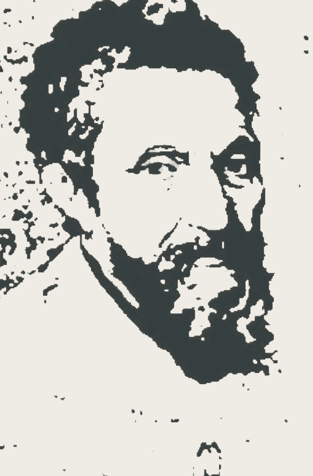

# 人工智能思想

> 原文：<https://medium.datadriveninvestor.com/ai-thoughts-14832cd7923a?source=collection_archive---------3----------------------->

Aaron Huber on Unsplash

> 在任何给定的时刻，单个脑细胞都会从其网络中数百个(如果不是数千个的话)**相连的神经元接收化学信号。当兴奋性和抑制性神经传递素沐浴接收细胞的受体时，它们会诱使神经元放电或保持不活动。本质上，接收神经元达到了一个临界点，即促使细胞触发的输入的神奇组合。电脉冲沿着细胞体行进，细胞体释放自己的神经递质，鼓励附近的神经元放电或保持静止。**
> 
> 神经元不会孤立地放电。他们在网络中开火…
> 
> 马尔科姆·盖伊的《脑电》

小时候的一个夏天，我被送去航海夏令营。经过几天的训练，我们进行了第一次比赛，每艘船上有两名年轻的水手。我想大概有十五艘船。那周早些时候，我们已经学习了所有关于风和航向策略的知识。当小舰队的帆船起飞时，我突然想到每一次前进都需要时间，这会减慢船只前进的速度，所以我很快计算出了到帕姆利科海峡另一边的距离单位时间内最有效的前进次数。一个大头针！在描述了数学之后，我们的速度将远远弥补距离与竞争对手的速度损失，我能够说服我的船友赌一把。我们出发时，所有其他船只每隔几分钟就来回调整航向。我们穿过海湾的一半，在离舰队很远的地方，我们开始转向，当我们加速驶向岸边标记时，我们远远领先于其他队伍。

 [## 挑战你对人工智能和社会的看法的 4 本书——数据驱动的投资者

### 深度学习、像人类一样思考的机器人、人工智能、神经网络——这些技术引发了…

go.datadriveninvestor.com](http://go.datadriveninvestor.com/4AI1) 

正如在达到目标的竞赛中最大限度地减少障碍是有价值的一样，首先，人工一般智能，AGI，以及保持对人类思想的基本机制，神经科学的关注是有价值的。在研究生物神经元和神经元集如何支持思想(AGI 目标)的过程中，人工智能具有价值。

有意识的思想不同于近似模型。正如第一个机器人公民索菲亚只是一场秀，一个模型，其能力受到她构造的现实约束的限制，人工智能深度学习(AI DL)也是如此。也就是说，用于深度学习的神经元的基础模型与大脑的神经元显著不同，因此，试图对思想和意识进行建模的复杂深度学习模型的结果只会是受其基础架构的构造(神经元模型)限制的模型。我是带着对深度学习领域最真诚的敬意来写这篇文章的。我在这里指出的区别是神经科学对生物神经系统固有的微妙性和复杂性的观察，这些系统支持一般的人类思维和智力结构。

这个基础正是人工智能 AGI 研究需要开始的地方。也就是说，许多方法中的一种应该是人类神经元的模型，包括 DNA 和支持元素的定义。人类神经元如何存在于神经元组中，思想如何从 860 亿个神经元和 100 万亿个突触连接中产生，这些故事中令人难以置信的微妙之处是我们如何从模型中获得真正的 AGI。

诚然，虽然人类目前还没有计算能力或架构来实现这一目标，但根据技术趋势的证据，人类正在沿着一条轨迹前进，这将在不久的将来或多或少的计算点上实现这一成就。也就是说，给定计算机发展的这种历史趋势，可以在误差范围内预测当前开发中的特定进步何时将变得商业可用，见证基于量子位的计算机等等，在不久的将来到达我们很可能拥有支持大脑模型的必要计算机基础设施的时间点。然而，当我们到达那里时，我们会有适当的神经元系统模型吗？

见证杰弗里·辛顿(Geoffrey Hinton)最新的胶囊人工智能架构进展，更接近大脑如何与神经元组一起工作。毫无疑问，现在和过去的趋势都是将大脑作为范例。正如模型的定义一样，模型仅仅是并且永远仅仅是模型定义的某种程度的近似。我会进一步指出，模型中的抽象程度越高，离被建模的对象就越远。这才是重点。我们已经到了这样一个时间点，我们正在意识到并阐明深度学习的缺点，并且拥有支持实际生物神经元建模的计算趋势，而不是抽象的一般近似。

我们正站在新的可能性的大门前！

> “千里之行始于足下”
> 
> [出自《道德经》第 64 章归因于老子](https://en.m.wikipedia.org/wiki/A_journey_of_a_thousand_miles_begins_with_a_single_step)

*©️ 2018 Hank M. Greene All right reserved*