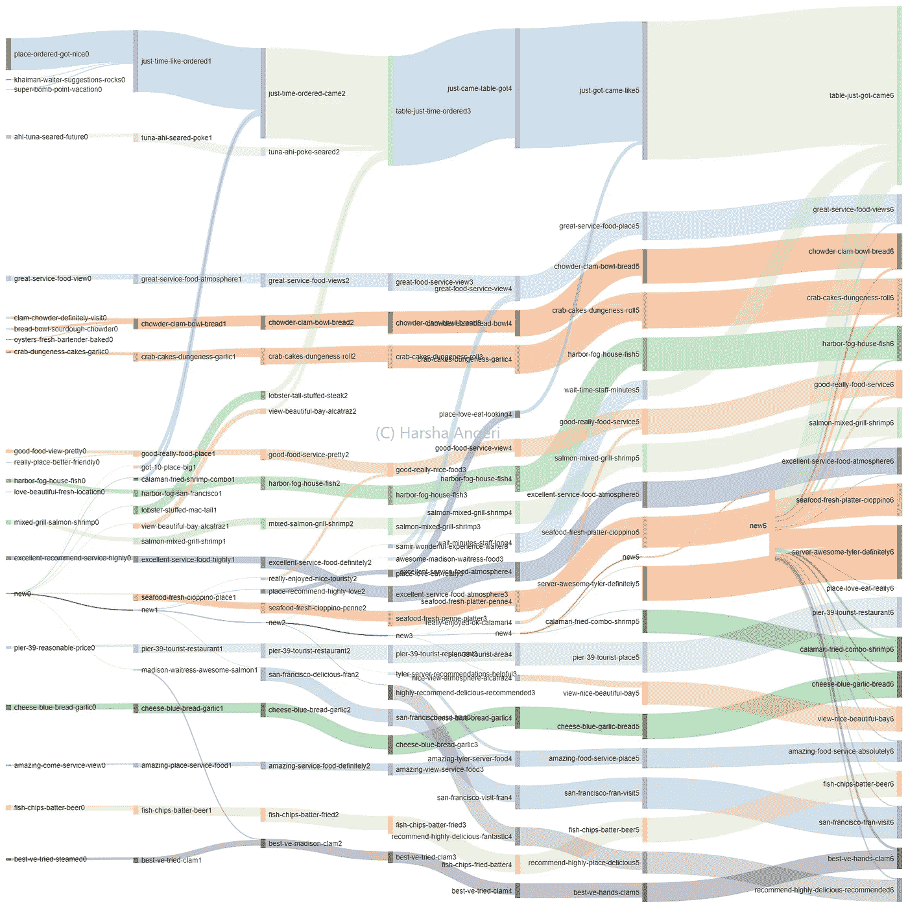
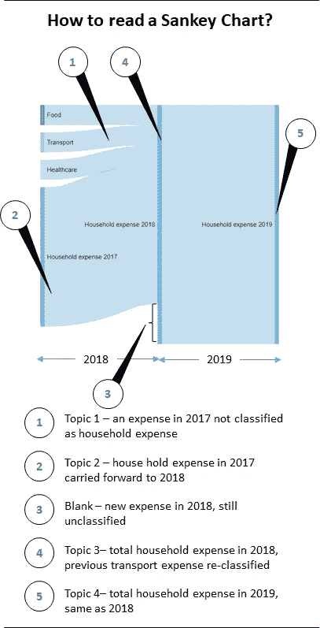
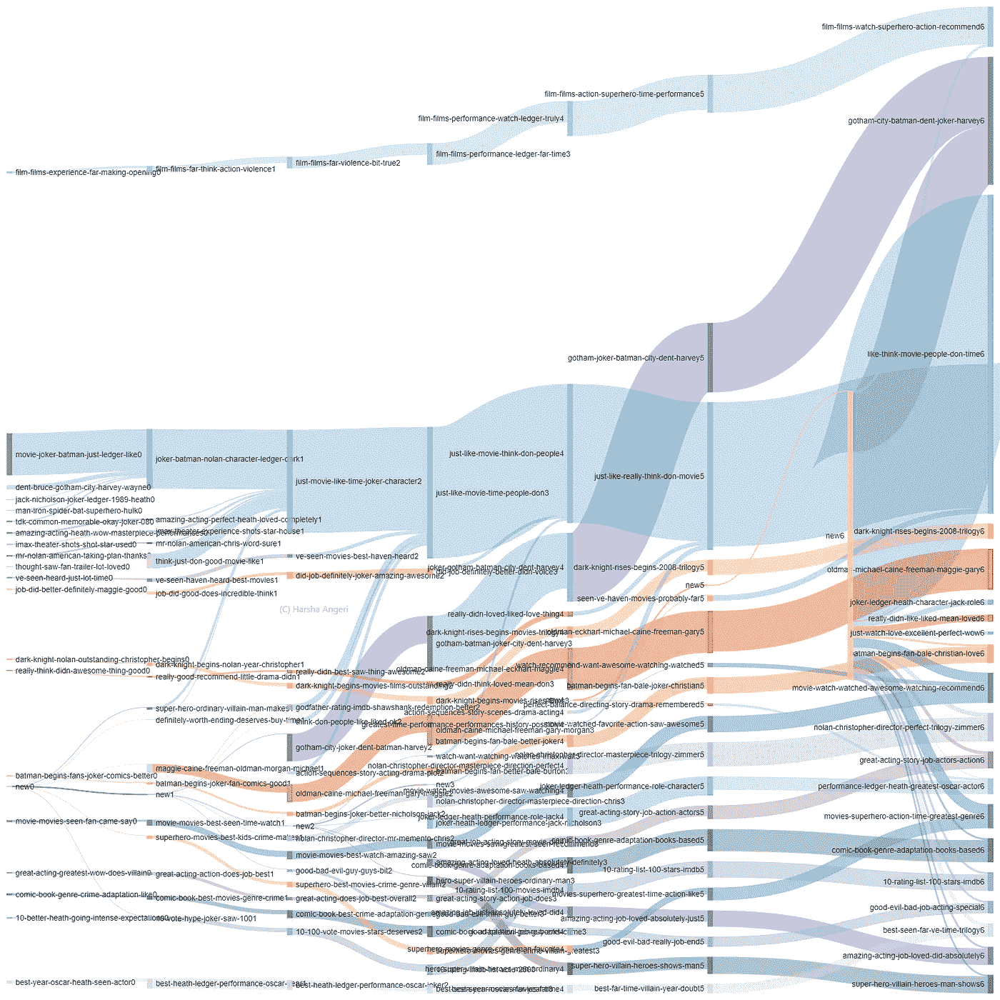
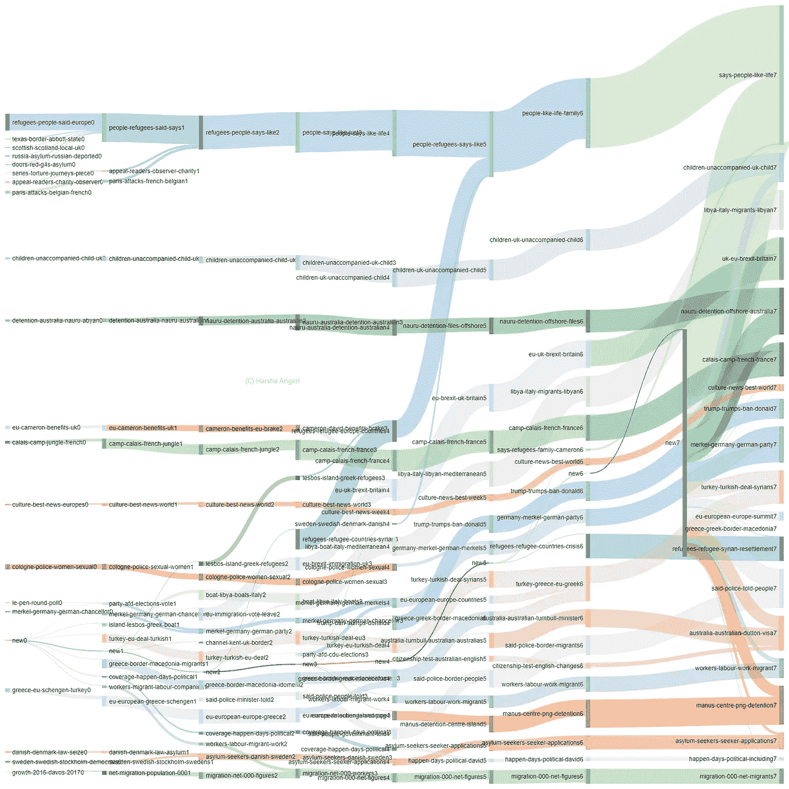
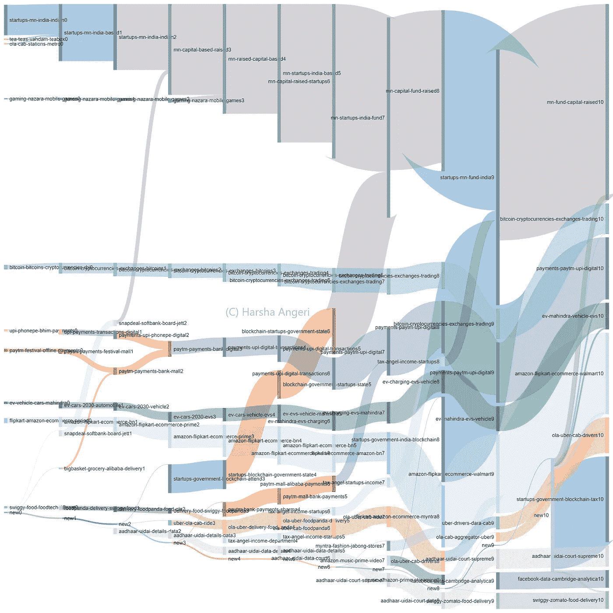
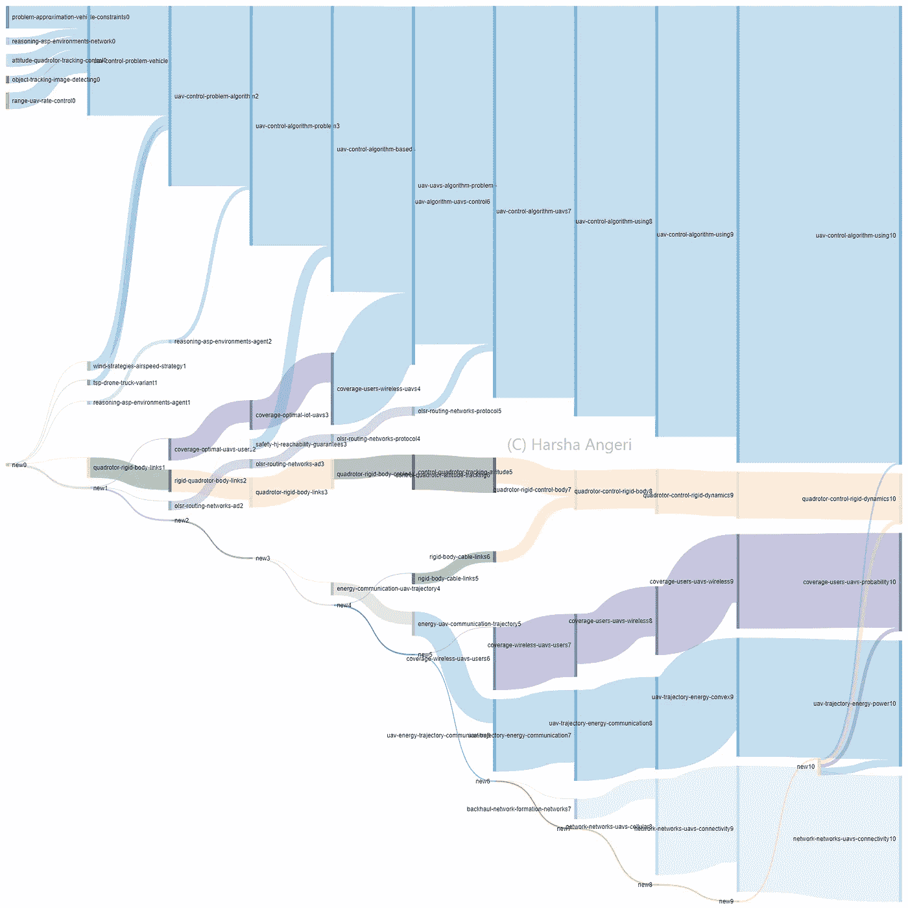
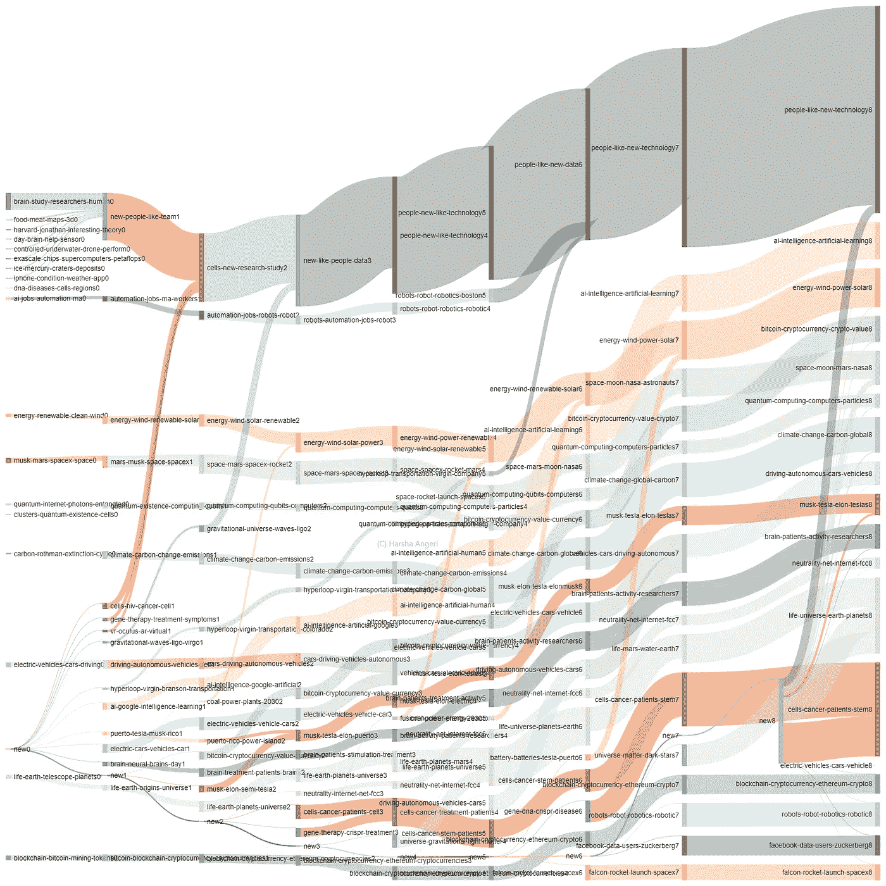

# 人工智能让生活变得不再杂乱

> 原文：<https://medium.datadriveninvestor.com/ai-to-de-clutter-life-fc9c11d84776?source=collection_archive---------2----------------------->

美国成年人平均每天花大约 6 个小时在互联网上(来源:2018 年 KPCB 互联网趋势)。

我们不断地在网上寻找。我们发现了什么？

**杂乱。**

*   每分钟有超过 400 小时的视频被上传到 Youtube
*   iOS 上有 200 多万个应用程序
*   大约 10 亿日活跃用户每天交换 650 亿条 WhatsApp 消息
*   脸书上的每一分钟:510，000 条评论被发布，293，000 条状态被更新，136，000 张照片被上传(来源:The Social Skinny)
*   你一定认为这是大众社交媒体。例如，如果我是核心科学研究人员，这不会影响我？你也不能幸免——140 万篇研究论文被上传到 arXiv.org，目前每月上传 12595 篇

除此之外，还有 120 亿个传感器在处理数据。预计到 2020 年将会产生 47 Zeta 字节的信息。只是为了明确这是 47 泽塔字节以下

# **47 0 亿字节**

预计其中只有 16%是结构化的和可搜索的。当然，很多都是假信息，就像我们今天所面临的一样。

齐塔字节会袭击我们，我们不知道如何管理。你会发现什么？

**杂乱。**

让我们拿最简单的事情来说。决定去餐馆。如今，大多数餐馆都有 3000 多条评论和 1000 多张 Instagram 图片。48%的 Yelp 评论是 5 星，这些不能区分。68%的评论有 4 颗以上的星(来源:[https://www.yelp.com/factsheet](https://www.yelp.com/factsheet))。72%会有推荐评级。杂乱。除非我仔细阅读评论，否则没有什么能帮助我做出决定。

我们正在经历的互联网和数据之旅无法逆转。我们的方式只是向前，这将有更多的数据每年增加泽塔字节。我们需要整理一下。

我希望，

*   有一种方法可以总结每一条新闻、每一个研究主题、每一次餐馆之旅(菜单、评论)、每一次电影感受、每一项技术等等
*   理解要点和有一个起点的更简单的方法
*   一种理解信息流的方式，能够在需要时“点击”进入细节
*   一种无需搜索数千篇文章/论文就能直观看到这一点的方法
*   消除混乱的途径

这个问题一直困扰着我，这里是我试图去杂乱。下图根据人们留下的 4000 多条评论总结了一家餐厅的历程。

Fig 1: Restaurant journey flow

数据代表真理，机器可以处理这些海量数据。使用人工智能技术教它如何做到这一点会带来智能，以消除混乱。

餐馆里有 56 个菜单项目(食物),图 1 显示了一直很重要的项目是蛤蜊杂烩、蟹饼和混合烤鲑鱼虾。这种流动跨越了时间，清楚地表明服务是伟大的，也是伟大的(港口的)观点。人工智能系统还发现这家餐厅位于旧金山的 39 号码头。从机器上看，这是个旅游景点。现在该你决定了。而你避开了 4000+的评论。

人们可以了解服务的细节，包括女服务员非常受欢迎，有两个叫 Samir & Tyler 的服务员随着时间的推移产生了很多实证主义。难道你不想在进入一家餐厅之前了解这些微妙的方面，而不去费力地通读评论吗？

你看到的是机械工程师熟悉的桑基图。它被用来描述流动，并被发现用来描述蒸汽机中的能量流动。用同样的方式来描述当今时代的信息流动。桑基图的原理是箭头的宽度与此处保持的流量成比例。从视觉上可以看出哪些信息是重要的，因为它是随时间绘制的，所以可以看出哪些信息始终是重要的。还可以看到哪些主题增长，哪些主题合并/拆分。人们也可以观察到某些主题并不存在，而是在某个时间点开始。

主题本身是使用无监督的机器学习系统生成的。这种人工智能机器的输入是文本(在这种情况下就像餐馆的评论),按照时间和要生成的主题数量(图 1 中有 20 个主题)排序。人工智能系统自动生成的所有东西，包括桑基图表。有一个很酷的 Python 库来制作 Sankey 图，所以整个学习和绘制过程是无人监督的，自动的，没有人工干预。

我们能为电影做同样的事情吗？在我最喜欢的“黑暗骑士”上放了一遍。从发布到现在，有 3700 条评论被输入到人工智能机器中。下面(图 2)是 AI 机器生成的东西。

Figure 2: The Dark Knight Movie

机器明白这是一部在哥谭市制作的超级英雄电影。这部电影一直得到推荐，直到本周(2018 年 6 月 25 日)都有很好的评论，这本身就很说明问题。一个惊人的发现是，自过去 10 年以来，许多人一直给出 10 分以上的评分。人们仍然积极地观看和评论，这些信息比任何具体的星级数字都要好。必看。人们可以看到像克里斯托·诺兰-汉斯·季默组合这样的细微差别，这暗示了配乐。这一下子让基于这样几个方面的搜索成为可能。所有上述数据都在一个向量空间中，因此像“给我看一部有类似导演-音乐家组合配乐的电影”这样的查询是可能的。小丑角色获得很多荣誉。机器也能识别出有续集，从流程中可以看出《黑暗骑士》三部曲正在上演。AI 自己学习后续电影的存在。

因为电影信息不像餐馆信息那样受时间限制，尤其是在上映日期前后，所以人们可以更密切地看到初始主题的流动。希斯·莱杰获得了奥斯卡奖，机器说这是因为他之前扮演的小丑角色。机器建议用 IMAX 看。它了解到这是一部漫画体裁的犯罪改编作品，并与蜘蛛侠、钢铁侠和绿巨人进行比较。艾甚至推荐你去寻找克里斯托弗·诺兰纪念品。

这台机器总结、推荐、精确定位细微差别，并以完全不同的方式让数据变得可搜索。

正如你所意识到的，人工智能机器并不关心文本的性质。让我们看看下面的图表。全世界讨论的一个大话题是关于移民(人类移居到不同的国家)。这样的话题从何说起？为什么不请 AI 系统出图。下图(图 3)描述了机器看到的关于迁移的情况。

Figure 3: Migration

这台机器处理了过去 2.5 年的 3000 篇报纸文章，并告诉我们，在人类移民方面，今天的世界似乎正在发生以下事情:无人陪伴的儿童问题(以前是英国，现在是美国)，利比亚-意大利(船民危机)，叙利亚危机(与希腊、土耳其等国)，叙利亚难民重新安置，对德国总理安格拉·默克尔的影响，法国加莱营地，英国英国退出欧盟对欧盟公民移民的影响，马努斯和纳鲁的澳大利亚拘留中心，当然还有多位总统特朗普的禁令。非常清晰地展示了迁移如何影响当今世界以及需要寻找的主要问题，自动生成。人们可以通过在主题流中回溯来寻找副主题，如澳大利亚移民问题，在那里他们引入了公民英语测试。还可以观察到问题如何从一个转移到另一个。例如，大卫卡梅隆刹车欧盟移民进入一个更广泛的 EU-英国英国退出欧盟问题，它将如何影响移民。

再举几个例子。从一个多国的单一主题出发，让我们来看看一个国家(印度)的技术前景。当输入 6 个月的数据时，机器生成下图(图 4)。

Figure 4: Technology News

显然，筹款增加了。主要话题围绕电子商务、食品配送、出租车聚合器(如优步)和电动汽车。人们可以看到脸书-剑桥分析杂志的问题突然出现。此外，地方方面，如 Aadhaar 和政府对天使投资者收入的税收显示出来。人们可以看到从 Myntra-Jabong 交易(时尚商务)到更广泛的电子商务话题的信息流。熟悉中国情况的人可以观察到董事会层面上 Snapdeal-软银筹资问题等细微差别，这将演变成一个更广泛的筹资话题。需要注意的是，分析的时间框架可以根据可用的文本量而改变(每天、每月、每年)。人工智能机器已经了解了印度科技领域正在发生的事情。

人们可以更深入地研究特定的技术。如果一个人不得不开始研究一个特定的主题或投资一项特定的技术，或者一名记者不得不写一篇关于技术方面的文章，那么从哪里开始呢？让我们选择无人驾驶飞行器(UAV)的主题，人工智能机器生成下图(图 5)。

Figure 5: UAVs

机器自动生成无人机的当前研究状态，包括技术细节

*   操纵和控制一架或一队无人机的“控制算法”是关键。看到像 OLSR 路由协议这样的细节被指出来是令人惊讶的。快速的谷歌搜索会告诉你 OLSR 代表优化链路状态路由协议，是一个为移动自组织网络优化的 IP 路由协议，包括各种无线自组织网络。当多架无人机飞行时，它们会形成一个特别的无线网络，因为它们的速度和轨迹不同，并将连接转移到地面和其他无人机站。这台机器让我学会了这一点，却没有弄懂上百份研究论文
*   考虑到无人机的各种外形因素，“四旋翼控制动力学”仍然是一个关键的研究课题。谷歌告诉我们四旋翼飞行器是你在无人机上看到的一组旋翼。这些多个转子在经历不同的不确定条件时，比方说穿过风暴，它的控制是一个关键领域
*   无人机在空中飞行，它与地面以及彼此之间的连接至关重要。“无人机网络连通性”是一个关键的研究领域，尤其是在蜂窝网络普及的情况下。无人机被认为是“空中”移动用户，就像我们是“陆地”移动用户一样。该组合形成了具有共存的空中和地面用户的下一代三维(3D)异构无线网络。哇！！！机器指着这个和它后面的文件让我知道它是怎么回事
*   与此相关的是“无人机轨迹能源动力”的话题。快速浏览研究论文摘要告诉我，无人机功能(例如视频流)，它的轨迹和它与其他无人机和地面无线连接所消耗的能量。连接能耗与轨迹的权衡是优化的主要研究课题
*   “覆盖用户概率”指的是使用多架无人机来解决一个问题的研究，例如在紧急情况下。可以认为这是计算出保证给定地理区域的目标覆盖概率所需的最小无人机数量。鉴于研究是将被产品化的领先指标，将出现用例的一个很好的指标

这是对无人机前沿话题的一个很好的总结

*   一位想写这个话题的记者
*   一位风险投资家想要投资一家无人机创业公司
*   一个想确定在哪里进行研究的研究者
*   一家跨国公司想搞清楚 R&D/新增长投资

最重要的是，这些决定可以在没有人类偏见的情况下做出，因为机器会给出真实的输出。由于我们处理数以千计的文章/论文，并专注于产生更广泛的流量，这种方法不太容易出现假新闻。一些伪造的文章不会改变这一趋势。

接下来呢？

1.  去杂乱方法的下一步:

*   将输出整合到报告的自动生成([通过编码自动生成报告& AI](https://medium.com/datadriveninvestor/auto-generate-reports-via-coding-ai-29468cd48956) )和技术采用地图([自动生成技术采用地图](https://medium.com/datadriveninvestor/auto-generate-technology-adoption-maps-80869f87d23e))将使这成为一个端到端的平台。每个主题流都可以作为自动生成的报告的输入。例如:无人机控制算法可以作为输入，自动生成该领域的公司、资金、专利等报告。使用人工智能的端到端自动化。我以前的博客解释了使用代码& AI 自动生成报告
*   Sankey Charts 的 UI 可以被简化和美化…目前，它是代码的直接输出
*   通过使用阈值，可以降低流的数量以获得更好的可读性
*   我写的解释每一个的段落可以直接提供，而不是图表
*   其他处理相同文本的人工智能系统也可以使用这个输出。例如，在主题流中嵌入情感

2.下一个世界

我想给你们展示一下人工智能机器眼中的世界未来。由人工智能和代码自动生成的热门趋势(图 6)

Figure 6: Future Trends

机器生成以下内容作为未来趋势。自己判断一下，人工智能是否能很好地理解是什么在驱动我们的未来，它是否能取代白领工作:

*   人工智能
*   机器人学
*   能源-风能和太阳能
*   气候变化和碳
*   加密货币和区块链
*   太空——月球、火星、NASA 和 SpaceX
*   宇宙(地球、火星和其他行星)中的生命，包括暗物质
*   量子计算
*   以特斯拉为亮点的电动汽车
*   自动驾驶汽车/车辆
*   大脑和病人活动研究
*   干细胞与癌症(包括基因 CRISPR)
*   互联网网络中立
*   用户数据(重点是脸书)

数据掌握着真理。代码+AI 可以解锁。

在人工智能的世界里，数据很重要，情报也很重要。

注意:有兴趣在其组织/产品中实施上述知识产权的公司可以通过 [Linkedin](https://www.linkedin.com/in/harshaangeri/) 联系

