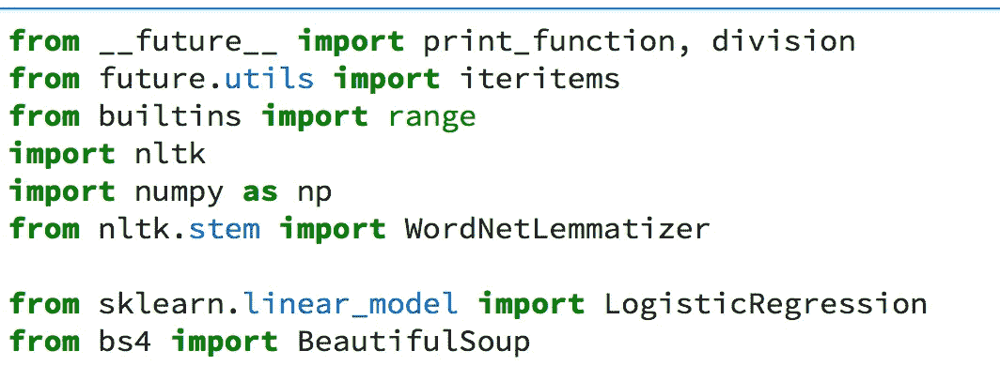
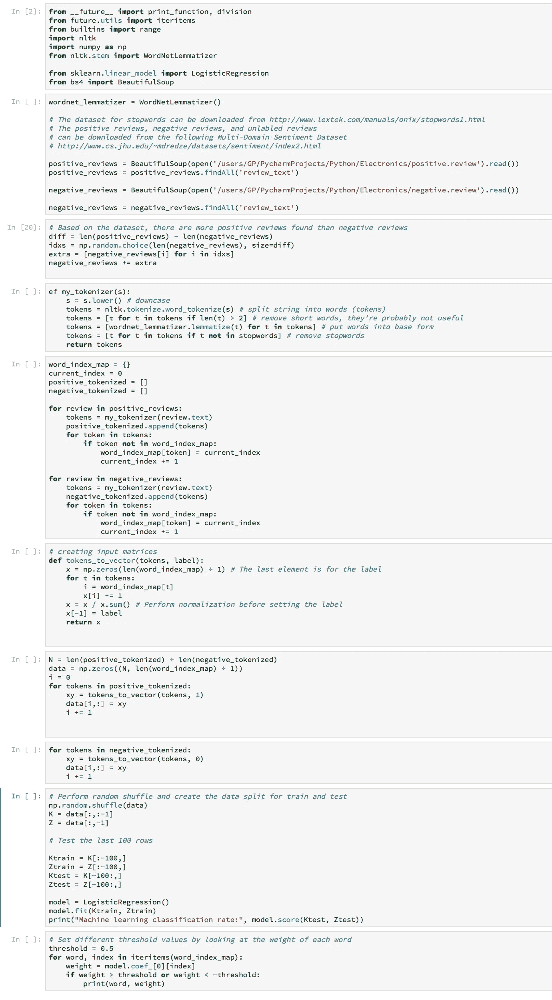
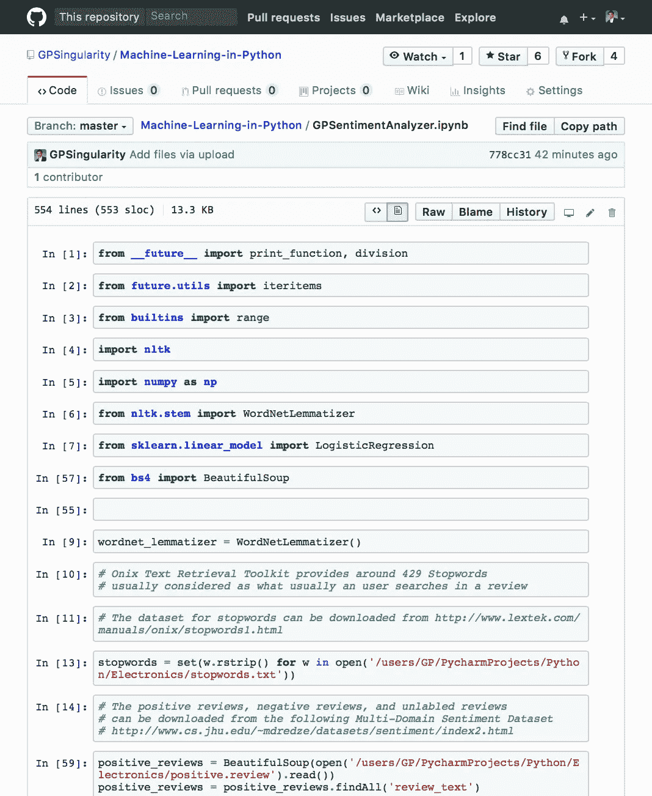
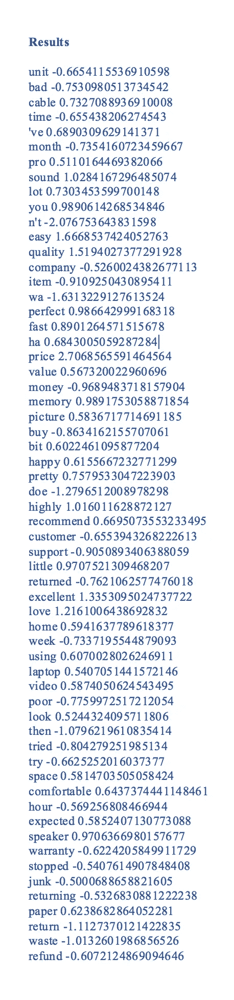

# 人工智能在 JupyterLab 中训练对亚马逊电子评论进行情感分析

> 原文：<https://medium.datadriveninvestor.com/ai-trained-to-perform-sentiment-analysis-on-amazon-electronics-reviews-in-jupyterlab-b4d8b9e1dad6?source=collection_archive---------2----------------------->

过去几十年来，自然语言处理方面的最新进展使得大量企业能够利用情感分析的潜力，通过深度学习和机器学习算法来训练人工智能，以教会机器并执行类似于人类通过认知能力应用的特定操作。尽管机器无法通过逼真的体验理解、感知和处理场景，但强化学习和神经网络等先进技术使得通过神经机器翻译来设计机器处理数据成为可能。意见挖掘和情感分析允许企业从文本中提取情感，以理解从特定主题的特定群体进化而来的群体智能。然而，由于情感可以来源于几个方面，如纯粹的情感反应、判断或只是评价。网络中立性是提取对文本进行分析的洞察力的关键因素。企业需要做出更好的产品决策，无论是改进现有产品还是推出新产品。客户是通过成千上万的文本提供情感的关键利益相关者。文本可以包含积极的评论，消极的评论，或者一些可能保持中立。情绪分析可以提供关于顾客对企业各方面的积极评价的见解，关于比竞争对手更好的品牌认知。通过社交网络对文本进行分类，可以超越文本的极性。许多组织提供的客户服务还需要声音的音调，以及在等待队列和响应评估方面对客户满意度的测量。位于华盛顿的微软研究实验室对女性进行了情绪分析，以评估基于文本的风险，以评估分娩前文本中焦虑和不愉快所表明的产后抑郁症。

**语义和情感分析**

自然语言处理在从文本中推断语义和情感方面有着广泛的应用。问答系统、语音识别和上下文识别。整个单词谱显示了特定的词汇关系、层次、组成、表示和上下文关系。有几个深入语义分析的主题，如 WordNet、词汇语义关系分析器、同义词集、命名实体识别、词义消歧和语义关系分析。1985 年，普林斯顿大学在认知科学实验室发明了一个大规模的英语词汇数据库，名为 WordNet。该数据库包含动词、形容词、名词、副词和相关词汇。将常见的概念组合成集合就产生了具有不同概念的合生集。WordNet 的工作方式类似于一个包含一组单词和相应同义词的辞典。WordNet 由大约 155，000 个单词组成，这些单词在各种同义词集中表示，接近 117，000 个同义词集，有 206，000 个词义对。

Figure 1\. NLTK for natural language processing.

NLTK 是最流行的自然语言处理库。NLTK 库可以把令牌变成向量。NLTK 还可以导入 WordNet 语言词典来充分利用关键特性。单词分布可以存储在 Redis 或 MongoDB 中作为后台语料库。

**逻辑回归**

逻辑回归机器学习分类器被考虑用于 Python 实现，因为它具有亚马逊电子评论的神经网络架构的权重。特别是逻辑回归是一种机器学习分类器，而不是一种在线性可分类上工作良好的回归。逻辑回归可以执行二元分类，也可以扩展到多类分类。逻辑回归是计算机科学中最流行的机器学习分类器。由于数据集包含 XML 格式的文件，XML 解析器可以与 BeautifulSoup 库一起使用。最初，代码会检查词汇大小和单词的相应索引，并创建向量。在第二遍中，逻辑回归可以被用作机器学习分类器，其通过解释评论的权重来执行二元分类。通过逻辑回归，我们通过计算超平面本身来分离超平面的数据。如果特征向量 X 大于零，它将被分配到正类，如果是负类，它将被分配到负类。逻辑回归在这里对神经网络架构起作用，每个输入是一个乘以其权重的神经元，结果被相加到最后生成输出。内积在逻辑回归中通过一个 sigmoid 函数产生 0 到 1 之间的概率，正面评价> 0.5，负面评价< 0.5.

Figure 2\. Logistic regression neural network architecture

Figure 3\. Python code implementation for NLTK for sentiment analysis

Figure 4: Code I posted on Github

**结果**

结果显示了基于针对特定单词的逻辑回归分类器的具有正面和负面评论准确性的情感分析。

Figure 5: Results

参考

Fandango，A. (2017)。 *Python 数据分析—第二版*(第二版。).英格兰伯明翰:Packt 出版公司。

哈登尼亚，N. (2016)。*自然语言处理:Python 和 NLTK* 。英格兰伯明翰:Packt 出版公司。

Kumar，a .，& Babcock，J. (2017 年)。 *Python:高级预测分析*。英格兰伯明翰:Packt 出版公司。

马尔，B. (2016)。*关键业务分析:每位经理都需要知道的 60 多种业务分析工具*。新泽西州上马鞍河:金融时报国际出版公司。

马萨龙，l .，，博什凯蒂，A. (2016)。*用 Python 进行回归分析*。英格兰伯明翰:Packt 出版公司。

Raschka，s .，Julian，d .，& heartful，J. (2016 *Python:对机器学习的更深入洞察*。英格兰伯明翰:Packt 出版公司。

卡尔博士(2016)。*使用 Python 进行文本分析，这是一种从数据中获取可行见解的实用方法*。纽约市，纽约:新闻媒体有限责任公司。

Swamynathan，M. (2017)。*用 Python 六步掌握机器学习*。纽约市，纽约:新闻。

TensorFlow 社区(2018)。MNIST 适合 ML 初学者。2018 年 5 月 12 日检索，来自[https://tensor flow . r studio . com/tensor flow/articles/tutorial _ mnist _ 初学者. html](https://tensorflow.rstudio.com/tensorflow/articles/tutorial_mnist_beginners.html)

Thanaki，J. (2017 年)。在 *Python 自然语言处理*中。英格兰伯明翰:Packt 出版公司。