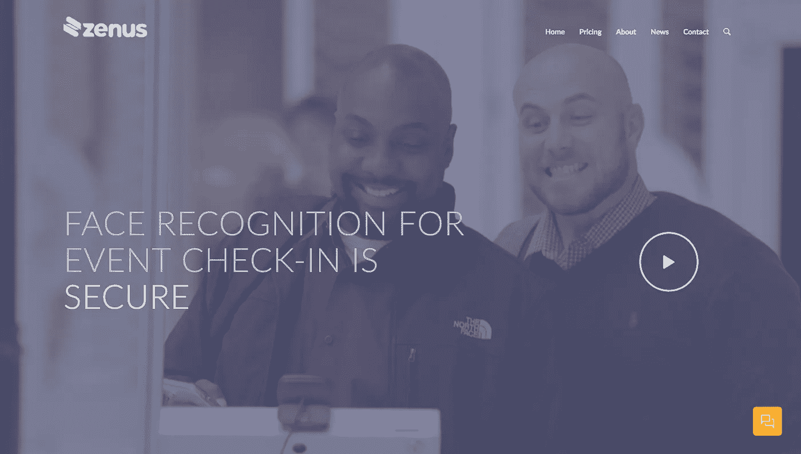
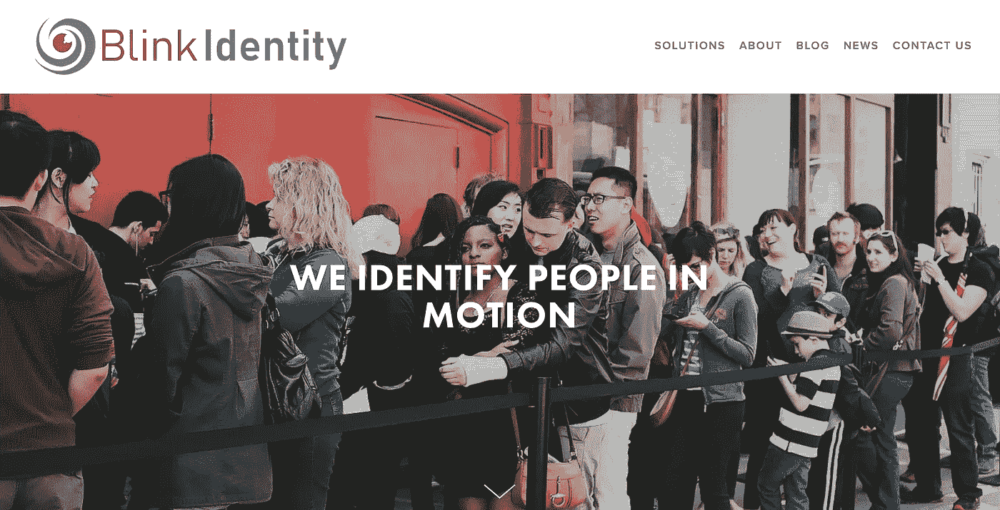
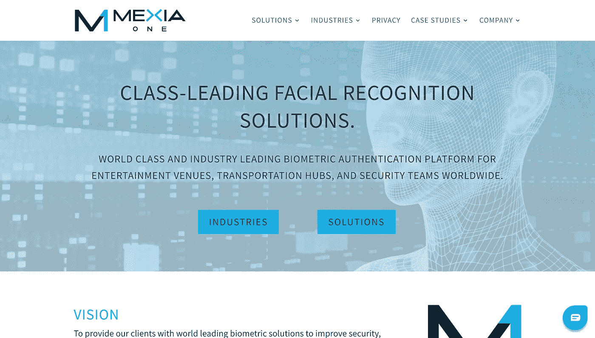
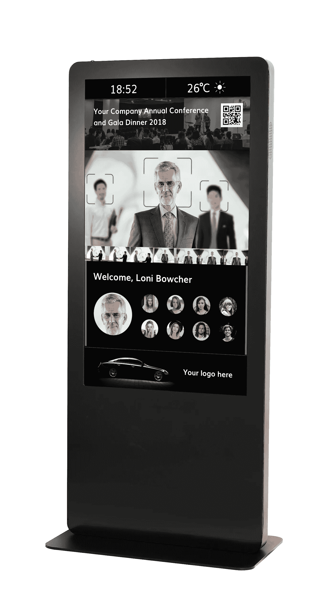

# 人工智能视觉——市场现状

> 原文：<https://medium.datadriveninvestor.com/ai-vision-state-of-the-market-abaefa491c7e?source=collection_archive---------47----------------------->

## 活动市场空间中的面部识别技术

Photo by [Annie Spratt](https://unsplash.com/@anniespratt?utm_source=medium&utm_medium=referral) on [Unsplash](https://unsplash.com?utm_source=medium&utm_medium=referral)

## 介绍

Juven 的使命是增强组织的会员生态系统，并将它们连接起来，以创造新的价值。由于活动管理是组织的关键影响领域之一，Juven 已经接受了提供端到端解决方案的挑战，以将活动管理(从而将整个组织的参与度)提升到一个新的水平。

在这一系列文章中，Juven 将介绍[人工智能面部识别技术](https://medium.com/@juven/event-management-3-0-ai-vision-e6b44f4487d)，其在活动市场的使用现状，我们的产品和优势，以及我们的发展路线图。

我们相信面部识别将变得越来越普遍，并有助于事件管理。查看[event SMB](https://www.eventmanagerblog.com/facial-recognition-guide-2018)发布的关于面部识别技术在赛事中的应用的白皮书。

## 市场格局和参与者

**Eventbrite** 是全球最大的票务平台之一。Eventbrite 允许用户根据位置或类别发现事件。它还允许用户创建和出售门票。

今年早些时候，Eventbrite 发表了一篇文章，来自一家名为 Zenus 的初创公司(见下文)。Eventbrite 没有做出任何与面部识别相关的事情。

Zenus Biometrics 是一家总部位于休斯顿的初创公司，它创造了似乎是基于软件的面部识别。不需要额外的设备。当使用 Zenus 的技术时，现场活动技术合作伙伴如 **Fielddrive** 可以提供硬件。在下面的例子中，事件管理器 **ExpoLogic** 是事件组织者。

这种方法的优点是不需要额外的设备。您可以在任何兼容设备上运行该软件。然而，这意味着您仍然需要一个人来协助(即点击拍照，因此它不是自动面部识别)，如下面的视频屏幕所示。另一个限制是，在任何时候，任何一个登机亭只能有一个人办理登机手续。他们需要在摄像机前停下来。此外，需要通过 API 调用与现有的注册平台集成，这总是一个棘手的过程。

This kind of kiosk still requires a facilitator to guide guests through. Video seen [here](https://www.facebook.com/zenusinc/videos/1350763408358617/).

可以看出，设备(即计算机、照相机和打印机)的设置要求游客站在照相机前面，以便助手可以方便徽章打印。

活动公司 **Ticketek，**总部位于悉尼，在澳大利亚和邻近的新西兰有大量业务。它是第一家将在线售票引入澳大利亚的公司。Ticketek 现在已经与中国永乐公司成立了一家合资公司，推出在线票务平台和娱乐平台 YunTek，旨在为[在娱乐活动](https://www.afr.com/technology/ticketek-cto-says-chinesestyle-facial-recognition-tech-will-soon-be-used-at-aussie-events-20180521-h10bkf)中登记客人开发面部识别，计划在未来 5 年内推出。

活动公司 **Live Nation** ，最近与**票务主管**合并，正在与科技初创公司 [**Blink Identity**](https://www.blinkidentity.com/news/2018/5/22/blink-identity-announces-partnership-with-live-nationticketmaster) 合作，探索面部识别在活动管理中的应用。

Blink Identity 是一家总部位于奥斯汀的公司，提供一种“动态识别”产品(或“步行速度生物识别解决方案”)。它的使命是“将快速安全的人脸识别技术引入现场活动场所、医疗保健和商业空间。”该解决方案的交易时间不到 4 秒。大部分时间是让客人在系统中穿行。

加拿大公司**me xiane**是隶属于 Mexia Interactive 的创业公司。Mexia Interactive 是一家航空运输业乘客分析提供商，成立于 2011 年，总部位于加拿大温尼伯。Mexia One 的 M1 愿景已经在 2018 年 2 月 26 日开始的几天内在巴塞罗纳举行的世界移动通信大会上有了一个成功的案例。从[视频](https://pmd.cdn.turner.com/money/big/technology/2018/02/28/facial-recognition-mexia-one.cnnmoney_1955960_1024x576.mp4)中可以看出，它速度快，易于管理。

然而，2018 年 11 月 6 日，Mexia Interactive [被领先的航空运输通信和 IT 解决方案专家 SITA](https://www.sita.aero/pressroom/news-releases/sita-acquires-mexia-interactive-to-boost-airport-offering) 收购。目前尚不清楚在 SITA 收购后 MexiaOne 是否会继续提供服务。

## 尤文因素

为什么 Juven 的面部识别解决方案是活动管理市场上最好的？回答:这是目前世界上唯一的端到端解决方案。

Juven Check-in Kiosk

我们现在只关注我们的人工智能视觉检查流程。

**1。高性能**

我们的面部识别是行业领先的算法，准确率高达 99.99%。它在 30 毫秒内有闪电般的快速反应。此外，[通过使用边缘计算](https://medium.com/@juven/event-management-3-0-ai-vision-e6b44f4487d)，它可以存储和处理多达 20，000 张图像。

该系统能够同时检测正在移动的多个人！由于拍摄角度在 30 度以内，根本没有必要停下来直视相机。而且不受眼部佩戴和化妆的影响。客人只要走进会场就可以办理入住手续。

**2。易于设置**

我们目前的原型只是即插即用。一旦您打开它，您将被引导通过直观的应用程序，并能够体验事件管理 3.0

**3。增值和节约成本**

市场通常收取每人 2-3 美元。除了活动管理，我们的目标是提供更多价值(例如通过活动赞助商、动态内容)，但不超过这个价格范围。

**4。客户端的出色用户体验**

我们的 AI-Vision 签到系统与我们的完整互动平台相集成。最终用户和参加活动的客人会收到一个个人资料，以更新他们的照片进行登记，并可以访问 Juven 的所有功能。由于不需要在镜头前停下来，客人只要走过就可以签到，所以整个体验对客人来说感觉非常流畅。

**5。尊重和保护隐私**

用户可以选择退出面部识别，并仍然使用购票时的二维码或他们的名字进行手动检票。

与 Juven 的完整互动平台的集成将该系统提升到了一个新的水平，因为它只是 Juven 上用于互动社区的整套系统的一部分。

Juven 非常高兴能够与 AI-vision 技术合作，帮助活动组织者管理他们的活动。我们的原型已经在接受测试。我们预计 2019 年在 Q1 部署。

> [Juven](https://juven.co/) 开发集成的组织软件，帮助各种慈善机构、公司、协会和俱乐部建立、参与和发展社区。我们认为，组织应该能够使用美观、直观和可靠的工具来创造更大的影响力。