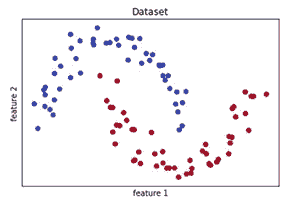
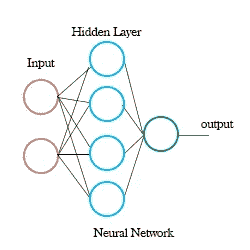
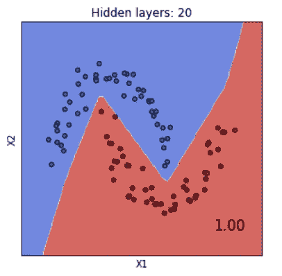
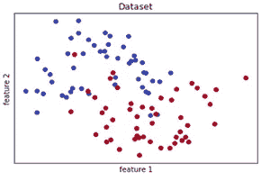
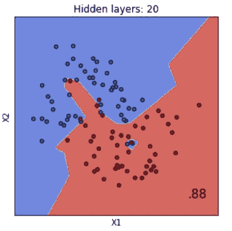
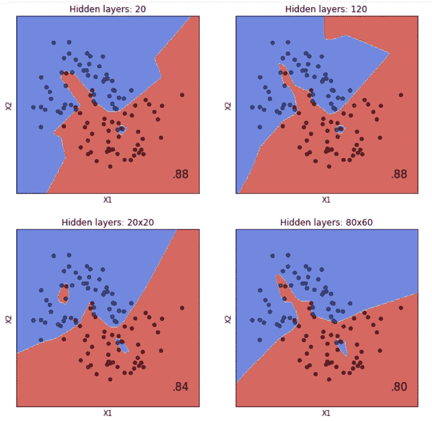

# [AI]那些有彩色圆点的彩色图表是什么？

> 原文：<https://medium.datadriveninvestor.com/ai-what-are-those-colourful-charts-with-colourful-dots-f7dc32a86fa9?source=collection_archive---------16----------------------->

那些彩色的图表…你是人工智能新手，但你已经见过它们了。色彩让你着迷。有些是螺旋形，有些是圆形。有些有两种颜色，有些有三种，有些更多。

看起来令人印象深刻，但它没有任何意义。

> 别着急，这里的关键词是:“**决策边界**”

## 决策边界简而言之

> 这就像绘制饥饿和情绪的临界点，你将决定是吃披萨还是沙拉。

在去之前，我们先掌握一些数据，绘制一些简单的图表。

# 首先是圆点

圆点代表一个样本。它可以是一种动物，一种植物，一种化学物质，或者任何你可以命名的东西。

在下图中，有:
n_samples = 100
红色和蓝色代表的 2 个分类。

Classification data split between Red and Blue classes

你可以把它想成:
2 种花，红花和蓝花
特征 1:花瓣(花)宽度
特征 2:花瓣(花)长度
这个数据集中有 100 朵花

从这个假设的数据集中，我们可以得出结论，花红色的花瓣宽度范围更宽，但通常比花蓝色的花瓣长度更短。

*这是一个分类问题

# 人工智能模型

接下来，我们使用机器学习模型来创建预测。

> 我们想要预测一个数据点是属于红色还是蓝色类别

我将使用一个神经网络的 2 个输入层(2 个特征)，1 个隐藏层 20 个神经元，和 1 个输出预测。

不熟悉 AI 模型？查看"[人工智能模型到底是什么？一辆 ELi5。](https://medium.com/datadriveninvestor/what-exactly-is-an-a-i-model-an-eli5-2b87e4d48114)“了解更多机器学习模型。

# 彩色图表

有了模型，我们可以得到这样的决策边界图。

Decision Boundary Chart

# 什么是决策界限？

本质上，“决策边界”是 ML 模型在给定的一组特征下预测数据点上的花是属于红色还是蓝色的界限。

对于红色区域中覆盖的任何数据点，该模型将给出该数据点处的花被分类为红色花的预测。蓝色也是如此。

图中的“1.00”是模型的精度分数。
数据一清二楚，实现模型 100%的准确率很简单。

但是，如果数据更加错综复杂呢？

## 新数据集

Data is more mixed than before

现在的新数据比以前的数据更加混杂。让我们看看模型的决策边界图是什么样的。

Decision Boundary for new data set

我们可以看到决策边界不再清晰。

为了解释侵入蓝色区域的外围数据，神经网络决定红色需要向外延伸。

同样，红色区域内的任何点都是模型预测的数据最有可能属于红色类。请注意，红色区域内的蓝色小区域也被计算在内。

这里的 0.88 标志着 88%的准确率。

# 模型之间的比较

通常，我们会看到许多图表，而不是只有一个。这些是不同模型之间的比较。

再来几张图表吧！

Comparing 4 Neural Network models

*你经常看到的比较图，通常是在决策树分类器、K-neighborhood 分类器等不同算法之间进行比较。

在这里，我们将查看和比较多层感知器神经网络模型的不同深度和隐藏层。

首先要注意的是，决策边界无处不在！我们来对比一下！

# 模型之间的比较

很明显，对于这组数据来说，*更深的*神经网络不如单个隐藏层好，并且两个*浅的*模型同样准确。

# 选择哪个型号？

最直接的答案是从准确度得分中挑选。

准确率为 88%的第一个和第二个模型是更好的选择。在这两者之间，决策界限是完全不同的。要判断哪个更好，我们只需要更多的数据！

# 决策边界简而言之

> 这就像绘制饥饿和情绪的临界点，在这个临界点上，你将决定是吃披萨还是沙拉。

# 还想吃吗？

看看
-[人工智能模型到底是什么？一辆 ELi5。](https://medium.com/datadriveninvestor/what-exactly-is-an-a-i-model-an-eli5-2b87e4d48114)
-[面向 AI 和区块链的 app:2019](https://medium.com/@dj_wong/apps-for-ai-to-blockchain-which-programming-language-should-i-learn-for-2019-749b440f0ff)我该学哪种编程语言？”