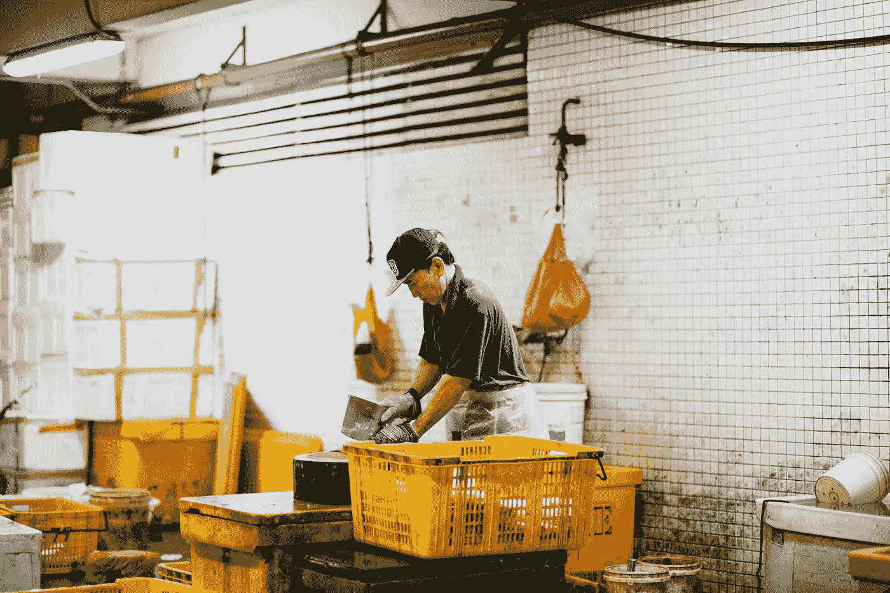

# 艾会接替你的工作，你应该感激

> 原文：<https://medium.datadriveninvestor.com/ai-will-take-over-your-job-you-should-be-grateful-140e6f91ec29?source=collection_archive---------3----------------------->

我们大多数人在成长的过程中都渴望改变世界，用我们的艺术触动人们的心灵，用我们的作品改变世界…

20 年后，我们可能会发现自己被困在那种你可以完全置身事外的机械工作中，尽管这份工作和其他工作一样受人尊敬，但它可能会阻碍你成长和取得成就的能力。

有些人一生都被困在这种工作中，做着他们讨厌的事情，这让他们无法实现自己的独特价值，或者实现他们一生应该做的事情，或者至少他们认为是这样，被资本主义坚定不移的现实所征服。

你一定也知道，有些人希望靠他们的艺术生活，却发现自己要么陷入低薪的临时工作，要么完全改变职业和道路，以便赚到足够的钱，在接下来的十年里，他们不必与其他四个人分享一个家。

有时候，我们有必要想一想，在这些必须有人去做的平凡工作中，我们可能会失去多少天才的想法。

有多少非凡的人陷入了一个忘恩负义的制度的激烈竞争中，这个制度因匮乏而繁荣，既不能给他们提供可维持的收入，也不能帮助他们发展自己以达到目标？

人工智能将接管你的工作，但是那些你无论如何都不会感到兴奋的工作。自动化将从我们手中夺走所有这些不用动脑的机械任务。换句话说，配合基本普遍收入的标准化，人工智能将允许我们重新发现自己的潜力，让我们有可能做一些对我们有意义的事情，而不用担心它不会在月底提供足够的收入来实现收支平衡。

联系、善良、创造力、艺术、创造力，这些东西都不能被一系列算法完全取代。不太多年前被嘲笑的软技能可能会成为人类在即将到来的技术和工业革命中扮演的最必要和最有价值的角色。

这将让我们真正想知道我们擅长什么，什么让我们兴奋，以及我们独特的经历、激情和知识如何才能带来最大的价值。

我们如何用自己的方式让这个世界变得更美好。

事实上，人工智能可能会阻止我们成为我们害怕在未来遇到的没有灵魂的机器人。