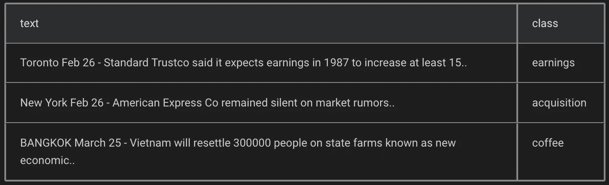

# 几乎没有代码的 AI

> 原文：<https://medium.datadriveninvestor.com/ai-with-almost-no-code-bc0e6f7f96f6?source=collection_archive---------6----------------------->

## 自动化机器学习

# 有没有可能不用编码就可以使用 AI？

> 答案是肯定的！

# 一个数据集是否足以建立一个机器模型？

> 是的，就是这样..！

> 建立机器学习模型只需要一个数据集。

现在我们有很多无代码工具 Azure ML Studio，DataRobot，深度认知。这里我们使用了一个名为 Ludwig 的 python 库，优步已经在内部使用了两年

[](https://www.datadriveninvestor.com/2019/02/13/ai-creativity-biggan-as-a-creative-engine/) [## 人工智能与创意:作为创意引擎的 BigGAN |数据驱动的投资者

### 的确，2018 年可以被视为人工智能创造的创造力全盛时期的开始。当然可以…

www.datadriveninvestor.com](https://www.datadriveninvestor.com/2019/02/13/ai-creativity-biggan-as-a-creative-engine/) 

最近优步的人工智能实验室开源了他们的 python 库， [Ludwig](https://github.com/manisaiprasad/ludwig)

> Ludwig 是一个建立在 TensorFlow 之上的工具箱，允许在不需要编写代码的情况下训练和测试深度学习模型。
> 
> 它是按照可扩展性原则构建的，并且基于数据类型抽象，因此很容易添加对新数据类型和新模型架构的支持。

一套可视化工具允许您分析模型的训练和测试性能，并对它们进行比较。

# 设置(安装)

您将需要 python 3 进行安装。如果你没有

```
install it by running:
sudo apt install python3  # on ubuntu
brew install python3      # on mac
```

为了安装 Ludwig，您只需运行以下命令:

```
pip install ludwig
python -m spacy download en
```

# 火车

训练模型非常简单:提供一个数据集和一个模型定义。

> 模型定义包含输入要素和输出要素的列表，您只需指定 CSV 中作为模型输入的列的名称及其数据类型，以及 CSV 中作为输出的列的名称，即模型将学习预测的目标变量。路德维希会据此组成一个深度学习模型，为你训练。

在 CSV 文件中准备数据，在模型定义 YAML 文件中定义输入和输出特征，然后运行:

```
ludwig train
--data_csv file.csv
--model_definition definition.yaml
```

这将对数据执行随机分割，对数据进行预处理，构建一个通过 softmax 分类器对输出类进行解码的模型，在训练集上训练模型，直到验证集的准确性停止提高。控制台会显示训练进度，但 TensorBoard 也可以使用。

# 预测

准备 CSV 文件中的数据，并使用预先训练的模型来预测输出目标:

```
ludwig predict
--data_csv data.csv
--model path_to_model
```

如果数据集包含要比较的基本事实信息，运行此命令将返回模型预测和一些测试性能统计数据。

这些可以通过`visualize`工具可视化，该工具也可以用来比较不同模型的性能和预测

# 设想

Ludwig 提供了许多可视化选项。如果您想查看模型的学习曲线，请运行:

```
ludwig visualize
--visualization learning_curves
--training_statistics train_statistics.json
```


`Visualization of learning curves`

> 使用**可视化**比较不同模型的性能和预测

# 直接从 Python 训练和预测

如果你想在你的 python 代码中使用它，你可以这样做。这还提供了一个简单的编程 API，允许您训练或加载模型，并使用它来获得对新数据的预测:

```
from ludwig import Ludwig Model

# train a model
model_definition = {...}
model = LudwigModel(model_definition)
train_stats = model.train(training_dataframe)

# or load a model
model = LudwigModel.load(model_path)

# obtain predictions
predictions = model.predict(test_dataframe)

model.close()
```

# 使用 Ludwig 构建一个简单的文本分类模型



data.csv

用`model_definition.yaml`:

```
input_features:
    -
        name: text
        type: text
        encoder: parallel_cnn
        level: wordoutput_features:
    -
        name: class
        type: category
```

**实验**:运行一个完整的实验来训练一个模型并测试它

```
ludwig experiment \
  --data_csv data.csv \
  --model_definition_file model_definition.yaml
```

# 资源

本文代码:[https://github.com/manisaiprasad/ludwig](https://github.com/manisaiprasad/ludwig)

请看一些例子[这里](https://uber.github.io/ludwig/examples/)