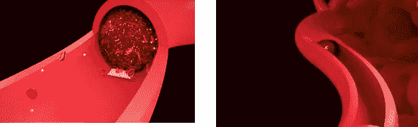

# 癌症上的人工智能

> 原文：<https://medium.datadriveninvestor.com/aioncancer-2f4fc7958297?source=collection_archive---------24----------------------->

在人工智能存在的世界里，医疗保健的未来会是什么样子？医生、科学家和研究人员都在不知疲倦地回答这个问题。自从 1956 年计算机科学家约翰·麦卡锡创造了“人工智能”这个词以来，它的作用一直在不断变化。从它在计算机技术早期阶段卑微的开端到今天看似不可能的能力，人工智能一直在进化，并且肯定会随着时间的推移而继续进化。

当今社会人工智能最重要的方面之一是在医疗保健领域。人工智能在该领域的可能性是无限的，从比医生更准确地诊断心脏病到知道何时进行手术，但我们今天将关注的是癌症。

癌症是一种疾病的术语，在这种疾病中，异常细胞不受控制地分裂，并可以侵入附近的组织。癌细胞也可以通过血液和淋巴系统扩散到身体的其他部位。癌症主要有几种类型，如*癌*、*肉瘤*、*淋巴瘤*、*白血病*和*恶性肿瘤*。

癌症的治疗方法已经研究了多年，从使用传统草药到众所周知的疗法*化疗*，但所有这些方法都仍然无效或对患者的健康造成很大影响，作为这些方法的替代解决方案，计算机科学家已经开始研究如何实现人工智能来解决癌症疾病。

然而，与大多数癌症相关的糟糕预后给医疗保健人工智能研究背后的大脑带来了紧迫感。但幸运的是，研究人员发现，通过标准的诊断方法，人工智能能够更早地检测出癌症和其他疾病，这可能会挽救未来患者的生命。这已经通过专注于几种不同类型癌症的研究得到了证明，包括皮肤癌和间皮瘤，这两种癌症都是使用人工智能检测的，准确率超过 95%。

今年早些时候，一项研究表明，计算机检测黑色素瘤的准确率比皮肤科医生高近 10%。一台深度学习计算机能够基于超过 10 万张图像以 95%的准确率成功诊断癌症。相比之下，58 名看了相同图像的皮肤科医生检测出癌症的平均准确率为 86.6%。此外，*Dicle**Medical**Journal*在 2015 年完成的一项研究证明，这可能与间皮瘤有关，间皮瘤是一种心脏、腹部或最常见的肺部癌症。使用人工免疫系统(AIS)技术，研究表明恶性胸膜间皮瘤可以以 97.74%的准确率被检测到。

由于人工智能收集和处理数据的能力，癌症护理也在进步。由于处理这些信息的性质，对于医生来说，该任务通常是耗时且乏味的工作。虽然它尚未完善，但通过使用人工智能，这一过程可能会变得更容易、更快、更有效。生物制药公司 Berg 的总裁兼联合创始人尼文·r·纳拉因(Michael r . Narain)表示，这项新兴技术正在不断发展，能够对大量数据进行分类，而人工“不可能”做到这一点。

每个人都是独一无二的，这就引出了一个问题:为什么许多癌症患者得到的治疗和下一个人一样？英特尔的一个团队正在努力解决这个问题。与其让患者接受化疗，化疗会对癌症患者的健康和免疫系统产生重大影响，*协作癌症云*旨在制定专门的治疗计划。通过基于特定基因组为每个人量身定制的治疗，癌症护理的未来可能意味着患者的痛苦体验将大大减轻。

纳米机器人消除癌症

正在开发各种纳米机器人来帮助治愈肿瘤或癌细胞，其中一种纳米机器人可以切断癌细胞的血液供应，使其体积缩小并最终缩小。凝血药物通常用于治疗轻微出血，而不是癌症治疗，由折纸折叠的 DNA 片制成的纳米机器人携带，用于切断全身肿瘤的血液供应。

由于缺乏血液供应，肿瘤开始缩小，癌症在新部位扩散和生长的能力似乎也降低了，使预期寿命延长了一倍，或者在一些小鼠癌症中完全消除了肿瘤。

Illustration of nanobots built from rectangular DNA origami fragments that consists of *thrombin* cutting off blood supply by converting fibrinogen into fibrin which bind the blood cells, which blocked the blood path into the tumour cells.

这一演示标志着纳米机器人药物输送在医学上的实施迈出了重要一步，可能为输送毒副作用减少的化疗药物以及其他许多用途铺平道路。

“我们开发了第一个完全自主的 DNA 机器人系统，用于非常精确的药物设计和靶向癌症治疗，”亚利桑那州立大学生物设计研究所分子设计和仿生学中心主任严昊教授说。

“此外，这项技术是一种可以用于许多类型癌症的策略，因为所有实体肿瘤的供血血管本质上是相同的，”他补充说。

这些纳米机器不是科幻小说中的微型金属工艺，而是使用 DNA 片段作为构建模块，精确折叠以适应其用途。

在这种情况下，DNA 片段排列成薄片，可以拉上拉链包住药物载荷，防止其与健康细胞相互作用，并阻止短期药物被分解。

他们还需要一个释放触发器，这是一种只会对癌细胞外部的化学信号做出反应的分子，它可以解开纳米机器人的拉链，暴露治疗方法。

在今天发表在《自然》*杂志上的这项研究中，DNA 片被折叠成管状，以包住凝血药物,*凝血酶*,这种药物用于治疗手术后的出血，但会很快分解到目标肿瘤。*

*包括来自中国、澳大利亚和美国的研究人员在内的国际团队，让他们的纳米机器人在蛋白质分子*出现时释放核仁素*，这种蛋白质分子覆盖着滋养肿瘤的血管内壁。*

*在治疗的 24 小时内，科学家们看到为原发肿瘤部位供血的血管被切断，在接下来的 72 小时内，所有肿瘤血管中都形成了固体凝块——导致肿瘤开始死亡。*

*这种治疗方法在治疗患有黑色素瘤癌症的小鼠时最为有效，黑色素瘤癌症有非常强的血液供应，接受治疗的八只小鼠中有三只显示出肿瘤的完全消退。*

*然而，仍然存在挑战，这就是当它们在人体内时追踪纳米机器人，如果它已经在人体上实施，当然，因为它们太小，无法在 X 射线和其他传统成像技术上显示出来。跟踪是必不可少的，这不仅是为了确保纳米机器人执行它们预定的程序，也是为了确保这些设备以及它们破坏的任何组织都被安全地移除。*

*“这是我们领域需要克服的严峻挑战。没有明确的答案，”迪勒先生说。他补充说，让纳米机器人可生物降解是一个可能的解决方案。*

*英国皇家外科学院顾问神经外科医生和理事会成员理查德·克尔(Richard Kerr)担任外科未来委员会主席，他认为这些技术问题将得到解决，因为专业知识和研究资金大量涌入该领域。*

*但对我来说，这种方法仍然值得怀疑，因为每种癌症在终止癌细胞方面都有不同的治疗方式，例如，如果我们对脑癌患者使用这种方法，如果我们切断大脑中癌细胞的血液供应，那么周围的脑细胞也会受到影响，这可能导致患者中风(*脑血管* *事故*，CVA)*

*我为这些纳米机器人提供的解决方案不是切断血液供应，而是发送含有某种蛋白质的纳米机器人，这种蛋白质具有吞噬癌细胞的能力，在这两种物质合二为一后，纳米机器人将接近合并的细胞并将其包含在内，然后通过患者的脓液或处理系统排出，但这仍需要彻底研究。*

*结论是，为了彻底消除癌症，开发人工智能技术的研究人员和在实践中使用人工智能技术的医生都需要做更多的工作。从改变生活的突破，如早期诊断癌症的能力，到简单地缩短处理数据和成像的时间，人工智能正在彻底改变医疗保健的世界。*

*人工智能的未来以及它将在医疗保健领域发挥的作用尚不可知，但研究人员正在不懈努力，为患者提供尽可能好的结果。也许有一天，世界上有一种治疗癌症的方法，人工智能可能是让我们实现这一目标的科学。*

*资源*

*亚历克斯·马修斯-金健康记者。(2018 年 2 月 12 日)。搜寻癌症的“纳米机器人”能够通过切断血液供应来缩小肿瘤。检索于 2018 年 12 月 13 日，来自[https://www . independent . co . uk/news/health/cancer-hunt-nano robots-tumors-shrink-cut-blood-supply-robots-treatment-a 8206801 . html](https://www.independent.co.uk/news/health/cancer-hunt-nanorobots-tumours-shrink-cut-off-blood-supply-robots-treatment-a8206801.html)*

*Er，o .，Tanrikulu，a .，& Abakay，A. (2015)。利用人工智能技术诊断恶性胸膜间皮瘤。医学杂志，42(1)。doi:10.5798/diclemedj*

*NCI 癌症术语词典。(未注明)。检索于 2018 年 12 月 13 日，来自[https://www . cancer . gov/publications/dictionary/cancer-terms/def/cancer](https://www.cancer.gov/publications/dictionaries/cancer-terms/def/cancer)*