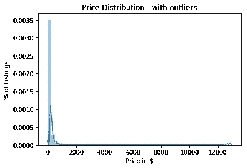
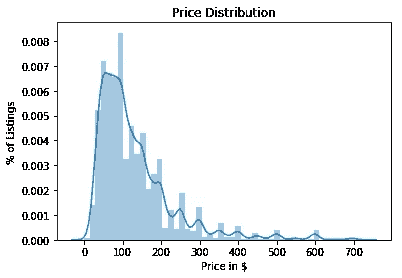
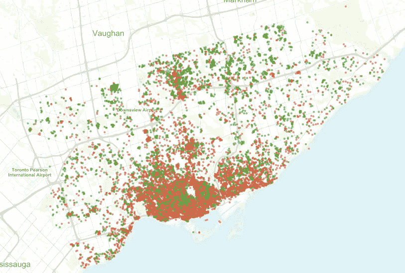
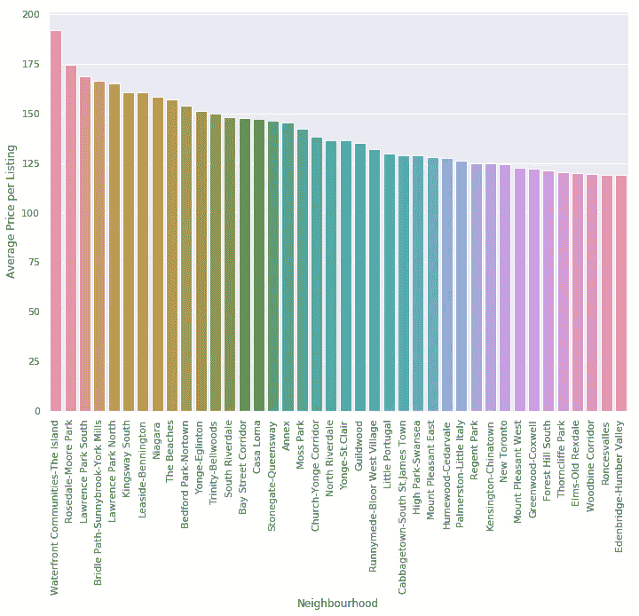
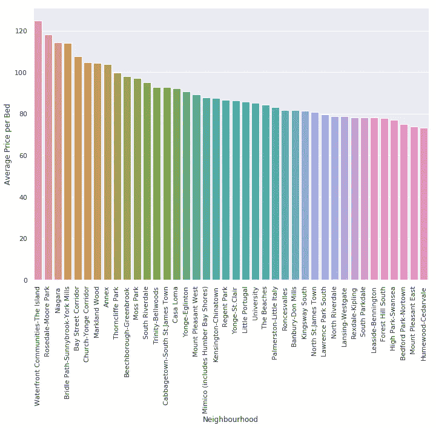
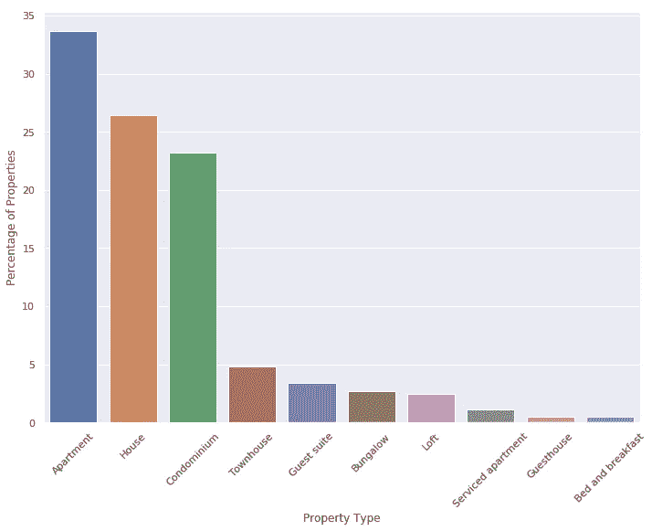
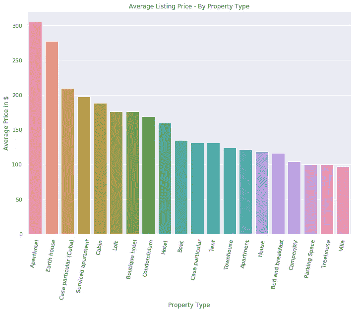
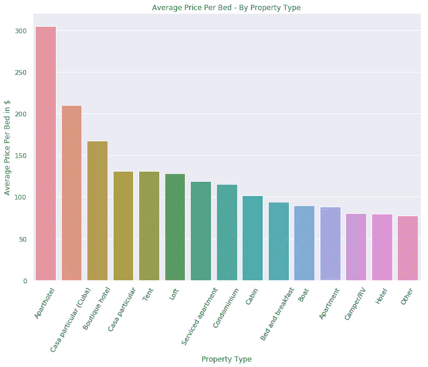
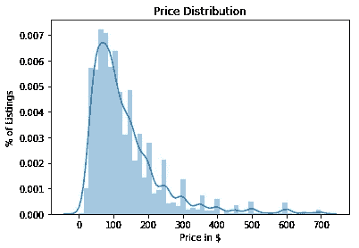

# AirBnB 房源数据-多伦多，2018 年 10 月

> 原文：<https://medium.datadriveninvestor.com/airbnb-listings-analysis-in-toronto-october-2018-2a5358bae007?source=collection_archive---------3----------------------->

From [http://www.abettermortgagebroker.com/renting-my-toronto-condo-on-airbnb-was-it-profitable/](http://www.abettermortgagebroker.com/renting-my-toronto-condo-on-airbnb-was-it-profitable/)

在这篇博文中，我们将通过 AirBnB 房源的镜头来了解多伦多的街区。在此过程中，我们将回答一些关于这些社区的探索性问题，例如:

*   哪些小区的床位价格最贵？
*   *哪些街区的房源数量最多？*
*   *多伦多 AirBnB 上列出最多的房产类型是哪些？*
*   *按物业类型分类的平均挂牌价格是多少？*
*   *按酒店类型划分，每张床的平均价格是多少？*
*   *按小区划分入住率是什么样子的？*

在此基础上，我们将尝试回答一些具体问题，例如:

*   *哪些因素对价格影响最大？*
*   *根据其他信息，能否准确预测价格？*

创建这个项目的原因是潜在地构建一个应用程序，帮助 Airbnb 主机以一种简单和数据驱动的方式为他们的房源定价。

想象一下，作为 Airbnb 的新主人，有一个工具可以根据你所在的社区和房产信息为你进行所需的分析，这将让你快速启动并运行。

另一个原因是对 AirBnB 等应用程序对城市租金价格的影响感到好奇，但这不在本项目范围内。

> **编辑**:这篇博文的代码已经被删除，以方便阅读。如果你想浏览代码，你可以查看下面链接的所有资源的 [Github repo](https://github.com/FaisalAl-Tameemi/dsnd-airbnb-listings) 。或者查看本文附带的 iPython 笔记本。

# 视觉探索

在数据科学中，探索数据集的一种快速方法是尝试并可视化关于主要数据点(即，要素)的一些趋势。

这篇文章的数据可以在[**insideairbnb**](http://insideairbnb.com)**网页上找到。**

## ****价格分布图(有异常值)****

****

**快速浏览一下，大多数价格都低于 700 美元；然而，我们确实有一些异常值，比如价格高达 12000 美元的列表(*但是怎么会呢？？谁为此买单？？！*)。**

**在下一张图中，我们将移除这些异常值，并再次绘制价格分布。**

## ****价格分布图(无异常值)****

****

**我们可以通过计算所有价格值的[标准差](https://en.wikipedia.org/wiki/Standard_deviation)来处理异常值。标准做法是将高于标准偏差三倍的值视为异常值。**

## ****多伦多 AirBnB 房源群地图****

**我们还可以直观地查看地图上的列表集群。很明显，最多的帖子是在多伦多市中心的核心区域。**

**在下图中，不同的颜色代表不同的酒店类型。最常见的属性类型有:**

1.  **整个公寓/家[橙色]**
2.  **私人房间[绿色]**
3.  **共享房间[蓝色—相对来说很少]**

****

**from [http://insideairbnb.com](http://insideairbnb.com/toronto/?neighbourhood=&filterEntireHomes=false&filterHighlyAvailable=false&filterRecentReviews=false&filterMultiListings=false)**

# **探索性问题**

**我们将从问一些一般性问题开始，以从我们的数据集中提取一些见解。**

## ****哪 5 个街区的平均挂牌价最贵？****

**如果我们按邻域进行*分组，然后对*价格*列进行*求和*，就可以得到平均挂牌价格。***

**我们将排名前 40 的社区的结果可视化如下:**

****

## ****哪 5 个社区的床位价格最高？****

**我们还可以通过将价格除以床位数来估算“每床价格”值。**

**请注意，一些单位，如单身公寓或单间公寓有“0 床”列表。在这些情况下，我们可以假设 0 张床意味着 1 张床，因为上面的划分不适用。或者，您可以使用默认值，如 0.1，而不是 1。**

> **按每张床的平均价格排序的结果**

**我们将排名前 40 的社区的结果可视化如下:**

****

## **多伦多 AirBnB 上列出最多的房产类型有哪些？**

**下图显示了 AirBnB 上多伦多各种房源类型的比例。我们将房产类型限定为前 10 种，因为其他类型太少了(不到 0.5%的房源)。**

****

## **按物业类型分类的平均挂牌价格是多少？**

****

## **按物业类型划分，每张床的平均价格是多少？**

****

## ****哪 10 个街区的房源数量最多？****

## ****我们如何估算房源的入住率？****

**数据集中没有提供占用率，但可以通过启发式方法进行估计，我们将在下面进行定义。**

**让我们考虑数据集中可用的一些相关点:**

*   ****每月评论**:洞察列表的访问频率**
*   ****最短住宿时间**:最短住宿时间的指标，与每月点评次数一起使用**
*   ****可用性 365** :一年中列表项可用的总天数的指示符(即，如果所有可用的天数都被租出，则列表项的占用率为 100%)**

**估计占用率的一个可能很简单的公式如下:**

> ****占用率** =((每月评论*分钟。夜晚)* 12) /可用性 _365**

**请注意，上述公式的预期目标是给我们一个介于 0 和 1 之间的值。但是，在实践中，这对于某些列表不起作用。**

# **更大的问题&数据建模**

## ****哪些因素对价格的影响最大？****

**为了深入了解对价格有重大影响的因素，我们可以建立一个线性回归模型，然后检查该模型的系数。**

**下面是用于拆分数据的函数，将其拆分为 2 组(训练和测试)，然后用我们的训练数据拟合模型。**

**使用的评分方法是 [*r2_score*](http://scikit-learn.org/stable/modules/generated/sklearn.metrics.r2_score.html#sklearn.metrics.r2_score) *(又名* [*决定系数*](https://en.wikipedia.org/wiki/Coefficient_of_determination) *)，这让我们可以很好地了解我们的预测与事实有多接近。***

**以下是我们的线性模型中的 5 大影响因素。**

**一个明显的因素是一个列表所在的邻居。另一个因素，表明较低的价格，是有一个共同的房间。**

**我们可以检查测试集标签的分布以及我们的预测，以可视化我们的模型如何拟合数据。**

********

**这是我们的**测试集**中真实价格的分布图。我们可以看到拟合的线并不完全平滑。**

**第二张图是**预测价格**(线性回归)的分布图。**

**我们可以看到，我们的模型高估了 100 到 200 美元范围内的资产数量。该模型还在估计价格更高的列表的数量。**

**当使用线性回归模型时，我们的 R2 分数约为`0.48`，当使用`[XGBoost](https://xgboost.readthedocs.io/en/latest/)` [模型](https://xgboost.readthedocs.io/en/latest/)时，我们的分数约为`0.53`。**

**这个 R2 分数可以有不同的解释，也就是说，1 分实际上表明我们过度拟合了模型。这里有一篇关于 [R2 分数警告](https://onlinecourses.science.psu.edu/stat501/node/258/)的精彩文章。**

## **结束语**

**我们可以得出结论，XGBoost 模型过度拟合了以前很好地观察到但没有像预期的那样概括的训练数据。这可能是由于超参数的选择。**

**下一步是尝试各种机器学习管道，这些管道可以帮助我们潜在地减少我们正在处理的特征的数量，或者捕捉数据中的非线性关系。建模过程完成后，将在本文中发布更新。**

**这里有一个 [Github repo](https://github.com/FaisalAl-Tameemi/dsnd-airbnb-listings) ,包含了上面讨论的所有代码，以及本文遗漏的一些片段。**