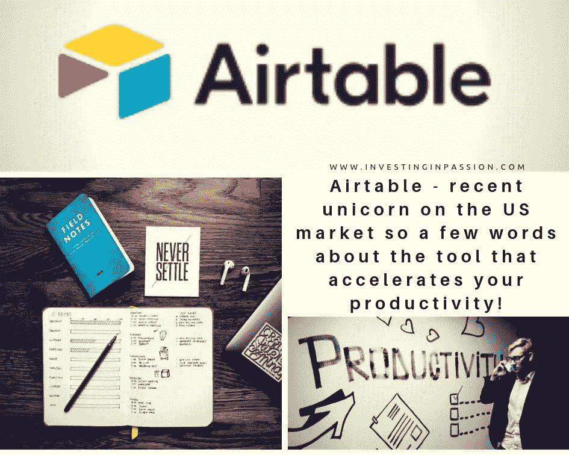
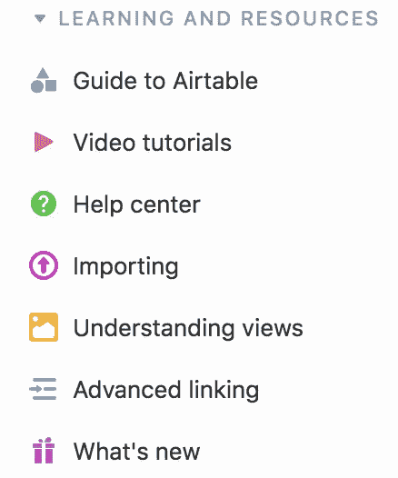

# airtable——美国市场上最近出现的独角兽，因此，请简单介绍一下这款能够提高您工作效率的工具！

> 原文：<https://medium.datadriveninvestor.com/airtable-recent-unicorn-on-the-us-market-so-a-few-words-about-the-tool-that-accelerates-your-538b3a3b9fc9?source=collection_archive---------12----------------------->

[**Airtable**](http://www.airtable.com) 是一款商业软件，云协作服务，成立于 2012 年，由 Thread Capital、Freestyle Capital、Founder Collective、Caffeinated Capital 和 Evolution Corporate Advisors 等公司提供支持。最新的融资使 Airtable 的估值从今年早些时候的 1.52 亿美元上升到了 11 亿美元的独角兽地位。

[**Airtable**](http://bit.ly/2VwZpHW) 工作起来像一个电子表格，但给你一个数据库的能力来组织任何事情，与你的朋友、同事分享工作，设定目标并跟踪你的项目进展。它有一个很好的电子表格式的布局，所以它看起来对我们每个人来说都很熟悉，使用起来简单直观。它允许实时协作，你不仅可以向它输入文本，还可以输入附件、图像和其他你想在一个单元格中包含的内容。您可以使用预先准备好的模板(用于个人 CRM、项目跟踪和员工目录)，或者按照您喜欢的方式从头开始创建电子表格。

对于新手，它提供了[详尽的手册](https://airtable.com/product)，展示产品的特性和功能。该工具有手机版和网络版，非常灵活。您可以使用的功能是无穷无尽的，Airtable 团队不时会发布新的示例，介绍如何有效地使用该产品。请确保您定期查看他们的博客，并实现新的功能来自动化您的工作，并充分受益于该工具。

最棒的是，通过将 [**Airtable**](http://bit.ly/2VwZpHW) 连接到应用自动化工具 Zapier，一旦发生特定事件，你可以通过设置规则在 Airtable 和你的其他应用之间传递数据来自动填充你的数字文件柜。你也可以将 Airtable 连接到 Asana、Evernote、Slack、MailChimp 等等。

[**Airtable**](http://bit.ly/2VwZpHW) 团队不断审核用户反馈，更新产品并引入新功能。我觉得它总是比我可能需要的东西领先一步，在我想到它之前，它已经被添加到可用的功能中了。

就我个人而言，**现在是我最大的图书馆，收集了我的想法、博客、网站、结论和灵感。**

****

**我在一段时间前发现了这个应用程序，从那以后，它一直在解决我整理我感兴趣的笔记、文章和网站的永恒需求，为我的下一篇文章、我想联系的人做清单、灵感和想法，它大大减少了我桌子上、笔记本电脑上、日历上、夹克口袋里的便利贴数量(如果你知道我的意思；))**

**即使是免费版本也已经满足了普通用户的需求。出于商业原因，付费的扩展版本可能是更好的选择，但毫无疑问， [**Airtable**](http://bit.ly/2VwZpHW) 被称为 2018 年的独角兽并非偶然。这是一个非常简单的想法，但是以前没有人想出这样的解决方案。这对我们这些创始人和投资者来说是一个明确的信息，退一步来看我们的日常生活，回答人们的基本需求。
有时这与**创新**和最非凡、最复杂的解决方案无关。**这一切都是为了让我们的日常生活更加轻松**，更加井井有条，让我们觉得我们从产品中受益，最大限度地提高效率，节省宝贵的时间。**