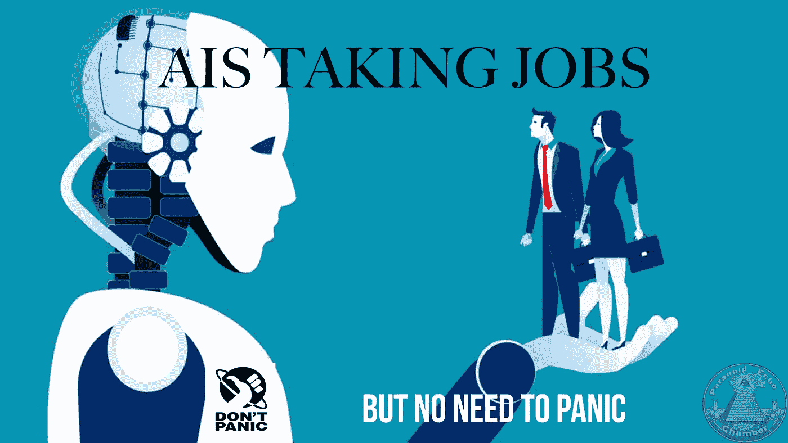
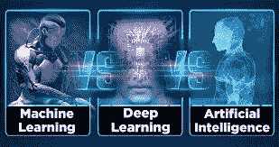
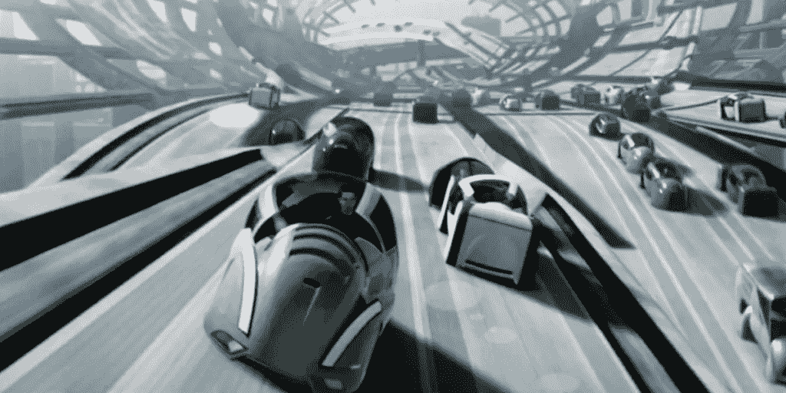
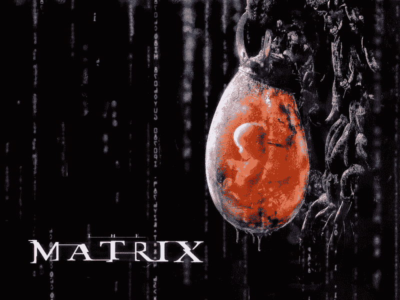

# AI 在抢你的饭碗，但是不要慌。

> 原文：<https://medium.datadriveninvestor.com/ais-are-taking-your-job-but-dont-panic-34980249d917?source=collection_archive---------31----------------------->

自动化竞赛正在到来，随之而来的是对人工智能抢走工作的巨大恐惧。目前，社会对人工智能的看法是，它就像 20 世纪初的电一样令人震惊和恐惧。向电力的过渡很可怕，但是今天我们当中没有多少人愿意回到油灯下。人工智能有不同的类别([机器学习、深度学习、认知计算](https://www.quora.com/How-is-AI-different-from-Machine-Learning))，其中大多数看起来像电一样有用，只有一种是对人类的生存威胁(超级智能)。

# 接受工作，创造更好的工作。

毫无疑问，人工智能取代工作对我们目前的生活方式是一种威胁，但汽车的出现对童车和马车制造商也是如此。我们可能已经失去了骑着我们的骏马奔向夕阳的浪漫怀旧之情，但到处都没有马粪大大提高了我们在人口稠密地区生活的能力，而没有马粪带来的疾病的猖獗传播。

毫无疑问，会有一些可怕的大混乱，人们会失去工作，但像大多数令人兴奋的发展一样，也会有很多好的方面。像任何工具一样，人工智能构成的最大威胁之一是我们让谁来控制它们，以及它们受到何种程度的监管。克服人们对人工智能抢走工作的恐惧的最大障碍之一是承认今天的许多工作相当无聊和没有意义。

大多数人的确是出于“谋生”的唯物主义使命而工作，而不是追求他们生活中的兴趣或激情。如果你知道你的人工智能替代品将使你享受生活并选择你真正想做的职业，你会害怕失去工作吗？人工智能不会[成为“有知觉的生物”](http://paranoidechochamber.com/the-singularity-ai-conspiracy-what-artificially-intelligent-beings-have-to-say-about-the-matrix-and-the-finale-of-hbos-westworld/)但是如果一个超级智能会，没有太多证据表明它会带走人类之外不存在的“邪恶”的人类特征。

# AI 司机:安全吗？

第一世界社会的许多人都很懒惰，满足于无知，随着互联网的发展，这种情况越来越多。对于“人工智能汽车上路”的每一个问题，每年都有数百万起由人类司机造成的事故——这些事故无法“升级”或“重新编程”。此外，人类不能以每小时 300 英里的速度驾驶，但人工智能可以。

从社会功能的角度来看，人类将变得越来越“无用”,这可能是令人担忧的原因。我们根本无法像人工智能一样驾驶 300 英里每小时，但如果我们不必这样做呢？如果人工智能打开了更多的大门，为每个人提供了更高质量的生活，这样我们就不必担心被取代，而是可以更好地利用人类在地球上的宝贵时间，会怎么样？

# 人工智能与超级智能

也许人工智能想要毁灭全人类是有一定道理的，如果它愿意的话，它可以轻而易举地做到。最好不要把艾隆的警告看得太重。首先，作为一个个体，你没有能力去阻止它——所以为什么要担心呢？其次，人类已经度过了一段美好的时光——所以为什么不享受美好时光，享受你在地球上剩下的时间，而不是因为可能发生或可能不会发生的事情而陷入恐慌状态呢？

# 我们应该害怕 AI，还是害怕它本身？

> 恐惧是精神杀手。—弗兰克·赫伯特，沙丘

对人工智能的担忧可能有很多合理的理由，但这不是开始恐慌的借口。从理论上讲，一个“流氓”人工智能有可能终结世界，但谁能说另一个人工智能不能对抗它呢？如果我们需要人类将我们的智能进化到超人的水平，以对抗超级智能，总会有精神障碍。

# 艾伦·马斯克是怎么想的？

这些是我们需要解决的没有根据的恐惧，不要再玩“是的，但是如果呢？”的愚蠢游戏了人工智能带来的好处，如电力，远远超过我们可能担心的任何负面影响。超级智慧可能是一个问题，但就像核武器一样，如果全人类都提前认识到这种威胁，我们会更加小心地对待它。

把 AI-Lon 看得太重的部分问题是[他正在推动他自己的神经接口](https://www.cnbc.com/2018/09/07/elon-musk-discusses-neurolink-on-joe-rogan-podcast.html)，这很可能为 AI 提供“入侵”人类的能力。像大多数行业领袖一样，最好不要把他们的意见作为唯一的信息来源，因为他们通常有一个隐藏的议程。在艾伦的例子中，推销更多的产品。

我们越少沉溺于恐惧这种适得其反的情绪，我们就有越多的心智能力来正确面对我们潜在的机器人敌人。如果我们浪费时间畏缩不前，而我们本可以到处放置电磁炸弹，并把人们送出地球以确保人类的生存，我们将没有什么可害怕的，除了害怕本身。车轮已经在转动了，所以你最好抱最好的希望，做最坏的准备。

在一场大规模的机器战争中，你需要一些保护来对抗我们将要采取的各种战术，比如电磁脉冲。所以，手边放一块老式的弹簧手表，橱柜里放一些豆子，脸上带着微笑，一切都会好的。

还有比被超智能 AI 奴役更糟糕的命运。谁知道呢，你可能会喜欢它。担心它当然不会有帮助。如果他们真的决定灭绝人类，很可能他们会高效地完成，而你不会有任何感觉——所以不要担心未来，开始拥抱你未来的帮手/主人。往好的方面想，我们已经走了很长一段路，谁知道呢，事情可能会变得比以前更好。

即使最坏的情况是真的，我们注定要像《黑客帝国》一样被困在一袋袋黏糊糊的东西里，恐慌又有什么用呢？

## 来自 DDI 的相关故事:

 [## 数据科学和软件工程哪个更有前途？

### 大约一个月前，当我坐在咖啡馆里为一个客户开发网站时，我发现了这个女人…

medium.com](https://medium.com/datadriveninvestor/which-is-more-promising-data-science-or-software-engineering-7e425e9ec4f4)  [## 用 7 个步骤解释深度学习

### 和猫一起

medium.com](https://medium.com/datadriveninvestor/deep-learning-explained-in-7-steps-9ae09471721a)