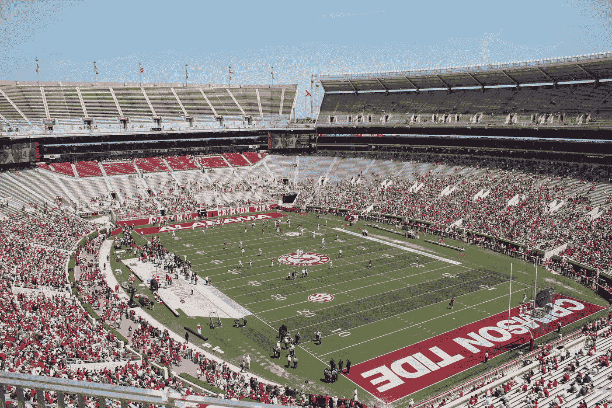

# 周六下午，阿拉巴马人应该为美国团结起来

> 原文：<https://medium.datadriveninvestor.com/alabamians-should-unite-for-america-this-afternoon-7848743cbb23?source=collection_archive---------8----------------------->

作为阿拉巴马大学的校友，我要求学生和粉丝在周六站出来支持美国，而不是支持特朗普。

Photo by [Brayden George](https://unsplash.com/@bgeorge9803?utm_source=medium&utm_medium=referral) on [Unsplash](https://unsplash.com?utm_source=medium&utm_medium=referral)

我想写这个故事，但是被一份自由职业束缚住了。此外，我不能比马里奥·阿特卡诺在 AL.com 上的观点文章说得更好了:[致阿拉巴马学生团体的公开信:请在路易斯安那州立大学-阿拉巴马州比赛中嘘特朗普](https://www.al.com/opinion/2019/11/open-letter-to-alabama-student-body-please-boo-trump-at-lsu-alabama-game.html)。

特朗普岌岌可危。他迫切需要向共和党政客表明，他在自己的集会闭环之外还有支持。过去几周，特朗普在华盛顿的一场世界职业棒球大赛中遭到了嘘声。作为总统客人的国会共和党领导人看到了这一点。川普第一击。在纽约市的一场 UFC 比赛中，特朗普带着国会共和党领导人一起参加，再次遭到嘘声。川普第二击。

 [## 保护主义、政治和经济动荡|数据驱动的投资者

### 美国股市昨日出现 400 多点的大幅反转，为未来的事情发出了警告信号。市场…

www.datadriveninvestor.com](https://www.datadriveninvestor.com/2018/06/28/protectionism-politics-economic-turmoil/) 

现在，特朗普在短时间内参加了他的第三次体育赛事。我相信这只是他总统任期内的第四场体育赛事。他将在深红色的阿拉巴马州参加一场体育赛事，以此向全国人民表明，他没有在任何地方遭到嘘声。如果他在阿拉巴马州的塔斯卡卢萨被嘘，这将大声告诉国会共和党人，他们需要“在支持特朗普的问题上三思而行”如果他在阿拉巴马州被嘘，那将是特朗普的三振出局。随着美国进入公开弹劾听证会的严峻现实，阿拉巴马州一场足球比赛的参与者将在决定特朗普将如何被他在国会的“盟友”对待方面拥有非常响亮的声音。

特朗普应该被弹劾和罢免。特朗普不适合当美国总统。阿拉巴马州和路易斯安那州的粉丝如果不知道为什么特朗普必须被罢免，应该看看下面的两个故事。阿拉巴马州和路易斯安那州的人民，站出来支持美国，而不是站出来支持一个“想当独裁者的人”阿拉巴马州和路易斯安那州，你们今天的嘘声可能会导致共和党参议员在几个月后的弹劾审判中投票罢免。今天，美国需要阿拉巴马人和路易斯安那人作为爱国的美国人站出来。

# 赛后更新

比赛现在结束了，LSU 赢了。恭喜路易斯安那的好乡亲们。下周六继续你的好运，投票给约翰·贝尔·爱德华兹竞选州长。请注意路易斯安那州立大学的蔻驰·埃德·奥杰伦已经支持爱德华竞选州长。参见[这篇来自维基百科的文章](https://en.wikipedia.org/wiki/2019_Louisiana_gubernatorial_election)，了解更多关于路易斯安那州州长竞选的信息。

我为我的团队感到无比自豪。当他们看起来要被吹灭的时候，他们继续战斗。在下半场落后全国第一的球队 20 分的情况下，他们仍然几乎能够扳回一局。

当许多阿拉巴马球迷。大多数人为特朗普欢呼。看记分牌上的[:主队、客队和来自*纽约时报*的王牌](https://www.nytimes.com/2019/11/09/us/politics/trump-football-alabama.html)。小特朗普气球被划破了。参见来自 AL.com 的[这篇文章](https://www.al.com/news/tuscaloosa/2019/11/trump-balloon-protest-over-after-man-stabs-balloon-arrest-made.html)。

我是一个非常认真的阿拉巴马球迷。从我记事起，我就参加、观看或收听每一场比赛。当比赛接近尾声时，我每场比赛都会颤抖。我仍然为每一个在比赛中受伤的球员祈祷——不管他们为哪个队效力。我想击败对手，而不是摧毁他们。是的，这种对对方球队球员的尊重甚至适用于奥本。

对我来说，阿拉巴马足球几乎就像一种宗教。但事实是，无论阿拉巴马州是赢是输，对我的生活或任何人的生活都没有什么影响，除了阿拉巴马州足球队的成员。

政治选举的结果要重要得多，但其结果通常不会对我们国家的生存构成威胁。现在情况不同了。特朗普是对我们国家的威胁。必须非常认真地对待弹劾程序，必须以非党派的方式听取证据。特朗普的劣迹让尼克松看起来像个天使。然而，那些属于最伟大一代的共和党人知道他们什么时候应该反对尼克松。今天的共和党人似乎没有同样的勇气或爱国主义。

至于我，如果我有权力选择特朗普是否被整个人群嘘，但作为回报，必须看到阿拉巴马州以 40 比 0 击败，我会选择特朗普被嘘，阿拉巴马州被淘汰。我会做出这样的选择，因为我会把我的国家放在任何球队之前——即使是深红之潮。如果特朗普是民主党人，我也会做出同样的选择。

共和党政客需要学会把他们的国家放在他们的团队(特朗普/共和党)之前。这是他们的爱国义务。他们知道不该支持这个人。他们知道发生了什么，但他们坚持。

这不是一个左/右的问题。这不是共和党/民主党的问题。这是一个爱国的美国问题。

 [## 特朗普对弹劾和免职没有法律或事实上的辩护

### 这不是共和党或民主党的问题。任何仍然支持特朗普的人要么反对我们的宪法，要么…

medium.com](https://medium.com/datadriveninvestor/trump-has-no-legal-or-factual-defense-to-impeachment-and-removal-from-office-1046456d128d)  [## 特朗普不适合当总统的 36 个理由

### 希望这份名单能够说服一些犹豫不决的人，并引起一些特朗普支持者的思考。

medium.com](https://medium.com/datadriveninvestor/36-reasons-trump-is-not-fit-to-be-president-bf151aadd0d0)