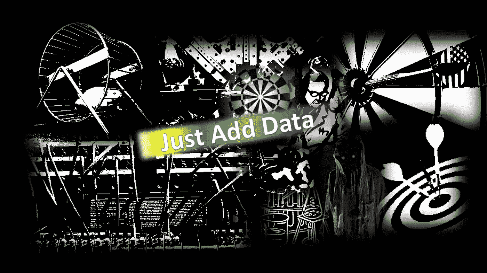

# 人工智能的炼金术和接近国王

> 原文：<https://medium.datadriveninvestor.com/alchemy-of-artificial-intelligence-mysteries-of-backboxes-and-proximity-to-kings-a9644a7c3a16?source=collection_archive---------1----------------------->

Image by author [Yogesh Malik](https://medium.com/u/df96de34e75c?source=post_page-----a9644a7c3a16--------------------------------)

对我的读者来说，我似乎是在写一篇关于古希腊神话的文章，但是你很快就会意识到，这个世界越是变化，它就越是一成不变。最近，谷歌人工智能研究员阿里·拉希米[将机器学习与炼金术](https://www.livescience.com/62495-rahimi-machine-learning-ai-alchemy.html)进行了比较。后来，一些技术记者，比以往任何时候都多，开始写技术和炼金术之间的关系。

炼金术就是使用“试错”的方法，得出一个公式(大多是秘密的或者无法解构的东西)。类似地，在机器学习中，模型是从数据中设计出来的，这个模型不断地学习并产生输出，但没有人知道决策是如何做出的。

# 论炼金术与人性

> 你可以称之为神秘或神话，炼金术在科学领域发现人与宇宙的关系方面发挥了非常重要的作用。炼金术旨在将“**贱金属**”(例如铅)转化为“**贵金属**”(尤其是黄金)。

我们如何知道什么最符合人类的利益？
1️⃣的科学是一个过程；
以“试错法”为基础的 2️⃣炼金术；
3️⃣专家建议，没有比扔飞镖更好的猴子了。

但是，如果猴子能比专家做得更好，那么“试错法”可能比基于“可再现的事实”而不是“未经证实的信念”的科学更有效。

考虑到所有这些，我们似乎很快就会生活在一个由黑盒统治的社会里，在这个社会里，多种秘密算法将控制我们的商业、文化和国家，直到我们有一个主宰世界的主算法

## 人工智能炼金术的奥秘

欧洲的领导人和国王总是在寻找黄金制造的秘密。在那个时代，炼金术士敞开心扉是危险的，因为他们意识到他们的秘密科学(实际上是欺诈)可能会让他们处于某种危险之中。

黄金制造商总是担心，一旦这种珍贵的物质(黄金)大量供应，他们就会破产。

## 马太效应和人工智能贩子

> 因为对所有拥有的人来说，更多的人将会得到《马太福音》(马太福音 25:29)

属于谷歌、脸书和其他公司的大量数据被进一步用于训练他们的新算法，以制造更快、更好和赚钱的黑匣子。所有这些成功将使这些科技巨头变得更加强大，而对这些迫在眉睫的问题的法律或监管回应要么不存在，要么不充分。

随着手中掌握更多的炼金术力量(秘密黑盒)，他们将享受与政府当局更大的接近。

# 接近国王

由于炼金术士喜欢与皇帝和国王保持密切关系，现在人工智能供应商正在帮助政府制定影响我们日常生活的政策。

皇帝、王子和牧师都见证了惊人的金属变形的明显奇迹。许多伟大的炼金术士身居高位，而他们的批评者仍然默默无闻。1404 年，英国国王亨利四世颁布了一项法案，宣布金属的大量繁殖是对王室的犯罪。

在 17 世纪，曾经有官方的炼金术士为皇帝服务，他们之间的爱恨情仇很有趣。对于我感兴趣的读者，我从一本书里选了这一段🔗[化学合唱团:炼金术的历史再版](https://www.amazon.com/Chemical-Choir-History-Alchemy/dp/144113297X)

> 1644 年和 1646 年，丹麦的克里斯蒂安四世铸造了金币，他说金币是由宫廷炼金术士卡斯帕·哈贝克用贱金属转化而来的；1647 年，一个叫 J.P .霍夫曼的人当着神圣罗马帝国皇帝费迪南三世的面把贱金属变成了黄金；第二年，另一个同样默默无闻的炼金术士布萨尔迪耶得到了一些粉末(后来证明，大概是石头)，这是他的一个朋友在他临终前偷来的，只记录了“里奇豪森”，他在费迪南德三世和帝国矿业总监冯·鲁茨伯爵面前用这种粉末完成了水银的嬗变。每一个预防措施，保证，采取了防止欺诈，在演示的结论帝国铸币厂的主人宣布，黄金是他测试过的最好的。皇帝对此印象深刻，并铸造了一枚纪念章来纪念这一时刻:布拉格，1648 年 1 月 15 日。两年后皇帝自己进行了成功的转化与一些 Richthausen 的粉末，并在 1658 年重复了汞的实验，再次成功，在美因茨的选帝侯的存在。1675 年，皇帝利奥波德一世目睹了一位来自波希米亚的僧侣文采·塞勒将一个铜制器皿变成黄金，然而，这个人被发现作弊，并被送回修道院几年；1704 年皇帝被进一步的示威游行，这一次是由那不勒斯人 Domenico Cactano，他以类似的方式震惊了马德里的法院。但卡塔诺也被证明是一个骗子，并于 1709 年被绞死，就像拜罗伊特侯爵的官方炼金术士一样，他在 1677 年至 1686 年间成功地欺骗了他的主人九年，最后被发现并被绞死。

让我们假设人工智能是炼金术，谷歌、亚马逊和脸书是销售[红粉](https://www.amazon.com/Red-Science-Colour-Spike-Bucklow/dp/1780235917)(人工智能黑匣子)的顶级供应商，并注意到这些科技巨头[仅在 2017 年就花费了近 5000 万美元来影响美国政府](https://www.recode.net/2018/1/23/16919424/apple-amazon-facebook-google-uber-trump-white-house-lobbying-immigration-russia)。毫无疑问，这些公司已经变得非常[有影响力，更像是政府。](https://www.npr.org/2017/10/26/560136311/how-5-tech-giants-have-become-more-like-governments-than-companies)

# 让我们总结一下

不受国家控制的黄金可能会导致国家破产，因此 1404 年英国国王亨利四世禁止了“金属的多元化”。人工智能的自我复制、自我适应和自我竞争特性，以及复杂的黑盒优化、“试错”方法，都是好的(尽管不是完美的)，比任何人类制造的手动方法都好。🔗到 2030 年，人工智能将为全球经济贡献 15.7 万亿美元，但真正的问题是问责制。然而，许多错误和伦理困境出现了，比如错误诊断的病人与医生的判断，或者无人驾驶汽车🔗[你会杀死谁](https://www.theverge.com/2016/8/9/12412190/moral-machine-trolley-problem-self-driving-car)型场景。

我在机器学习方面仍然没有足够的经验来理解“e *估计部分完美信息的期望值*”(不管那是什么意思)，但是使用麻省理工学院的🔗[道德机器](http://moralmachine.mit.edu/)(一个收集人类对机器智能做出的道德决策的观点的平台，如自动驾驶汽车)我刚刚救了比宠物更多的人类，比大个子更多的健康人，比女性更多的男性。

> 我的道德机器结果显示我已经有偏见，但我应该认真对待它，并通过一次又一次地测试机器的道德决策来修正自己吗？不，因为每次我走在街上，我都会看到道德后果的潜在场景是无限的，机器不能为我决定，它不会为我发生。至少今天没有。