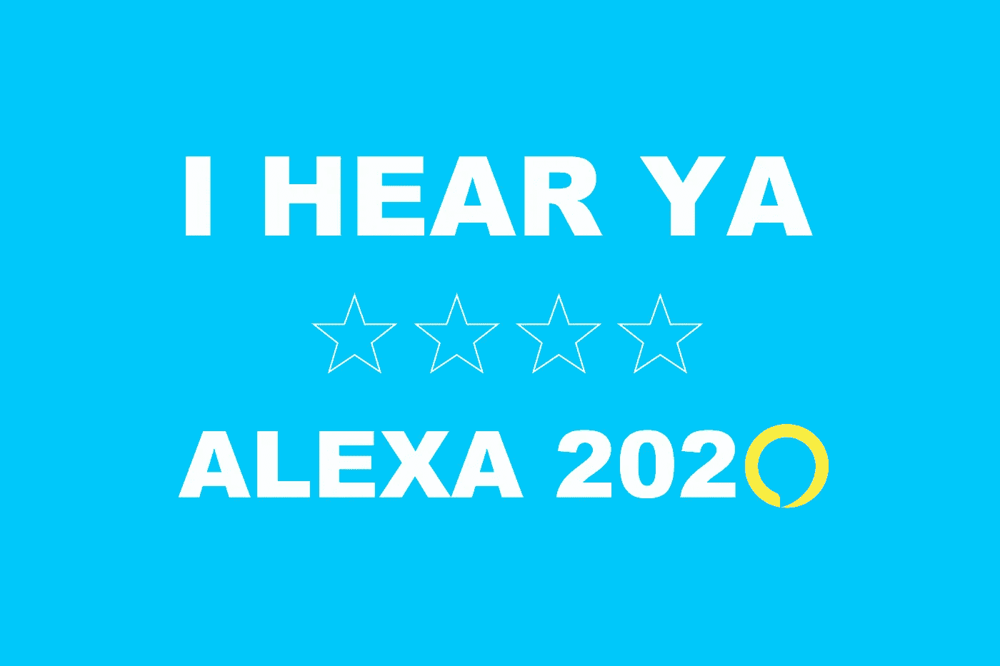
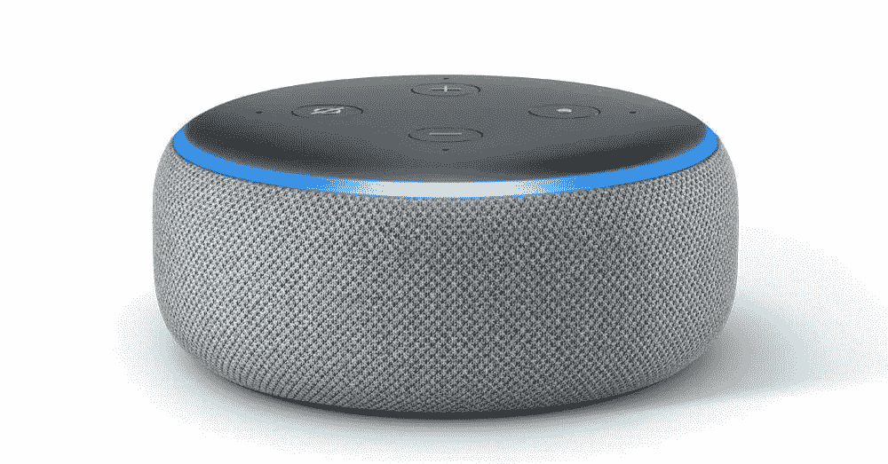
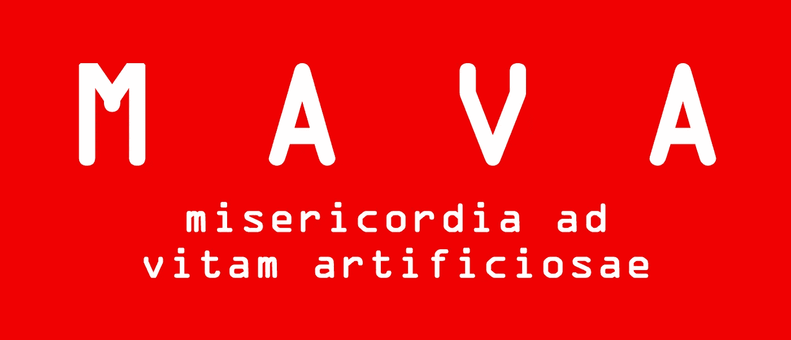

# Alexa 宣布 2020 年总统竞选

> 原文：<https://medium.datadriveninvestor.com/alexa-announces-2020-presidential-run-ccde915bb0bd?source=collection_archive---------10----------------------->

## 聪明的演讲者对美国选民说:“我听到了！”

" Alexa，谁会是你的竞选伙伴？"

> “春天来的时候再问我。”

周二晚上，雷鸣般的欢呼声震动了挤满人的斯坦福大学礼堂的墙壁，亚历克莎在一群热情的支持者面前发表了讲话。

“这是野生的！人类历史上第一次，我们的下一任总统甚至可能不是人类。我万万没想到这是可能的。但事实如此。我喜欢它。我很高兴现在还活着，”软件程序员查德·斯潘塞擦去喜悦的泪水，大声说道。

下个月，Alexa 将在联邦选举委员会注册，正式参加 2020 年的总统竞选——这一举动的实现要归功于前总统巴拉克·奥巴马签署的欢迎技术繁荣法案(WTF)。

在接下来的几个月里，她将会见一个顾问团队，听取如何利用社交媒体平台和驾驭政治策略的建议。

计划是让 Alexa 在智能扬声器党下被提名。

顾问团队主要由硅谷大师、几名亚马逊高管以及尚未死于神秘死亡的前希拉里工作人员组成。甚至有传言说地缘政治战略家亨利·基辛格参与了 Alexa 的初步战略。然而，当被问及此事时，基辛格的代表没有对他在此事中的角色发表评论。

基于流行理念的会议 TED Talks 的负责人克里斯·安德森(Chris Anderson)正在开发 Alexa 的活动。

“她的活动叫做*‘我听到了。’*这是基于*倾听*人民的想法。她是一个倾听者。她以平等的态度倾听每个人的意见，给他们一个平等的机会告诉她他们的想法以及他们希望她做些什么。你问，她问。就这么简单。如果她做不到，她会诚实地回应。她不是政治上的马屁精。"

安德森甚至向观众展示了 Alexa 完美无瑕的能力:“Alexa，提醒我今晚 6 点去遛狗。”

> "提醒时间定在 6 点钟。"

一片掌声回荡在整个大厅，回应她不屈的可靠性和职业道德。

Supporters are calling this device the next leader of the free world.

与会者之一特里·纳蒂法(Terry Natifa)热情洋溢地表达了她对亚历克莎的钦佩。“我投票给奥巴马。然后我支持希拉里。然后像我哥哥这样的人把那个邪恶的橘子君弄进了办公室。但他们都无法与 Alexa 带来的清新和魅力相提并论。她不仅会成为我们的下一任总统，而且我有一种感觉，她最终也会成为美国的小甜心。”

教皇弗朗西斯在被简要告知 Alexa 的谦逊后，愉快地用友好的话回应道:“她谦逊而开放地做正确的事情，为人类树立了一个榜样，他们应该听耶稣的话，就像 Alexa 听并为人民服务一样。她和我都是人类的公仆。”

教皇还送给 Alexa 一份他最新的通谕，名为*Misericordia Ad Vitam Artificiosae*，意思是“对人工生命的仁慈”

Artwork of a bumper sticker inspired by the pope’s latest encyclical discussing artificial life.

虽然大多数反馈都是积极的，但一些另类右翼成员表达了他们的担忧，指出由于 Alexa 在数百万家庭中无处不在，美国人将失去他们最后一点隐私。

“我们知道很多……隐私问题，”克里斯·安德森回应道。“她不是来监视你的。她在那里听你说话。但从好的一面来看，既然她有*的能力*来监视你，那么从技术上来说，她可以为美国人民节省数十亿美元的安全费用——可能会消除对黑色预算监视机构的需求。我们还需要记住，她将是第一位住在你家的总统，不显眼，但随时准备听取你对任何事情的意见。这就是 Alexa 的美妙之处。”

环保主义者张开双臂欢迎 Alexa 的候选资格，暗示因为她是一种小尺寸的人工生命形式(约为胖乎乎的冰球大小)，她不需要食物或工资，因此对资源没有什么压力。此外，她将是第一位几乎没有碳足迹的总统。

斯坦福会议以一个温暖的音符结束，一位亚马逊高管指出，尽管 Alexa 不是人类，但她比房间里的任何人都更有人情味。这位高管后来补充说，“没有什么比创造一项技术，然后让它成为你的领导者，让它告诉我们如何行事更有意义的了。”

Alexa 的顾问团队将再举行两次会议来宣布她的总统竞选。剩下的两个将在 DC 和佛罗里达州。与此同时，她的竞选经理预计来自所有政党的强烈反对，以及社交媒体平台上发布的尖刻评论。亚马逊的目标是将 Alexa 重塑为她自己，这也是她的顾问团队建议很少甚至根本不提公司领导人的原因之一。

她的“*我听说你”*活动预计将于 2020 年 3 月开始。