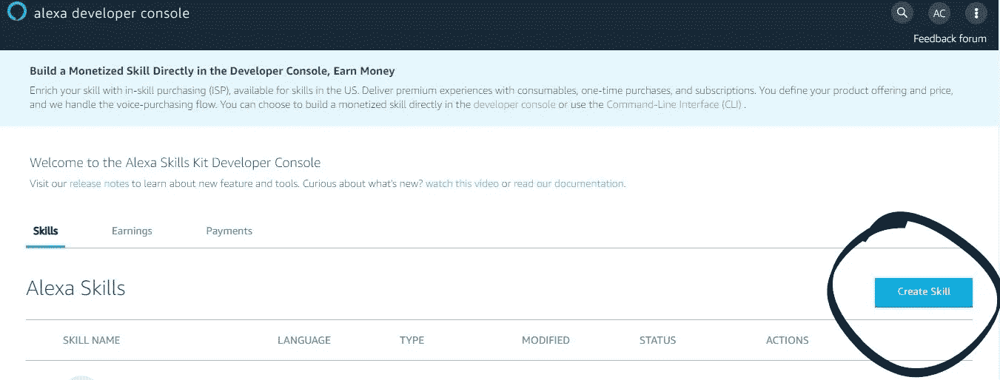
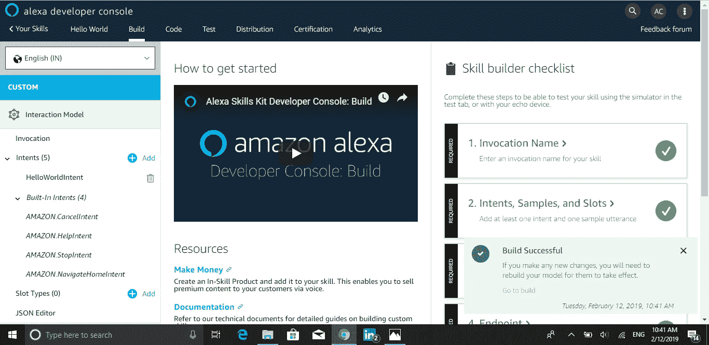
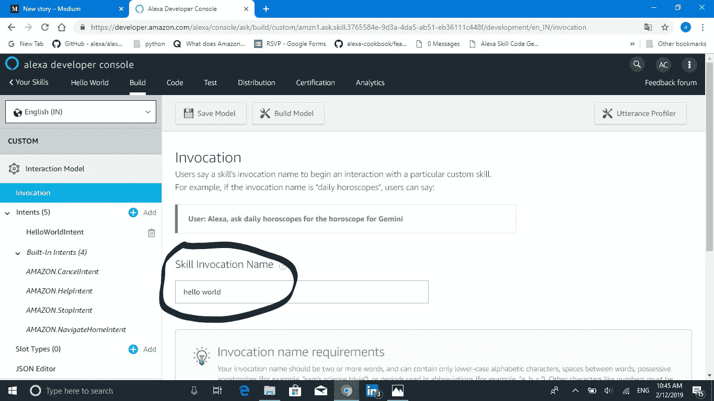
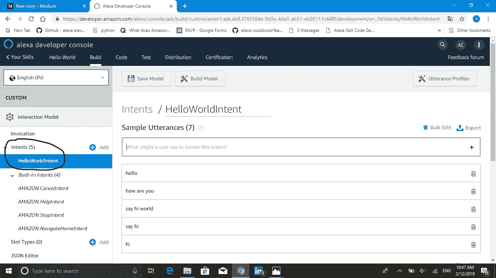
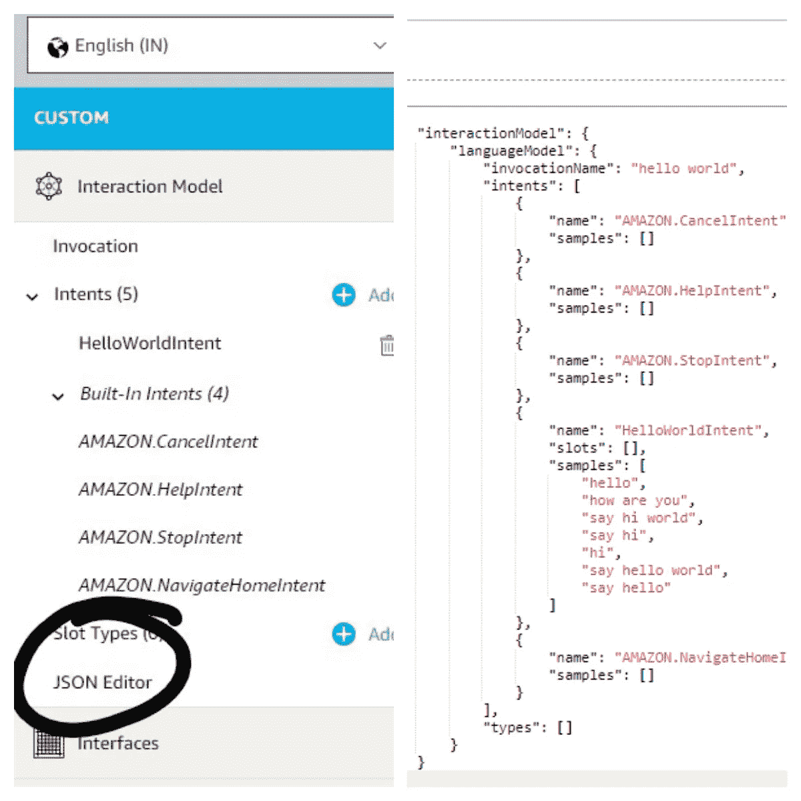
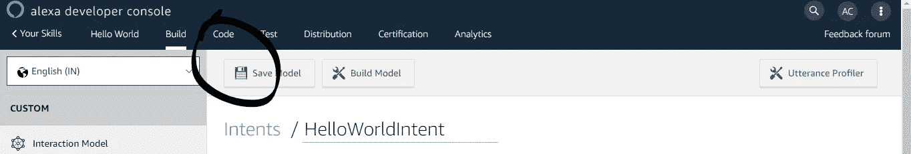
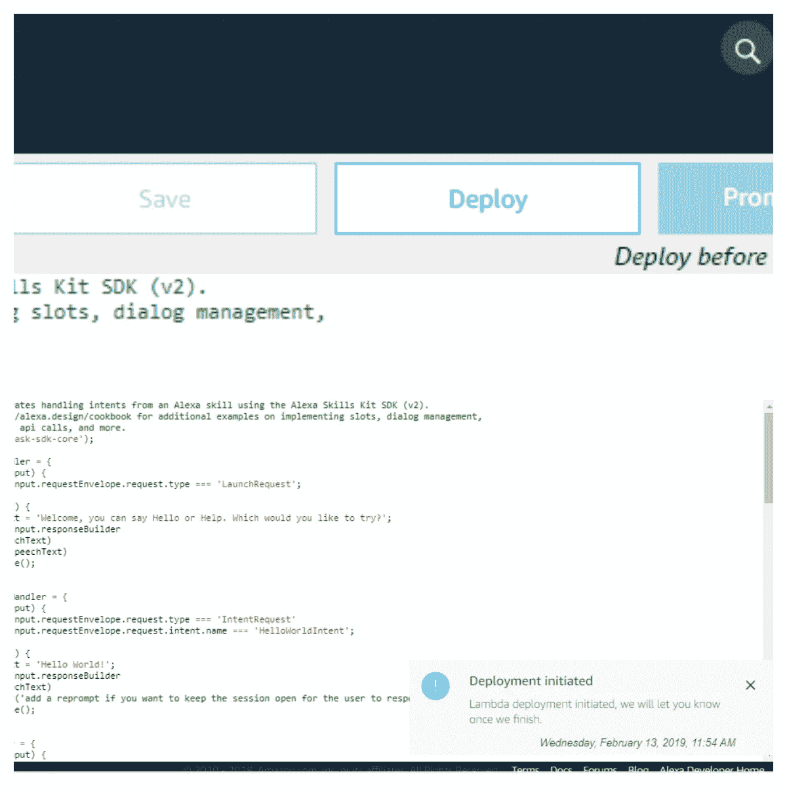
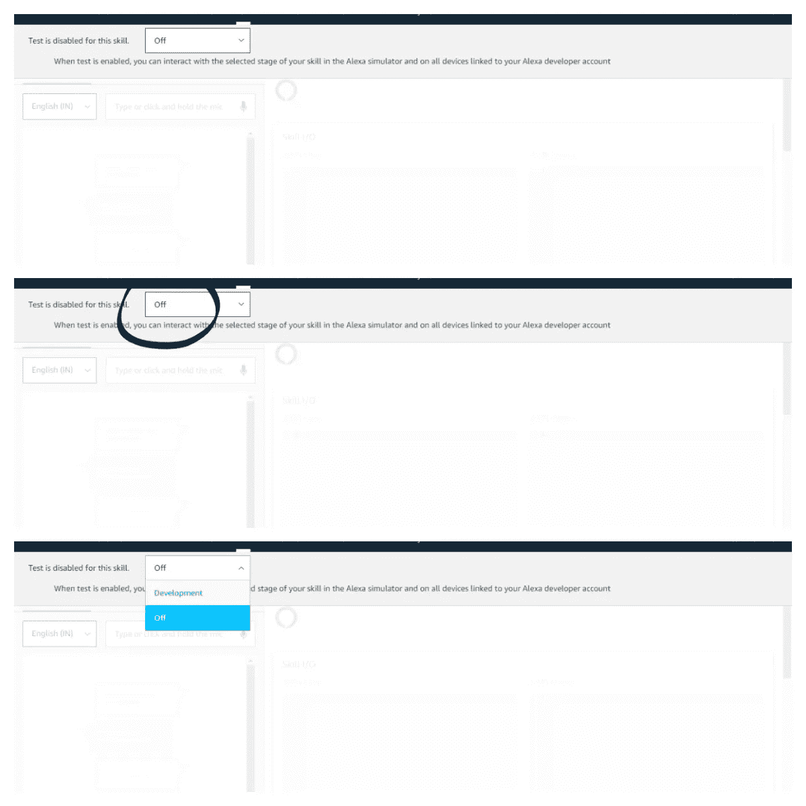
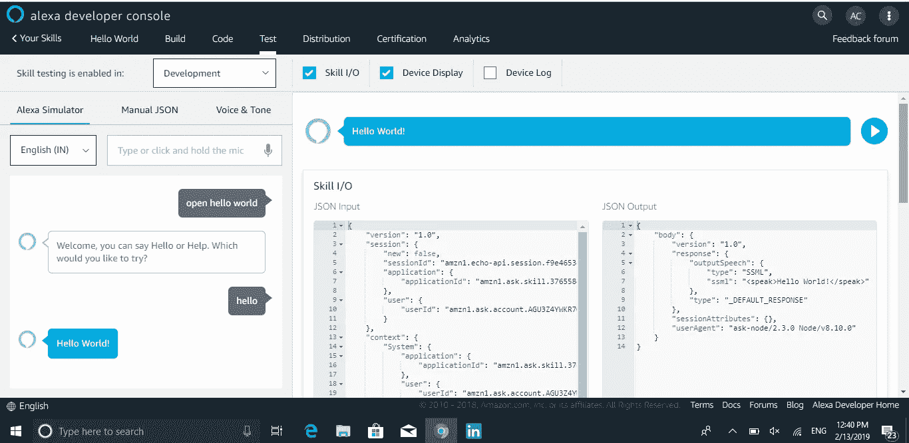

# Alexa 开发者控制台

> 原文：<https://medium.datadriveninvestor.com/alexa-developer-console-ae2fe9cb3253?source=collection_archive---------5----------------------->

# 用你的 Alexa 第一技能向 Alexa 问好

大家好！我们已经介绍了 Alexa 以及亚马逊为什么大力投资 Alexa。我们还介绍了什么是 Alexa 技能以及这些技能是如何工作的。现在让我们开始为 Alexa 建立第一个技能。

一切都是从 Hello-World 开始的。我们都听过这个词，几乎每个人在开始编程的时候都做过这个程序。因此，让我们为 Alexa 制作一个 Hello world 技能，为 Alexa 构建令人惊叹的语音体验。

# 第一步:

前往亚马逊开发者控制台[developer.amazon.com](https://www.amazon.com/ap/signin?openid.return_to=https%3A%2F%2Fdeveloper.amazon.com%2Fap_login%2F68747470733A2F2F646576656C6F7065722E616D617A6F6E2E636F6D2F686F6D652E68746D6C.html&openid.identity=http%3A%2F%2Fspecs.openid.net%2Fauth%2F2.0%2Fidentifier_select&openid.assoc_handle=mas_dev_portal&openid.mode=checkid_setup&openid.claimed_id=http%3A%2F%2Fspecs.openid.net%2Fauth%2F2.0%2Fidentifier_select&pageId=amzn_developer_portal&openid.ns=http%3A%2F%2Fspecs.openid.net%2Fauth%2F2.0&language=en_US&openid.pape.max_auth_age=1)用你的 ID 和密码登录(如果你在这里没有[就免费创建一个)。](https://www.amazon.com/ap/register?openid.pape.max_auth_age=1&openid.return_to=https%3A%2F%2Fdeveloper.amazon.com%2Fap_login%2F68747470733A2F2F646576656C6F7065722E616D617A6F6E2E636F6D2F686F6D652E68746D6C.html&prevRID=9HVV2QJ0DM24ED06EVVN&openid.identity=http%3A%2F%2Fspecs.openid.net%2Fauth%2F2.0%2Fidentifier_select&openid.assoc_handle=mas_dev_portal&openid.mode=checkid_setup&prepopulatedLoginId=&failedSignInCount=0&language=en_US&openid.claimed_id=http%3A%2F%2Fspecs.openid.net%2Fauth%2F2.0%2Fidentifier_select&pageId=amzn_developer_portal&openid.ns=http%3A%2F%2Fspecs.openid.net%2Fauth%2F2.0)

从菜单进入 Alexa，点击 Alexa 技能包。您将看到一个类似下图的页面。点击屏幕右侧的创建技能选项。

给你的技能命名为“Hello World ”,在“选择一个模型添加到你的技能”下选择 Alexa-Hosted (Beta ),然后点击“创建技能”。

您将进入构建模型部分，它看起来类似于下面这样。

太棒了。如果你已经到了这一页，干得好；你已经完成了第一项技能的一半。

单击交互模型中的调用名称，您将会找到“hello world”名称。这是一个你将用来调用/启动你的技能。

单击 Intents 下调用名称正下方的 hello world 条目。

在这里你会发现一些单词，像你好，你好，向世界和许多人问好。这就是你如何运用你的技能去完成一项特定的任务。你会发现一些像亚马逊一样的内置意图。取消亚马逊。帮助意向等等。这些是每个技能都应该具备的主要意图，因此这些已经在你将要创造的每个技能中被定义了。

单击左侧菜单中的 JSON 编辑器。您会发现一些类似下图的代码。

这就是我们在调用名和 HelloWorldIntent 中的所有内容。它被自动转换成 JSON 代码，供后端使用。这都是关于前端的部分，在这里你可以设计你的技能如何与用户互动。

# 第二步

现在点击构建部分旁边的上层菜单上的代码。

这是您技能的后端部分，您将进行实际的编码，并让您的技能为您的用户提供一些令人惊叹的语音用户体验。(我们将在我的下一篇文章中进一步讨论这个问题)。

单击 index.js 文件。这是你 Hello World 技能的代码。你将设计当用户询问任何关于你的技能的问题时，你的技能应该给出什么样的回答，以及你想在你的技能中加入的所有逻辑部分。您也可以使用 python 或任何其他语言。这里我用的是节点 js。

单击右上角的 deploy 按钮，您会在右上角看到一个部署启动状态。等待部署完成。

这就是了。你已经成功地为 Alexa 制作了你的 Hello World 技能。

# 第三步

现在点击上方菜单中的测试，测试你的技能

你会找到一个界面来测试你的技能

你会发现左边是 Alexa 模拟器，右边是技能输入/输出。

现在在 Alexa 模拟器中输入“打开 hello world”，你会在 Alexa 模拟器中听到 Alexa 的声音和一条文字回复。现在输入 hello 来测试你的 hello world 技能。

你会在你的 Alexa 模拟器上听到 Alexa 说 Hello World 和一个文本回复。您将在右侧找到 JSON 输入和输出，它将告诉您输入和输出是如何交互的。

就是这样。你已经成功为 Alexa 制作了你的第一个技能。为自己做出第一技能，开始接触 Alexa 的世界，给自己一个热烈的掌声。还有很多问题需要解决。这只是成为 Alexa 开发者的开始。

现在试着让 Alexa 在打招呼的时候说“嗨，你好”而不是“你好世界”。

**提示:-在代码部分浏览 Index.js 文件。即使你不熟悉 node js，也可以试着浏览一下代码，编辑一下，让 Alexa 说“嗨，你好。”**

请在下面评论你是否能做到这一点。如果没有，发布错误以便我可以帮助你。如果是的话，试着尝试一些你想到的新事物，并在下面分享你的经验。

我们将涵盖更多的细节，并了解更多的意图，话语，插槽，以及更多的下一篇文章。在那之前，休息一下，开心一下。

如果你喜欢这篇文章，请鼓掌。在我的下一篇文章中再见。

**接下来:——Alexa 技能培养术语**

# DDI 特色数据科学课程:

*   [**用于数据科学的 Python**](http://go.datadriveninvestor.com/intro-python/mb)
*   [**深度学习**](http://go.datadriveninvestor.com/deeplearningpython/mb)
*   [**数据可视化**](http://go.datadriveninvestor.com/datavisualization/mb)

**DDI 可能会从这些链接中收取会员佣金。我们感谢你一直以来的支持。*