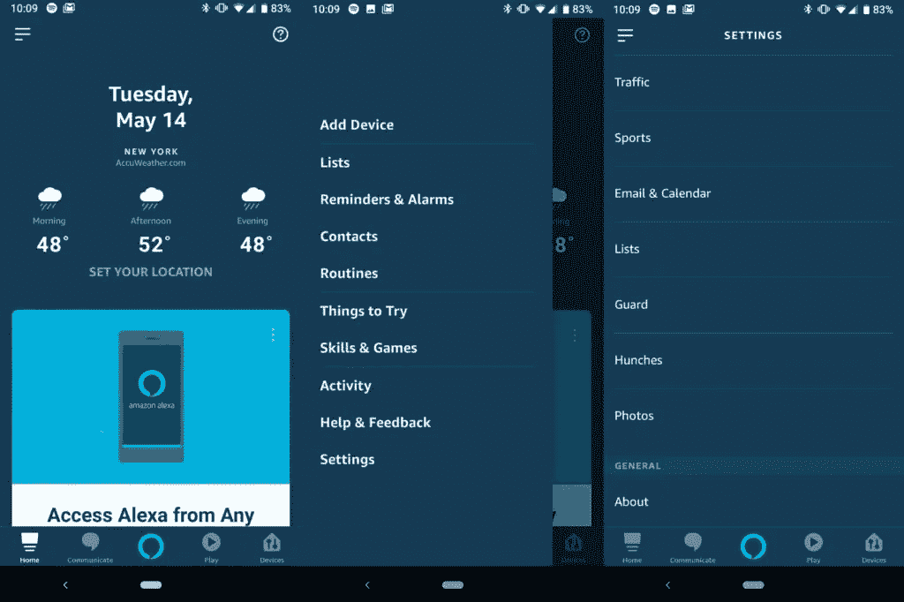

# Alexa 警卫:保护你的家与你的亚马逊回声免费

> 原文：<https://medium.datadriveninvestor.com/alexa-guard-protect-your-home-with-your-amazon-echo-for-free-d4c7db587e6c?source=collection_archive---------9----------------------->

大多数安全系统通过开/关传感器、运动传感器和声音传感器来监控你的家。亚马逊已经将其安全功能添加到几乎所有 echo 产品中，专注于利用其监听周围环境的能力。

Alexa 已经开始发布他们的新功能，名为 Alexa Guard。这个功能是 100%免费的(假设你已经有了 Echo)。警卫，让你用你的回声扬声器监听可能出现的紧急情况。它使用内置在设备中的远场麦克风来监听玻璃破裂和烟雾探测器或二氧化碳探测器发出的警报。

# 这是如何工作的？

当你离开你的房子，你需要把回声进入警卫模式。你只要简单地说“Alexa，我要走了”就可以做到。Alexa 会回应“好吧，我现在就开始守卫”。然后它把你的回声或回声的离开模式，他们开始听警报或玻璃破碎的声音。即使你忘记告诉 Alexa 你要离开，你也可以随时从 Alexa 应用程序打开警卫模式。

Alexa 会通过向你的手机发送智能警报来让你知道它是否听到了什么问题。警报将包含事件的音频记录；如果您的 Echo 内置了一个摄像头，您可以使用 Drop-In 特性来查看实时摄像头馈送。此外，如果你通过 ring 的安全套件或 ADT 的控制智能家居设置支付专业监控费用，你可以让 Alexa Guard 直接向安全提供商发送智能警报，后者可以代表你向当局发出警报。

Guard 还可以通过打开和关闭智能灯来控制您的智能灯，让您感觉有人在家。当你开机时，它会询问你的邮政编码，这样它就知道什么时候是晚上了。

# 如何设置 ALEXA 卫士

通过亚马逊 Alexa 应用程序运行 Alexa Guard 的过程对任何手机都是一样的。像往常一样，确保你有最新版本的 Alexa 应用程序，然后再尝试设置警卫。

1.  轻按屏幕左上角的菜单选项来扩展应用程序的选项
2.  选择“设置”应该在底部
3.  向下滚动并选择“警卫”
4.  同意允许应用向您发送智能提醒。
5.  按照提示设置玻璃破碎、烟雾探测器和智能灯的使用。

你可以选择这些选项中的任何一个或全部，然后你就可以开始了。

因此，如果你没有一个智能枢纽或安全系统，你会受益于一些基本的安全功能，然后 Alexa 卫队是你的。请记住，如果有人闯入你的家，最有可能的方式是通过窗户闯入，所以设置您的 echo 来监控这种类型的噪音并通知您是一个很好的附加功能，可以添加到您的柜台上的一个硬件中。虽然这不是一个完整的安全解决方案，但它是一个有用的功能，让 Alexa 比谷歌的 Home 或苹果的 AirPod 更有优势。

希望很快，亚马逊将允许回声武装自己，当它知道你去了基于你的地理位置。

但如果你想要更多的保护(与 Alexa 集成)，你可能要考虑环的五件套安全套件。

总的来说，Alexa Guard 可以填补大多数人的空白，因为智能扬声器在家里变得越来越普遍，但许多人没有安全系统。守卫会给你一些你以前没有的功能。守卫会让你多一点安心，而不花你一毛钱。

在 www.somethingaobutnothing.org 查看更多科技文章