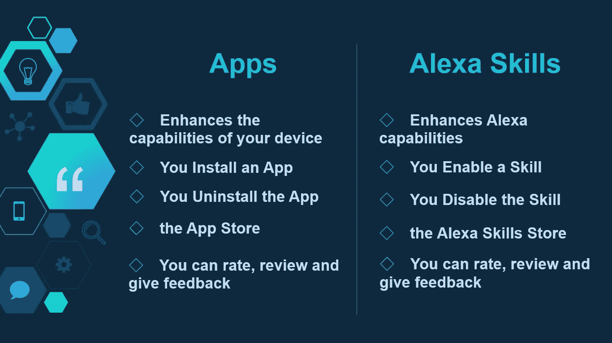
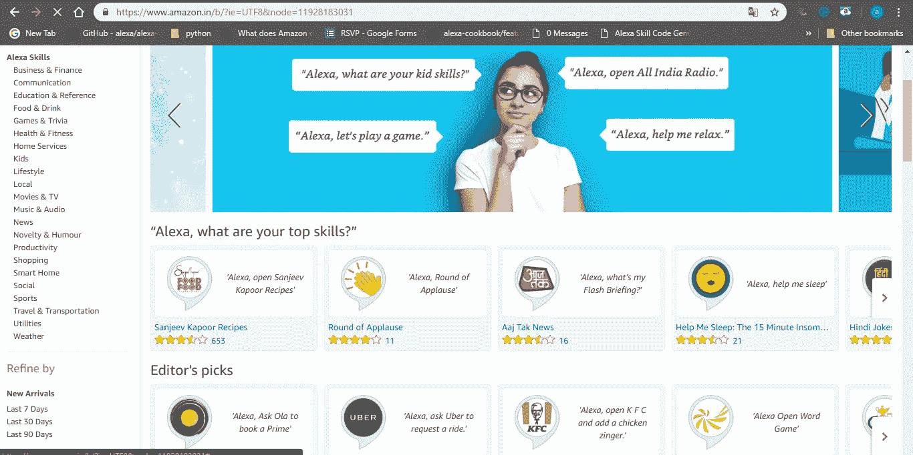
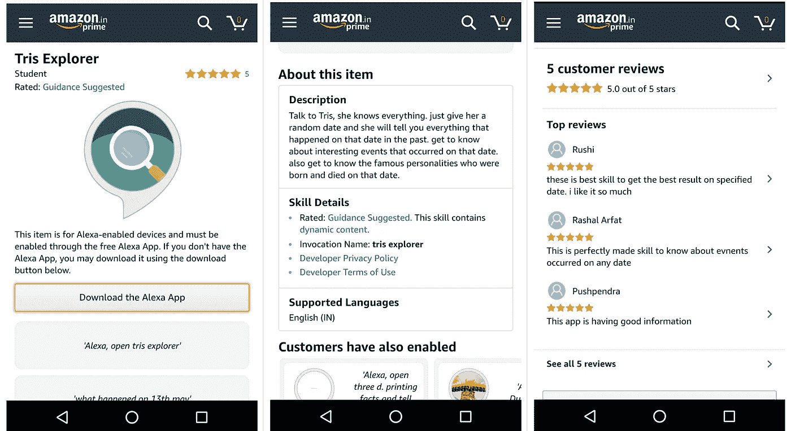
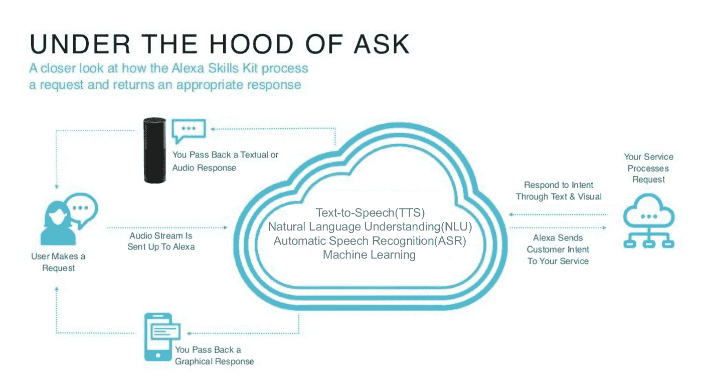

# ALEXA SKILLS

> 原文：<https://medium.datadriveninvestor.com/alexa-skills-356587403f61?source=collection_archive---------6----------------------->

# Alexa 功能

在我的上一篇文章中，我提到了 Alexa 的工作方式和支持 Alexa 的两个框架。今天我们将讨论什么是 Alexa 技能，为什么我们需要 Alexa 技能来发展 Alexa 生态系统，为什么亚马逊希望你为 Alexa 建立创新技能。

# 什么是 Alexa 技能？

Alexa 技能类似于我们在 Android、IOS 或 Windows 中使用的应用程序。类似于一个应用程序如何增强或增加你的设备的功能，类似的技能改善和增加 Alexa 的新功能。根据亚马逊的最新更新，Alexa 技能商店上有超过 70，000 个由开发者制作的 Alexa 技能，并且这个选择每天都在增长。

# Alexa Skill =安卓应用

让我们看看一个 Alexa 技能是如何与我们在 Android 中使用的应用程序相似的。

这就是技巧与 Android 应用程序的相似之处。Alexa 技能商店与 Android 上的 play 商店完全相同。搜索你想要的技能，启用它，使用它，如果你喜欢就保留它，如果你不喜欢就禁用它。就这么简单。

# 什么是 Alexa 技能商店？

Alexa 技能商店是你可以找到全球不同开发者制作的所有技能的地方，你可以在你的 Echo 设备中使用这些技能，或者通过智能手机上的亚马逊 Alexa 应用程序使用这些技能。

你可以访问 Alexa 技能商店了解更多细节和令人兴奋的技能。以下是基于不同地区的 Alexa 技能商店链接，如[印度](https://www.amazon.in/b?ie=UTF8&node=11928183031)、[英国](https://www.amazon.co.uk/b?ie=UTF8&node=10068517031)、[美国](https://www.amazon.com/alexa-skills/b?ie=UTF8&node=13727921011)、[澳洲](https://www.amazon.com.au/b?ie=UTF8&node=5269642051)、[加拿大](https://www.amazon.ca/b?ie=UTF8&node=16286269011)等等。

# 如何启用 Alexa 技能？

要使用 Alexa 技能，您必须拥有亚马逊 Echo 设备或其他支持 Alexa 的设备，或者在您的智能手机上安装亚马逊 Alexa 应用程序。

现在，使用应用程序或在网络上登录您的帐户，并转到应用程序的技能和游戏部分。在这里，你会发现世界各地的其他人创造的所有不同的技能，你可以按类别探索，你可以搜索你想要的技能。阅读描述和客户评论，点击启用，如果你想使用它，然后你可以说 Alexa 打开技能名称后使用技能。你可以禁用该技能，类似于你在 Android 上卸载应用程序的方式。

# Alexa 技能是如何工作的？

让我们来看看一个 Alexa 技能如何工作的架构。

现在让我们一步一步来。

1]用户要求 Alexa 打开“技能”。例如，技能的名称为“空间事实”，因此用户将说 Alexa open space facts。这是 Alexa 将用于确定以下操作的话语。

2]话语(Alexa，开放空间事实)被发送到 Alexa 语音服务(AVS)。

[3]现在，AVS 是文本到语音(TTS)、自然语言理解(NLU)、自动语音识别(ASR)机器学习协同工作并解释用户所说内容的地方。

4]作为回报，AVS 会将意向和技能发送给您的服务。

5]您的服务现在将调用代码的后端。您的服务是由开发人员或技能的创建者在后端编程的，所有这些都将在 JSON 中完成。

6]现在，您的服务将响应 AVS，AVS 将根据请求以音频或文本或视频形式撰写响应。

【时间】注释:-我将在下一篇文章中深入定义意图、话语和其他术语。这是为了向您简要介绍一项技能的工作原理。

# 亚马逊为什么投资 Alexa Skills？

Alexa 技能是 Alexa 的能力。它增加了新的功能，并帮助 Alexa 变得更聪明。语音是最自然、最具创新性的技术交流方式，这还只是个开始。因此，要发展整个 Alexa 生态系统，让 Alexa 在世界各地传播，我们需要越来越多具备创新理念和新功能的技能。

# 借助 Alexa Developer Rewards，您可以培养技能、赚取收入并获得更多收益

Alexa 技能选项每天都在增加，您也可以使用 Alexa 技能来赚钱。

1]亚马逊每个月都会推出一项激励计划，让你发布你的技能就能获得亚马逊官方的 Alexa T 恤，还能获得许多其他奖励，比如一个游戏站或从顶级品牌那里淘到的其他战利品。看看不同国家的激励页面

[印度](https://developer.amazon.com/alexa-skills-kit/alexa-developer-skill-promotion-india)，[美国](https://developer.amazon.com/alexa-skills-kit/alexa-developer-skill-promotion)，[英国](https://developer.amazon.com/en-gb/alexa-skills-kit/alexa-developer-skill-promotion)，[德国](https://developer.amazon.com/de/alexa-skills-kit/alexa-developer-skill-promotion)，[日本](https://developer.amazon.com/ja/alexa-skills-kit/alexa-developer-skill-promotion)，[法国](https://developer.amazon.com/fr/alexa-skills-kit/alexa-developer-skills-promotion)，[澳大利亚](https://developer.amazon.com/alexa-skills-kit/anz/alexa-developer-skill-promotion)，[意大利](https://developer.amazon.com/it/alexa-skills-kit/alexa-developer-preview-program)，[西班牙](https://developer.amazon.com/es/alexa-skills-kit/alexa-developer-preview-program)，[加拿大](https://developer.amazon.com/alexa-skills-kit/alexa-developer-skill-promotion-canada)。

2]你可以向不同的机构推销你的技能或想法。你可以在亚马逊官方页面上寻找代理公司的名单，在那里你可以找到其他项目。

3]从亚马逊本身获得报酬。您可以从客户最关注的合格技能中获得报酬。亚马逊一直在向开发人员支付现金，这些开发人员在高客户参与度下培养了 Alexa 技能。

因此，这就是你如何使用 Alexa 技能来以更快、更有效的方式免提完成事情。在我的下一篇文章中，我将讨论 Alexa 技能发展中的关键术语和定义。与此同时，我们将为 Alexa 建立第一个技能。

**接下来:- Alexa 技能培养基础。**