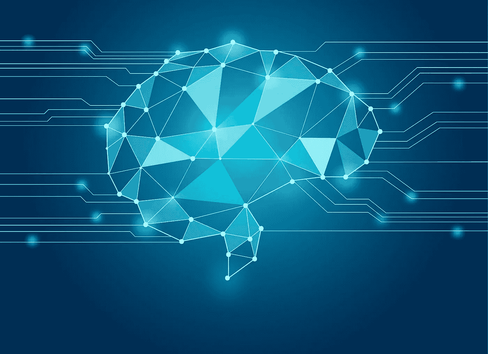
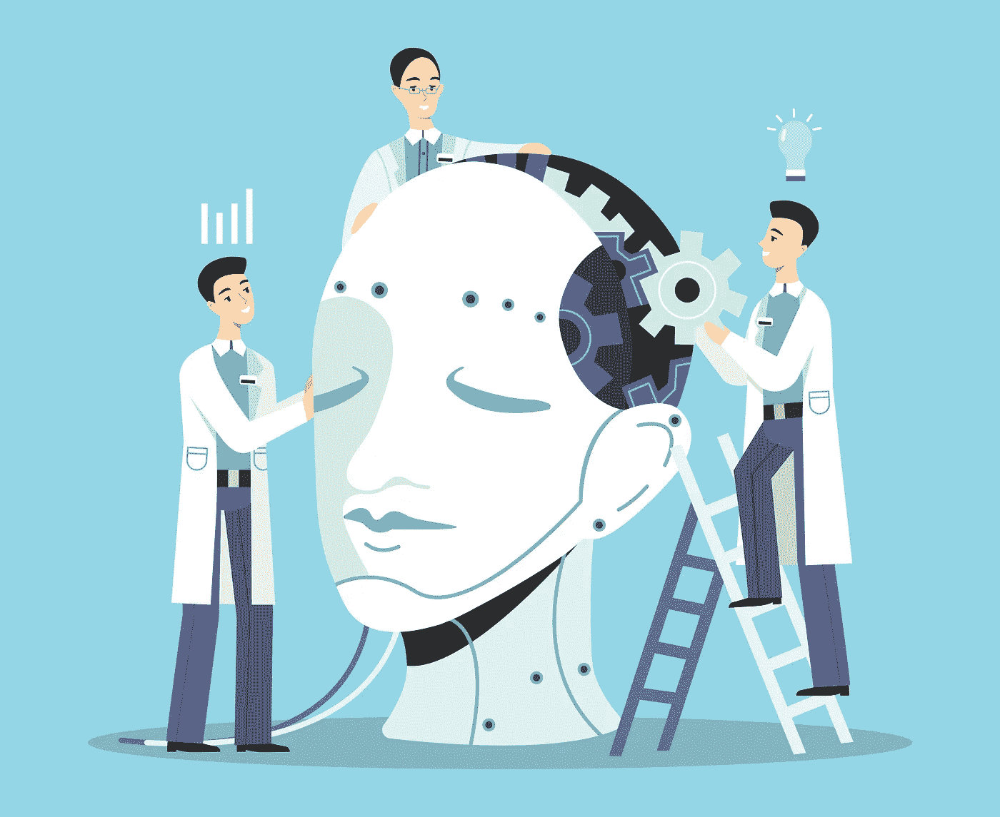

# Alexa 技术:亚马逊人工智能的秘密

> 原文：<https://medium.datadriveninvestor.com/alexa-technology-the-secrets-of-amazon-artificial-intelligence-9ed6cb7cb876?source=collection_archive---------30----------------------->

亚马逊 Alexa 的销量破纪录，原因显而易见。得益于最先进的亚马逊 Alexa 技术，客户可以体验下一代个人助理，其功能远远超过自 2014 年 Alexa 发布以来的所有先前版本。Alexa 使用的非凡的机器学习过程从根本上改变了完成日常任务的方式。为了欣赏这个新的现代奇迹，让我们仔细看看 Alexa 是如何工作的。

# Alexa 人工智能

由于人工智能，Alexa 可以符合和适应每个用户，但这也带来了一个问题:Alexa 越聪明，就越难构建。如果我们思考我们说话的方式，我们使用不同的单词模式和组合，以及委婉语、术语、拟声词和许多其他方法来描述我们正在寻找答案的问题。语音和发音的这种差异甚至在最基本的命令中也很明显，例如唤醒 Alexa。

为了唤醒 Alexa，它需要检测“唤醒词”,如果检测到这个词，这些信息将被发送到云上的语音认知系统，该系统将语音转换为文本。这个过程将 Alexa 的任务从二进制问题转换为序列到序列问题。这是一个让[专业软件开发人员](https://skywell.software/)非常头疼的问题，因为 Alexa 的人工智能有无限的可能性。它必须搜索整个英语词汇来寻找 wake 单词，而云技术是唯一可以处理如此大量数据的可扩展解决方案。因此，如果你想知道 Alexa 到底使用了多少数据，答案是很多。

为了适应每个人独特的人声音色、音高、变调等。需要大量的数据来将语音命令转换成文本，并确定一系列单词的实际含义。这个过程是双重的:首先，Alexa 将查看纯文本，而不添加额外的功能来确定用户的请求。如果这不起作用，它就会求助于下一个过程，即基于机器学习，通过使用音频和转录本的组合来训练 Alexa。

# Alexa 深度学习

我们已经提到过，工程师使用机器学习来训练 Alexa，这确切地决定了 Alexa 可以做什么以及它能够做什么。机器学习的一个子类是自然语言理解(NLU)。这里有很多映射，但大多数情况下一切都是从规则和表达式开始的。但是，如果您的请求有多个因素，您仍然会遇到问题。

例如，假设你问 Alexa“纽约的天气如何？”为了让 Alexa 生成响应，它需要跨域意图分类。应用层将发现天气，并且对话管理器将决定是否需要更多信息来获得准确的响应。一个语言生成器产生一个提示和自然语言生成(NLG)给 Alexa 的文本，它需要说大声的答案。通常，在构造对话代理时，您会创建一个模板，该模板最初会一直工作到您必须向上扩展的时候。这种语音引擎使用连接合成，将音频分成更小的比特，引擎试图找到最佳的比特序列，以最大限度地利用音频的自然度。

因此，如果你喜欢在演讲中使用讽刺、挖苦或其他修辞手段，Alexa 将能够通过拼凑所有片段来识别你在说什么。此外，它将能够微调说话的声音，使其更加自然和舒缓。然而，你给 Alexa 一个讽刺或无礼的评论，你可以期待同样的回报。Alexa 背后的工程师使用专业的解说员，让 Alexa 听起来像一个“聪明人”，亚马逊有自己的有声读物出版服务也有所帮助。

Alexa 的下一步将是根据人们说话的语气和他们使用的词语来判断他们的情绪或心情。将来，如果有人要求 Alexa 获取纽约的天气，并带着一丝忧郁，Alexa 会问这个人是否有什么事情困扰他们，是否有什么可以做的，或者可能播放一首歌让他们振作起来。它还能够通过记住你之前说过的话来更好地进行对话，很快你的基本要求将变成更加生动的对话，包括关于天气的笑话，你在恶劣天气下的日常通勤以及许多其他细微差别。

亚马逊对 Alexa 有很大的计划。它不想完全取代人类互动，但它确实想从根本上改变人类与机器互动的方式。他们不希望 Alexa 成为智能手机等配件，而是一个你离不开的个人助理。这对于行动不便的人来说非常有用，他们不容易起来打开电视，增加或降低恒温器的温度等。它甚至可以被篡改，以适应有语言障碍的人，使 Alexa 按照他们的条件工作。

这些只是 Alexa 的一些用途，我们将在未来看到，尽管它们非常重要。像家庭自动化和娱乐这样的东西将被彻底改造，以提供前所未有的舒适和便利，并伴随着非常先进的智能。如果你目前拥有一台 Alexa 设备，它甚至可以帮助你解决你在工作或个人生活中遇到的问题。不要向你最好的朋友抱怨你所有的问题，试着向 Alexa 抱怨。它将能够处理 20 分钟的对话，并实际上产生可行的解决方案来帮助你。例如，你可以问它“我如何提高我公司的搜索引擎排名？”它会为你列出所有的可能性。随着机器学习进入 Alexa，没有什么是禁区，你会对结果感到惊喜。所以，试试吧。随着技术的快速进步，在不久的将来，你将能够看到 Alexa 和许多其他形式的人工智能在使用中。

*最初发表于*[*sky well . software*](https://skywell.software/blog/alexa-technology-the-secrets-of-amazon-artificial-intelligence/)*。*