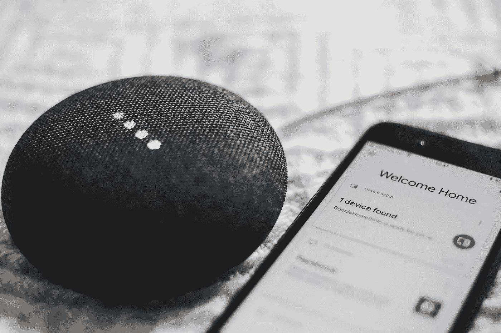
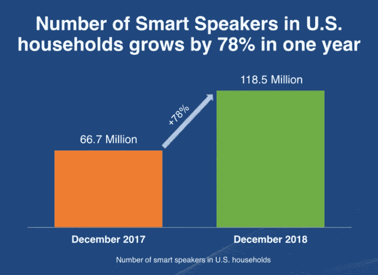

# Alexa，告诉我你接下来要去哪里

> 原文：<https://medium.datadriveninvestor.com/alexa-tell-me-where-youre-going-next-16c3743a2867?source=collection_archive---------15----------------------->

虽然有时顾客会对亚马逊的 Alexa 产生信任问题，但像这样的虚拟助手(以及其他虚拟助手)会继续感受到这种爱。在 2017 年 12 月至 2018 年 12 月期间，美国家庭的智能扬声器数量增加了[78%](https://marketingland.com/survey-reports-118-million-smart-speakers-in-u-s-but-the-expectation-of-future-demand-is-way-down-254937),从 6670 万增加到 1 . 185 亿，德勤预计 2019 年全球销量为[1 . 64 亿台](https://www2.deloitte.com/insights/us/en/industry/technology/technology-media-and-telecom-predictions/smart-speaker-voice-computing.html),总额为 70 亿美元，而 2018 年的销量估计为 9800 万台，总额为 43 亿美元。

对于亚马逊(目前该领域的领导者)和其他科技巨头苹果、谷歌和微软来说，这听起来很有希望，但仍有很大的增长空间。一项研究显示，预计到 2019 年底，只有 26%的美国互联网用户(即 7420 万人)将拥有智能扬声器。虽然这是发达国家中最高的比例，但这意味着仍有数百万人可能会冒险一试。

*Source: marketingland.com*

海外也有数百万人。尤其令人感兴趣的是中国。截至 2018 年年中，中国城市中只有 22%的成年人能够使用智能扬声器，尽管预计到 2019 年底，该国将有 8550 万公民使用这一技术，但这仅占人口中互联网用户的 10%。

 [## 2019 年即将改变世界的技术|数据驱动的投资者

### 很难想象一项技术会像去年的区块链一样受到如此多的关注，但是……

www.datadriveninvestor.com](https://www.datadriveninvestor.com/2019/01/17/the-technologies-poised-to-change-the-world-in-2019/) 

美国公司在那里面临的一大障碍是语言处理；中国有 130 种口语方言和 30 种书面语。虽然德勤并不认为这个问题是不可克服的——印度的语言障碍也是如此——但与此同时，阿里巴巴和百度等中国科技公司已经迅速填补了这个缺口。

在英国，进一步的市场渗透也是可能的，预计到 2019 年底，22.4%的互联网用户将拥有智能扬声器，加拿大(18.2%)、德国(17.2%)和法国(14.0%)。

无论在哪个国家，德勤都认为商业、教育和医疗领域的机会越来越多——可以想象在酒店的每个房间、每个办公室、每个教室和医院的每张床旁边都有一个智能扬声器(取代呼叫按钮)。作为证据，德勤列举了万豪在包括中国在内的一些酒店安装这种技术的计划，以及永利拉斯维加斯在所有房间安装这种技术的决定。不过，增长空间很大，因为据估计，全球有 187，500 家酒店和大约 1，750 万间客房。

期待进一步增长的另一个原因是技术[继续发展](https://thenextweb.com/contributors/2018/02/18/will-smart-speakers-like-2023/)的事实。我们看到越来越多的视觉效果附加到它们身上，以及越来越多的个性化和与其他设备的更大集成。随着用户对虚拟助手的要求越来越高，等待时间增加的问题仍有待解决。

然而，总的来说，技术正在发展。它仍然有各种各样的出口和各种各样的使用方式。

*本文最初发表于 2019 年 9 月 9 日的《DataDrivenInvestor.com》。*