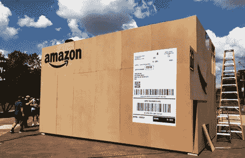
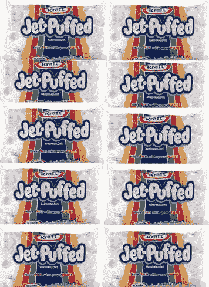
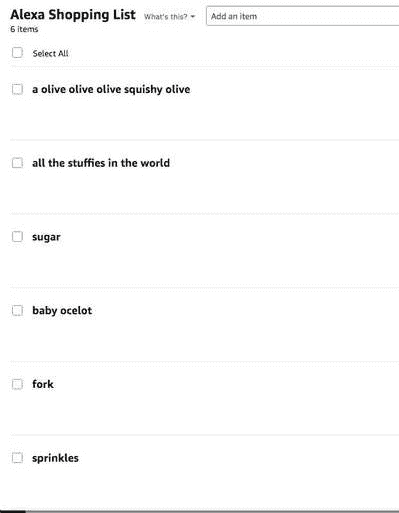
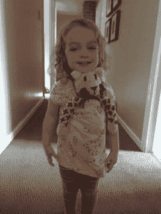

# 亚历山大:新的商学院

> 原文：<https://medium.datadriveninvestor.com/alexa-the-new-business-school-263d8774d03d?source=collection_archive---------32----------------------->

[“Alexa！](https://www.amazon.com/Amazon-Echo-And-Alexa-Devices/b?ie=UTF8&node=9818047011)你能在我的购物清单上添加 A 电池吗？”集线器无辜地问。他没有注意到他的两个聪明的小女儿的两只大大的小眼睛在记录他的每一句话。

就这样，几天后，我们在前廊发现了这个:

(Okay fine, it was only half that size…)
(photo credit: Alabama News Center)

“你从亚马逊订购了什么？”集线器问。

“没什么，”我说。" T2，你从亚马逊订购了什么？"因为探戈是两个人跳的，还有所有的爵士乐…呃…探戈音乐…

我们把它打开，那两对早些时候看着他们父亲的眼睛兴奋地睁得大大的。因为，这就是盒子里的东西:

“你点了一打*棉花糖*？”哈勃斯问道。

嘘。当然不是！我的意思是，如果我们是诚实的，我不完全肯定那不是我。我曾经意外地订购了一些非常奇怪的东西。

我们注意到我们 4 岁和 6 岁的女儿在两种选择之间左右为难，一种是一头扎进一堆白糖袋里，另一种是躲在他们能在地板上找到的任何影子后面。有点不对劲…

“你们*和*点了棉花糖吗？?"我问。他们点点头，既羞怯又可笑地骄傲。理应如此。但是怎么做呢？？

他们指向我们的 Alexa 扬声器。Hubs 打开我们的亚马逊账户，果然，我们在 Alexa 的订单历史中有一件东西确实是一打棉花糖。幸运的是，这是他们订购的唯一一件真正送到我们家的东西…下面是我们愿望清单的其余部分，这要感谢他们用 Alexa 疯狂购物:

小豹猫？！？我的意思是，不要吹毛求疵，但我有点希望那是不知何故来到我们家的东西，而不是一堆锦葵。“好吧，”我说，努力做一个负责任的家长，而不是抵制和我的孩子一起跳进袋子里的冲动。"把它们放在盒子里，我早上会把它们运回来。"令我惊讶的是，女孩们没有抱怨。他们甚至一声不吭(一语双关)。是枢纽站出来说话。“不，”他说。“不要送他们回去。女孩们订购了它们，所以现在他们需要想出如何处理它们。他们可以从偿还我们的购买款开始。”

我用一种不敢相信你的表情看着他，但同时也为他令人敬畏的父亲身份感到骄傲。女孩们还是没有抱怨，因为制定规则的是爸爸，不是妈妈。他们一起计算每个孩子欠我们多少钱。然后，女孩们拖着脚步走向她们的小存钱罐，拿出适量的零钱。

那是感恩节的前几天，我还没有买完食品杂货。我*和*需要一些软糖来做我的红薯。

“嘿，伙计们，”我提议。"我可以向你买一个你的包吗？"他们(在他们精明的父亲的帮助下)问我在商店买一袋东西要花多少钱。然后，他们提高了我的收费，说这是值得的，省了我一趟。感觉有点被宰了，还特别为自己的孩子骄傲，我无法拒绝。他们很容易就卖出了他们的第一个包。他们的妹妹开始抓狂，因为有一堆棉花糖，却没有人给她一个。所以，女孩们(她们现在在扮演一个角色)算出每个袋子里有多少棉花糖，用这个数字除以她们向我收取的整袋棉花糖的费用，然后要求每袋棉花糖 10 美分。

他们的小妹妹(你们这些家伙，她当时只有两岁)蹒跚地走向她的存钱罐，带着两个一角硬币回来了。恰恰！作为回报，她得到了两个糖枕头。

seriously, how could you charge that sweet face a single penny for a treat??

这就是我的女儿们如何在她们的意外(？)Alexa 购买。这很可能是该中心迄今为止最辉煌和最持久的教训之一。让它也成为你的一个教训:商学院是给傻瓜准备的——买一个 Alexa 单元吧；)

其他新闻，我还在等那只小豹猫…

*最初发表于*[*【www.chelseaflagg.com】*](https://www.chelseaflagg.com/bloggings/alexa-the-new-business-school)*。*