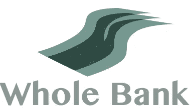
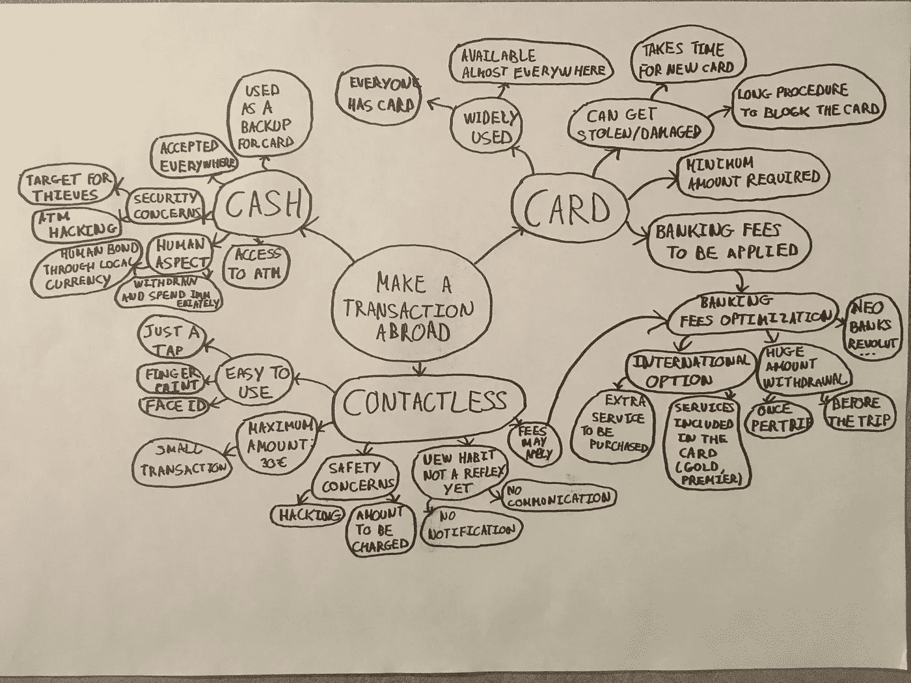
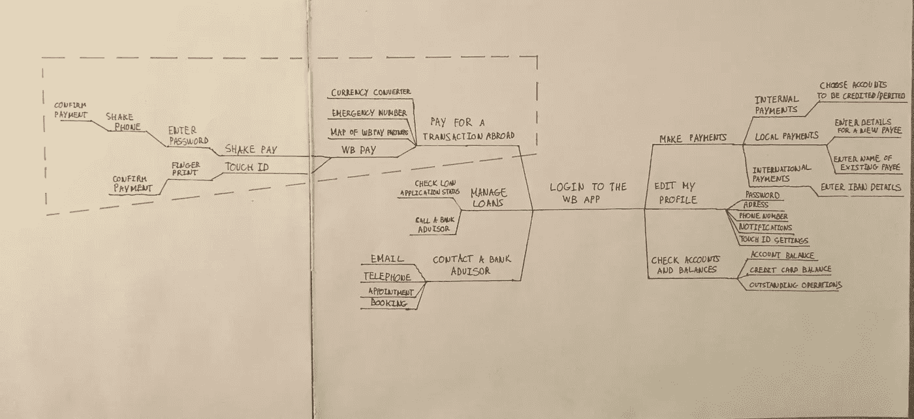
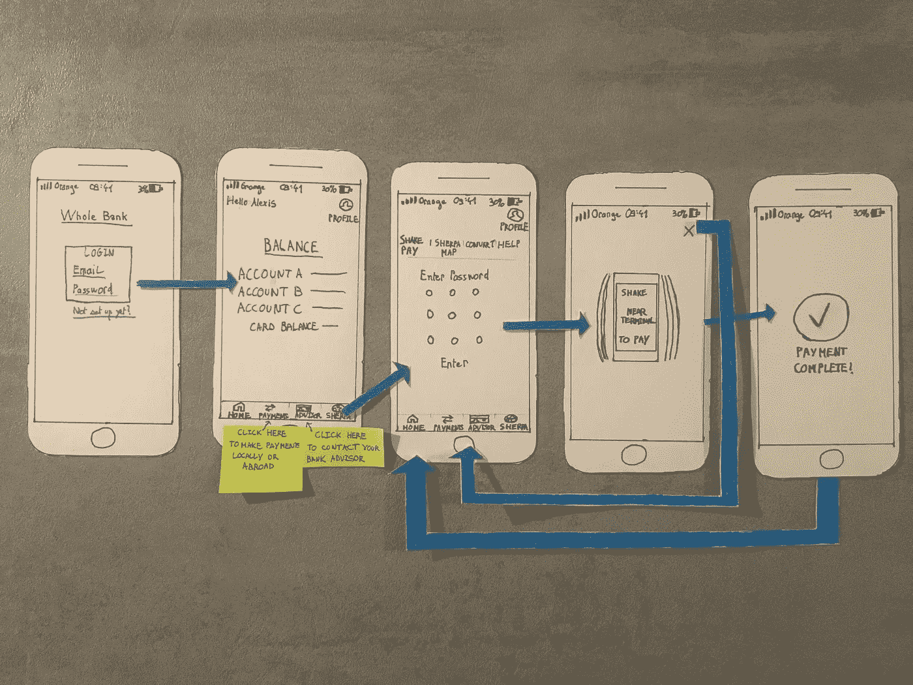
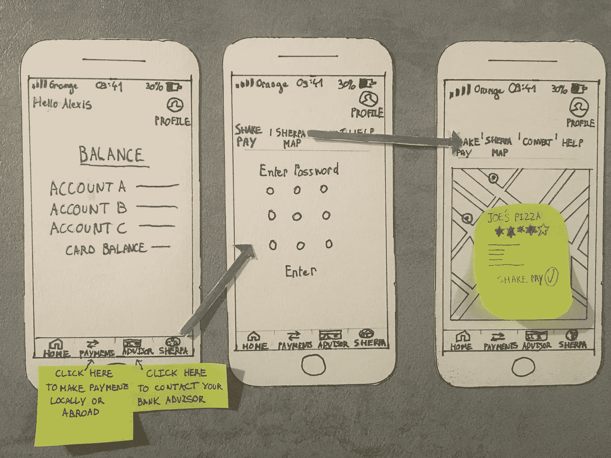
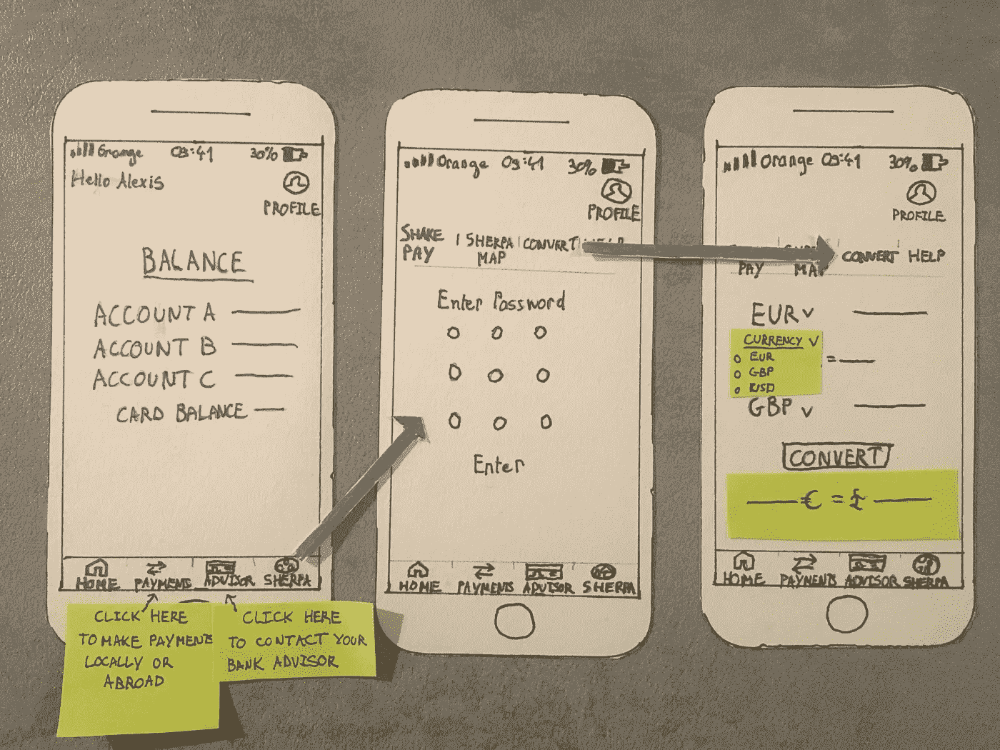
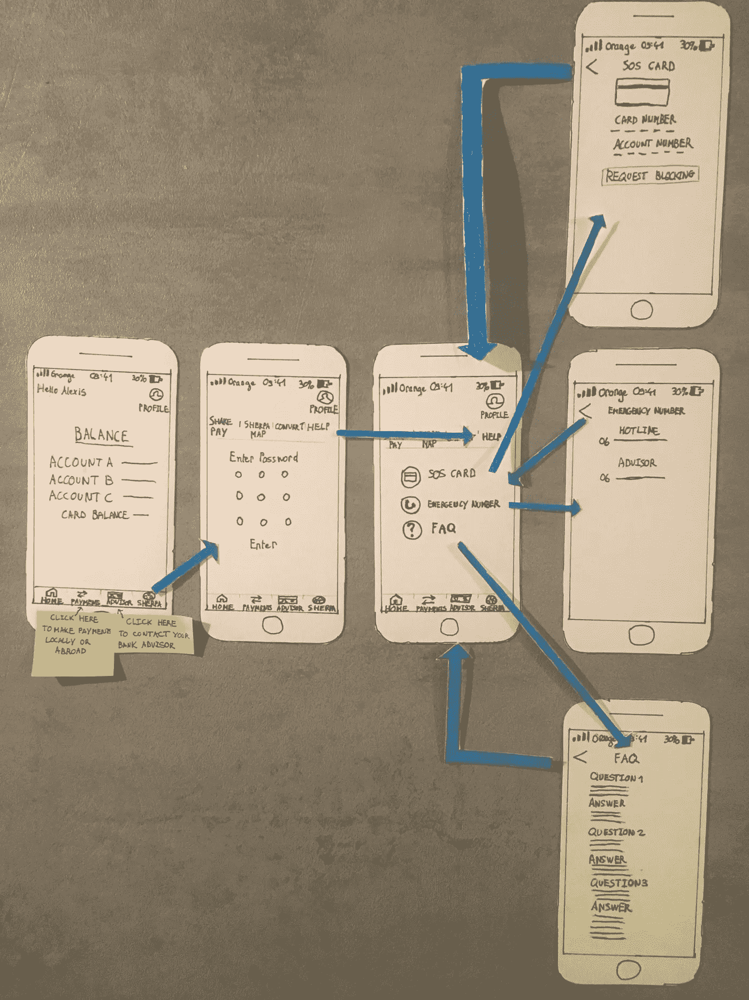

# 亚历克西斯·吉拉蒂 _ 设计思维练习

> 原文：<https://medium.datadriveninvestor.com/alexis-gilardi-design-thinking-exercise-6b2f747d1d91?source=collection_archive---------1----------------------->

UX 学徒的新任务:最近，Whole Bank 的创新主管卡罗尔·霍尔姆斯(Carol Holmes)联系我，为他们的银行应用提供一项新功能，允许人们在国外用手机支付。

# 关于公司

全行成立于美国马萨诸塞州弗雷明汉。他们的使命是为他们的消费者提供创新的金融服务，如虚拟货币，使他们能够以不同的方式储蓄和管理金钱。

# 商业问题

所有银行都意识到，信用卡系统在用户旅行时有其局限性。虽然在国外使用信用卡可以从 ATM 机提取现金并付款，但它也有以下缺点:

*   卡可能会被**盗走或丢失**
*   **有些商店不允许信用卡/借记卡**付款
*   卡片可能会损坏

**基于这一点，整个银行希望让他们的客户访问他们应用程序上的一个功能，以便**直接用他们的手机**支付，而无需任何信用卡/借记卡。**

# **第一步:竞争对手分析**

**由于我不熟悉银行市场上的主要参与者，我开始了这个项目的竞争研究，以检测一些主要竞争对手是否已经在他们的应用程序上开发了类似的电话支付功能。**

**我对所谓的**“新银行”**特别感兴趣，比如 [Revolut](https://www.revolut.com/fr/?lang=en) 或 [N26](https://n26.com/en-fr) 这样的初创企业。这些公司似乎提供了很有竞争力的服务，因为他们允许顾客在国外用借记卡支付和取款，而不需要额外的费用。虽然这些新银行不直接在他们的应用程序上提供任何非接触式支付，**他们的“免费”政策和灵活性**是我在整个项目中肯定会记住的两个主要卖点。**

# **步骤 2:了解用户**

**在对整个银行所面临的竞争环境有了更好的了解后，我显然想更多地了解他们的用户，主要是出国旅行并使用他们的卡的人。**

## **受试者**

**我采访了以下 5 个人，他们很能代表整个银行的新应用功能目标:**

*   **Agnès，57 岁，艺术品经纪人，多年来一直在许多国家旅行。**
*   **Jean-Louis，65 岁，已退休，曾去过包括俄罗斯在内的许多国家旅行，休闲也有商务旅行。**
*   **Claudine，69 岁，退休，正和家人环游世界，并计划去新西兰旅行 3 周。**
*   **Quentin，27 岁，设计师，在英国工作了 4 年。**
*   **Caroline，28 岁，初创公司创始人，在所有与技术相关的领域都非常领先，曾在伦敦和中国工作过一段时间。**

**在这个小组中，我试图保持年龄、职业和对技术熟悉程度的多样性。**

## ****面试****

**为了了解人们在国外如何使用技术和不同的支付方式，我与他们就以下话题进行了松散的对话:**

*   **每天如何使用技术？**
*   **如何使用你的银行应用程序？**
*   **如何进行非接触式支付？**
*   **你能告诉我更多关于你旅行时使用的不同支付方式吗？**
*   **根据你要去的国家，如何使用这些支付方式？**
*   **自您开始旅行以来，您对特定支付方式的选择有何变化？**
*   **你能告诉我你在国外付款遇到困难的时候，你是如何解决的吗？**

## **调查结果**

**在采访了这 5 位用户并记录下他们所说的一切后，我试图找出**的关键点**，这些关键点将定义整个银行在开发新的旅行功能时需要解决的主要问题:**

*   **到目前为止，信用卡/借记卡是出国旅行时最明智的支付手段:它容易使用，随时可用，越来越多的商家接受它。然而，用户承认这样一个事实，即它可能会被盗/损坏，并且一些商家要求用该卡支付最低金额。还有对银行费用的担忧，银行费用总是被认为太高，这需要不同的策略来尽可能地限制它们。**
*   ****现金主要用作借记卡/信用卡的备用选项**。它常用于当地商店的小额交易。携带现金存在安全隐患，一些人觉得他们一提取现金，就已经花掉了。我发现的最后一个观点非常有趣:对一些人来说，用现金支付是与当地人交往的一种方式，也是“商家/顾客”关系人性化的一种方式。**
*   ****在国外使用时，非接触式支付仍处于早期阶段，**主要用于用户不带现金的小额交易(因为非接触式支付的上限为 30€)。当他们被提供时，人们也大多使用非接触式；他们不会主动这样做，这表明围绕这种支付方式缺乏沟通。**

**为了理解**不同的见解/想法是如何联系在一起的**以便更好地理解用户，我尝试综合了以下思维导图中的所有发现。**

****

**A mindmap of my findings**

# **步骤 3:定义问题**

**在了解了竞争对手和用户之后，我觉得自己更有把握彻底定义整个银行(和我)必须解决的关键问题，以提供真正创新的支付功能。**

**在了解了我从研究中获得的最重要的见解和整个银行必须追求的**业务目标**之后，我想到了以下问题:**

> **我们如何让人们使用整个银行应用程序以快速、安全、直观和人性化的方式在国外进行交易，从而使该应用程序成为他们的新旅行伴侣？**

**作为一名“即将成为”UX 设计师的人，我试图在这个问题中抓住**用户和业务需求之间的最佳平衡点**。我还觉得这将使我能够思考许多不同的解决方案，然后我可以缩小范围，只选择最好的一个。我已经使用了 Andy Pipes[的这篇优秀的](https://medium.com/@The_Pied_Pipes)[媒体文章](https://medium.com/@The_Pied_Pipes/how-might-we-write-better-hmws-e7793e0154fc)中建议的过程来写更好的“我们如何能”的问题。**

# **第四步:构思**

**既然问题已经明确，我可以开始考虑所有可能的解决方案，为出国旅行的用户提供最好的支付功能。**

**我首先绘制了我认为用户希望在他们的银行应用程序上看到的所有**操作和功能**，以及所有这些操作如何相互**逻辑关联**:**

****

**A mindmap of the different features of the Whole Bank app**

**我已经用**红色**突出显示了需要**开发的行动/功能**。其余的已经存在于应用程序中，但做这个练习帮助我在原型阶段在不同的菜单/功能之间建立一个层次结构。**

**经过一段时间的思考和构思，我得出的结论是，为了尽可能快速、安全、直观和人性化，这款应用必须在其旅游功能中包含**而不仅仅是电话支付服务**。它必须包括所有必要的服务，用户在国外旅行时会期望在一个新的重新设计的方法:**夏尔巴人。****

**“夏尔巴人”(来自喜马拉雅山搬运工的名字，他们帮助游客在攀登珠穆朗玛峰时搬运行李)是全行应用程序中新推出的旅游功能，包括:**

*   ****摇一摇支付:**出国旅行时用手机支付的一种安全、直观、人性化的新方式。通过在商家的终端上晃动你的手机，几乎感觉你在和他握手。付钱突然变得更人性化了。我也想过用刷卡或倾斜手机来支付，但摇一摇感觉更直观。**
*   ****夏尔巴地图:**一张地图，告诉你附近所有摇一摇支付的合作伙伴在哪里，让你瞬间知道哪里可以使用摇一摇支付。**
*   ****夏尔巴人转换器:**当你远行时，要理解你用什么货币支付并不总是那么容易。夏尔巴转换器可以帮助你将任何金额转换成你最喜欢的货币，所以你总是知道你付了多少钱。**
*   ****夏尔巴人帮助:**丢了卡，有什么问题吗？夏尔巴人会在你旅行时为你提供帮助。**

# ****第五步:建立最佳解决方案的原型****

**现在，我已经从最初的选择中提炼出了我认为最好的想法，我必须制作一个 SHERPA 的原型，以便与利益相关者和用户一起测试它，并收集他们的反馈。在下面的段落中，我解释了包含在 SHERPA 中的 4 个主要特性的原型。**

## **动摇工资**

****

**Shake Pay Paper Prototype**

**用户首先登录，输入他的电子邮件和密码。在下面的屏幕上，他看到了所有账户的余额概况。要访问夏尔巴人，他只需按下右下角的图标。然后，他立即出现在摇一摇支付屏幕上:当他要支付时，他只需输入自己的密码，然后他会被提示摇一摇他的手机，然后在交易完成时收到一条确认消息。因为这种类型的交易必须快速完成，所以我试图尽可能减少用户在应用程序上登录和交易验证之间的点击次数。**

## **夏尔巴人地图**

****

**SHERPA Map Paper Prototype**

**按下夏尔巴人图标后，用户可以按下夏尔巴人地图图标，并将自动看到他周围的地图。地图上的黑色大头针向他显示支持摇一摇支付的不同商店/餐馆。用户也可以按下其中一个引脚，这将变成红色，并会显示在覆盖一些更多的信息，如地址，网站，电话号码。**

## **夏尔巴转换器**

****

**SHERPA Converter Paper Prototype**

**按下夏尔巴图标后，用户可以按下夏尔巴转换器图标。然后，他将能够选择他想看到的货币，键入金额，并按下“转换”来查看结果。**

## **夏尔巴人的帮助**

****

**SHERPA Help Paper Prototype**

**按下 SHERPA 图标后，用户可以按下 SHERPA 帮助图标。他有三个选择:**

*   ****SOS 卡:**如果信用卡被盗，启动该流程以冻结信用卡。**
*   ****紧急号码:**拨打紧急热线或银行顾问。**
*   ****常见问题:**阅读常见问题。**

**对于这些屏幕中的每一个，我没有包括底部工具栏，因为我认为这 3 个菜单只有在紧急情况下才会看到，用户需要全神贯注，而不会被太多的图标分散注意力。**

# **结论**

**有了 SHERPA，我想我已经设法找到了整个银行**的业务需求**和**的用户需求**之间的最佳平衡点**，为**提供了全面的功能**，我希望它能成为人们最喜爱的旅行伴侣。也就是说，该功能仍然需要通过**用户测试**和进一步的原型开发来改进和完善。****

# **我从这个练习中得到的主要收获**

**首先，我发现这个练习非常有趣，富有挑战性和趣味性。在用户研究阶段，我发现了自己从未想过的见解，这种感觉棒极了。当我试图提炼问题时，将所有的发现/用户痛点合并成一个(相当)简洁的问题，真的很令人兴奋。在构思和原型阶段，我可以看到我的想法成形，这真的很令人满意。**

**也就是说，这个练习一点也不容易，而且完成的时间比预期的要长。这绝对是我想继续做下去并做得更好的运动。**

**我也喜欢继续设计思维过程，并与用户一起测试我的纸上原型，以帮助完善和改进这个概念。**

**最后，我迫不及待地想学习如何使用数字工具来帮助制作线框和更高逼真度的原型。这些是我成为 UX 绝地之旅的关键要素！**

****