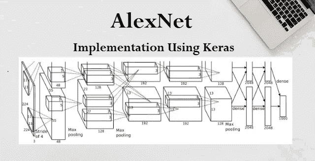
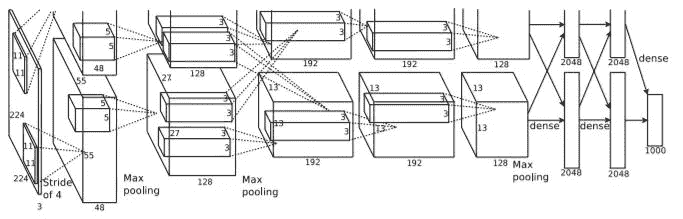
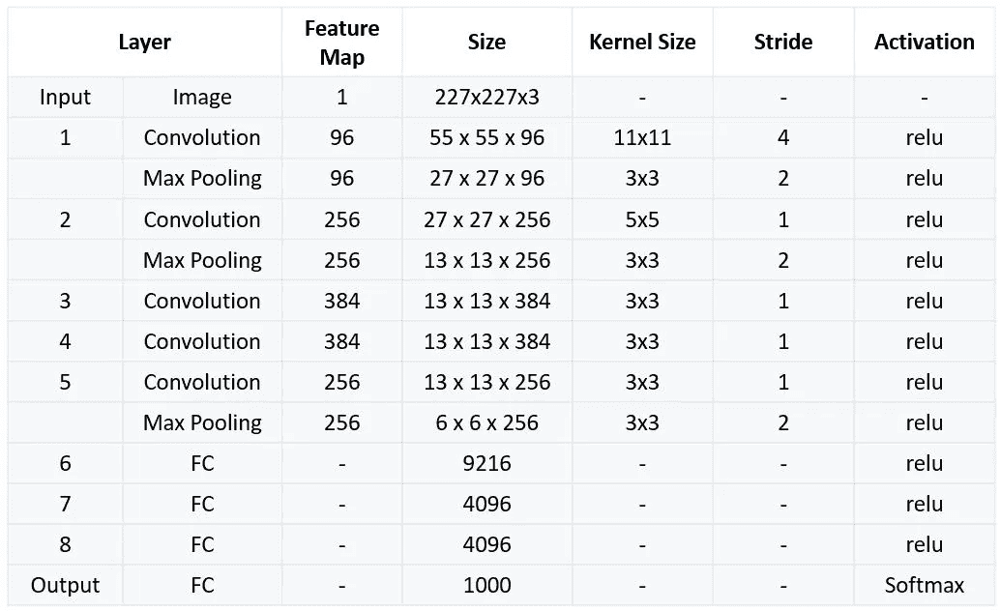

# 使用 Keras 实现 AlexNet

> 原文：<https://medium.datadriveninvestor.com/alexnet-implementation-using-keras-7c10d1bb6715?source=collection_archive---------0----------------------->

# 简介:

Alex Krizhevsky、Geoffrey Hinton 和 Ilya Sutskever 创建了一个名为“AlexNet”的神经网络架构，并在 2012 年赢得了图像分类挑战赛(ILSVRC)。他们在 120 万张高分辨率图像上训练他们的网络，分成 1000 个不同的类别，有 6000 万个参数和 65 万个神经元。培训是在两个具有分离层概念的 GPU 上进行的，因为当时 GPU 有点慢。

> 原文可在 [ImageNet 使用深度卷积神经网络分类](https://papers.nips.cc/paper/4824-imagenet-classification-with-deep-convolutional-neural-networks.pdf)获得
> 
> 还要检查:[卷积神经网络](https://engmrk.com/convolutional-neural-network-3/)和 [LeNet-5](https://engmrk.com/lenet-5-a-classic-cnn-architecture/)

# AlexNet 架构:

AlexNet 架构由五个卷积层组成，其中一些是最大池层，然后是三个全连接层，最后是 1000 路 softmax 分类器。

Original Architecture Image from [Krizhevsky et al., 2012.]

在最初的论文中，所有的层被分成两层，以在单独的 GPU 上训练它们。由于这是一个复杂的安排，难以理解，我们将在一个层的概念实现 AlexNet 模型。

Simplified AlexNet Architecture Video

**第一层:**

AlexNet 的输入是 227x227x3 RGB 图像，该图像通过具有 96 个特征图或滤波器的第一卷积层，特征图或滤波器的大小为 11×11，跨距为 4。图像尺寸变为 55x55x96。

然后，AlexNet 应用最大池层或子采样层，过滤器大小为 3×3，跨距为 2。生成的图像尺寸将缩小到 27x27x96。

**第二层:**

接下来，是具有 256 个特征图的第二卷积层，其大小为 5×5，跨距为 1。

然后，再次出现最大池层，过滤器大小为 3×3，跨度为 2。此图层与第二个图层相同，只是它有 256 个要素地图，因此输出将减少到 13x13x256。

**第三、四、五层:**

第三、第四和第五层是卷积层，滤波器大小为 3×3，步长为 1。前两个使用 384 个特征地图，而第三个使用 256 个过滤器。

三个卷积层之后是最大池层，过滤器大小为 3×3，步长为 2，具有 256 个特征图。

**第六层:**
卷积层输出通过全连通层展平，9216 个特征图，每个尺寸为 1×1。

**第七层和第八层:**
接下来又是两个 4096 单元的全连接层。

**输出层:**
最后还有一个 softmax 输出层ŷ，有 1000 个可能值。

Summary of AlexNet Architecture

# 实现 AlexNet 模型的 Python 代码:

从 keras.models 导入 keras
从 keras.layers 导入 Sequential
从 keras.layers 导入 Dense、Activation、Dropout、Flatten、Conv2D、MaxPooling2D】从 keras.layers.normalization 导入 BatchNormalization
导入 numpy 作为 np
np.random.seed(1000)

#实例化一个空模型
model = Sequential()

#第一卷积层
model.add(Conv2D(filters=96，input_shape=(224，224，3)，kernel_size=(11，11)，strides=(4，4)，padding='valid ')
model . add(Activation(' relu ')
# Max Pooling
model . add(maxpooling 2d(pool _ size =(2，2)，strides=(2，2)，padding = ' valid '))

#第二卷积层
model . add(Conv2D(filters = 256，kernel_size=(11，11)，strides=(1，1)，padding='valid ')
model . add(Activation(' relu ')
# Max Pooling
model . add(maxpooling 2d(pool _ size =(2，2)，strides=(2，2)，padding = ' valid '))

#第三卷积层
model . add(Conv2D(filters = 384，kernel_size=(3，3)，strides=(1，1)，padding = ' valid ')
model . add(Activation(' relu '))

# 4 卷积层
model . add(Conv2D(filters = 384，kernel_size=(3，3)，strides=(1，1)，padding = ' valid ')
model . add(Activation(' relu '))

#第五卷积层
model . add(Conv2D(filters = 256，kernel_size=(3，3)，strides=(1，1)，padding='valid ')
model . add(Activation(' relu ')
# Max Pooling
model . add(maxpooling 2d(pool _ size =(2，2)，strides=(2，2)，padding = ' valid '))

#将其传递给一个全连接层
model.add(Flatten())
#第一个全连接层
model.add(Dense(4096，input_shape=(224*224*3，))
model . Add(Activation(' relu '))
# Add Dropout 防止过拟合
model.add(Dropout(0.4))

#第二全连接层
model . Add(Dense(4096))
model . Add(Activation(' relu '))
# Add Dropout
model . Add(Dropout(0.4))

#第三全连接层
model . Add(Dense(1000))
model . Add(Activation(' relu '))
# Add Dropout
model . Add(Dropout(0.4))

#输出层
model . add(Dense(17))
model . add(激活(' softmax '))

模型.摘要()

#编译模型
model . Compile(loss = keras . loss . category _ cross entropy，optimizer='adam '，metrics=["accuracy"])

*原载于 2018 年 10 月 5 日 engmrk.com***。**