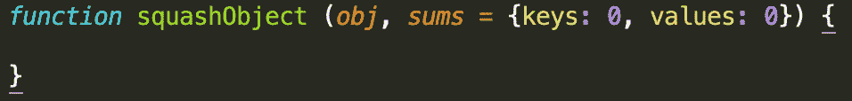
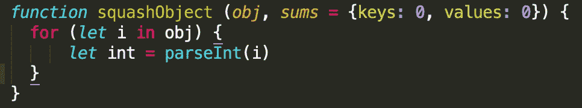
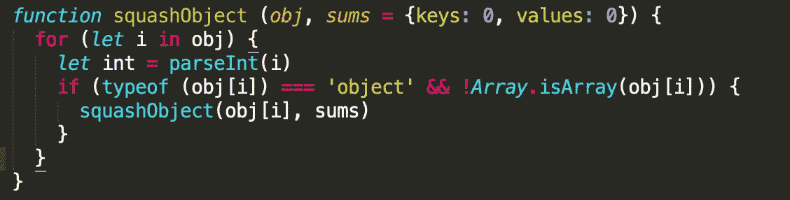
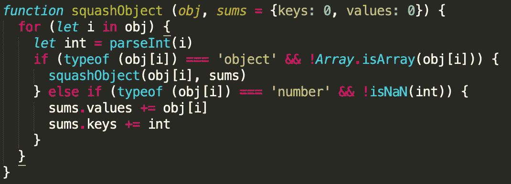
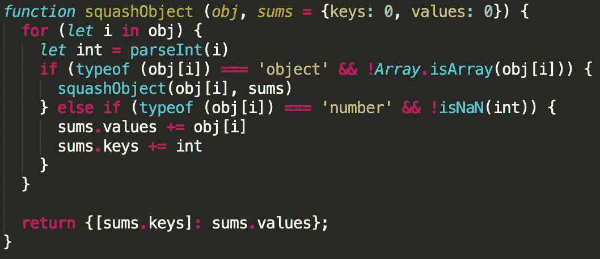

# 算法实践(第三部分)

> 原文：<https://medium.datadriveninvestor.com/algorithm-practice-part-3-f7e1e1e65147?source=collection_archive---------4----------------------->

[](http://www.track.datadriveninvestor.com/1B9E)

[第一部分](https://medium.com/@angelospmusic/algorithm-practice-part-1-f127532b837a?source=---------5------------------) || [第二部分](https://medium.com/@angelospmusic/algorithm-practice-part-2-6badfbd5ff3?source=---------4------------------)

今天，我将介绍一个我在道琼斯面试时遇到的算法。这是我得到的对这个问题的解释:

```
// This function accepts an object and returns
// an object with a single key-value pair.// It should search through an object and find
// key-value pairs where both are numbers.// It should then return an object where the key
// is the sum of all valid keys, and the value is
// the sum of all valid values.
```

以下是他们给出的两个示例对象和预期结果:

```
const object1 = {
  1: 5,
  2: {
    3: 2,
    9: 6,
    'a': {
     2: 'hello world',
     7: 5,
     3: false
    }
  }
};const object2 = {
  4: 3,
  'foo': {
    0: 9,
    5: 5,
    4: {
      6: ['bar', 7, true],
      1: {
        2: 10
      }
    }
  }
};console.log(squashObject(object1))
// returns {20: 18}console.log(squashObject(object2))
// returns {11: 27}
```

本质上，我们需要遍历每个对象，找到都是数字的键/值对，将它们相加，最后在最后将它们返回到一个对象中。所以，如果键是一个数字，值是一个包含数字的数组，我们就不包含它们。它们都必须是整数才能包含在内。

[](https://www.datadriveninvestor.com/2019/03/22/the-seductive-business-logic-of-algorithms/) [## 算法诱人的商业逻辑|数据驱动的投资者

### 某些机器行为总是让我感到惊讶。我对他们从自己的成就中学习的能力感到惊讶…

www.datadriveninvestor.com](https://www.datadriveninvestor.com/2019/03/22/the-seductive-business-logic-of-algorithms/) 

# 找到解决方案

## 争论

在问题描述中，提到了我们需要编写的函数(`squashObject`)接受一个对象作为参数。对于我的解决方案，我决定添加第二个对象参数，该参数将在每次函数递归运行时更新(如果找到一个数字的键/值对)。下面是我的函数带有两个参数的样子:



该函数需要返回一个对象，将作为键/值整数对一部分的键的总和作为键，将作为键/值整数对一部分的值的总和作为值，因此第一次调用该函数时，我正在初始化`sums`对象。

## 循环

整个函数(除了返回的内容)将被封装在一个 for…in 循环中。这使我们能够遍历输入对象的键。



我将对象的键转换为整数，因为 JavaScript 将对象的键视为字符串，即使它们被初始化为整数。我将它保存为变量`int`，稍后我将使用它来决定我是否应该增加我的`sums`对象。

## 条件式

在循环内部，我有两个条件。下面演示了第一种方法；如果我们正在查看的键值是一个对象，我们递归调用`squashObject`并遍历这个新的嵌套对象。



> 注意:在 JavaScript 中，数组是对象。这可能会导致一些混乱，看看这个小例子:

```
obj = {}
arr = []typeof(obj) // returns 'object'
typeof(arr) // returns 'object'
```

因此，我不仅要检查`obj[i]`是否是一个类型‘object ’,还要检查它是否是一个数组。

第二个条件是 sums `gets`递增的地方。我正在检查`obj[i]`的值是否是一个数字(由于`parseInt`线，我已经知道我是否是一个数字)，我还在检查以确保`i`不等于`NaN`。



如果这些条件评估为真，我将`values`键增加`obj[i]`的值，并将`keys`值增加`int`。剩下唯一要做的事情就是返回请求的对象。



这是完整的解决方案！如果有人对如何改进这个算法有任何建议，请告诉我。