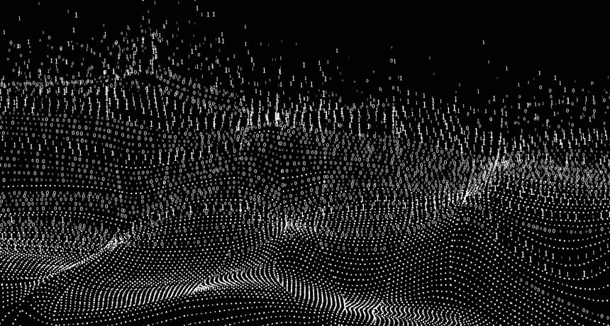
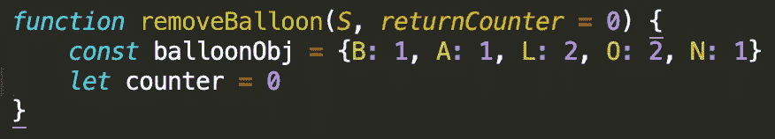
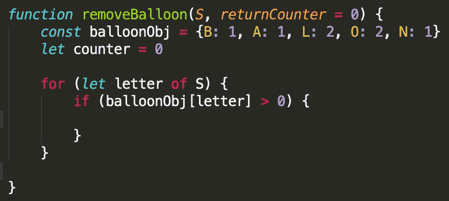
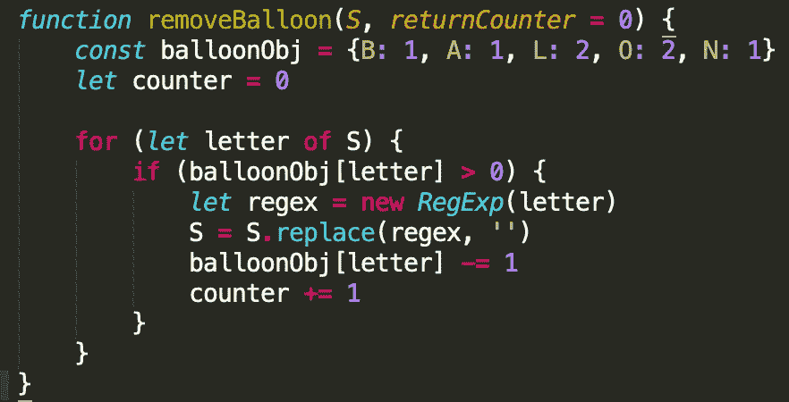
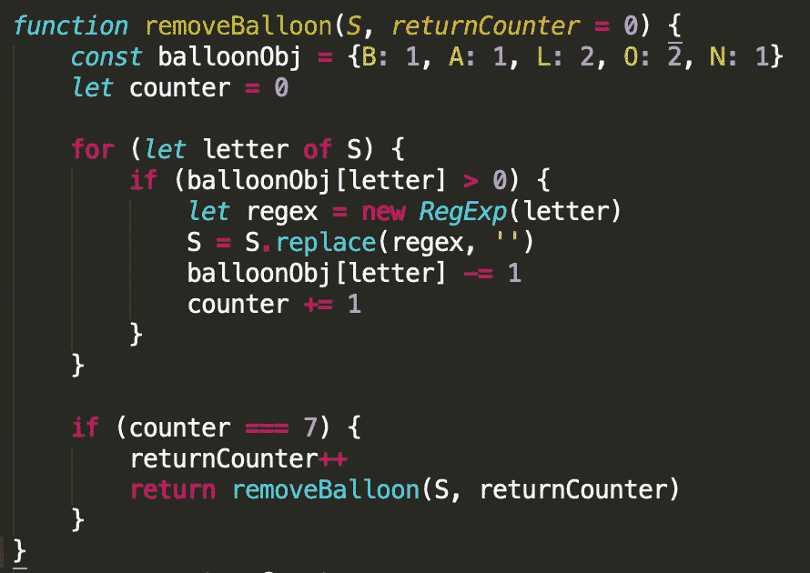
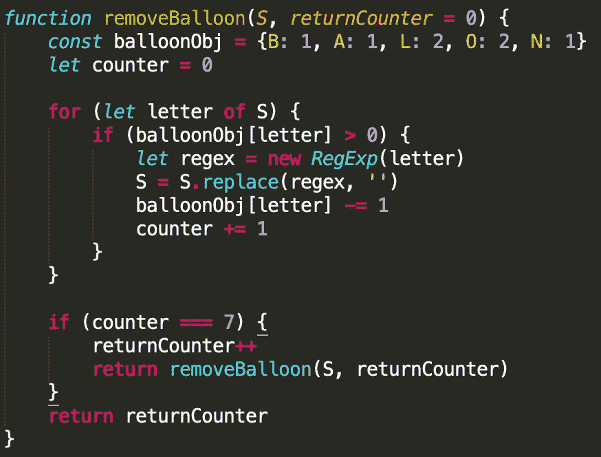

# 算法实践(第四部分)

> 原文：<https://medium.datadriveninvestor.com/algorithm-practice-part-4-1c65d86fc90b?source=collection_archive---------1----------------------->

[第 1 部分](https://medium.com/@angelospmusic/algorithm-practice-part-1-f127532b837a?source=---------6------------------) || [第 2 部分](https://medium.com/@angelospmusic/algorithm-practice-part-2-6badfbd5ff3?source=---------5------------------) || [第 3 部分](https://medium.com/datadriveninvestor/algorithm-practice-part-3-f7e1e1e65147?source=---------4------------------)

在本周的《算法实践》中，我将回顾一下在西北互助大学第二轮技术面试中给我的一个关于气球的问题。这是他们给出的解释:

# 找到解决方案

 [## 算法诱人的商业逻辑|数据驱动的投资者

### 某些机器行为总是让我感到惊讶。我对他们从自己的成就中学习的能力感到惊讶…

www.datadriveninvestor.com](https://www.datadriveninvestor.com/2019/03/22/the-seductive-business-logic-of-algorithms/) 

## 分解它

这个问题是要求一个函数根据从输入字符串`S`中移除“BALLOON”的次数返回一个数字。重要的是“BALLOON”里的所有字母都在那里，它们是否按顺序排列并不重要。如果“BALLOON”中的所有字母被删除一次，函数应该返回 1，如果被删除两次，应该返回 2，以此类推。

## 参数和变量声明

第一步是向函数添加第二个参数，我称之为`returnCounter`。这是在函数结束时返回的数字，并用默认值初始化，这样当`removeBalloon` 被递归调用时，它的值不会被重置。`returnCounter` 将在每次“气球”从`S`移除时递增，但我们稍后会谈到这一点。

我将`balloonObj`初始化为一个对象，键是单词中的字母，值是该字母在单词中出现的次数。我将使用这个对象来确定“气球”何时从`S`中完全移除。

每当从`S`中删除“balloon”中的一个字母时，`counter`变量将递增，当它达到 7(等于单词“BALLOON”中的字母数)时，`returnCounter`将递增 1，该函数将被递归调用。我有点超前了，在下一节中会有更多关于这个变量的内容！

## For 循环和条件

我添加了一个 for…of 循环，遍历`S`中的每个字母。如果字母键入`balloonObj`并且值大于 0，那么将运行以下代码:

条件语句后的第一行是创建一个定制的正则表达式——基于我们从`S`收到的信。关于这方面更深入的指导，我推荐[这篇堆栈溢出文章](https://stackoverflow.com/questions/4371565/create-regexps-on-the-fly-using-string-variables)。下一行使用这个新的正则表达式通过`replace()`重新分配`S`的值，这实质上是找到并删除这个字母。如果`S`在函数开始时是“BAONXXOLL”，现在将是“AONXXOLL”。

接下来，值`balloonObj[letter]`递减 1。如果我们看到的是“BAONXXOLL”的第一个字母，那么在这一行之后,`balloonObj['B']`将会是 0。最后，`counter`加 1。记住`counter`将用于确定“气球”何时从`S`中完全移除。

## 递归

现在我们到了这个谜题的最后一块。如果`counter`等于 7，这意味着`balloonObj`中的所有值都是 0，是时候再次运行该函数来查看`S`中的某个地方是否有另一个完整的“气球”。这也是`returnCounter`递增的地方，并将其新值传递给`removeBalloon()`的递归调用。最后一步是返回值，因为我们现在返回的只是函数的递归调用。

The full `removeBaloon()` function!

在我们所经历的一切过去之后，我要回来了。如果在`S`中没有找到“气球”,则等于 0，否则为“气球”被移除的次数。

## 时间复杂度

我意识到这个解决方案不是最有效的，目前，它是 O(n ),因为`replace()`嵌套在 for 循环中。我正在想办法改进它，如果有人有任何改进的建议，请告诉我！