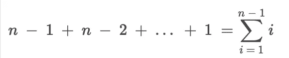
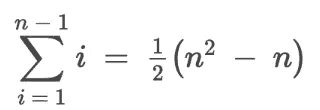
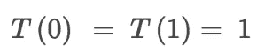
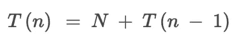
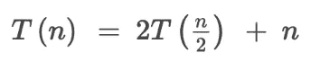

# 算法工具包:排序

> 原文：<https://medium.datadriveninvestor.com/algorithm-tool-kit-sorting-34728eff59a6?source=collection_archive---------8----------------------->


Photo by [Soraya Irving](https://unsplash.com/@traxing?utm_source=unsplash&utm_medium=referral&utm_content=creditCopyText) on [Unsplash](https://unsplash.com/search/photos/sorting?utm_source=unsplash&utm_medium=referral&utm_content=creditCopyText)

我已经在之前的文章[这里](https://medium.com/@baeddavid/algorithm-tool-kit-arrays-3dc70bb24085)中简单地谈过排序算法。经过一番深思熟虑，我决定写一篇关于排序的完全独立的文章，因为它在计算机科学的所有分支中都扮演着不可或缺的角色，并且很有可能出现在你的下一次技术面试中。

# 为什么它很重要

排序算法对了解和学习都很重要，因为我们可以从每个算法中获得关键的设计和实现。对于每个技能水平，排序算法的收获是不同的，因此开发人员总是通过研究它们来学习一些东西。

[](https://www.datadriveninvestor.com/2019/03/22/the-seductive-business-logic-of-algorithms/) [## 算法诱人的商业逻辑|数据驱动的投资者

### 某些机器行为总是让我感到惊讶。我对他们从自己的成就中学习的能力感到惊讶…

www.datadriveninvestor.com](https://www.datadriveninvestor.com/2019/03/22/the-seductive-business-logic-of-algorithms/) 

一个计算机科学新手可能会发现选择排序中的最小元素查找器特别有启发性，而一个更有经验的开发人员可能会通过研究更高级排序(如计数排序)背后的数学来学习一些新东西。

# 为什么我们应该排序

我们作为人天生就能在我们看到的任何事物中找到模式。如果出现`A B C A B ?`，你应该能够立即说`C`不见了。
我们已经确定了模式。那么这和排序有什么关系呢？

当我们对某样东西进行分类时，找到规律要比让它处于混乱状态容易得多。以下面的解决方案为例

Majority Element via Map

我们使用一个映射，对一个元素的每个实例进行计数，然后返回计数大于 *n* 的任何元素。它的时间复杂度为 O(n)，空间复杂度为 O(n)。将其与排序后的解决方案进行比较:

Majority Element Via Sort

与地图解决方案中的 14 行相比，我们有 4 行。我们将代码缩短了 10 行，可读性更好！

然而，生活中没有免费的东西。为了使我们的代码更短更易读，我们不得不牺牲时间。第二个方案的时间复杂度是 O(n log n) 。请记住，当使用默认排序引擎时，排序算法总是 *O(n log n)* ，因为它们大多使用快速排序或合并排序。

# 术语

在我开始向你抛出一个又一个排序算法之前，让我们先了解一些术语。

**比较排序**——通过比较元素来排序元素的任何排序算法。并非所有排序算法都使用比较。稍后我会详细介绍。

**稳定/不稳定** -稳定的排序算法不会重新排列相同值的键。换句话说`if x and y are adjacent elements in an unordered sequence AND x = y AND x comes before y THEN x comes before y in the new sorted sequence`。

**分而治之**——一种递归设计范式，通过将阵列分成更小、更易管理的部分，解决它们，然后组合它们来工作。一些最有效的排序算法是分治法。稍后我们将讨论两个重要的问题。

**时间复杂性**——这值得一个属于自己的帖子，我发誓有一天我会写出来，但现在这里有一个简短的介绍，告诉你排序需要知道什么。

*   **大 O 记法-** 说白了就是一个算法的绝对最差运行时间。没有比这更糟糕的了。在数学术语中，*它是给定函数 f(x)的渐近上界。对于更懂数学的人来说，你会知道我对数学定义的解释意义重大。*
*   **摊销时间(Theta 符号)-** 如果我们有一个平均来说相当快的函数，但是最差情况下的时间真的很差呢？我们可以称之为**θ符号**，用θ表示。如果我们能证明最坏情况是例外情况，我们可以继续说:*给定一个函数 f(x)其时间复杂度为 O(y)，其中 y 是自然数，但平均时间为θ(z)，其中 z < y，我们可以说 f(x)有一个* ***的摊销时间*** *为 O(z)。*

# 基本分类

有许多排序算法，但有三种被认为是基本的排序算法。算法很简单，不会有太多深入。更应该把这看作是对它们如何/为什么工作的介绍。

## 冒泡排序

冒泡排序是大多数人对排序算法的介绍。它很简单，很简短，也相对容易解释。冒泡排序比较两个相邻的元素，如果其中一个较大，就交换它们。因此，较大的元素慢慢“冒泡”到数组的末尾。

让我们一次一行地浏览代码。第 2 行中的第一个 for 循环是“占位符”，因为没有更好的术语。它本质上告诉我们什么元素在它正确的位置上。

第二个 for 循环是我们的“swap”循环。这个循环负责将较大的元素冒泡到数组的末尾。第 5 行的 if 语句检查`j + 1`左边的元素是否更大。如果是，将它们交换到正确的顺序。当我们点击`i == arr.length — 1`时，我们可以终止算法。

一些读者可能想知道为什么我们只去`arr.length — 1`而不仅仅是`arr.length`。这是因为我们带有`j`的内部 for 循环检查了`i`旁边的元素。for 循环中的这个小变化让我们将算法减少了 1 次比较。

冒泡排序的时间复杂度为 O(n)。因为我们为`i`的每个值遍历数组。

由于第 4 行的原因，冒泡排序**是**稳定排序。如果元素是相同的，排序将不会触及它们。

## 选择排序

在我看来，选择排序是更直观的排序算法。不像冒泡排序，我们试图冒泡最大的元素，我们试图找到最小的元素，并将它们插入到数组的前面。

让我们再看一遍算法。

第 2 行中的第一个 for 循环遍历数组设置`minIdx`到`i`。第 4 行的内部 for 循环检查`i`之后的每个元素。如果在任何点上`j`处的元素小于`minIdx`处的元素，我们将`minIdx`设置为`j`的值。

当我们的内部 for 循环终止时，我们已经成功地找到了第*n*个最小元素，其中 *n* 是 *i* + 1。在完成外部 for 循环的迭代之前，我们交换索引`i`和`minIdx`处的元素。

由于嵌套的 for 循环*，选择排序的时间复杂度也是 *O(n )* 。*你可能会说:
*“但是大卫，内 for 循环从* `*i + 1*` *开始所以不可能是 O(n)！!"*
这就是我们需要用一点数学来证明时间复杂度的地方。如果你不喜欢数学，你应该马上离开。就像现在。

我们知道选择最小元素需要进行*n1*比较。寻找下一个最小的元素需要进行*N2*比较。这样一直持续到我们没有任何元素剩下。我们可以这样表达



Summation Expression for Selection Sort

然后我们可以使用*级数*来减少这个



Reduced

当计算大 O 符号时，我们去掉常数和非支配项。这就给我们留下了 n，我们可以用大 O 项来表示。你现在安全了，不再有数学了。

选择排序是**而不是**稳定排序。这是因为如果在数组末尾`x = y AND x comes before y`处有两个相同的最小值，选择排序将在`x`之前选择`y`，并将其排列为现在`y comes before x`。

## 插入排序

插入排序是“酷”的基本排序。这是因为有些排序使用插入排序作为基础，即外壳排序和库排序。与最后两种排序算法不同，它向后工作。我们选择一个元素，并将其表示为`key`。然后我们比较 key，从数组的末尾开始向前移动元素，直到找到元素的正确位置。

一行一行地遍历它，我们看到我们的 for 循环从索引 1 开始。这是因为插入排序需要一点缓冲来检查索引`i`后面的元素。
我们将 key 初始化为等于索引`i`处的元素，并开始向后工作，直到数组的前面。
**只要元素大于键，我们就继续向上“撞击”它们，直到为*键找到合适的位置。*** 这对于插入排序非常重要，因为这是算法的“排序”部分。

插入排序的时间复杂度为 *O(n )* 并且**是**稳定排序。

现在我们已经完成了 3 种基本排序，让我们进入真正酷的排序算法。

# 各个击破

在进入本节的算法之前，我应该先说明，本节要求你对递归有所了解。你不需要成为递归大师；你只需要了解概念。

分而治之是一种递归算法范式，递归地创建类似的子问题，直到我们能够解决它们。然后将这些小的解决方案组合起来。用外行的话来说，我们把问题分成可管理的块，解决它们，然后组合它们。

我应该再次声明，这一节将会有大量的数学内容。我不喜欢，你不喜欢，但是必须要做。抱歉。

## 快速排序

这是我们要讨论的订单的一个快速要点列表，包括快速排序。

*   设置。
*   划分算法
*   递归调用
*   时间复杂度
*   最佳化

## 设置

快速排序使用额外的算法来进行排序。所有实际的快速排序算法只是把它分成两半。特殊算法是**分割算法**。我们需要传递给它的参数是左边的**数组，右边的**和**。**

## 划分算法

分区算法是一个简单的算法，它将数组围绕一个叫做**的特殊元素进行分区。**支点非常特别，意思是它的特别没有特别的原因。出于划分算法的目的，我们选择数组的最后一个元素作为枢纽。

当我们划分数组时，所有小于或等于枢轴的元素被放在枢轴的左边，所有大于枢轴的元素被放在右边。

这个算法有点简单。`left`是最左边的元素，`right`是最右边的元素。我们使用两个指针，一个在循环内部声明，另一个在循环外部声明。`i`代表我们的元素小于或等于支点。`j`代表我们的元素大于我们的支点。我们滑动和交换指针，取决于它们是否大于支点。当我们到达数组的末尾时，我们将大于侧的*中最左边的元素与枢轴交换以完成分区。*

嘣！我们完了。该算法在 *O(n)* 时间内运行，实现起来非常简单。

在我们进入下一部分之前，让我们快速浏览一下我们返回的内容。我们返回的是枢纽的索引，而不是元素的索引。这是因为枢纽索引是快速排序核心。我将在下一节详细解释。

## **递归调用**

到目前为止，快速排序还算不错。现在事情开始变得有点棘手了。我先把代码贴出来，然后再解释发生的一切。

我们这里有 8 行代码，但是他们做的工作量是令人难以置信的。我会尽力解释的。

我将从为我们定义基本情况开始。基本情况是当**左<右**时。这是因为当左边比右边少**而不是**时，我们有一个包含 1 个元素的数组。我们不能再用一个元素分割数组了，所以我们可以继续并返回它。同样，假设只有一个元素的数组是有序的也是合理的。

棘手的部分是递归情况。当离开< right, we need to perform 3 key operations. Using the partition function from earlier, we get the index of the pivot of the array.

After we have found the pivot, we recursively call Quick Sort on the elements leading up to the pivot and on the elements after the pivot. The pivot is untouched by our recursive call. This is the key to our sort. If we are able to perform partition on subarrays of size *n / 2* 其中 *n* 是数组的大小，直到 *n=1* 我们将有我们排序的数组。

为了澄清，我们继续进行递归调用，直到我们到达我们的基本情况。当我们最终返回我们的数组时，我们的数组将被之前所有递归调用的有序“支点”填充。

## 时间复杂度

有多快？是 *O(n)。*我知道这很令人失望。我炒作你说这是超快速排序算法，其实是二次时间排序。抱歉。但是如果只有很小一部分时间是 T2 呢？如果它大部分时间运行在 *O(n log n)* 时间呢？这就是摊销时间分析的用武之地。如果你忘记了那是什么，或者只是没有阅读上面的内容，我将带你了解这里的情况。

如果我们可以证明最坏情况的时间复杂度是一种罕见的情况，并且平均情况的时间复杂度更有价值，我们可以这样表达:快速排序的摊销时间为 *O(n log n)* 。

酷！那么证据是什么呢？为了找到证据，我们首先需要找到为什么它有时会这么慢。我们可以通过使用一个叫做*递归关系的小东西来实现。* **当心。我们现在开始学数学。**



Base case for O(n²)



Recursive Case for O(n²)

这组方程就是我们所说的*递推关系*。这个特殊的方程组是快速排序的最坏情况时间复杂度的递归关系。对于精通数学的读者来说，你会对此感到困惑，因为这与快速排序根本不匹配。通过将 *n* 减 1，快速排序不起作用。那么这是什么废话？

这是因为快速排序最糟糕的情况是数据透视表是数组中最大或最小的值。这是因为当我们分割一个数组并递归调用它时，我们最终为每个元素分割数组。我们在分区处分割数组，**但是**分区在数组的前端或末端，所以我们有一个不平衡的分区。

现在，在你拿出你的干草叉并要求我包含一个不同的 *O(n log n)* 排序之前，让我解释一下为什么我们可以把快速排序称为 *O (n log n)* 排序。

当快速排序工作时，它**真的**工作*。这是因为在快速排序的理想情况下，它继续将每个数组分成两半，对其执行分区函数，然后递归地更深入。通过将每个数组大小 *n* 分成两半，其中*n*2，我们创建了 *log n* 级递归。并且在每一层，如果我们对它执行具有 *O(n)* 时间的划分算法，我们得到组合时间 *O(n log n)* 。这是它的递归关系。*


Base case for O(n log n)



Recursive Case for O(n log n)

你可以在递归的例子中看到，我们把数组分成两个独立的部分，并在递归层次上执行一个 *O(n)* 操作。

## 最佳化

好了，这是一个相当大的数学量，我们已经完成了快速排序。所以你可能想知道我们是否能以任何方式优化快速排序。答案是肯定的。有很多方法可以优化快速排序，实际上很多，我不会一一列举。相反，我将使用 CLRS 在*算法简介*中提到的两种方法。

*   **随机化
    这给了我们一点安全，比正常的快速排序要好，但我们可以做得更好。**
*   **三中值** 这是一个相当酷的优化。它不能保证快速排序的理想情况，但是它可以保证我们不会遇到最坏的情况。三中值的工作原理是取数组的第一、中间和最后一个元素。通过一系列的 *O(1)* 检查，我们能够找到那三个的中间值。然后，我们将该值与最后一个索引的值进行交换，确保我们没有完全片面的快速排序。

快速排序就是这样！我知道这已经很多了，但是我们还有两种我很想讲的，所以请多陪我一会儿。

## 合并排序

这是我们将要讨论的合并排序的快速列表

*   设置
*   合并算法
*   递归调用
*   时间复杂度
*   用例

## 设置

合并排序的设置与快速排序非常相似。合并排序使用合并算法，而不是分区算法。所以让我们开始吧。
注意*合并排序的实现将不使用任何内置的本地 JavaScript 方法，即 slice、concat、splice。这是因为我相信，当使用这些方法时，算法的一些复杂性就消失了。

## 合并算法

好吧。在这里。合并算法。这里有很多东西要做，实际上比分区算法要多得多，所以我们要一步一步来。

我们首先传入 4 个参数: **arr，left，mid，**和 **right** 。然后我们初始化两个数组`L`和`R`。为了找到我们必须迭代的点，我们做一点数学。

我们通过从`mid`中减去`left`并加 1 得到`L`的大小。我们通过从`right`中减去`mid`得到`R`的大小。我们开始插入数组，使用传递给函数的参数来跟踪我们的位置。

在推进我们的元素后，我们准备“合并”它们。我们初始化三个变量，`i = 0`、`j = 0`和`k = left`。我们现在开始清空数组。

当`L`和`R`不为空时，我们开始将两个数组清空到`arr`。如果`L[i] <= R[j]`我们在索引`k`处将其插入`arr`。然后我们增加`i`和`k` 1。否则我们从`R`插入一个元素到`arr`的索引`k`处，将`k`和`j`都增加 1。

当其中一个数组为空时，循环终止。当循环终止时，我们的一个数组是空的。我们现在必须将非空数组的元素推入`arr`。嘣！我们完了。

但是代码到底做了什么呢？对于那些在编码时没有理解的人来说，这完全没问题，因为代码一开始就让人不知所措。真正发生的是，我们将数组的两个有序部分合并成一个统一的有序数组。但是等等…这个数组还没有排序？那我们怎么得到两个排序后的一半呢？你的冷嘲热讽绝对正确。数组的两部分没有排序。这就是我们递归调用的地方。

## 递归调用

还记得我在快速排序一节中说过，我们可以假设一个只有一个元素的数组是有序的吗？这正是我们要利用的优势。快速排序通过在有序位置设置枢轴来排序，而合并排序通过合并排序的子数组来排序。

哒哒！！！下面是为我们拆分数组的代码。类似于快速排序，我们的基本情况是相同的，因为我们希望创建大小为 1 的子数组。一旦我们的递归树*见底*，我们就开始合并它们。注意，在这种排序中，我们实际上是在 if 检查内部，而不是像快速排序那样在外部，因为我们需要将新合并的子数组传递回递归树。

## 时间复杂度

与快速排序不同，这种排序没有诡计。归并排序有一个最好情况、一般情况和最坏情况的时间复杂度 *O(n log n)* 。这是因为**只有**的递归关系是这样的。**又是数学。不喜欢就回头。**


Base Case for Merge Sort


Recursive Case for All Time Complexities

它等同于快速排序。这是因为它们本质上有相同的前提，但执行方式不同。我们将数组划分为可管理的小块，并在递归层执行一个 *O(n)* 函数。

嘭！现在你知道了两个基本的分治排序算法。如果你理解了所有的数学知识，并且能够解释为什么两种算法的时间复杂度是一样的，那么你就解决了一个亚马逊白板问题。

很多人知道这些排序是什么，也知道时间复杂度是什么，但是他们不知道为什么。但不是你。你现在知道为什么了，你也可以用数学来解释。记住，时间是 *O(n log n)* ，因为当我们分割数组时有 *log n* 级递归，我们在每一级递归上执行 *O(n)* 操作。

# 结束游戏

因为你们一直呆在这里超级酷，我将用我最喜欢的排序算法来对待你们:计数排序。

## 计数排序

计数排序是一种基于非比较的排序算法。这是什么意思？这意味着计数排序不比较元素来找到元素的正确顺序。那不是很疯狂吗？

先简单解释一下它的工作原理。

计数排序的工作原理是创建一个额外的数组作为缓存。缓存的大小等于原始数组的最大元素。然后，我们遍历原始数组，对原始数组中的元素进行计数，并使用索引作为键将计数值放入缓存数组中。

```
Original: [1,4,1,3,2,2,4]
Cache:    [0,2,2,1,2]
```

例如，我们的原始数组有 2 个 1，因此在缓存数组的索引 1 处，我们将其赋值为 2。缓存数组后，我们开始将缓存数组清空到原始数组中。

```
Original: [1,4,1,3,2,2,4]
Cache:    [0,0,2,1,2]After emptying the 1 index in cache
Partially-Sorted:[1,1,1,3,2,2,4]
```

我们将缓存数组清空到原始数组中，直到缓存中所有元素的值都为 0。当我们完成数组排序时！让我们看一下代码。

我们有自己的缓存阵列`count`。我们开始用 0 初始化计数数组。之后，我们使用索引作为键，使用元素作为值，开始计数每个元素的实例。有点像一张基本的地图。

在那之后，我们开始从我们的`cache`数组中减去值，将它们放回我们的数组中，使用`k`作为我们的指针，指示值需要去哪里。一旦缓存被清空，我们就完成了！

这难道不是最酷的事情吗？使用一点数学知识，我们能够在不比较元素的情况下对数组进行排序。而且更酷的是，它的时间复杂度为 *O(n * k)* 其中 *k* 是数组中最大的元素。这意味着如果数组中的元素分布不太分散，它的排序时间接近于 *O(n)* ！空间复杂度是相同的，因为缓存大小取决于 *k* 。

我可能应该告诉你，当它有负数时，它不是一个很酷的排序算法，因为它需要大量的调整，而且当给定一个这样的数组时，它会明显变慢。

```
[500000,4,3,2,1]
```

# 鳍状物

你已经正式做到了！你已经完成了这篇怪物般的文章，它带你经历了 6 种不同的排序算法。每一类都做一些独特的事情，所以我希望你至少从他们中的一个身上学到了一些东西。对于一个有趣的挑战，你为什么不试着改变代码，使他们按降序排列？

现在去排序一些数组你排序向导。