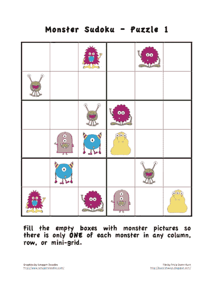
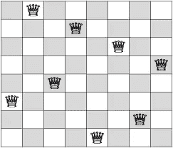

# 代码回溯算法

> 原文：<https://medium.datadriveninvestor.com/algorithm-with-code-backtracking-37cbc1664f7e?source=collection_archive---------3----------------------->



[http://bookishways.blogspot.com/2012/09/sudoku-puzzles-with-pictures.html](http://bookishways.blogspot.com/2012/09/sudoku-puzzles-with-pictures.html)

如果你对 IT 市场感兴趣，你就不能忽视**算法**的重要性。一个**算法**是一个**方法来解决一个特定的问题，便于计算机操作**。在这个系列中，我们的目标是介绍具有各种困难的算法。我们希望这篇文章能帮助读者专业地理解**算法**。我们的语言基础是 C++14，这是许多编程竞赛中使用的语言。

> 一个算法就像一个食谱。
> 
> [穆罕默德·瓦萨姆](https://medium.com/u/f73e4a3dbf39?source=post_page-----37cbc1664f7e--------------------------------)

第一种算法技术是**回溯**。该算法解决需要在可能性中搜索的问题。最有代表性的例子就是**数独**和 **N 皇后问题**。该算法的基本思想是逐步建立一个解决方案，当它失败时，删除已建立的解决方案。回溯算法是一种比强力方法好得多的方法。

[](https://www.datadriveninvestor.com/2019/03/22/the-seductive-business-logic-of-algorithms/) [## 算法诱人的商业逻辑|数据驱动的投资者

### 某些机器行为总是让我感到惊讶。我对他们从自己的成就中学习的能力感到惊讶…

www.datadriveninvestor.com](https://www.datadriveninvestor.com/2019/03/22/the-seductive-business-logic-of-algorithms/) 

# 数独问题

我们来思考一下**数独**的问题。数独的规则如下。

1.  游戏棋盘由 9 X 9 个单元格组成，单元格的编号从 1 到 9。
2.  单元格中的数字 0 表示玩家必须填充单元格。玩家必须在单元格中填入适当的数字。
3.  行、列和盒子分割游戏板。**对于每一行、列和框，它们不能包含相同的数字**。

然后，形式化数独问题。

```
Input : int Gameboard[9][9] with empty cell included(Filled with 0)
Output : int Result[9][9] with all the cells are filled with satisfying the rule above.
```

那么解决方案的思路如下。

1.  我们将寻找所有可能的解决方案。但是，不要搜索不可能的情况。
2.  使用递归函数简化代码。当不可能的时候，停止寻找。
3.  基本思想类似于 DFS(深度优先搜索)算法。

因此，该职能的主要组成部分如下。

```
1\. **possible**(int y, int x, int num) : Check whether it is currently able to locate "num" in the board with position (y,x).2\. **print**() : print all the board in stdout. 3\. **solve**() : Backtracking algorithm. Try to fill 1 to 9 on the cell, after filling, move to the next blank to fill. After the callee function finishes, set it back to 0 to make it empty again.4\. **vector<pait<int, int>> blank** : Save all the blanks that the player must fill. 
```

# n 皇后问题



[https://codepumpkin.com/n-queen-problem/](https://codepumpkin.com/n-queen-problem/)

**回溯**算法的另一个代表性例子是 **N 皇后问题**。问题与数独问题颇为相似；然而，他们的解决方案却截然不同。这个问题遵循国际象棋的官方规则:尤其是对女王而言。以下是 **N 皇后问题**的规则。

1.  玩家必须在棋盘上找到 N 个皇后。
2.  对于任何一对皇后来说，他们都不能互相攻击。
3.  不允许在同一行或同一列中放置两个皇后。
4.  也不允许将两个皇后放在同一条对角线上。

```
Input : An integer N
Output : The number of possibilites to locate N queens on the N X N chess board without violating rules.
```

我们将使用类似于数独的方法来解决这个问题。想法又是**回溯**！这将是实现它的一些指南。

```
1\. isValid(int row, int col) : Check whether locating a new queen on (row, col) 
2\. bt(int cnt) : Back trace process. "cnt" reveals the number of queens which is already in the board. 
```

**注意不要在代码中使用 N×N 的板子！**增加了时间复杂度，浪费了大量效率。由于一行中只能有一个 queen，因此为每一行保存一列就足够了。在我们的代码中，我们使用一个简单的一维数组来表示列号。

# 结论

对于多项式时间算法无法解决的问题，**回溯**算法要比**蛮力**算法好得多。对于第一个手动实现，设计并不简单。**尽力而为！**

希望我的文章方便你的算法思维。而且，放大你对**算法**的兴趣。任何联系人都可用。给我发邮件**Jeong yw 12382 @ postech . AC . kr**