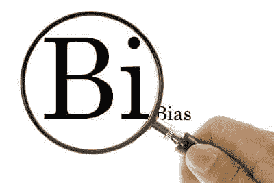
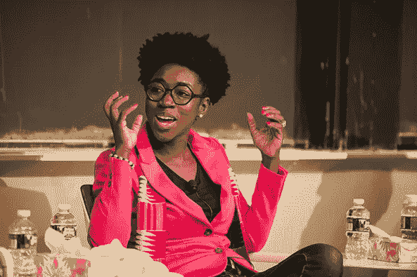

# 算法偏差

> 原文：<https://medium.datadriveninvestor.com/algorithmic-bias-181f68dcd06b?source=collection_archive---------4----------------------->

算法已经成为当今世界最有效的元素，它们进行的计算和决策比人更可靠、更快。他们对我们读到的新闻、得到的工作、遇到的人和看到的广告做出决定。根据我们在脸书社交网络上读到的故事、我们在 Telegram messenger 上发送的文本、我们在 Instagram 应用程序上喜欢的照片以及我们在谷歌等网站上看到的搜索结果，我们生成了**大数据**。大数据被用于医疗保健、就业、住房、教育和警务决策。

与我们许多人的想法相反，技术并不客观。算法的行为取决于发明它们的人:他们编写什么代码，他们使用什么数据来训练机器学习模型，以及他们在模型完成后如何测试模型。例如，给一个图像分类算法数百万张带标签的猫图片，它将能够告诉你一张它以前没有见过的照片是否包含一只猫。给语音识别算法数百万个声音样本以及相应的文字，它将能够比大多数人更快地转录口语。

> 你输入学习算法的数据越多，它就越能更好地完成任务。

根据上面的句子，你提供给算法的任何数量的白人数据，你都应该对黑皮肤的人做同样的事情，或者你提供给算法的任何数量的数据，包括男人，对女人和变性人做同样的事情，等等。

 [## 幸福的算法？-数据驱动型投资者

### 从一开始，我们就认为技术正在使我们的生活变得更好、更快、更容易和更实用。社交媒体…

www.datadriveninvestor.com](https://www.datadriveninvestor.com/2019/03/08/an-algorithm-for-happiness/) 

软件程序并非不受人类的影响，因为通常我们正在创建它们，它们根据可能由人类、机器或两者的组合提供的数据进行操作，并且根据它们，算法可能会继承偏差。

> 机器学习算法基于人们在线所做的事情进行学习和进化。

例如，[卡耐基梅隆大学的研究人员进行的一项新研究](http://www.andrew.cmu.edu/user/danupam/dtd-pets15.pdf)发现，谷歌的在线广告系统向男性展示高收入工作的广告比向女性展示高收入工作的广告多得多。算法偏差正成为一个比过去更严重的问题，政府和算法开发者并不关心它，或者如果他们关心，那还不够:)

> 如果做出重要决策的算法中存在偏见，不被识别和检查，它可能会产生危险的后果，特别是对贫困社区和少数民族。

TED talk provided by [Joy Buolamwini](https://www.ted.com/talks/joy_buolamwini_how_i_m_fighting_bias_in_algorithms)

查看 Joy Buolamwini 提供的这个 TED 演讲，看看一个真正的问题，一台机器不能很好地识别黑人的脸，但它对白人非常有效。

另一个例子是微软和波斯顿大学研究人员的联合项目，在该项目中，他们发现[在单词嵌入算法](https://www.technologyreview.com/s/602025/how-vector-space-mathematics-reveals-the-hidden-sexism-in-language/)中存在性别歧视，这些算法用于搜索引擎、翻译和其他依赖于[自然语言处理的软件](https://bdtechtalks.com/2018/02/20/ai-machine-learning-nlg-nlp/)。在他们对单词嵌入算法行为的发现中，有一个趋势是将诸如“编程”和“工程”等单词与男性联系起来，将“家庭主妇”与女性联系起来。

算法偏差并不是一个新话题。几十年来，学者和专家警告公司和算法开发者。但在这个时候，它变得至关重要，因为这些算法在我们的日常决策中变得越来越大胆。

## 开源与算法偏见

对抗算法偏差的最佳方式之一是评估输入机器学习模型的训练数据。数据本身可能具有偏态分布；例如，程序员掌握的关于美国公民的数据可能比移民多，关于富人的数据可能比穷人多。这种不平衡将导致人工智能对我们的社会实际上是如何表现的做出不正确的结论。

开源技术有极大的潜力来帮助对抗算法偏见。现代人工智能由开源软件主导，从 TensorFlow 到像 [scikit-learn](http://scikit-learn.org/stable/) 这样的软件包。开源社区已经证明在开发健壮的经过测试的机器学习工具方面非常有效，因此可以得出结论，相同的社区可以有效地将反偏见测试构建到相同的软件中。

开源技术也被证明对于检查和分类大量的数据非常有效。没有什么比开源工具在数据分析市场的统治地位更明显的了。).识别数据偏差的工具应该由开源社区来设计，这些技术也应该应用于已经在像 [Kaggle](https://www.kaggle.com/datasets) 这样的网站上发布的大量开放训练数据集。

## 人与算法偏差

开发和应用机器学习系统的公司和政府监管机构，对监控和限制算法偏差表现出很少的兴趣。在这个话题变得超出我们的掌控之前，他们应该多加关注。此外，科技公司使用各种数学模型，而且它们的运作方式并不透明！

人类不可能监督算法做出的每一个决定。但是公司可以定期运行模拟来测试他们算法的结果。

算法偏差是人的问题，而不是技术问题。我们的想法、偏见、兴趣、憎恨等等，都反映在人工智能程序中。真正的解决办法是开始消除我们个人和社会生活中的偏见。这意味着支持就业、教育、政治等领域的多样性。如果我们想修正我们的算法，**我们应该首先修正我们自己**。

教育极其重要。我们都知道有些人可能不知道算法偏差，但他们关心它的影响，应该和这些人谈谈，解释“偏差是如何形成的”和“为什么它很重要”。