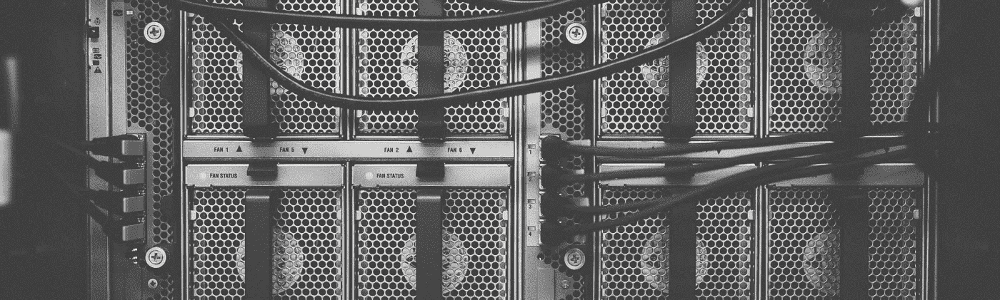

# 算法偏差

> 原文：<https://medium.datadriveninvestor.com/algorithmic-bias-51d319e8988f?source=collection_archive---------19----------------------->

Photo by [Thomas Kvistholt](https://unsplash.com/photos/oZPwn40zCK4?utm_source=unsplash&utm_medium=referral&utm_content=creditCopyText) on [Unsplash](https://unsplash.com/search/photos/computer-science?utm_source=unsplash&utm_medium=referral&utm_content=creditCopyText)

几天前，继 Twitter 的杰克·多西和脸书的马克·扎克伯格之后，谷歌的桑德尔·皮帅被召集到国会听证会，主要关注谷歌对共和党的偏见。我想我们都熟悉谷歌的工作方式:你不会得到你正在搜索的搜索结果，而是得到谷歌认为你正在搜索的结果。通常，这些算法旨在帮助人类预测某些结果，但如果算法本身是错误的呢？

在听证会上，民主党众议员佐伊·洛夫格伦说:“如果你用谷歌搜索白痴这个词，就会出现唐纳德·特朗普的照片。”这是谷歌方面对总统的一种偏见，还是“仅仅”是算法在起作用的结果？这个算法是根据它认为人们想看什么来给你答案的？

# 偏见

偏见是指与另一事物、人或群体相比，偏向或反对某事物、人或群体的偏见，通常被认为是不公平的。众所周知，人类天生就有不可思议的偏见。一切奇怪的或不同于常规的东西都被认为是危险的，或者不如我们对问题事物的看法。我们认为计算机和数学是客观的(因此是无偏见的)。如果计算机在做纯数学运算，它们怎么可能是无偏见的呢？

# 规模的故事

术语算法偏见——或技术偏见或“编码凝视”——只是刚刚(重新)流行起来，这意味着这种现象只是最近才被发现。这可以用这样一个事实来解释，即我们还没有像今天这样在现实生活中做出大规模决策的计算机系统。我们开始从使用计算机作为“大计算器”转向使用计算机在就业、保险、贷款、教育和可变定价等领域进行广泛的预测。

[ProPublica](https://www.propublica.org/article/machine-bias-risk-assessments-in-criminal-sentencing)发表的一篇很棒的文章讲述了一个软件包的故事，该软件包会给刑事罪犯一个分数，看他再犯的可能性有多大。这个分数将根据一长串问题以及机器对类似案例和结果的“知识”来计算。ProPublica 的研究表明，这个系统对有色人种有很大的偏见。有色人种系统性地获得了比白人罪犯更高的风险分数，即使当罪行更加严重时。

这怎么可能？当然，如果编写一个程序将调查中的一组答案转换成一个分数，结果应该是公平的？这不是简单的从投入到产出的计算吗？

# 关于机器学习

机器学习是对算法和数学模型的研究，计算机系统使用这些算法和数学模型来逐步提高它们在特定 task⁴.上的性能在现实生活中，这意味着你可以教计算机识别某些模式，并用它来寻找和预测类似的模式。最引人注目的机器学习算法是面部识别。脸书能够在照片中自动标记你的唯一方式是因为它有一个与你在一起的照片的大数据集可供交叉参考。机器“学习”的方式与人类非常相似。你第一次看到新事物时，它是未知的，没有特别的重要性。下次你看到这个东西时，你会认出它是你以前见过的东西。在接触了大量相同事物的样本后，我们能够在新的环境中识别它。

这个概念还引入了偏见可能潜入系统的最明显的地方:数据集。

# 教科书

为了训练或“教”一台计算机，你必须给它提供一个可以学习的大数据集。为了让计算机能够识别照片中的人，你必须向它提供大量有一个人的照片。在验证了足够多的照片后，计算机将能够开始预测照片中是否有人。如果你通过向计算机展示一千个红苹果的例子来教它寻找苹果，它不会认出一个绿苹果。

在谷歌的例子中，数据集是网站和照片*。看起来，特朗普的许多照片都与“白痴”一词相关联，这导致谷歌的搜索引擎返回搜索查询“白痴”的“最佳”答案，即使它不一定客观或公平。

* *谷歌的数据集比这复杂得多，还会考虑到你的个人搜索历史、政治观点、地理位置和许多其他因素。*

算法本身不一定有偏见。我们作为人类。算法是数据集的一面镜子，它用数据集来代表事实。

除了数据集，还有一个更关键的因素在影响算法偏差:老师。

# 老师

我们已经看到，为了在新的环境中做出预测，计算机正在被教授使用数据集来创建现实的数字表示。在这个例子中，数据集可以与学生用来学习新知识的教科书相比较。偏见的另一个切入点是机器的老师:程序员。

算法的程序员对机器如何解释信息以及用信息做什么有最终发言权。技术是由人类建造的，人类是有偏见的，因此，如果没有一大群不同的人来检查，技术就会继承一些偏见。

J. Buolamwini(麻省理工学院研究生)给出了一个明显的例子。在做一个关于计算机视觉的学校项目时，她意识到她使用的面部识别软件不能识别有色人种的面部。该软件是以这样一种方式编写的，它可以记录(白种人)皮肤上某些特定的颜色变化，这将触发程序对其进行适当的处理。鉴于该行业的大部分劳动力由 males⁵白人组成，很容易理解这种疏忽是如何造成的。

虽然最初的程序员(很可能)没有将他们的软件编程为种族主义者，但他们的无知导致了软件中的巨大偏见。

# 如何停止算法偏差

只要我们使用历史数据来教导机器，我个人不认为我们可以做任何事情来完全修复算法中的偏见。人类引入了一种偏见，得出一个完全准确和公平的数据集是极其困难和昂贵的。也就是说，我不认为我们应该停止扩展和改进我们日常使用的算法。

我们不应该忘记的主要事实是，我们不是在与技术对抗；我们正在开发技术来帮助 T2。

> 大多数致力于人工智能医疗应用的人并不是要取代医生；他们试图创造工具，让医生更准确、更有效，提高护理质量。最好的国际象棋“棋手”既不是人类，也不是计算机，而是人类和计算机一起工作的团队。

— [瑞秋·托马斯](https://www.fast.ai/2018/08/07/hbr-bias-algorithms/)

如果我们看到算法是什么——一套计算规则——而不把它们视为真理的“全能”来源，我们就可以有效地利用它们来实现更大的利益。

# 来源

哥伦比亚特区扎克泽夫斯基(2018 年 12 月 11 日)。技术 202:这是你的谷歌听证会指南。从[washingtonpost.com](https://www.washingtonpost.com/news/powerpost/paloma/the-technology-202/2018/12/11/the-technology-202-here-s-your-guide-to-the-google-hearing/5c0e9eaa1b326b67caba2b5b/?utm_term=.f8d850721eef)取回。

字典(2018)。偏见。从[en.oxforddictionaries.com](https://en.oxforddictionaries.com/definition/bias)取回。

谷歌趋势(2018 年 12 月 12 日)。算法偏差。从 trends.google.com[取回](https://trends.google.com/trends/explore?date=today%205-y&geo=US&q=algorithmic%20bias)

维基百科(2018)。机器学习。从[en.wikipedia.org](https://en.wikipedia.org/wiki/Machine_learning)取回。

美国数据(2018 年)。电脑程序员。从 [datausa.io](https://datausa.io/profile/soc/151131/) 中检索。