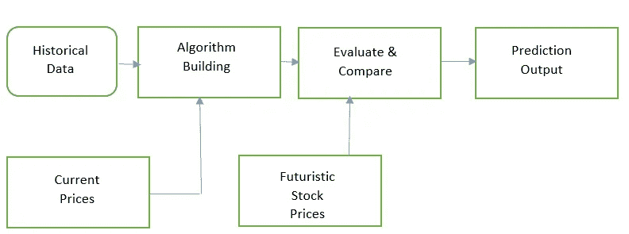
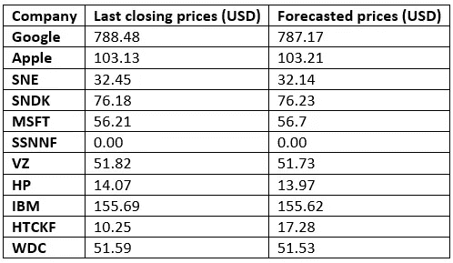
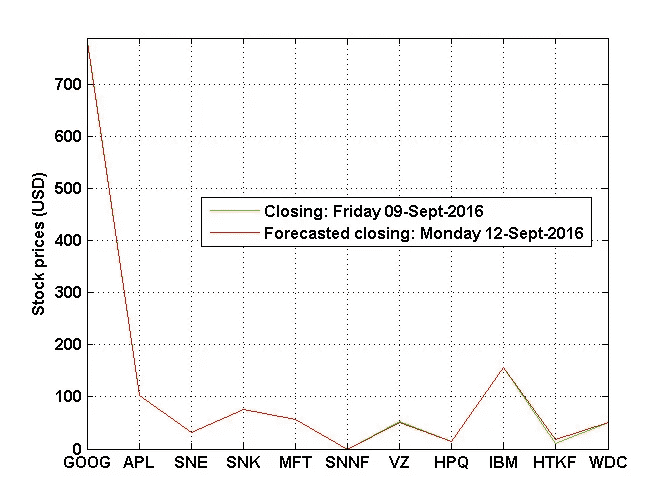
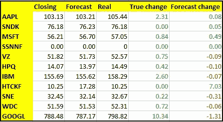
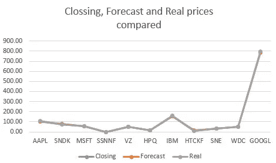

# 算法交易引擎:它们到底有多准确？

> 原文：<https://medium.datadriveninvestor.com/algorithmic-trading-engines-just-how-accurate-are-they-20f07a279d96?source=collection_archive---------1----------------------->

## 未来就在现在

纵观历史，人类总是表达他们想要预知未来的愿望。《牛津英语词典》将“T2 未来主义”一词的最早使用追溯到 1842 年，当时它主要用于神学领域。下一个有记录的未来主义是意大利人和俄罗斯人在 20 世纪 20 年代和 30 年代发起的幻想运动，其目的是摆脱过去，拥抱速度和技术，但往往伴随着有趣的暴力变化。

然而，今天，未来主义走了一条弯路来重塑我们人类的思维和行为。它已经超越了共产主义，为我们打算做的每一件事带来了多学科方法的惊人发展。事实上，作家、顾问、组织领导人*等系统思考者今天使用未来主义为他们的客户提供建议，例如全球趋势、可能的情景、新兴市场机会、风险以及如何管理它们。*

Today we live in the matrix, a world of possibilities — Photo Credit: Photo by [Luke Chesser](https://unsplash.com/@lukechesser?utm_source=unsplash&utm_medium=referral&utm_content=creditCopyText) on [Unsplash](https://unsplash.com/s/photos/data?utm_source=unsplash&utm_medium=referral&utm_content=creditCopyText)

另一方面，今天的工程师和科学家可以预测各种方面，误差几乎为零。由于*可靠性*工程的预测性，今天的工厂比过去更加可靠、可靠和安全。如今，设计工程师可以专门使用模型预测控制(MPC)来捕捉未来的物流动态、平衡电力系统等。通过计算一系列可以自动操纵系统的输入信号。

 [## 算法诱人的商业逻辑|数据驱动的投资者

### 某些机器行为总是让我感到惊讶。我对他们从自己的成就中学习的能力感到惊讶…

www.datadriveninvestor.com](https://www.datadriveninvestor.com/2019/03/22/the-seductive-business-logic-of-algorithms/) 

股票的算法交易也是如此。股票价格由各种市场衍生产品的波动决定，而市场衍生产品的波动又取决于基础资产，如股票、债券、商品、货币、利率和市场指数。一些衍生品依赖于天气模式、政治稳定和全球各地发生的事情，这引发了猜测。今天，即使是最聪明的人也无法在合理的边际误差内正确地确定这些动态的影响，更不用说绝对确定性了。我们有限的人性根本不允许我们捕捉所有这些信息，并将它们处理成我们迫切需要的一个有用的决定。

但是等等。如果我们可以使用复杂的计算算法来处理这些信息，以预测股票价格的未来，会怎么样？会有所不同吗？随着当今市场上功能强大的计算工具的出现，大多数不可能的事情都变成了生计。唯一现存的障碍是，只有少数拥有这种力量的人能够实现这个梦想，因此富人变得越来越富，穷人……或者也许正如他们所说的*信息就是力量*。这就产生了一个问题，为什么不是每个人都可以拥有这些工具？即使我听起来很理性，如果我有这些信息，我会愿意和善良到让它出来吗？

我们生活在 t *he matrix* 中，这是一个充满可能性的世界，通过计算，一切皆有可能，有些未来实际上是可以预知的。*但是这些算法交易引擎有多精确呢？*嗯，如今有了大量可用的数据，每个人都应该能够对股票和几乎任何他们想要的东西进行某种预测。那么我们该怎么做呢？我们已经开始编写代码来测试它们的精确度。我们相信历史数据承载了足够多的信息作为现在和未来。我们获取历史数据集并使用它们来构建智能算法，我们用这些信息来训练算法，当我们提供当前的市场波动时，它应该能够为我们提供未来股票价格将如何表现的线索。在方法上，我们是这样做的:

A summarized methodology of obtaining data, building the trading algorithm and using for prediction.

值得注意的是，需要的唯一且最重要的信息是历史数据的可用性。多亏了谷歌和雅虎财经，我们知道了算法将用来学习的历史数据的存在。因此，我们选择了一些纳斯达克指数可以公开查阅的公司股票作为试验品。其中包括:谷歌、西部数据公司、HTC、IBM、惠普、威瑞森公司、三星电子公司、微软、SanDisk 公司、索尼和苹果公司。

A sample of Input data used for training the algorithm

我们认为，个性化的算法交易机器可以提供涡轮增压的高频投资交易，为股票交易客户增加流动性回扣，降低交易成本和相关风险。选股是一门艺术，我同情所有尝试选股的人。虽然我们今天仍在努力从我们的计算机中瞥见一个决策，但我预见到有一天，同样的计算机不仅会提供决策，还会实际购买股票，而人类需要做的只是登记并攫取他们的利润。难道我们都不想成为这场革命的一部分吗？

所以营业日结束的时候到了，我们有了预测和真实价格。亲眼看看这个最小的应用程序执行得有多精确:

A pictorial representation of the performance of the algorithm

如你所见，似乎我们最终还是做对了一些事情。总体而言，该算法相当悲观，但有了足够的数据，它学习得更快。

我们可以将每家公司的实际期末股票制成表格，并尝试进行验证分析，衡量我们的模型是否成功。

A sample output data received from the algorithm on the next business day.

为了进行比较，我们也可以绘制真实变化与模型预测的对比图。值得注意的是，一些数据点比其他数据点更加稳健。例如，SNDK 返回 0.05 美元的一分钟绝对误差，MSFT 0.35 美元，优于 GOOGL、HTCKF 和 AAPL 的预测结果。

总之，算法交易引擎的准确性是惊人的。如果实施得当，可以获得低至零的边际误差。然而，缺乏足够的训练数据对这类算法的实现是一个很大的打击。例如，HTC 只有 151 个数据点，所以我们用 120 个数据点训练机器，用剩下的数据进行验证和测试，这可能是它给出最差预测的原因。请继续关注数据驱动交易引擎未来实现的更多更新。